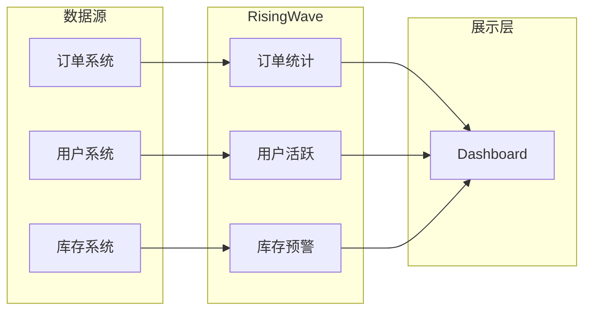
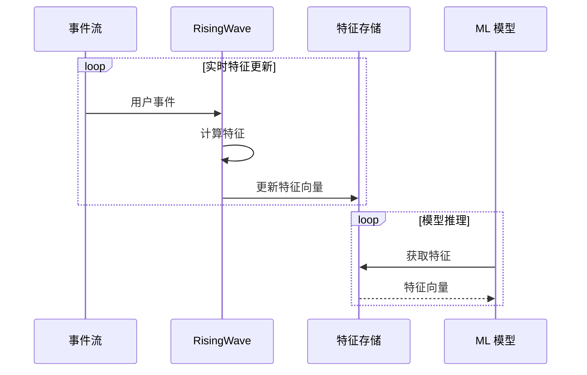
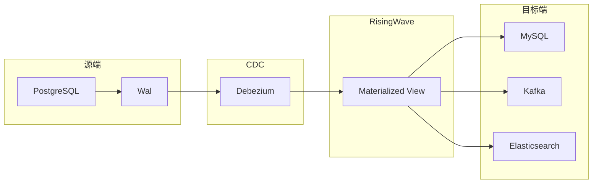
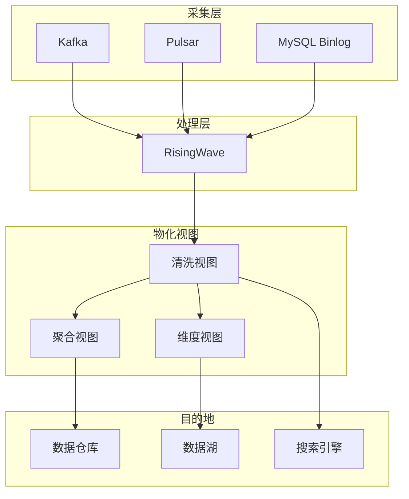

# RisingWave 应用场景

## 学习目标

- 理解 RisingWave 在实时分析中的应用价值
- 掌握 CDC 数据同步的架构设计
- 了解实时特征工程在 ML 场景的实践

## 正文

### 1. 实时分析看板

RisingWave 非常适合构建实时分析仪表板：

```sql
-- 实时订单统计
CREATE MATERIALIZED VIEW dashboard_stats AS
SELECT 
    DATE_TRUNC('minute', created_at) as minute,
    COUNT(*) as order_count,
    SUM(amount) as gmv,
    COUNT(DISTINCT customer_id) as unique_customers
FROM orders
GROUP BY DATE_TRUNC('minute', created_at);
```



**应用场景**：
- 电商实时大屏
- 金融交易监控
- 物流追踪看板
- IoT 设备监控

### 2. 实时特征工程

机器学习模型需要持续更新的特征：

```sql
-- 用户行为特征
CREATE MATERIALIZED VIEW user_features AS
SELECT 
    user_id,
    -- 交易特征
    COUNT(*) FILTER (WHERE event_type = 'purchase') as purchase_count,
    SUM(amount) FILTER (WHERE event_type = 'purchase') as total_spent,
    AVG(amount) FILTER (WHERE event_type = 'purchase') as avg_order_value,
    -- 行为特征
    COUNT(*) FILTER (WHERE event_type = 'view') as view_count,
    MAX(created_at) as last_active,
    -- 时间窗口特征
    COUNT(*) FILTER (
        WHERE created_at > NOW() - INTERVAL '1' HOUR
    ) as hourly_activity
FROM user_events
GROUP BY user_id;
```



**典型应用**：
- 实时推荐系统
- 欺诈检测
- 动态定价
- 异常检测

### 3. CDC 数据同步

Change Data Capture 实现数据库间的实时同步：

```sql
-- 源表 CDC
CREATE SOURCE pg_customers (
    _key BIGINT,
    _value JSONB
) WITH (
    connector = 'postgres-cdc',
    host = 'postgres-source:5432',
    database = 'ecommerce',
    schema = 'public',
    table = 'customers'
);

-- 物化视图作为中间层
CREATE MATERIALIZED VIEW customer_sync AS
SELECT 
    (_value->>'id')::BIGINT as customer_id,
    (_value->>'name')::VARCHAR as name,
    (_value->>'email')::VARCHAR as email
FROM pg_customers;

-- 同步到目标数据库
CREATE SINK customer_mirror AS
SELECT * FROM customer_sync
WITH (
    connector = 'postgres',
    host = 'postgres-target:5432',
    database = 'warehouse',
    table = 'customers'
);
```



### 4. 实时数据管道

构建 ELT 数据管道：



**典型场景**：
- 日志实时 ETL
- 多源数据融合
- 数据仓库实时更新
- 跨系统数据一致性

## 架构对比

| 场景 | 传统方案 | RisingWave 方案 |
|------|----------|-----------------|
| 实时看板 | Flink + Redis + API | SQL + 物化视图 |
| 特征工程 | Python 批处理 + 定时任务 | SQL + 增量计算 |
| CDC 同步 | Debezium + Kafka Connect | SQL + 内置连接器 |
| 数据管道 | Airbyte + dbt | SQL 一体化 |

## 要点总结

1. **实时看板**：毫秒级延迟的实时数据可视化
2. **特征工程**：流式计算替代批处理，模型实时更新
3. **CDC 同步**：数据库变更实时捕获和同步
4. **数据管道**：统一 SQL 定义复杂数据流
5. **开发效率**：SQL 开发比 Flink Java 更高效

## 思考题

1. 如何设计一个支持多个 ML 模型共享的实时特征平台？
2. CDC 同步中如何处理源数据库的结构变更？
3. 在数据管道中如何保证 Exactly-Once 的端到端一致性？
