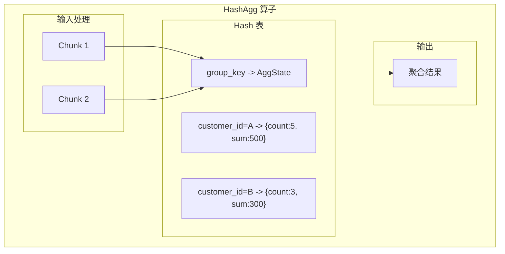
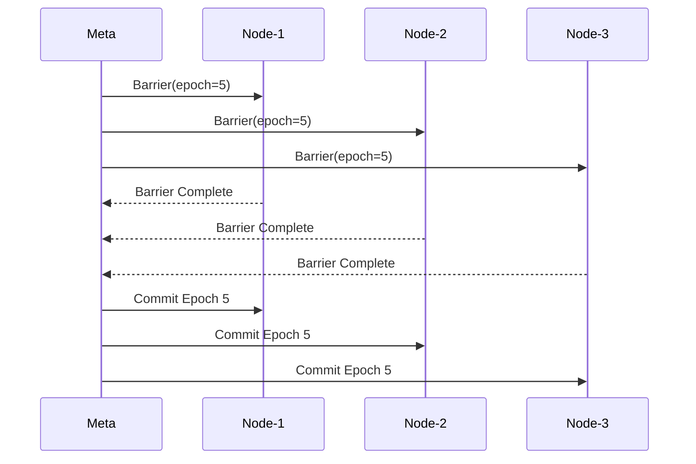
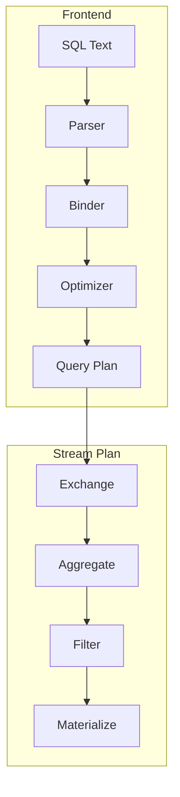

# RisingWave 源码阅读

## 学习目标

- 掌握 RisingWave 源码的目录结构和模块划分
- 理解流处理算子的实现原理
- 了解 SQL 到算子树的编译过程

## 正文

### 1. 源码目录结构

```
risingwave/
├── src/
│   ├── frontend/              # 前端（SQL 处理）
│   │   ├── planner/          # 查询规划器
│   │   ├── optimizer/        # 查询优化器
│   │   └── binder/           # SQL 绑定器
│   │
│   ├── meta/                 # 元数据管理
│   │   ├── manager/          # 集群管理
│   │   ├── hummock/          # 状态管理
│   │   └── model/            # 元数据模型
│   │
│   ├── stream/               # 流处理核心
│   │   ├── src/
│   │   │   ├── executor/     # 算子实现
│   │   │   │   ├── global_simple_agg.rs
│   │   │   │   ├── hash_agg.rs
│   │   │   │   ├── join.rs
│   │   │   │   ├── filter.rs
│   │   │   │   ├── project.rs
│   │   │   │   └── materialize.rs
│   │   │   ├── barrier/      # Barrier 管理
│   │   │   │   └── mod.rs
│   │   │   └── manager/      # 执行器管理
│   │   └── test/
│   │
│   ├── storage/              # 存储层
│   │   ├── src/
│   │   │   ├── hummock/      # 状态存储
│   │   │   └── rowset/       # 行存储
│   │
│   └── common/               # 公共模块
│       └── src/
│           └── array/        # 数组类型
│
├── e2e_test/
│   └── streaming/
│
└── docs/
    └── design/
```

### 2. 流处理执行器

#### 2.1 算子接口

```rust
// src/stream/src/executor/mod.rs

/// 流处理算子 trait
pub trait Executor: Send {
    /// 获取算子 ID
    fn execute_id(&self) -> u64;
    
    /// 获取算子名称
    fn name(&self) -> &str;
    
    /// 执行算子，返回消息流
    async fn execute(self: Box<Self>) -> StreamResult<MessageStream>;
    
    /// 转换为执行计划
    fn to_stream_plan(&self) -> StreamPlan;
}
```

#### 2.2 Materialize 算子

```rust
// src/stream/src/executor/materialized_view.rs

pub struct MaterializeExecutor {
    input: Box<dyn Executor>,
    table: Table,
    schema: Schema,
}

impl MaterializeExecutor {
    pub async fn execute(self: Box<Self>) -> StreamResult<MessageStream> {
        let mut input = self.input.execute().await?;
        
        let mut stream = async_stream::stream! {
            while let Some(msg) = input.next().await {
                match msg? {
                    Message::Chunk(chunk) => {
                        // 增量更新状态
                        let diff = self.table.apply_chunk(&chunk)?;
                        
                        // 生成输出消息
                        yield Message::Chunk(diff);
                    }
                    Message::Barrier(barrier) => {
                        // 提交检查点
                        self.table.checkpoint().await?;
                        
                        yield Message::Barrier(barrier);
                    }
                }
            }
        };
        
        Ok(stream.boxed())
    }
}
```

#### 2.3 聚合算子



```rust
// src/stream/src/executor/hash_agg.rs

pub struct HashAggExecutor {
    group_key: Vec<usize>,
    agg_calls: Vec<AggCall>,
    state: HashMap<GroupKey, Vec<AggState>>,
}

impl HashAggExecutor {
    /// 处理输入 Chunk，更新聚合状态
    pub async fn process_chunk(&mut self, chunk: StreamChunk) -> Result<StreamChunk> {
        // 1. 按 group_key 分组
        let groups = chunk.group_by(&self.group_key)?;
        
        // 2. 更新每个分组的聚合状态
        for (key, indices) in groups {
            let state = self.state.entry(key).or_default();
            
            for (agg_idx, call) in self.agg_calls.iter().enumerate() {
                let value = call.eval(&chunk, &indices)?;
                state[agg_idx].accumulate(value)?;
            }
        }
        
        // 3. 产生输出
        self.produce_output().await
    }
}
```

### 3. Barrier 管理

```rust
// src/stream/src/barrier/mod.rs

/// Barrier 在算子树中的流动
pub struct Barrier {
    pub epoch: u64,
    pub height: u32,
    pub kind: BarrierKind,
}

/// Barrier 协调过程
pub async fn run_barrier_coordination(
    node: &mut StreamActor,
    barrier_rx: Receiver<Barrier>,
) -> Result<()> {
    while let Some(barrier) = barrier_rx.recv().await {
        // 1. 注入 Barrier
        node.input.send(Message::Barrier(barrier.clone())).await?;
        
        // 2. 等待所有上游完成
        node.barrier_state.wait_for_upstream(barrier.epoch).await?;
        
        // 3. 提交本地状态
        node.state_manager.flush(barrier.epoch).await?;
        
        // 4. 向下游传播 Barrier
        node.output.send(Message::Barrier(barrier)).await?;
    }
    
    Ok(())
}
```



### 4. SQL 编译流程



**编译过程**：

1. **Parser**：将 SQL 解析为 AST
2. **Binder**：绑定表名、列名到实际对象
3. **Optimizer**：优化查询计划（谓词下推、列裁剪）
4. **Stream Plan Generator**：将查询计划转换为算子树

### 5. 关键文件速查

| 文件路径 | 功能 | 关键结构 |
|----------|------|----------|
| `src/stream/src/executor/mod.rs` | 算子接口定义 | `Executor` trait |
| `src/stream/src/executor/materialized_view.rs` | 物化视图算子 | `MaterializeExecutor` |
| `src/stream/src/executor/hash_agg.rs` | 哈希聚合算子 | `HashAggExecutor` |
| `src/stream/src/executor/join.rs` | 连接算子 | `HashJoinExecutor` |
| `src/stream/src/executor/filter.rs` | 过滤算子 | `FilterExecutor` |
| `src/stream/src/executor/project.rs` | 投影算子 | `ProjectExecutor` |
| `src/stream/src/barrier/mod.rs` | Barrier 管理 | `BarrierManager` |
| `src/stream/src/executor/global_simple_agg.rs` | 简单聚合 | `GlobalSimpleAggExecutor` |
| `src/frontend/src/planner/stream.rs` | 流计划生成 | `StreamPlanner` |
| `src/storage/src/hummock/state_store.rs` | 状态存储 | `HummockStateStore` |

## 进阶阅读

1. **官方文档**：[https://www.risingwave.dev/](https://www.risingwave.dev/)
2. **设计文档**：`docs/design/` 目录
3. **测试用例**：`e2e_test/streaming/` 端到端测试

## 思考题

1. 物化视图的状态如何在 Barrier 失败时恢复？
2. HashAgg 算子如何处理大状态和内存压力？
3. 算子树如何支持动态扩缩容？
