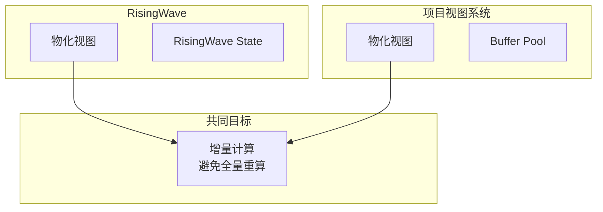
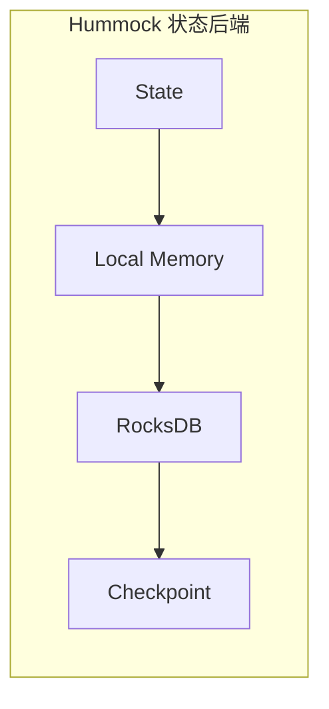
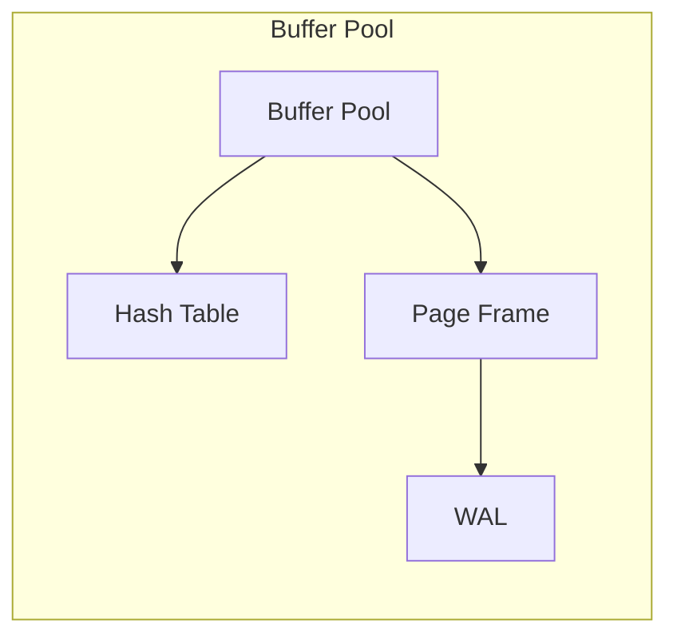
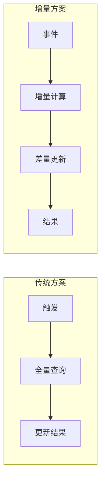
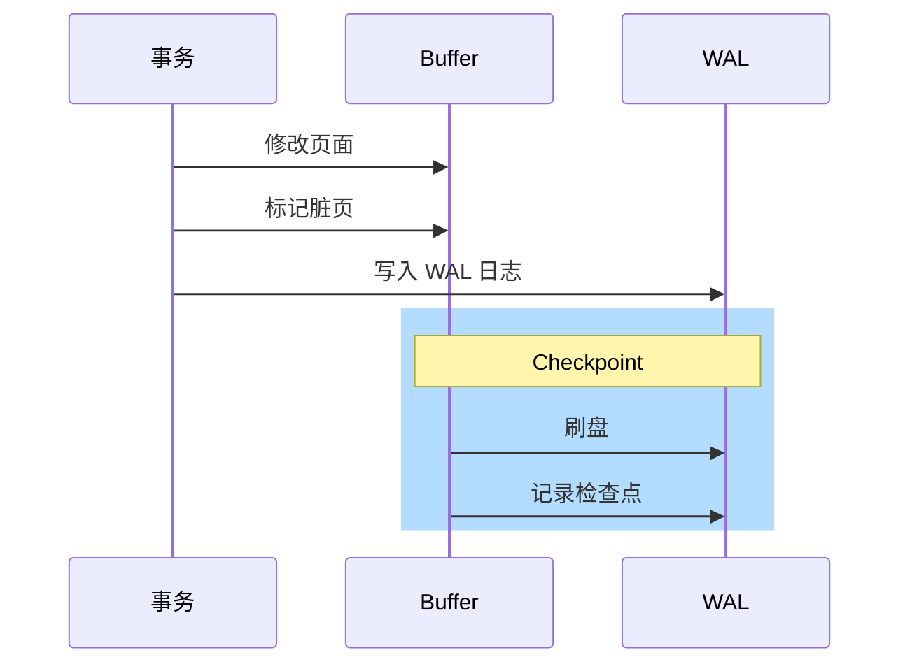
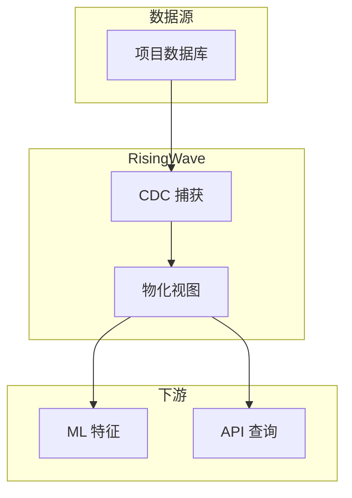

# RisingWave 与项目视图系统

## 学习目标

- 理解 RisingWave 物化视图增量更新与项目视图系统的关联
- 掌握流处理算子与 Volcano 模型的关系
- 了解项目中可借鉴的流处理设计

## 正文

### 1. 物化视图增量更新

RisingWave 的核心特性是 **持续物化视图**，与项目中的视图系统有相似的设计目标：

**关键区别**：

| 维度 | RisingWave | 项目视图系统 |
|------|------------|--------------|
| 数据来源 | 流数据（Kafka/CDC） | 数据库表 |
| 更新触发 | 实时流事件 | 显式刷新/触发器 |
| 状态存储 | Hummock (RocksDB) | Buffer Pool |
| 查询方式 | SQL | API |

### 2. 流处理算子与 Volcano 模型

RisingWave 的流处理算子树与项目中 Volcano 执行器模型有对应关系：

```mermaid
graph TB
    subgraph "RisingWave 算子树"
        subgraph "上端口"
            I["input"]
        end
        
        subgraph "处理层"
            F["Filter"]
            P["Project"]
            A["Aggregate"]
        end
        
        subgraph "下端口"
            O["output"]
        end
    end
    
    subgraph "Volcano 模型"
        subgraph "上行"
            U["upstream"]
        end
        
        subgraph "处理"
            E["Exchange"]
            G["Get"]
            P2["Project"]
        end
        
        subgraph "下行"
            D["downstream"]
        end
    end
    
    I -.->|"数据流"| F
    F -.->|"过滤"| P
    P -.->|"投影"| A
    A -.->|"聚合"| O
    
    U -.->|"火山拉取"| E
    E -.->|"交换"| G
    G -.->|"投影"| P2
    P2 -.->|"推送"| D
```

**对应关系**：

| RisingWave | 项目 Volcano | 功能 |
|------------|--------------|------|
| Exchange | Exchange | 数据重分布 |
| Filter | Selection | 条件过滤 |
| Project | Projection | 列选择 |
| Aggregate | Aggregation | 聚合计算 |
| Materialize | Result | 结果输出 |

### 3. 状态管理对比

#### 3.1 RisingWave 状态

**特点**：
- 本地内存缓存热数据
- RocksDB 持久化
- Checkpoint 支持故障恢复

#### 3.2 项目 Buffer Pool 状态

**特点**：
- 页面级缓存
- Clock-Sweep 置换
- WAL 持久化

### 4. 可借鉴的设计

项目中可以借鉴 RisingWave 的以下设计：

#### 4.1 增量视图维护

**实现思路**：
- 记录基线状态
- 接收增量变化
- 计算差量并应用
- 避免全量重算

#### 4.2 Barrier 检查点

**借鉴点**：
- 周期性检查点
- 脏页批量刷盘
- 恢复时从检查点开始

### 5. 集成模式

项目中可以与 RisingWave 集成的场景：

**应用场景**：
- 实时特征工程（ML 模型特征实时更新）
- 实时分析（无需等待批处理）
- CDC 同步（与其他系统数据同步）

## 要点总结

1. **物化视图**：RisingWave 与项目有相似的视图计算目标
2. **算子对应**：流处理算子与 Volcano 模型有语义对应
3. **状态管理**：Hummock 与 Buffer Pool 有类似的设计模式
4. **增量计算**：项目中可借鉴增量维护减少重算
5. **互补使用**：项目可集成 RisingWave 处理复杂流计算

## 思考题

1. 如何在项目视图系统中实现增量更新机制？
2. Barrier 检查点模式如何应用到项目的 WAL 系统？
3. 项目与 RisingWave 集成时，数据一致性和延迟如何权衡？
