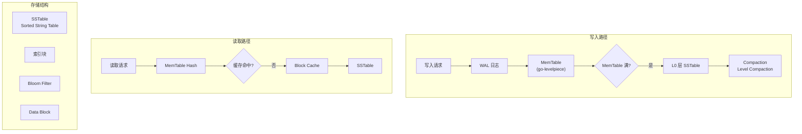

# Badger 项目概览

## 学习目标

- 了解 Badger 的定位和特点
- 掌握 Badger 的 LSM-Tree 核心设计与键值分离优化

## 项目定位

> Go 嵌入式高性能 LSM-Tree KV 数据库，由 Dgraph 开发，提供键值分离和 RocksDB 的纯 Go 替代方案

**基本信息**：

- 开发方：Dgraph Labs
- 开源协议：Apache 2.0
- GitHub Stars：~12k

## 核心设计

## 要点总结

- **LSM-Tree 架构**：采用日志结构合并树，与 LevelDB/RocksDB 类似但完全用 Go 实现
- **键值分离**：值存储在独立的 Value Log 中，减少 Compaction 时的 I/O 开销
- **无锁读取**：使用 MVCC 和 STMP 协议实现高效的并发读取
- **Bloom Filter**：每个 SSTable 内置 Bloom Filter 加速键查找
- **TTL 支持**：支持带过期时间的键值对
- **事务支持**：支持 ACID 事务，保证数据一致性

## 相关资源

- GitHub: https://github.com/dgraph-io/badger
- 文档: https://dgraph.io/docs/badger/
