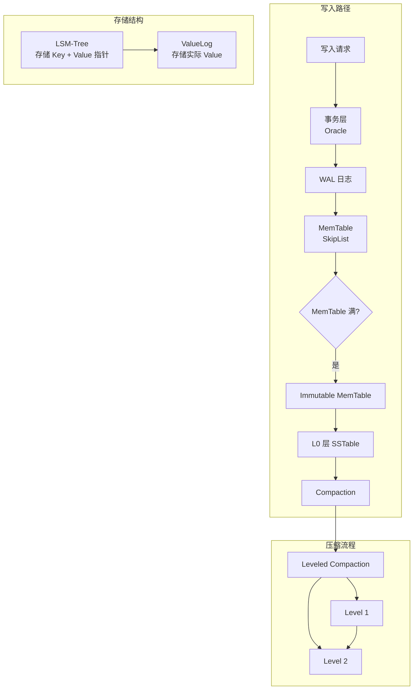
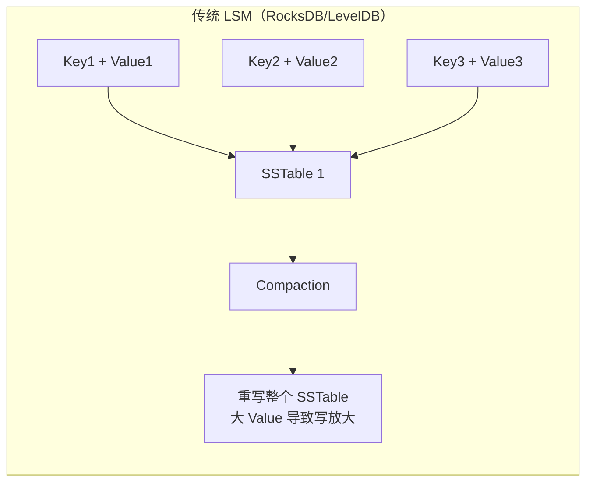
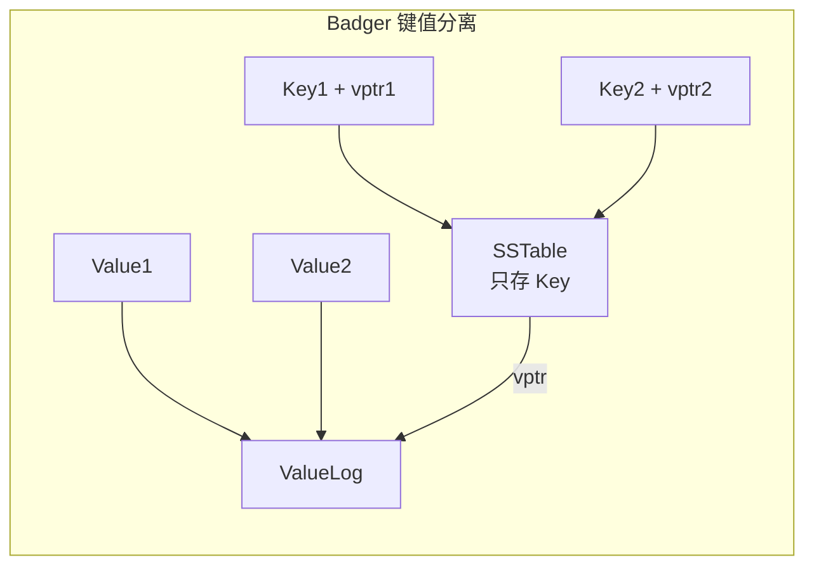
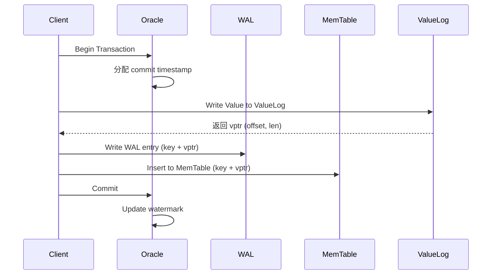
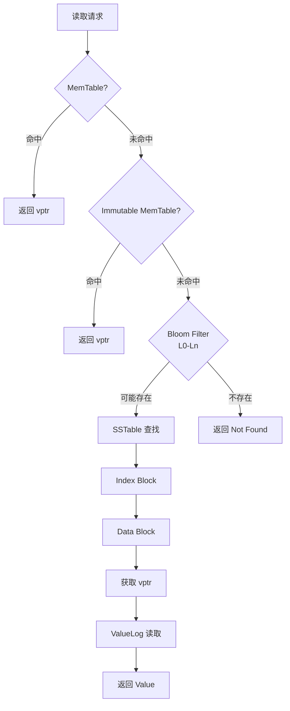
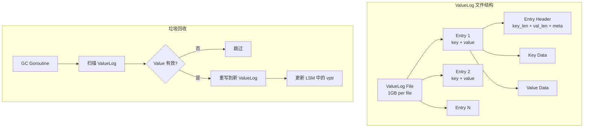
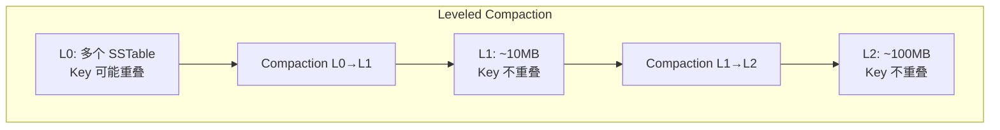

# Badger 架构设计

## 学习目标

- 理解 Badger 的 LSM-Tree 架构设计
- 掌握键值分离的 ValueLog 机制
- 了解写入/读取/压缩流程

## 架构总览



## 键值分离设计

Badger 的核心创新：将 Key 和 Value 分离存储。

### 传统 LSM 问题



### Badger 解决方案



**优势**：
- **减少写放大**：Compaction 只处理 Key，不重写 Value
- **SSD 友好**：减少写入量，延长 SSD 寿命
- **适合大 Value**：大 Value 场景优势明显

## 写入路径详解



### MemTable 结构

```go
// MemTable 使用 SkipList 实现
type MemTable struct {
    sl       *skl.Skiplist  // 跳表
    wal      *wal.WAL       // 关联的 WAL
    buf      *bytes.Buffer  // 缓冲区
    size     int64          // 当前大小
    maxSize  int64          // 最大大小
}
```

### WAL 格式

```
+----------------+----------------+----------------+
| Entry Header   | Key            | Value Ptr      |
+----------------+----------------+----------------+
| checksum(4B)   | key_len(4B)    | val_offset(8B) |
| key_len(4B)    | key_data(NB)   | val_len(4B)    |
| val_len(4B)    |                |                |
+----------------+----------------+----------------+
```

## 读取路径详解



### SSTable 结构

```
+------------------+
| Data Block 1     |
| Data Block 2     |
| ...              |
| Data Block N     |
+------------------+
| Index Block      |  --> 指向各 Data Block
+------------------+
| Bloom Filter     |  --> 快速排除不存在的 Key
+------------------+
| Footer           |
+------------------+
```

## ValueLog 详解



### ValueLog GC 触发条件

1. **空间阈值**：无效数据比例超过 50%
2. **定时触发**：后台定期扫描
3. **手动触发**：调用 `DB.RunValueLogGC()`

## Compaction 策略



### 层级大小配置

| Level | 大小倍数 | 目标大小 |
|-------|---------|---------|
| L0 | - | ~4 个 SSTable |
| L1 | 10x | ~10 MB |
| L2 | 100x | ~100 MB |
| L3 | 1000x | ~1 GB |
| Ln | 10^n | ~10^n MB |

## 要点总结

- **键值分离**：Key 存 LSM，Value 存 ValueLog，减少写放大
- **ValueLog GC**：后台回收无效 Value 空间
- **Leveled Compaction**：层级合并，每层 Key 不重叠
- **并发设计**：Oracle + Watermark 实现事务

## 思考题

1. 键值分离在什么场景下优势最大？什么场景下反而成为劣势？
2. ValueLog GC 如何避免对前台请求的影响？
3. Badger 的 Leveled Compaction 与 RocksDB 的 Universal Compaction 有何区别？
