# 存储引擎

## 学习目标

- 理解 Badger 存储引擎的核心架构和数据结构
- 掌握键值分离的 ValueLog 持久化机制
- 熟悉读写路径的实现细节
- 对比 Badger LSM-Tree 与项目存储引擎的异同

## 核心存储架构

### 整体架构

Badger 的存储引擎以 LSM-Tree 为基础，创新性地采用了键值分离设计，将 Key 存储在 LSM-Tree 中，Value 存储在独立的 ValueLog 文件中。

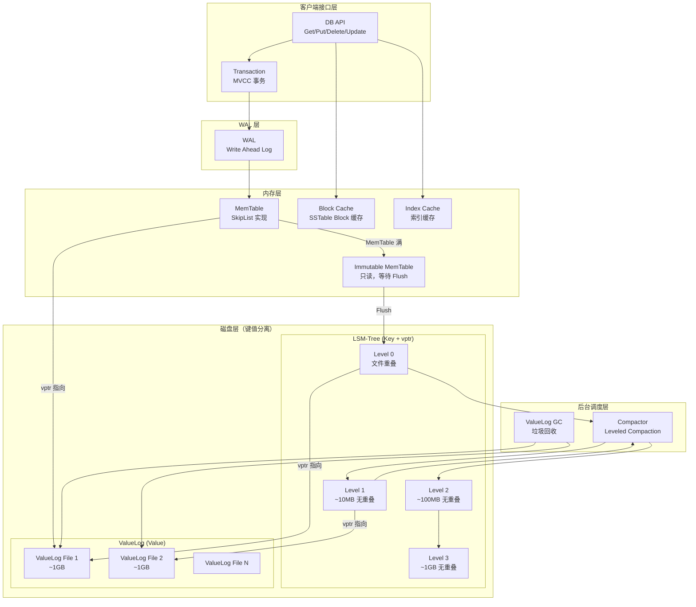

### 数据流向

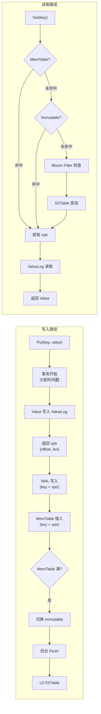

## 核心数据结构

### MemTable (SkipList)

Badger 的 MemTable 使用 SkipList 实现，支持高效的有序插入和查找。

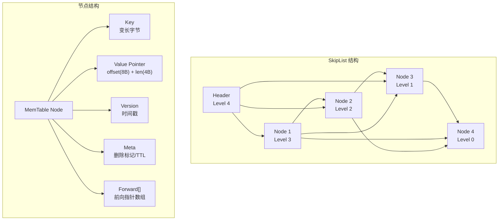

**SkipList 特点**：

| 特性 | 说明 |
|------|------|
| 时间复杂度 | O(log n) 查找/插入 |
| 空间复杂度 | O(n) 平均节点数 |
| 并发支持 | 读操作无锁 |
| 内存管理 | Arena 分配器 |

**Go 实现**：

```go
// skl/skl.go
type Skiplist struct {
    head   *node
    height int32
}

type node struct {
    key   []byte      // 键
    value []byte      // 值（实际是 vptr）
    meta  byte        // 元数据（删除标记等）
    next  [maxHeight]*node
}

// 插入操作
func (s *Skiplist) Add(key, value []byte) {
    // 1. 随机决定层数
    level := s.randomLevel()
    // 2. 找到插入位置
    // 3. 更新前向指针
}

// 查找操作
func (s *Skiplist) Get(key []byte) []byte {
    // 从最高层开始查找
    // 逐层下降
}
```

### WAL (Write-Ahead Log)

Badger 的 WAL 记录键和 Value 指针，保证崩溃恢复。

```
WAL 文件格式：
+------------------+
| Record 1         |
|  - Header        |
|    - checksum(4B)|
|    - key_len(4B) |
|    - val_len(4B) |
|  - Key Data      |
|  - Value Pointer |
|    - offset(8B)  |
|    - len(4B)     |
+------------------+
| Record 2         |
| ...              |
+------------------+

Value Pointer 结构：
+------------------+
| fid (文件 ID)    | 4B
| offset (偏移)    | 8B
| len (长度)       | 4B
+------------------+
```

**WAL 写入流程**：

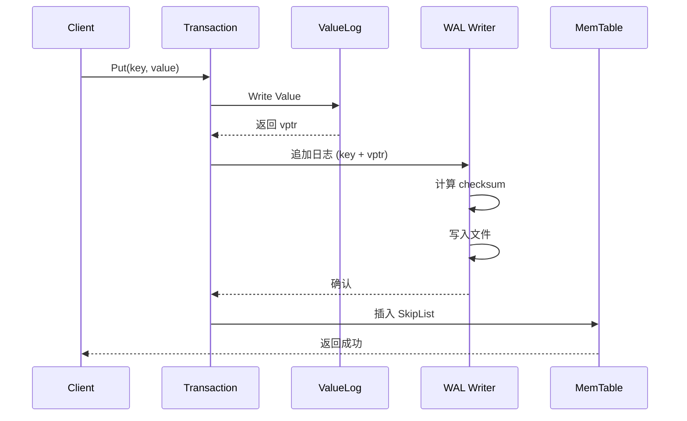

### SSTable (Sorted String Table)

Badger 的 SSTable 只存储 Key 和 Value Pointer，不存储实际 Value。

```
SSTable 文件格式：
+------------------+
| Data Block 1     |  <- KV 条目（key + vptr）
| Data Block 2     |
| ...              |
| Data Block N     |
+------------------+
| Bloom Filter     |  <- 快速排除不存在 Key
+------------------+
| Index Block      |  <- Data Block 索引
|  - 每个 Block 的 last_key
|  - Block offset + size
+------------------+
| Footer           |  <- 指向 Bloom Filter 和 Index
+------------------+

Data Block 条目格式：
+------------------+
| Key Header       |
|  - overlap(2B)   |  <- 前缀压缩
|  - diff(2B)      |
|  - val_len(4B)   |
| Key Data         |
| Value Pointer    |
|  - fid(4B)       |
|  - offset(8B)    |
|  - len(4B)       |
+------------------+
```

### ValueLog（键值分离核心）

ValueLog 是 Badger 键值分离的核心，独立存储实际 Value。

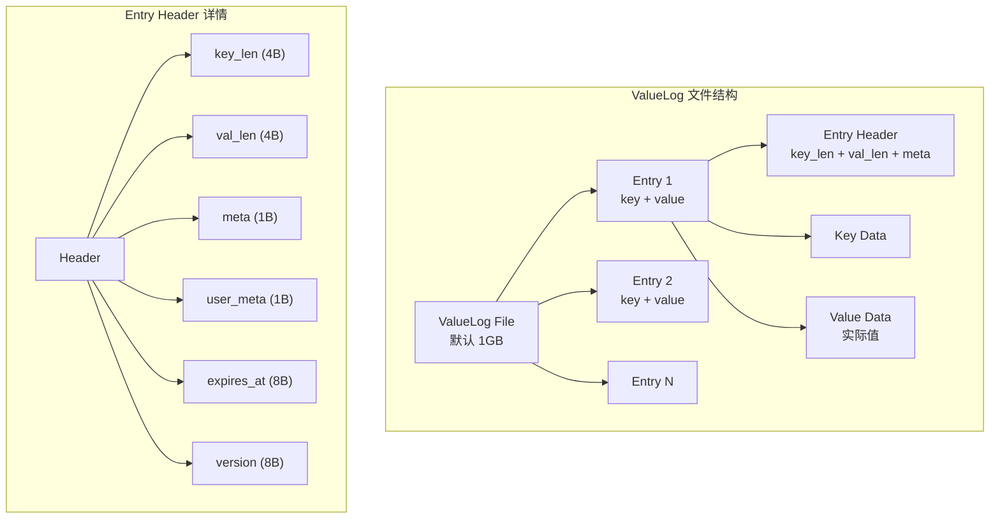

**ValueLog 写入**：

```go
// value.go
func (vlog *valueLog) write(vals []*request) error {
    // 1. 计算所需空间
    // 2. 如果当前文件不够，创建新文件
    // 3. 批量写入
    // 4. 返回 vptr
}
```

**ValueLog 读取**：

```go
// value.go
func (vlog *valueLog) read(vp valuePointer) ([]byte, error) {
    // 1. 根据 fid 找到文件
    // 2. 根据 offset 定位
    // 3. 读取 Entry
    // 4. 解析 Header 和 Value
}
```

## 数据持久化机制

### 写入持久化

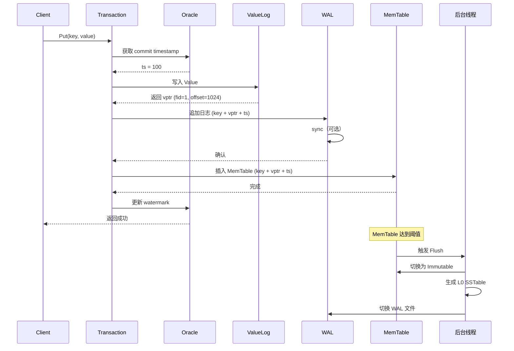

### 崩溃恢复

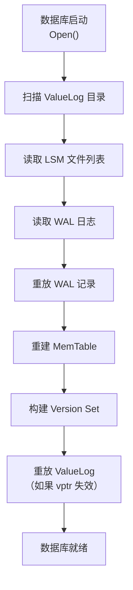

**恢复步骤**：

1. 扫描 ValueLog 目录，获取文件列表
2. 读取 LSM 目录，构建当前 Version
3. 读取 WAL 日志，重放未持久化的操作
4. 重建 MemTable
5. 检查 ValueLog 完整性
6. 数据库就绪

### ValueLog GC（垃圾回收）

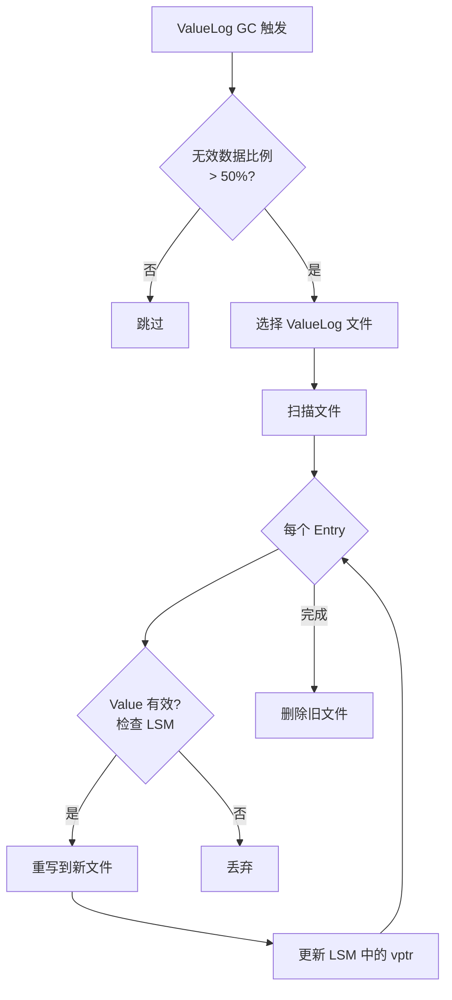

**GC 触发条件**：

| 条件 | 说明 |
|------|------|
| 空间阈值 | 无效数据比例超过 50% |
| 定时触发 | 后台定期扫描 |
| 手动触发 | 调用 `DB.RunValueLogGC()` |

**GC 实现**：

```go
// value.go
func (vlog *valueLog) runGC(discardRatio float64) error {
    // 1. 选择候选文件
    // 2. 扫描并统计有效 Entry
    // 3. 如果无效比例超阈值，执行 GC
    // 4. 重写有效 Entry 到新文件
    // 5. 更新 LSM 中的 vptr
    // 6. 删除旧文件
}
```

## 读写路径

### 写入路径

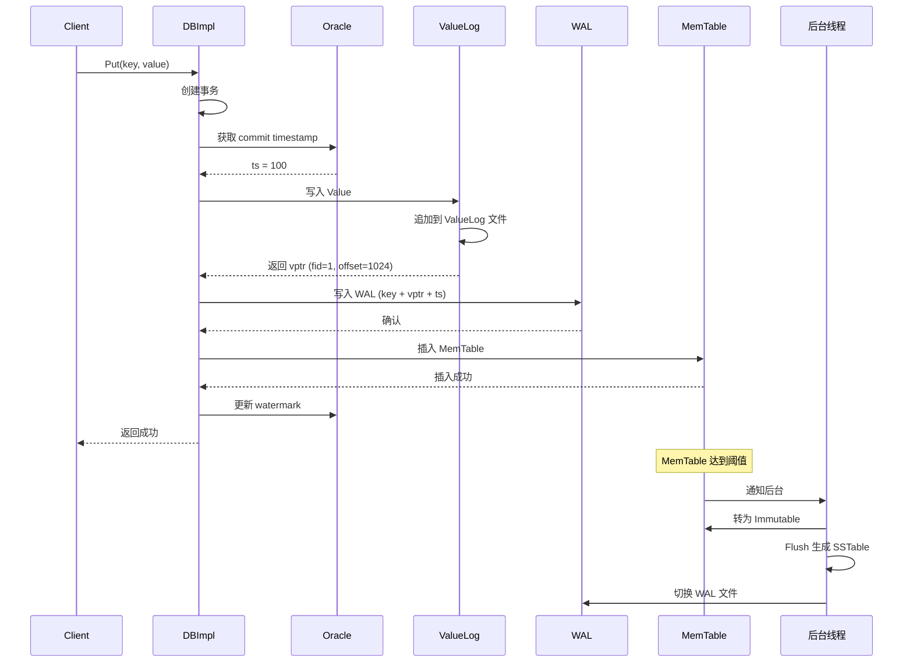

### 读取路径

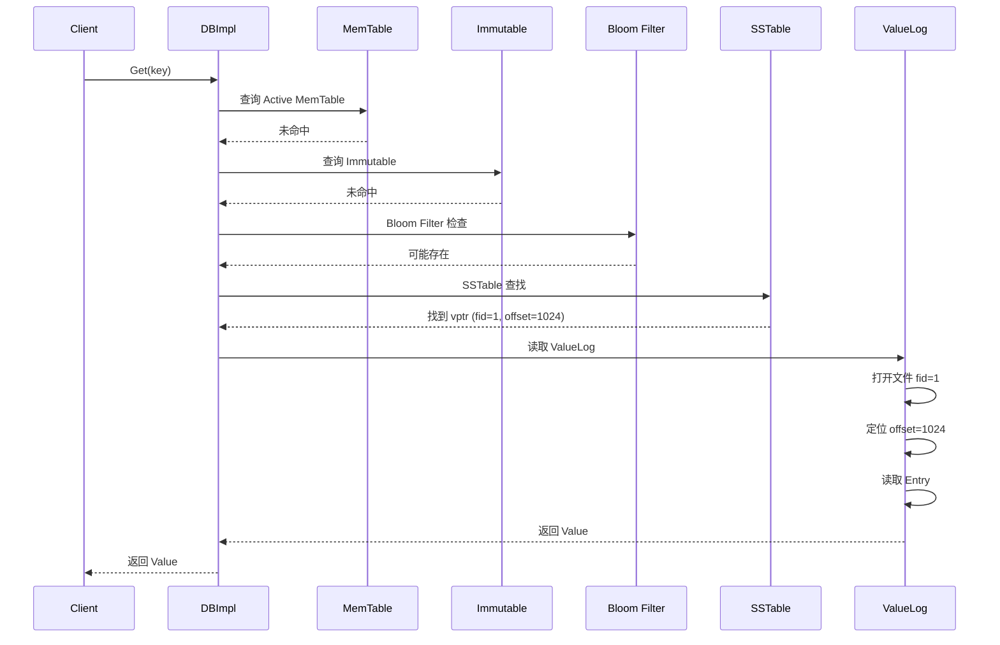

### 读取优化

| 优化技术 | 说明 |
|---------|------|
| Bloom Filter | 快速排除不存在 Key |
| Block Cache | 缓存 SSTable Data Block |
| Index Cache | 缓存 SSTable Index |
| 前缀压缩 | 减少存储空间 |
| 二分查找 Index Block | 快速定位 Data Block |

## 与项目 storage 模块的对比

### 架构对比

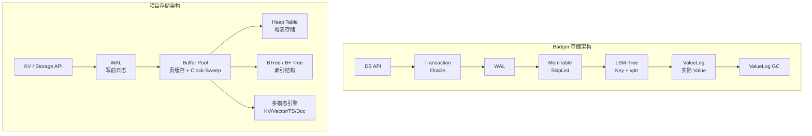

### 详细对比

| 维度 | Badger | 项目存储引擎 |
|------|--------|-------------|
| **数据结构** | LSM-Tree + 键值分离 | B+ Tree / Heap Table |
| **内存管理** | MemTable (SkipList) + Block Cache | Buffer Pool (页缓存) |
| **磁盘格式** | SSTable (Key) + ValueLog (Value) | 数据文件 + 索引文件 |
| **写入模式** | 顺序追加 WAL + MemTable | 随机写入 Buffer Pool |
| **读取模式** | 多层合并查找 + 额外 ValueLog 读取 | 直接定位 |
| **压缩策略** | Leveled Compaction | 无后台压缩 |
| **并发控制** | Oracle + Watermark | 锁管理器 |
| **大值处理** | ValueLog 分离 | 无特殊处理 |
| **事务支持** | MVCC (Snapshot Isolation) | 无事务层 |
| **适用场景** | 写密集，大 Value | 读密集，嵌入式 |

### 项目存储引擎现状

```c
// 多模态存储引擎接口 (engineering/include/db/storage_engine.h)
// 与 Badger 键值分离的对比：
//
// Badger 键值分离       项目多模态存储
// ───────────────────── ───────────────────────
// LSM 存储 Key + vptr   索引存储 Key + rid
// ValueLog 存储 Value   Heap Table 存储实际数据
// 独立 GC 回收          VACUUM 回收空间
// 减少写放大            无写放大问题

typedef struct storage_ops_s {
    const char *name;        // 引擎名称
    DataModel model;         // 数据模型

    // 生命周期
    int (*init)(const char *data_dir);
    int (*shutdown)(void);

    // 表操作
    int (*table_create)(const char *name, const storage_schema_t *schema);
    void *(*table_open)(const char *name, AccessMode mode);
    int (*table_close)(void *rel);

    // 元组操作
    int (*tuple_insert)(void *rel, const void *data, size_t len);
    int (*tuple_update)(void *rel, ...);
    int (*tuple_delete)(void *rel, const void *key, size_t key_len);

    // 扫描操作
    scan_desc_t *(*scan_begin)(void *rel, ...);
    int (*scan_next)(scan_desc_t *scan, void *out_data, size_t *out_len);
} storage_ops_t;
```

### KV 引擎对比

```c
// 项目 KV 引擎 API (engineering/include/db/kv.h)
// 与 Badger 接口对比
//
// 项目 KV              Badger
// ───────────────────  ─────────────────────
// kv_open(path)         badger.Open(opts)
// kv_put(db, k, v)      txn.Set(k, v)
// kv_get(db, k, &v)     txn.Get(k)
// kv_delete(db, k)      txn.Delete(k)
// kv_close(db)          db.Close()
//
// 主要差异：
// 1. 项目 KV 使用 Heap Table + BTree 索引
// 2. Badger 使用 LSM-Tree + 键值分离
// 3. 项目 KV 无事务支持
// 4. Badger 有 ValueLog GC 机制

typedef struct kv_s kv_t;

kv_t *kv_open(const char *path);
kv_result_t kv_put(kv_t *db, const void *key, size_t key_len,
                   const void *value, size_t value_len);
kv_result_t kv_get(kv_t *db, const void *key, size_t key_len,
                   void **out_value, size_t *out_len);
kv_result_t kv_delete(kv_t *db, const void *key, size_t key_len);
kv_result_t kv_close(kv_t *db);
```

### 可借鉴的设计

| 项目 | 借鉴点 | 说明 |
|------|-------|------|
| **键值分离** | ValueLog 设计 | 大 Value 场景减少写放大 |
| **MemTable** | Arena 分配器 | 减少内存碎片，批量回收 |
| **WAL** | 结构化日志 | Key + vptr 分离 |
| **ValueLog GC** | 垃圾回收 | 清理无效 Value |
| **Oracle** | MVCC 时间戳管理 | 事务隔离实现 |
| **Block Cache** | LRU 缓存 | 加速 SSTable 读取 |

## 要点总结

- **键值分离架构**：Key 存 LSM-Tree，Value 存 ValueLog，显著减少写放大
- **写入优化**：顺序追加 WAL + MemTable + ValueLog，写入吞吐高
- **读取路径**：MemTable → Immutable → Bloom Filter → SSTable → ValueLog，需要额外 I/O
- **持久化保证**：WAL 确保崩溃恢复，ValueLog GC 清理无效数据
- **与项目对比**：Badger 写友好且支持大 Value，项目读友好但无键值分离
- **借鉴价值**：ValueLog 设计可优化项目大 Value 场景，Oracle 机制可增强事务能力

## 思考题

1. Badger 的键值分离对读性能有什么影响？如何缓解读性能下降？
2. ValueLog GC 如何避免对前台请求的影响？GC 触发时机如何选择？
3. 如果在项目 KV 引擎中实现键值分离，需要修改哪些模块？如何处理小 Value 场景？
4. Badger 的 Oracle + Watermark 事务模型与项目的 WAL 系统如何融合？
5. Badger 的 LSM-Tree Compaction 策略与 LevelDB/RocksDB 有何不同？为什么？
