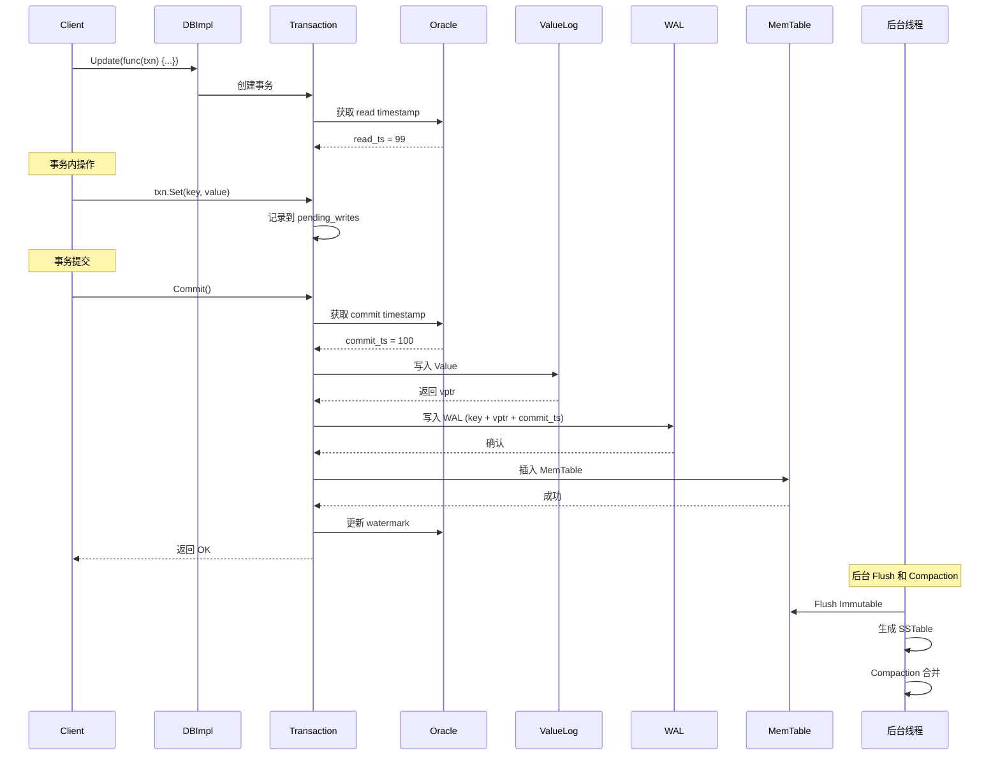
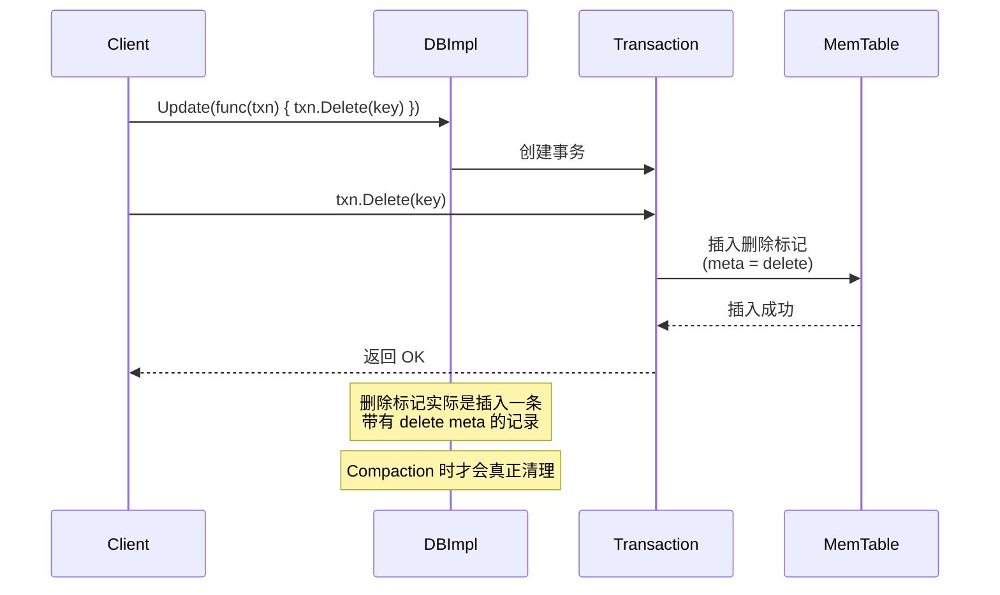
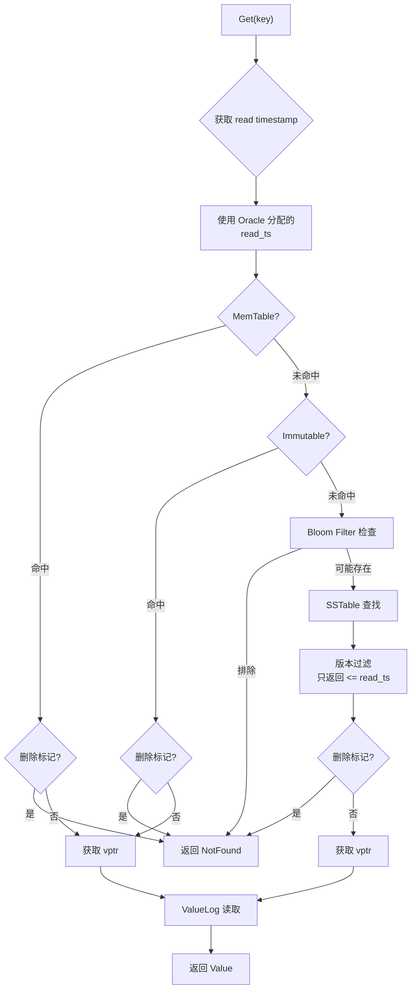
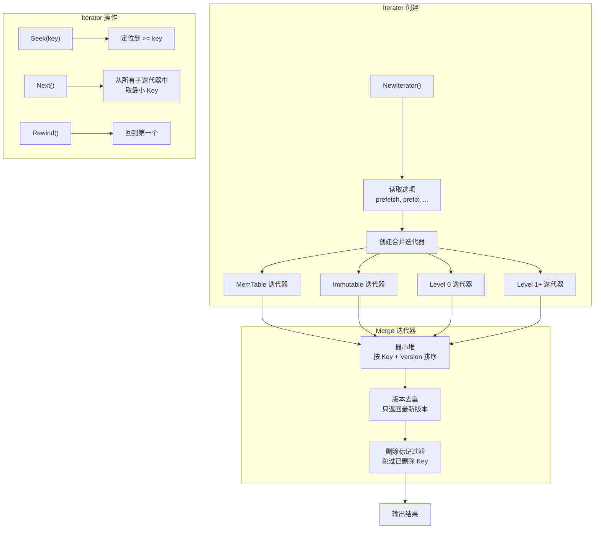
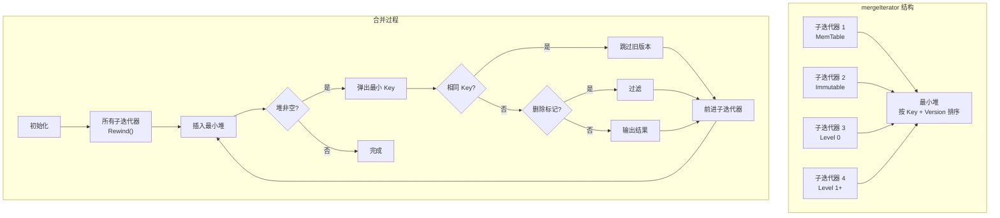
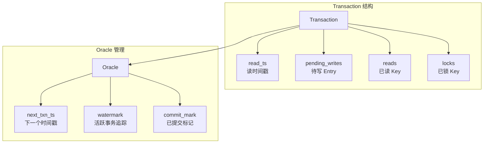
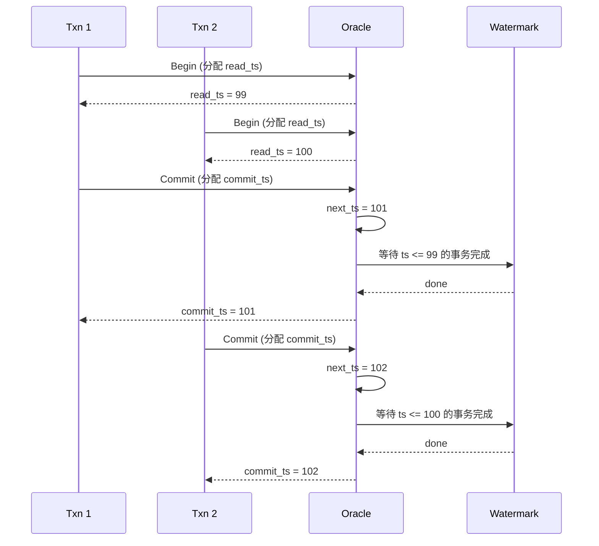
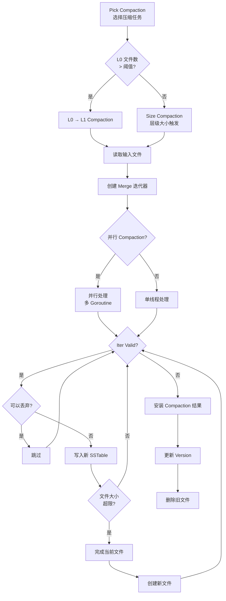
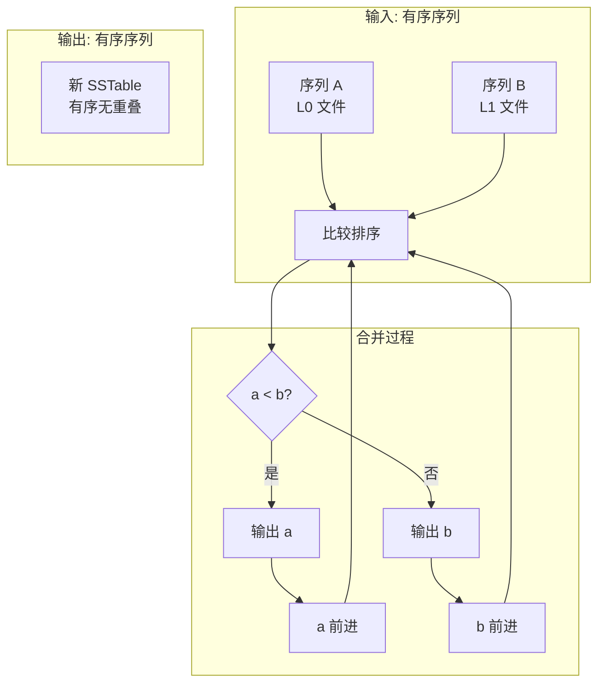

# 查询或操作引擎

## 学习目标

- 理解 Badger 查询和操作执行流程
- 掌握 Iterator 设计和 Merge 迭代器的工作方式
- 了解 Transaction 和 MVCC 的实现
- 对比 Badger 操作引擎与项目 algo/ 模块的关联

## 操作执行流程

### 写入操作 (Put / Update)



### 删除操作 (Delete)



**删除实现**：

```go
// txn.go
func (txn *Txn) Delete(key []byte) error {
    // 删除是插入一条带有删除标记的 Entry
    e := &Entry{
        Key:  key,
        meta: deleteBit,  // 删除标记
    }
    return txn.SetEntry(e)
}

// Compaction 时处理删除
// 如果 meta 包含 deleteBit，则丢弃该 Key
```

### 读取操作 (Get / View)



### 范围扫描 (Iterator)



## 核心算法和数据结构

### Iterator 设计

Badger 的 Iterator 是一致的数据访问接口，支持合并多个数据源的读取。

```go
// iterator.go
type Iterator struct {
    iitr   *mergeIterator  // 合并迭代器
    item   *Item           // 当前项
    readTs uint64          // 读时间戳
    opt    IteratorOptions // 选项
}

type IteratorOptions struct {
    PrefetchValues bool     // 预取 Value
    Prefix         []byte   // 前缀过滤
    Reverse        bool     // 反向遍历
    AllVersions    bool     // 返回所有版本
    InternalAccess bool     // 内部访问
}
```

### Merge 迭代器 (mergeIterator)



**Merge 迭代器算法**：

```go
// iterator.go
type mergeIterator struct {
    iters   []*iterator    // 子迭代器列表
    cur     *iterator      // 当前最小
    heap    *simpleHeap    // 最小堆
    reverse bool           // 反向
}

func (it *mergeIterator) Next() {
    // 1. 当前迭代器前进
    it.cur.Next()

    // 2. 重新插入堆
    if it.cur.Valid() {
        it.heap.push(it.cur)
    }

    // 3. 弹出新的最小
    if it.heap.len() > 0 {
        it.cur = it.heap.pop()
    }

    // 4. 跳过相同 Key 的旧版本
    it.advancePastVersions()
}

func (it *mergeIterator) advancePastVersions() {
    for it.Valid() && it.cur.Key() == it.lastKey {
        it.Next()
    }
}
```

### Transaction 实现



**Transaction 实现**：

```go
// txn.go
type Txn struct {
    readTs     uint64          // 读时间戳
    commitTs   uint64          // 提交时间戳
    writes     []Entry         // 待写入
    reads      map[string]struct{}  // 已读 Key
    locks      map[string]struct{}  // 已锁 Key
    db         *DB
}

// 读取
func (txn *Txn) Get(key []byte) (*Item, error) {
    // 1. 检查事务内的 pending writes
    if item := txn.getPendingWrite(key); item != nil {
        return item, nil
    }

    // 2. 记录到 reads（用于冲突检测）
    txn.reads[string(key)] = struct{}{}

    // 3. 从 DB 读取（使用 read_ts）
    return txn.db.get(key, txn.readTs)
}

// 写入
func (txn *Txn) Set(key, value []byte) error {
    // 添加到 pending writes
    txn.writes = append(txn.writes, Entry{
        Key:   key,
        Value: value,
    })
    return nil
}

// 提交
func (txn *Txn) Commit() error {
    // 1. 获取 commit timestamp
    txn.commitTs = txn.db.orc.allocTs()

    // 2. 检查冲突（乐观事务）
    if err := txn.checkConflict(); err != nil {
        return err
    }

    // 3. 写入 ValueLog + WAL + MemTable
    return txn.apply()
}
```

### Oracle + Watermark (MVCC)



**Oracle 实现**：

```go
// oracle.go
type oracle struct {
    isManaged  bool
    nextTxnTs  uint64         // 下一个时间戳
    readMark   *watermark     // 读水印
    txnMark    *watermark     // 事务水印
    commits    map[uint64]struct{}  // 已提交时间戳
}

// 分配读时间戳
func (o *oracle) readTs() uint64 {
    // 返回当前最小的未完成事务时间戳
    return o.txnMark.min()
}

// 分配提交时间戳
func (o *oracle) commitTs() uint64 {
    // 原子递增并返回
    return atomic.AddUint64(&o.nextTxnTs, 1)
}

// 等待时间戳
func (o *oracle) waitForMark(ts uint64) {
    // 等待所有小于等于 ts 的事务完成
    o.txnMark.waitFor(ts)
}
```

**Watermark 实现**：

```go
// watermark.go
type watermark struct {
    mark     uint64
    waiting  map[uint64]chan struct{}  // 等待通道
    done     map[uint64]int            // 已完成计数
}

// 标记开始
func (w *watermark) Begin(ts uint64) {
    // 增加计数
}

// 标记完成
func (w *watermark) Done(ts uint64) {
    // 减少计数，如果为 0 则通知等待者
    if w.done[ts] == 0 {
        if ch, ok := w.waiting[ts]; ok {
            close(ch)  // 通知
        }
    }
}

// 等待
func (w *watermark) WaitFor(ts uint64) {
    if w.mark >= ts {
        return  // 已经完成
    }

    ch := make(chan struct{})
    w.waiting[ts] = ch
    <-ch  // 等待通知
}
```

### Compaction 执行流程



**Compaction 核心算法**：

```go
// compaction.go
func (c *compaction) build() error {
    // 1. 创建合并迭代器
    iter := c.db.newMergeIterator(c.levels)

    // 2. 逐条处理
    for iter.Rewind(); iter.Valid(); iter.Next() {
        key := iter.Key()
        val := iter.Value()

        // 3. 检查是否可以丢弃
        drop := c.shouldDrop(key, val)

        // 4. 去重（相同 Key 保留最新版本）
        if key == lastKey {
            drop = true
        }

        // 5. 写入新 SSTable
        if !drop {
            builder.Add(key, val)
        }

        // 6. 文件大小限制
        if builder.Size() >= targetFileSize {
            builder.Finish()
            builder = NewBuilder()
        }
    }

    return nil
}

func (c *compaction) shouldDrop(key, val []byte) bool {
    // 1. 删除标记
    if isDelete(val) {
        // 只在最后一层才真正删除
        return c.level == maxLevel
    }

    // 2. 过期 TTL
    if isExpired(val) {
        return true
    }

    return false
}
```

## 与项目 algo/ 模块的关联

### 算法关联

Badger 中使用的核心算法在项目 algo/ 模块中都有对应实现：

| 算法 | Badger 使用 | 项目对应模块 |
|------|------------|-------------|
| **SkipList** | MemTable 实现 | `engineering/src/index/` |
| **Bloom Filter** | SSTable 快速过滤 | `engineering/src/algo/` |
| **LRU Cache** | Block Cache | `engineering/src/db/core/` |
| **二分查找** | Index Block 定位 | `engineering/src/algo/` |
| **排序合并** | Compaction 合并 | `engineering/src/algo/` |
| **最小堆** | Merge 迭代器优先队列 | `engineering/src/algo/` |
| **Hash 表** | Watermark 管理 | `engineering/src/self_made/` |

### 排序合并算法 (Compaction 核心)



**Compaction 合并代码**：

```go
// compaction.go
// 合并多个有序输入

// 项目中的排序实现 (engineering/src/algo/)
// 可用于 Compaction 合并
//
// 1. 归并排序 - Compaction 合并的核心
// 2. 外部排序 - 大文件排序
// 3. 堆排序 - Merge 迭代器
```

### Bloom Filter 与项目实现

```go
// 项目 Bloom Filter 实现 (engineering/src/algo/bloom_filter.c)
// Badger 使用类似实现

// Bloom Filter 参数计算
// k = ln(2) * (bits_per_key)  // 哈希函数数量
// m = n * bits_per_key        // 位数组大小

// Badger Bloom Filter
// bloom_filter.go
type BloomFilter struct {
    filter []byte
    k      int  // 哈希函数数量
}

func (bf *BloomFilter) MayContain(key []byte) bool {
    hash := hashKey(key)
    for i := 0; i < bf.k; i++ {
        pos := (hash + i*hash2) % (len(bf.filter) * 8)
        if bf.filter[pos/8]&(1<<(pos%8)) == 0 {
            return false  // 肯定不存在
        }
    }
    return true  // 可能存在
}
```

### Iterator 模式与项目实现

```c
// 项目扫描接口 (engineering/include/db/rel.h)
// 与 Badger Iterator 设计相似
//
// Badger Iterator      项目 ScanDesc
// ───────────────────  ─────────────────────
// Rewind()             scan_begin()
// Next()               scan_next()
// Valid()              scan != NULL
// Key()                scan->tuple
// Value()              scan->tuple_data
// Close()              scan_end()

typedef struct scan_desc_s scan_desc_t;

scan_desc_t *scan_begin(void *rel, ...);
int scan_next(scan_desc_t *scan, void *out_data, size_t *out_len);
void scan_end(scan_desc_t *scan);
```

## 操作性能分析

### 写入性能

| 因素 | 影响 | 说明 |
|------|------|------|
| **WAL sync** | 每次写入 1 次 fsync | 可配置 async |
| **ValueLog 写入** | 顺序追加 | SSD 友好 |
| **MemTable 插入** | O(log n) SkipList | 内存操作，快 |
| **MemTable 满** | 冻结 + 后台 Flush | 可能阻塞写入 |
| **批量写入** | WriteBatch 合并 | 吞吐提升 10x+ |

### 读取性能

| 因素 | 影响 | 说明 |
|------|------|------|
| **Bloom Filter** | 过滤 90%+ 无效文件 | 减少磁盘 I/O |
| **Block Cache** | 缓存 SSTable Block | 减少磁盘读取 |
| **Index Cache** | 缓存索引 | 加速定位 |
| **层级深度** | 最多 6-7 层 | 读放大可能 |
| **ValueLog 读取** | 额外一次 I/O | 键值分离代价 |
| **Level 0 重叠** | 最多 4 个文件 | 逐文件查找 |

### 读放大问题

```
读放大 = 实际读取的磁盘数据量 / 返回的数据量

场景 1: 点查 Key 在 L1
- 1 次 Bloom Filter 检查
- 1 次 Index Block 读取
- 1 次 Data Block 读取
- 1 次 ValueLog 读取
- 读放大: ~3x

场景 2: 点查 Key 在 L0
- 需要检查多个 L0 文件
- 可能需要读取多次 Index Block
- 读放大: ~5-8x

场景 3: 范围扫描
- 需要合并多个层级
- 读放大: 10x~100x

优化方案：
1. 增大 Block Cache 和 Index Cache
2. 调整 Compaction 触发阈值
3. 使用前缀 Bloom Filter
4. 预取 Value
```

### 写放大问题

```
写放大 = 实际写入磁盘的数据量 / 用户写入的数据量

场景 1: 写入 1MB 数据
- WAL 写入: 1MB（Key + vptr）
- ValueLog 写入: 1MB（Value）
- MemTable → L0: 1MB（Key + vptr）
- L0 → L1 Compaction: 1MB + 10MB = 11MB
- L1 → L2 Compaction: 11MB + 100MB = 111MB
- ...
- 写放大: ~5-20x（比 RocksDB 低）

优化方案：
1. 键值分离减少 Value 重写
2. 增大 MemTable 大小
3. 调整 Compaction 触发阈值
4. 使用更大的 ValueLog 文件
```

## 要点总结

- **操作流程**：Put/Get/Delete 都通过 Transaction 执行，保证原子性
- **Iterator 系统**：一致的数据访问接口，支持 Merge 迭代器多路合并
- **Transaction 机制**：基于 Oracle + Watermark 的 MVCC 实现
- **版本管理**：时间戳版本控制，读操作读取快照版本
- **Compaction 操作**：后台合并排序 + 去重，是 LSM-Tree 的核心维护操作
- **性能权衡**：写入吞吐高但读放大不可避免，键值分离减少写放大
- **与项目关联**：SkipList、Bloom Filter、排序合并算法与项目 algo/ 模块对应

## 思考题

1. Merge 迭代器如何保证多个子迭代器的 Key 排序正确？如果子迭代器有相同 Key 怎么处理？
2. Badger 的删除为什么是插入删除标记而不是立即删除？这有什么好处和坏处？
3. Oracle + Watermark 机制如何保证事务隔离？如果 Watermark 更新延迟会怎样？
4. 如果项目中实现 LSM-Tree 引擎，Compaction 的合并排序算法能否复用现有 algo/ 模块的排序实现？
5. Badger 的键值分离对读性能有什么影响？如何优化读路径？
6. ValueLog GC 如何避免影响前台请求？GC 触发时机如何选择？
