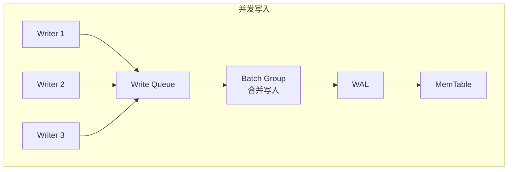
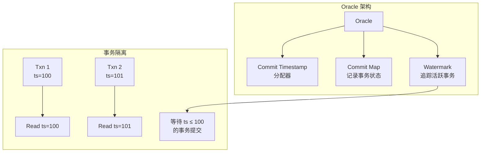

# Badger 关键特性

## 学习目标

- 掌握 Badger 的核心特性
- 理解键值分离、事务、压缩等功能

## Key-Value Separation（键值分离）

Badger 的核心创新，将 Key 和 Value 分离存储：

```go
// 写入时
err := db.Update(func(txn *badger.Txn) error {
    // 大 Value 不会导致 Compaction 写放大
    return txn.Set([]byte("key"), []byte("large_value..."))
})

// 读取时需要额外 I/O
err := db.View(func(txn *badger.Txn) error {
    item, _ := txn.Get([]byte("key"))
    // 需要从 ValueLog 读取 Value
    return item.Value(func(val []byte) error {
        fmt.Printf("Value: %s\n", val)
        return nil
    })
})
```

### 适用场景

| 场景 | 是否适合 | 原因 |
|------|---------|------|
| 大 Value (>1KB) | 适合 | 减少 Compaction 写放大 |
| 小 Value (<100B) | 不太适合 | 额外 I/O 开销 |
| 写多读少 | 适合 | 减少写入量 |
| 读多写少 | 一般 | 多一次 I/O |

## Concurrent LSM（并发 LSM）

Badger 支持并发写入，不像 LevelDB 的单线程写入：



### 批量写入优化

```go
// 使用 WriteBatch 批量写入
wb := db.NewWriteBatch()
defer wb.Cancel()

for i := 0; i < 10000; i++ {
    key := []byte(fmt.Sprintf("key-%d", i))
    val := []byte(fmt.Sprintf("value-%d", i))
    wb.Set(key, val)
}

// 一次性提交
err := wb.Flush()
```

## Transaction（事务支持）

Badger 通过 Oracle 实现 MVCC 事务：



### 事务示例

```go
// 乐观事务
err := db.Update(func(txn *badger.Txn) error {
    // 读取
    item, err := txn.Get([]byte("counter"))
    if err != nil && err != badger.ErrKeyNotFound {
        return err
    }
    
    var counter int
    if item != nil {
        item.Value(func(val []byte) error {
            counter = int(binary.LittleEndian.Uint64(val))
            return nil
        })
    }
    
    // 更新
    counter++
    buf := make([]byte, 8)
    binary.LittleEndian.PutUint64(buf, uint64(counter))
    return txn.Set([]byte("counter"), buf)
})
```

### 隔离级别

- **Snapshot Isolation**：读取事务开始时的快照
- **Serializable**：通过冲突检测实现

## TTL（过期时间）

Badger 原生支持键的过期时间：

```go
// 设置 TTL
err := db.Update(func(txn *badger.Txn) error {
    e := badger.NewEntry([]byte("key"), []byte("value")).
        WithTTL(24 * time.Hour)  // 24 小时后过期
    return txn.SetEntry(e)
})

// 检查是否过期
err := db.View(func(txn *badger.Txn) error {
    item, err := txn.Get([]byte("key"))
    if err == badger.ErrKeyNotFound {
        fmt.Println("Key expired or not found")
    }
    return nil
})
```

### TTL 实现原理

- 每个 Entry 包含 `ExpiresAt` 时间戳
- Compaction 时清理过期 Entry
- Get 时检查是否过期

## Compression（压缩）

Badger 支持多种压缩算法：

```go
import "github.com/dgraph-io/badger/v4/options"

db, err := badger.Open(badger.DefaultOptions("./data").
    WithCompression(options.Snappy).  // Snappy 压缩（默认）
    // WithCompression(options.ZSTD). // ZSTD 压缩
)
```

### 压缩算法对比

| 算法 | 压缩比 | 压缩速度 | 解压速度 | 推荐场景 |
|------|-------|---------|---------|---------|
| None | 1:1 | 最快 | 最快 | CPU 敏感 |
| Snappy | ~2:1 | 快 | 快 | 默认选择 |
| ZSTD | ~3:1 | 中等 | 快 | 空间敏感 |

## Block Cache

Badger 内置 Block Cache 加速读取：

```go
db, err := badger.Open(badger.DefaultOptions("./data").
    WithBlockCacheSize(256 << 20).  // 256 MB Block Cache
    WithIndexCacheSize(128 << 20).  // 128 MB Index Cache
)
```

### Cache 类型

- **Block Cache**：缓存 SSTable 的 Data Block
- **Index Cache**：缓存 SSTable 的 Index Block

## Backup & Restore

```go
// 备份
func backup(db *badger.DB, w io.Writer) error {
    _, err := db.Backup(w, 0)
    return err
}

// 恢复
func restore(db *badger.DB, r io.Reader) error {
    return db.Load(r, 100)  // 100 个批次
}
```

## 配置选项

```go
opts := badger.DefaultOptions("./data").
    // MemTable 大小
    WithMemTableSize(64 << 20).           // 64 MB
    // ValueLog 文件大小
    WithValueLogFileSize(1 << 30).        // 1 GB
    // ValueLog GC 阈值
    WithValueLogMaxEntries(1000000).      // 100 万条
    // LSM 层级大小倍数
    WithLevelSizeMultiplier(10).
    // 压缩线程数
    WithNumCompactors(4).
    // MemTable 数量
    WithNumMemtables(4)

db, err := badger.Open(opts)
```

## 要点总结

- **键值分离**：减少写放大，适合大 Value 场景
- **并发写入**：WriteBatch 批量写入，并发 MemTable
- **MVCC 事务**：Oracle + Watermark 实现 Snapshot Isolation
- **TTL 原生支持**：内置过期机制
- **Block Cache**：加速 SSTable 读取

## 思考题

1. 键值分离对读性能有什么影响？如何缓解？
2. TTL 在 Compaction 时如何清理？如果 Compaction 不及时会怎样？
3. Block Cache 和 Index Cache 应该设置多大？
