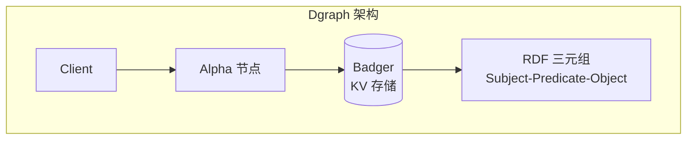
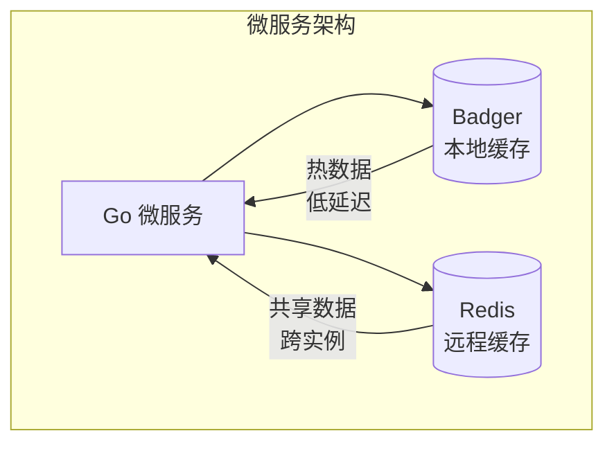

# Badger 使用场景

## 学习目标

- 掌握 Badger 的典型应用场景
- 理解 Badger 与其他嵌入式 KV 的选型决策

## 元数据存储

Badger 适合作为应用元数据存储：

```go
// 用户 Session 存储
type SessionStore struct {
    db *badger.DB
}

func (s *SessionStore) SetSession(sessionID string, data map[string]interface{}) error {
    return s.db.Update(func(txn *badger.Txn) error {
        key := []byte("session:" + sessionID)
        val, _ := json.Marshal(data)
        e := badger.NewEntry(key, val).
            WithTTL(30 * time.Minute)  // 30 分钟过期
        return txn.SetEntry(e)
    })
}

func (s *SessionStore) GetSession(sessionID string) (map[string]interface{}, error) {
    var data map[string]interface{}
    err := s.db.View(func(txn *badger.Txn) error {
        item, err := txn.Get([]byte("session:" + sessionID))
        if err != nil {
            return err
        }
        return item.Value(func(val []byte) error {
            return json.Unmarshal(val, &data)
        })
    })
    return data, err
}
```

### 元数据存储优势

| 特性 | 优势 |
|------|------|
| 事务支持 | 元数据更新的一致性 |
| TTL | 自动清理临时数据 |
| 持久化 | 进程重启不丢失 |
| 嵌入式 | 无需独立服务 |

## Dgraph 存储后端

Badger 最初是为 Dgraph 图数据库设计的：



### 图数据存储模式

```go
// 图数据在 Badger 中的存储
// Key: Subject + Predicate + Object
// Value: Object value + Facets

func (s *Store) SetTriple(subj, pred, obj string) error {
    key := fmt.Sprintf("%s|%s|%s", subj, pred, obj)
    return s.db.Update(func(txn *badger.Txn) error {
        return txn.Set([]byte(key), []byte(obj))
    })
}
```

## 小型 KV 引擎

### 配置管理

```go
type ConfigStore struct {
    db *badger.DB
}

func (c *ConfigStore) Get(key string) (string, error) {
    var val string
    err := c.db.View(func(txn *badger.Txn) error {
        item, err := txn.Get([]byte("config:" + key))
        if err != nil {
            return err
        }
        return item.Value(func(v []byte) error {
            val = string(v)
            return nil
        })
    })
    return val, err
}

func (c *ConfigStore) Set(key, value string) error {
    return c.db.Update(func(txn *badger.Txn) error {
        return txn.Set([]byte("config:"+key), []byte(value))
    })
}
```

### 缓存层

```go
// 带 TTL 的缓存
type CacheLayer struct {
    db *badger.DB
}

func (c *CacheLayer) Set(key string, value []byte, ttl time.Duration) error {
    return c.db.Update(func(txn *badger.Txn) error {
        e := badger.NewEntry([]byte("cache:"+key), value).
            WithTTL(ttl)
        return txn.SetEntry(e)
    })
}

func (c *CacheLayer) Get(key string) ([]byte, error) {
    var val []byte
    err := c.db.View(func(txn *badger.Txn) error {
        item, err := txn.Get([]byte("cache:" + key))
        if err != nil {
            return err
        }
        return item.Value(func(v []byte) error {
            val = append([]byte{}, v...)  // 复制一份
            return nil
        })
    })
    return val, err
}
```

## Go 微服务存储

Badger 作为 Go 微服务的本地存储：



### 双层缓存模式

```go
type DualCache struct {
    local  *badger.DB  // 本地 Badger
    remote *redis.Client  // 远程 Redis
}

func (d *DualCache) Get(key string) ([]byte, error) {
    // 先查本地
    var val []byte
    err := d.local.View(func(txn *badger.Txn) error {
        item, err := txn.Get([]byte(key))
        if err == nil {
            return item.Value(func(v []byte) error {
                val = v
                return nil
            })
        }
        return err
    })
    
    if err == nil {
        return val, nil  // 本地命中
    }
    
    // 查远程
    val, err = d.remote.Get(context.Background(), key).Bytes()
    if err != nil {
        return nil, err
    }
    
    // 写入本地缓存
    d.local.Update(func(txn *badger.Txn) error {
        e := badger.NewEntry([]byte(key), val).WithTTL(5 * time.Minute)
        return txn.SetEntry(e)
    })
    
    return val, nil
}
```

## 场景选型对比

### Badger vs RocksDB

| 维度 | Badger | RocksDB |
|------|--------|---------|
| 语言 | Go | C++ |
| 键值分离 | 原生支持 | 需要 BlobDB/Titan |
| 事务 | MVCC 原生 | 需要 TransactionDB |
| 压缩 | Snappy/ZSTD | 多种压缩算法 |
| 列族 | 不支持 | 支持 ColumnFamily |
| 性能 | 中等 | 高（高度优化） |
| 运维 | 简单（纯 Go） | 复杂（需要 C++ 环境） |

### Badger vs LevelDB

| 维度 | Badger | LevelDB |
|------|--------|---------|
| 并发写入 | 支持 | 单线程 |
| 事务 | MVCC 事务 | WriteBatch（非事务） |
| 键值分离 | 原生支持 | 不支持 |
| TTL | 原生支持 | 不支持 |
| 压缩 | Snappy/ZSTD | 仅 Snappy |
| 语言 | Go | C++ |

### Badger vs Bolt

| 维度 | Badger | Bolt |
|------|--------|------|
| 数据结构 | LSM-Tree | B+ Tree |
| 写性能 | 高（顺序写） | 中（随机写） |
| 读性能 | 中（需要合并） | 高（B+ Tree） |
| 写放大 | 较低（键值分离） | 较高 |
| 适用场景 | 写多读少 | 读多写少 |

## 要点总结

- **元数据存储**：事务 + TTL + 持久化的组合非常适合
- **Dgraph 后端**：Badger 的设计初衷
- **Go 微服务**：纯 Go 实现易于集成
- **双层缓存**：Badger 本地 + Redis 远程

## 思考题

1. 为什么 Dgraph 选择 Badger 而不是 RocksDB？
2. Badger 的键值分离在什么场景下会成为劣势？
3. 如何设计双层缓存策略来最大化性能？
