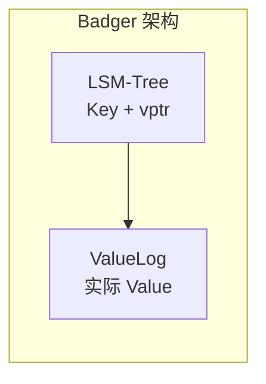
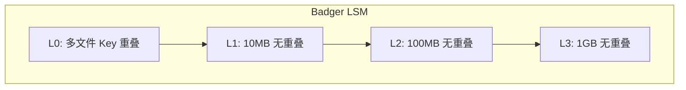
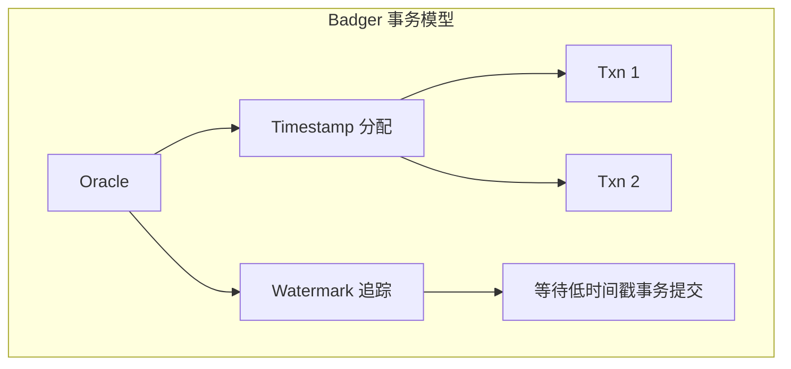

# Badger 项目关联

## 学习目标

- 理解 Badger 设计与项目存储引擎的关联
- 对比键值分离与项目 KV 引擎的异同
- 探索可借鉴的设计点

## 键值分离设计借鉴

### Badger 键值分离



**优势**：
- 减少 Compaction 写放大
- 适合大 Value 场景
- SSD 友好

### 项目 KV 引擎现状

```c
// engineering/src/db/storage/kv_engine.c
typedef struct kv_entry {
    char *key;
    size_t key_len;
    char *value;     // Value 内联存储
    size_t value_len;
} kv_entry_t;
```

**问题**：
- Value 内联导致写放大
- 大 Value 场景性能下降
- Compaction 成本高

### 借鉴方案

```c
// 方案：分离存储
typedef struct kv_key_entry {
    char *key;
    size_t key_len;
    uint64_t value_offset;  // Value 文件偏移
    uint32_t value_len;
} kv_key_entry_t;

typedef struct kv_value_log {
    file_t *value_file;     // 独立 Value 文件
    uint64_t current_offset;
} kv_value_log_t;
```

**实现步骤**：
1. **ValueLog 文件管理**：
   ```c
   // value_log.h
   typedef struct value_log {
       int fd;
       char *path;
       uint64_t size;
       uint64_t capacity;
   } value_log_t;
   
   value_log_t *value_log_open(const char *path);
   uint64_t value_log_append(value_log_t *vl, const char *data, size_t len);
   int value_log_read(value_log_t *vl, uint64_t offset, char *buf, size_t len);
   void value_log_close(value_log_t *vl);
   ```

2. **GC 回收机制**：
   ```c
   // value_gc.h
   typedef struct value_gc {
       value_log_t *vl;
       double gc_threshold;  // 无效数据比例
   } value_gc_t;
   
   // 扫描并回收无效 Value
   int value_gc_run(value_gc_t *gc, kv_store_t *store);
   ```

## LSM 结构对比

### Badger LSM



### 项目 LSM（如果实现）

```c
// lsm_tree.h
typedef struct lsm_level {
    int level;
    size_t target_size;
    size_t current_size;
    sstable_t **tables;
    int table_count;
} lsm_level_t;

typedef struct lsm_tree {
    memtable_t *memtable;
    memtable_t *immutable_memtable;
    lsm_level_t *levels;
    int num_levels;
} lsm_tree_t;
```

**层级大小配置**：

| Level | Badger 目标大小 | 项目建议目标大小 |
|-------|----------------|-----------------|
| L0 | ~4 个 SSTable | ~4 个 SSTable |
| L1 | ~10 MB | ~10 MB |
| L2 | ~100 MB | ~100 MB |
| L3 | ~1 GB | ~1 GB |

## MemTable 对比

### Badger SkipList MemTable

```go
// skl/skl.go
type Skiplist struct {
    head   *node
    height int32
}

type node struct {
    key   []byte
    value []byte
    next  [maxHeight]*node
}
```

**特点**：
- O(log n) 查找/插入
- 无锁并发读取
- 天然有序

### 项目可选方案

#### 方案一：跳表（推荐）

```c
// skl.h
typedef struct skl_node {
    char *key;
    char *value;
    struct skl_node **forward;  // 前向指针数组
    int level;
} skl_node_t;

typedef struct skiplist {
    skl_node_t *header;
    int level;
    int (*compare)(const char*, const char*);
} skiplist_t;
```

#### 方案二：B+ 树（当前使用）

```c
// 项目已实现的 btree
typedef struct btree_node {
    // ... 现有实现
} btree_node_t;
```

**对比**：

| 维度 | SkipList | B+ Tree |
|------|---------|--------|
| 查找 | O(log n) | O(log n) |
| 插入 | O(log n) | O(log n) |
| 范围扫描 | 简单（链表遍历） | 复杂（需要中序遍历） |
| 内存占用 | 较高（指针开销） | 较低 |
| 并发友好 | 是（无锁读） | 一般（需要锁） |

## 事务模型借鉴

### Badger Oracle + Watermark



### 项目事务借鉴

```c
// txn_oracle.h
typedef struct txn_oracle {
    uint64_t next_ts;           // 下一个时间戳
    pthread_mutex_t ts_lock;    // 时间戳锁
    watermark_t *watermark;     // 水印管理
} txn_oracle_t;

typedef struct watermark {
    uint64_t min_commit_ts;     // 最小已提交时间戳
    uint64_t *active_txns;      // 活跃事务列表
} watermark_t;

// 分配读时间戳
uint64_t oracle_read_ts(txn_oracle_t *oracle);

// 分配提交时间戳
uint64_t oracle_commit_ts(txn_oracle_t *oracle);

// 等待时间戳以下事务提交
void oracle_wait_for(ts, txn_oracle_t *oracle);
```

## 缓存机制对比

### Badger Block Cache

```go
// options.go
type Options struct {
    BlockCacheSize  int64  // Block Cache 大小
    IndexCacheSize  int64  // Index Cache 大小
}
```

### 项目 Buffer Pool

```c
// buf.h
typedef struct buffer_pool {
    page_t **pages;
    int capacity;
    hash_table_t *lookup;
} buffer_pool_t;
```

**对比**：

| 维度 | Badger Block Cache | 项目 Buffer Pool |
|------|-------------------|-----------------|
| 目的 | 缓存 SSTable Block | 缓存页面 |
| 置换策略 | LRU | Clock-Sweep |
| 哈希查找 | 是 | 是 |
| 脏页管理 | 无（只读缓存） | 有（写缓冲） |

### 借鉴点

```c
// block_cache.h
typedef struct block_cache {
    void **blocks;
    int capacity;
    lru_list_t *lru;
    pthread_mutex_t lock;
} block_cache_t;

// 获取 Block
block_t *block_cache_get(block_cache_t *bc, uint64_t block_id);

// 放入 Block
void block_cache_put(block_cache_t *bc, uint64_t block_id, block_t *block);
```

## 配置系统借鉴

### Badger 配置选项

```go
opts := badger.DefaultOptions("./data").
    WithMemTableSize(64 << 20).           // 64 MB
    WithValueLogFileSize(1 << 30).        // 1 GB
    WithNumCompactors(4).
    WithNumMemtables(4)
```

### 项目 GUC 系统映射

```c
// guc.h
// 可借鉴的配置参数
GUC_DEFINE(badger_memtable_size, "64MB");
GUC_DEFINE(badger_valuelog_size, "1GB");
GUC_DEFINE(badger_compactor_count, "4");
GUC_DEFINE(badger_memtable_count, "4");
```

## 实践建议

### 阶段一：键值分离实验

1. 在 `db/storage/kv_engine.c` 中添加 ValueLog 支持
2. 实现 `value_log.h` 和 `value_log.c`
3. 修改 `kv_put` 和 `kv_get` 使用分离存储

### 阶段二：LSM 结构实现

1. 实现 `lsm_tree.h` 和 `lsm_tree.c`
2. 实现 `memtable_skl.h` 跳表 MemTable
3. 实现 `sstable.h` SSTable 格式

### 阶段三：事务支持

1. 实现 `txn_oracle.h` 时间戳管理
2. 实现 `watermark.h` 水印追踪
3. 集成到现有 `db/wal.h` WAL 系统

## 要点总结

- **键值分离**：项目 KV 引擎可借鉴 ValueLog 设计减少写放大
- **LSM 结构**：Badger 的 Leveled Compaction 可作为参考
- **事务模型**：Oracle + Watermark 是成熟的 MVCC 方案
- **缓存机制**：Block Cache 与 Buffer Pool 可互补使用

## 思考题

1. 项目存储引擎是否需要完整的键值分离？什么场景下收益最大？
2. 如何在现有 Buffer Pool 基础上增加 Block Cache？
3. Badger 的事务模型与项目的 WAL 系统如何融合？