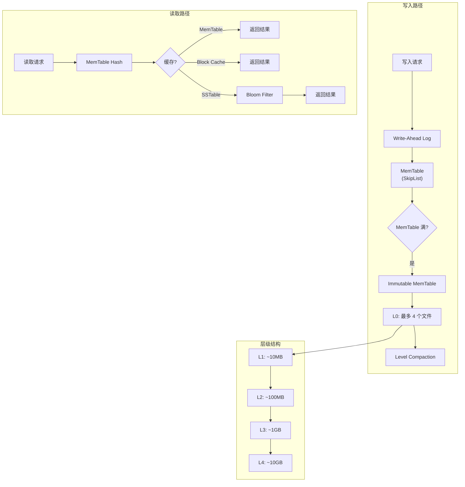

# LevelDB 项目概览

## 学习目标

- 了解 LevelDB 的定位和特点
- 掌握 LevelDB 的 LSM-Tree 核心设计与 Level Compaction 策略

## 项目定位

> Google 开源的 C++ 嵌入式 LSM-Tree KV 存储引擎，单进程使用，Snappy 压缩，Level Compaction 策略

**基本信息**：

- 开发方：Google (Jay Kreps 等)
- 开源协议：BSD 3-Clause
- GitHub Stars：~32k

## 核心设计

## 要点总结

- **LSM-Tree 架构**：日志结构合并树，优化顺序写入性能
- **Level Compaction**：每层大小呈 10 倍增长，Level-1 及以上同一层内 key 不重叠
- **SkipList MemTable**：内存中的有序数据结构，支持高效写入
- **SSTable 格式**：数据块 + 索引块 + Bloom Filter，支持高效范围查询
- **Snappy 压缩**：默认使用 Snappy 算法压缩数据，减少存储空间
- **单进程访问**：不支持跨进程访问，适合嵌入式场景
- **Iterator 支持**：支持正向/反向迭代器，用于范围扫描

## 相关资源

- GitHub: https://github.com/google/leveldb
- 文档: https://github.com/google/leveldb/blob/main/doc/table_format.md
