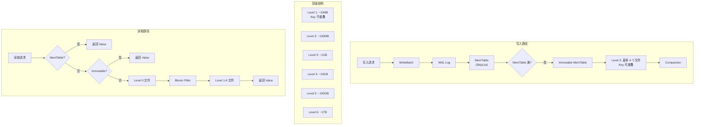
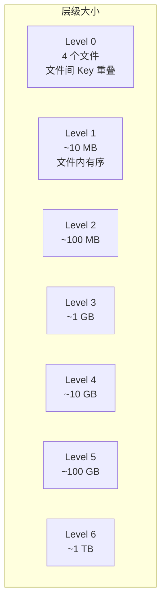
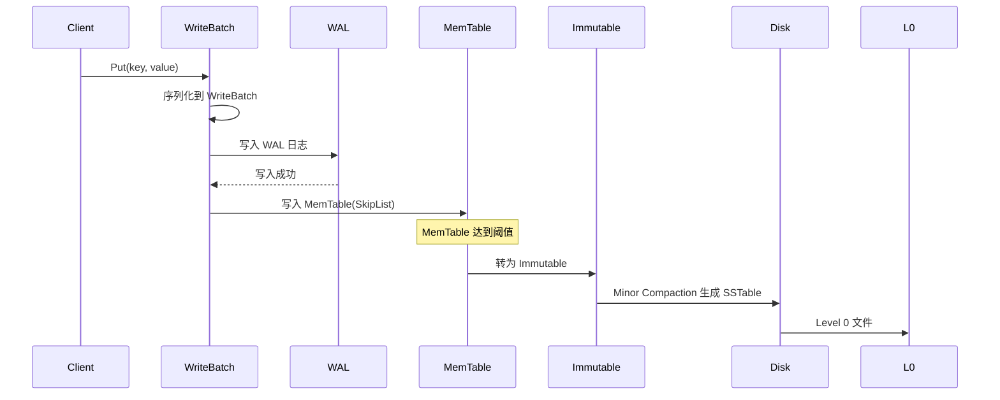
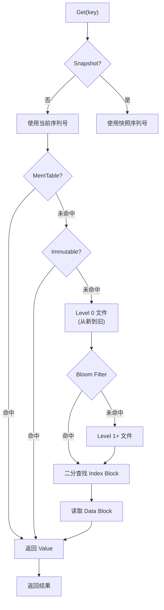
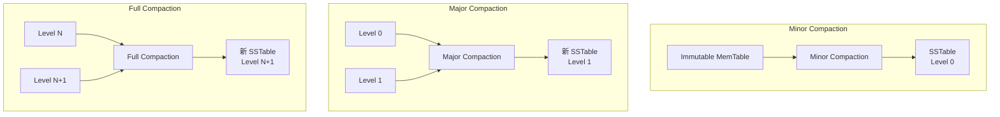

# LevelDB 架构设计

## 学习目标

- 理解 LevelDB 的 LSM-Tree 架构设计
- 掌握 Level Compaction 策略
- 了解写入/读取/压缩流程

## 架构总览



## LSM 分层结构

### 层级规则



**核心规则**：
- 每层大小约为上一层的 10 倍
- Level 1 及以上文件间 Key 不重叠
- Level 0 的文件间 Key 可重叠（需要逐个文件查找）

### 文件格式

```
SSTable 格式：
+------------------+
| Data Block 1     |
| Data Block 2     |
| ...              |
| Data Block N     |
+------------------+
| Meta Block       |  --> Bloom Filter
+------------------+
| Meta Index Block |
+------------------+
| Index Block      |  --> 指向各 Data Block
+------------------+
| Footer           |  --> 指向 Index/Meta Index
+------------------+
```

## 写入路径详解

### 写入流程



### WAL 格式

```
+----------------+----------------+----------------+
| Block Header   | Entry 1        | Entry 2        |
+----------------+----------------+----------------+
| checksum(4B)   | sequence(8B)   | sequence(8B)   |
| length(2B)     | type(1B)       | type(1B)       |
| type(1B)       | key_len(4B)    | key_len(4B)    |
+----------------+----------------+----------------+
```

### MemTable 实现

```cpp
// db/memtable.cc
class MemTable {
 public:
  // 使用 SkipList 存储
  typedef SkipList<const char*, KeyComparator> Table;
  
  void Add(SequenceNumber seq, ValueType type,
           const Slice& key, const Slice& value);
  
  bool Get(const LookupKey& key, std::string* value,
           Status* s);
  
 private:
  Table table_;          // SkipList
  Arena arena_;          // 内存分配器
  int refs_;             // 引用计数
};
```

## 读取路径详解

### 读取流程



### 查找顺序

```
1. MemTable（最新数据）
2. Immutable MemTable
3. Level 0 文件（从最新到最旧，逐个查找）
4. Level 1 ~ Level 6（每层最多一个文件，二分查找）
```

### Iterator 设计

```cpp
// 前向迭代器
Iterator* it = db->NewIterator(ReadOptions());
for (it->SeekToFirst(); it->Valid(); it->Next()) {
    // 处理 key-value
}

// 范围查找
it->Seek(start_key);
while (it->Valid() && it->key() <= end_key) {
    // 处理范围内的 key-value
    it->Next();
}
```

## Compaction 策略

### 三种 Compaction



### Compaction 触发条件

| 类型 | 触发条件 | 说明 |
|------|---------|------|
| Minor | MemTable 满 | Immutable 转为 SSTable |
| Major | Level 0 文件数 > 4 | L0 → L1 合并 |
| Major | 层级大小超过阈值 | Ln → Ln+1 合并 |

### Level Compaction 过程

```cpp
// db/version_set.cc
struct Compaction {
  int level_;              // 当前 level
  int max_output_files_;   // 最大输出文件数
  // 输入文件
  std::vector<FileMetaData*> inputs_[2];
  // 输出层级
  int output_level_;
};

Status VersionSet::DoCompactionWork(CompactionState* compact) {
    // 1. 合并排序
    Iterator* input = MakeInputIterator(compact);
    
    // 2. 逐条处理
    while (input->Valid()) {
        // 去重（保留最新版本）
        if (drop) continue;
        
        // 写入新 SSTable
        builder->Add(key, value);
        
        // 文件大小超限则新建
        if (builder->FileSize() >= kTargetFileSize) {
            FinishFile(builder, compact);
            builder = NewBuilder();
        }
    }
    
    // 3. 完成 Compaction
    InstallCompactionResults(compact);
}
```

## Version 管理

### VersionSet 结构

```cpp
// db/version_set.h
class VersionSet {
 public:
  // 当前版本
  Version* current_;
  // 版本列表（历史）
  std::vector<Version*> versions_;
  // Manifest 文件
  WritableFile* descriptor_file_;
  
  // Compaction 状态
  std::vector<Compaction*> compactors_;
  
 private:
  // 层级大小配置
  uint64_t max_file_size_;
  int num_levels_;
};
```

### Version 切换

```
Compaction 完成后：
1. 创建新 Version（新 SSTable 列表）
2. 原子切换 current_ 指针
3. 旧 Version 引用计数递减
4. 旧 SSTable 引用计数为 0 时删除
```

## 要点总结

- **LSM 分层**：7 层结构（L0-L6），每层 10 倍增长
- **写入路径**：WAL → MemTable → Immutable → SSTable
- **读取路径**：MemTable → Immutable → L0 → L1-6
- **Compaction**：Minor / Major / Full 三种类型
- **Version 管理**：原子切换，引用计数回收

## 思考题

1. Level 0 的 Key 重叠为什么会导致读性能下降？
2. Level Compaction 如何保证同一层内的 Key 不重叠？
3. 如果写入速度超过 Compaction 速度会发生什么？