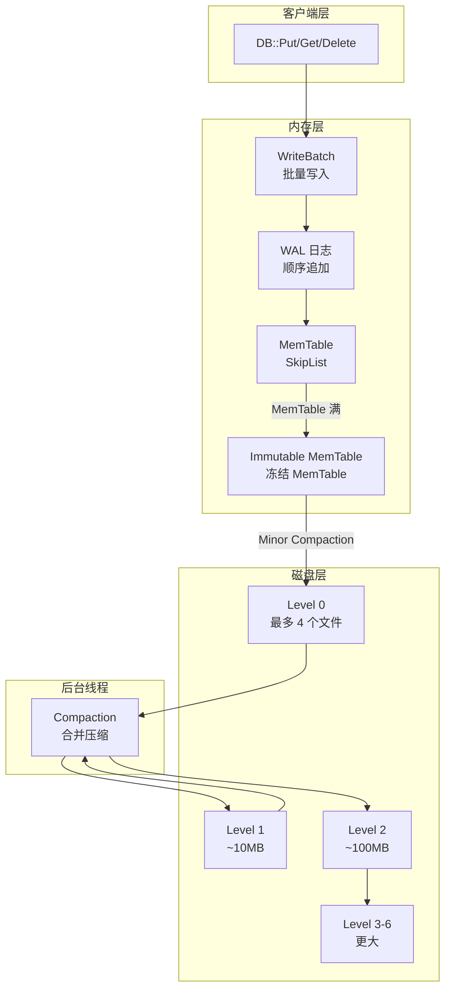
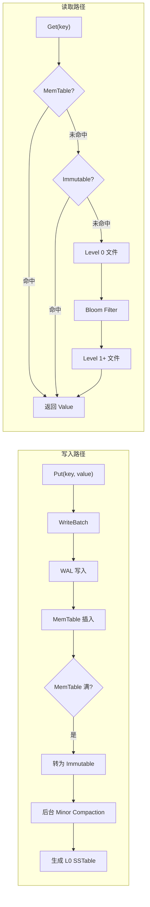
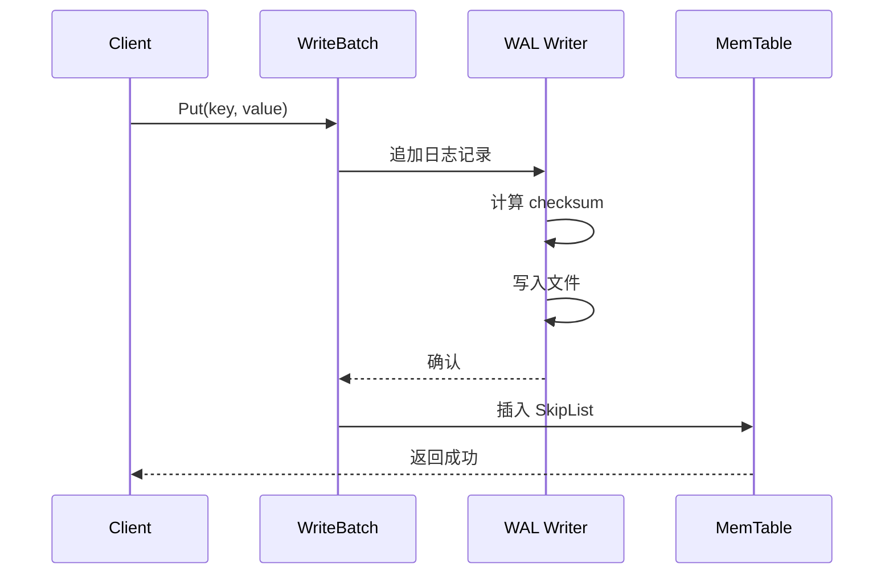
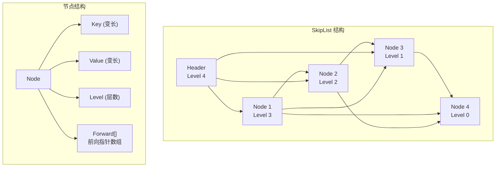
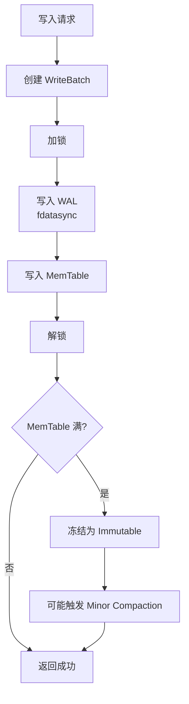
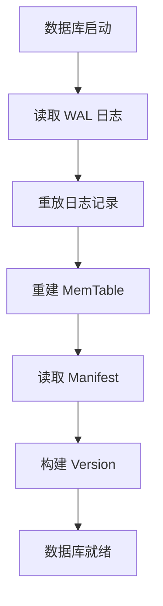
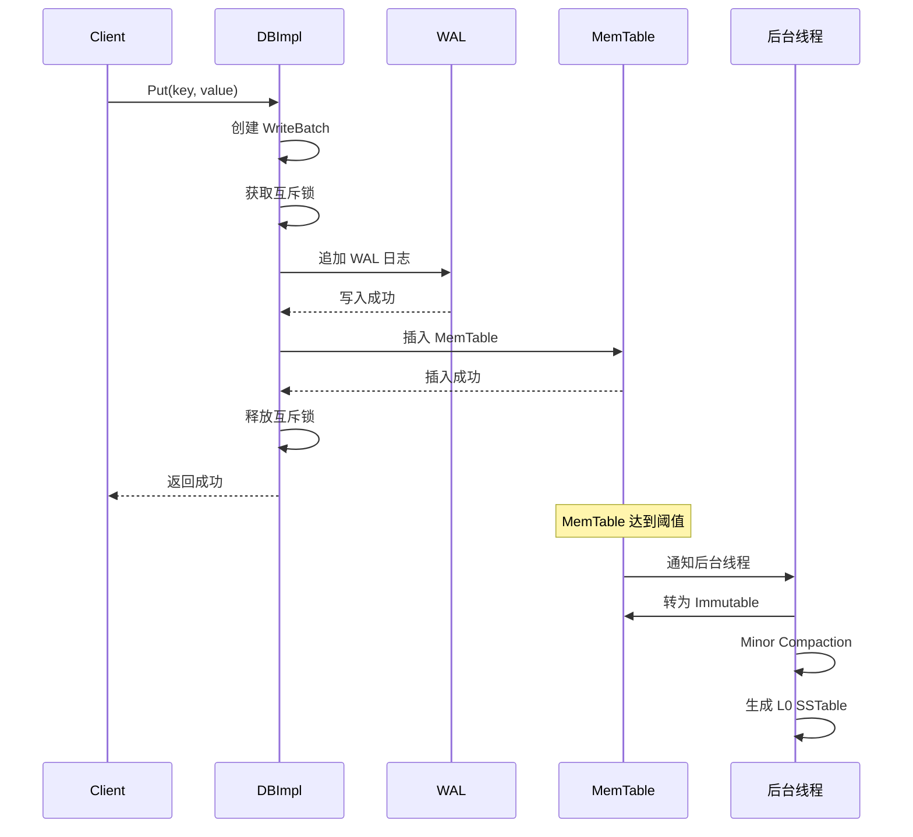
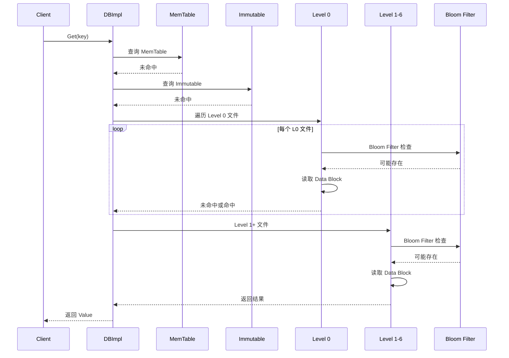
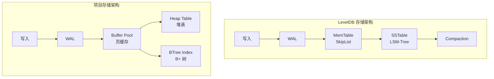

# 存储引擎

## 学习目标

- 理解 LevelDB 存储引擎的核心架构和数据结构
- 掌握 WAL、MemTable、SSTable 的数据持久化机制
- 熟悉读写路径的实现细节
- 对比 LevelDB LSM-Tree 与项目存储引擎的异同

## 核心存储架构

### 整体架构



### 数据流向



## 核心数据结构

### WAL (Write-Ahead Log)

WAL 是 LevelDB 的写前日志，保证写入的持久性和崩溃恢复。

```
WAL 文件格式:
+------------------+
| Block 1          |
|  - Header (7B)   |
|    - checksum(4B)|
|    - length(2B)  |
|    - type(1B)    |
|  - Record Data   |
+------------------+
| Block 2          |
| ...              |
+------------------+

Record 类型:
- kZeroType: 无效记录
- kTypeValue: 键值对
- kTypeDeletion: 删除标记
```

**WAL 写入流程**：



### MemTable (SkipList)

MemTable 使用 SkipList 实现有序内存表。



**SkipList 特点**：

| 特性 | 说明 |
|------|------|
| 时间复杂度 | O(log n) 查找/插入/删除 |
| 空间复杂度 | O(n) 平均节点数 |
| 并发支持 | 读操作无锁 |
| 内存管理 | Arena 分配器 |

### SSTable (Sorted String Table)

SSTable 是磁盘上的有序文件格式。

```
SSTable 文件格式:
+------------------+
| Data Block 1     |  <-- 数据块
| Data Block 2     |
| ...              |
| Data Block N     |
+------------------+
| Meta Block       |  <-- Bloom Filter
+------------------+
| Meta Index Block |  <-- Meta Block 索引
+------------------+
| Index Block      |  <-- 数据块索引
+------------------+
| Footer (48B)     |  <-- 文件尾
+------------------+

Data Block 格式:
+------------------+
| Entry 1          |
|  - shared_bytes  |
|  - unshared_bytes|
|  - value_length  |
|  - key_delta     |
|  - value         |
+------------------+
| Entry 2          |
| ...              |
| Restart Points   |  <-- 重启点数组
| Restart Count    |
+------------------+
```

## 数据持久化机制

### 写入持久化



### 崩溃恢复



**恢复步骤**：

1. 读取 Manifest 文件，构建当前 Version
2. 读取 WAL 日志，重放未提交的事务
3. 重建 MemTable
4. 数据库就绪

### 检查点 (Manifest)

Manifest 文件记录数据库的元数据版本。

```
Manifest 文件格式:
+------------------+
| Snapshot 1       |
|  - Level 0 files |
|  - Level 1 files |
|  - ...           |
+------------------+
| Delta 1          |  <-- 增量更新
+------------------+
| Delta 2          |
+------------------+
| Current Pointer  |  <-- 当前快照指针
+------------------+
```

## 读写路径

### 写入路径



### 读取路径



### 读取优化

| 优化技术 | 说明 |
|---------|------|
| Bloom Filter | 快速排除不存在 Key |
| Block Cache | 缓存热点 Block |
| Key 前缀压缩 | 减少存储空间 |
| 二分查找 Index Block | 快速定位 Data Block |

## 与项目 storage 模块的对比

### 架构对比



### 详细对比

| 维度 | LevelDB | 项目存储引擎 |
|------|---------|-------------|
| **数据结构** | LSM-Tree | B+ Tree / Heap Table |
| **内存管理** | MemTable (SkipList) | Buffer Pool (Page Cache) |
| **磁盘格式** | SSTable | 数据文件 + 索引文件 |
| **写入模式** | 顺序追加 | 随机写入 |
| **读取模式** | 多层合并查找 | 直接定位 |
| **压缩策略** | Compaction | 无后台压缩 |
| **适用场景** | 写密集 | 读密集 |

### 项目存储引擎现状

```c
// 多模态存储引擎接口 (engineering/include/db/storage_engine.h)
typedef struct storage_ops_s {
    const char *name;                      // 引擎名称
    DataModel model;                       // 数据模型

    // 生命周期
    int (*init)(const char *data_dir);
    int (*shutdown)(void);

    // 表操作
    int (*table_create)(const char *name, const storage_schema_t *schema);
    void *(*table_open)(const char *name, AccessMode mode);
    int (*table_close)(void *rel);

    // 元组操作
    int (*tuple_insert)(void *rel, const void *data, size_t len);
    int (*tuple_update)(void *rel, ...);
    int (*tuple_delete)(void *rel, const void *key, size_t key_len);

    // 扫描操作
    scan_desc_t *(*scan_begin)(void *rel, ...);
    int (*scan_next)(scan_desc_t *scan, void *out_data, size_t *out_len);
} storage_ops_t;
```

### KV 引擎对比

```c
// 项目 KV 引擎 (engineering/include/db/kv.h)
typedef struct kv_s kv_t;

// LevelDB 风格 API
kv_t *kv_open(const char *path);
kv_result_t kv_put(kv_t *db, const void *key, size_t key_len,
                   const void *value, size_t value_len);
kv_result_t kv_get(kv_t *db, const void *key, size_t key_len,
                   void **out_value, size_t *out_len);
kv_result_t kv_delete(kv_t *db, const void *key, size_t key_len);
kv_result_t kv_close(kv_t *db);
```

**主要差异**：

- LevelDB 使用 LSM-Tree，项目 KV 使用 Heap Table + BTree Index
- LevelDB 有 Compaction 后台线程，项目 KV 依赖 Buffer Pool 刷脏
- LevelDB 单进程访问，项目 KV 支持多进程（通过锁管理器）

## 要点总结

- **LSM-Tree 架构**：WAL → MemTable → Immutable → SSTable 分层
- **写入优化**：顺序追加 WAL + 内存 MemTable，写入吞吐高
- **读取路径**：MemTable → Immutable → L0 → L1-6，可能存在读放大
- **持久化保证**：WAL 确保崩溃恢复，Manifest 记录版本状态
- **与项目对比**：LSM-Tree 写友好，B+ Tree 读友好，各有所长

## 思考题

1. LevelDB 的 WAL 与项目 WAL 实现有什么异同？各有什么优缺点？
2. MemTable 为什么选择 SkipList 而不是 B+ Tree 或 Hash 表？
3. 如果要在项目中实现一个 LSM-Tree 存储引擎，需要修改哪些模块？
4. LevelDB 的 Compaction 策略会导致什么问题？如何优化？