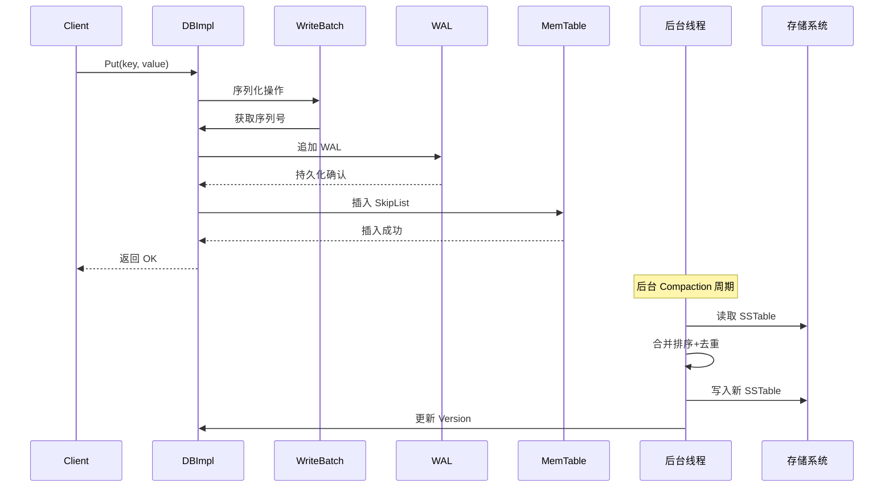
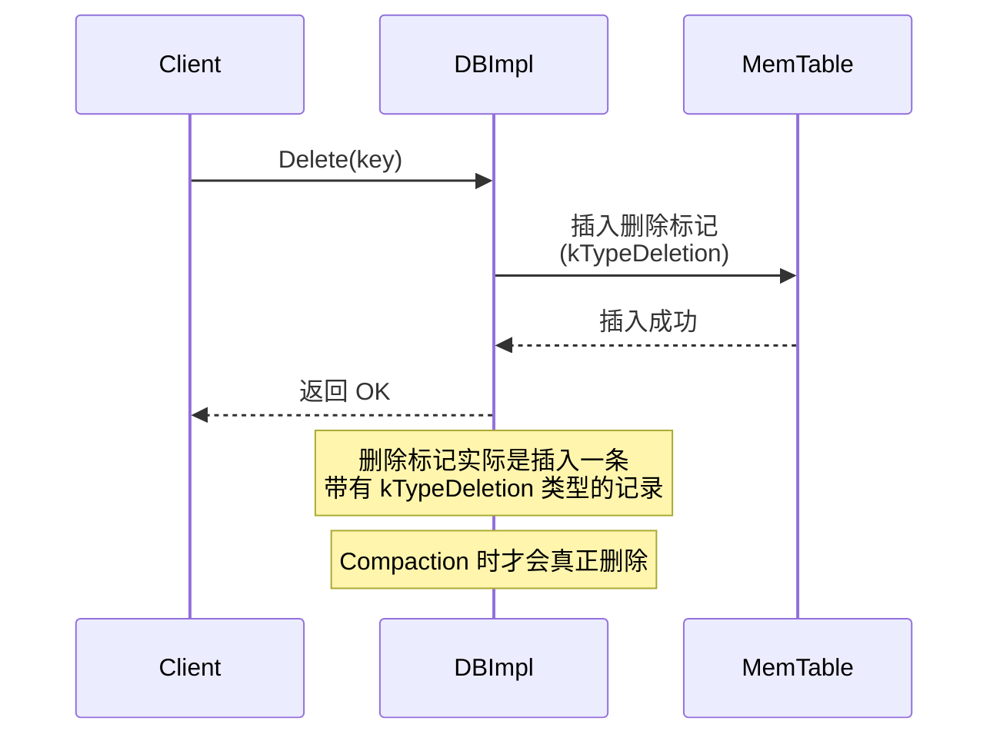
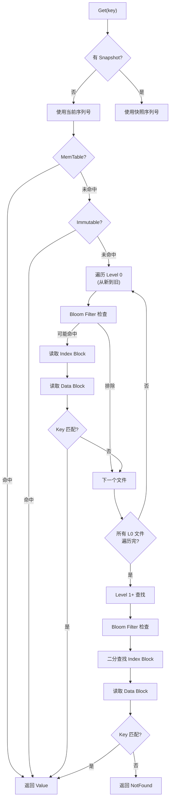
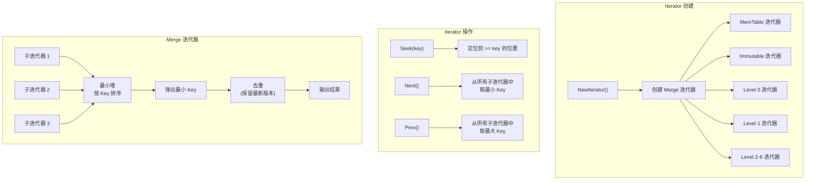
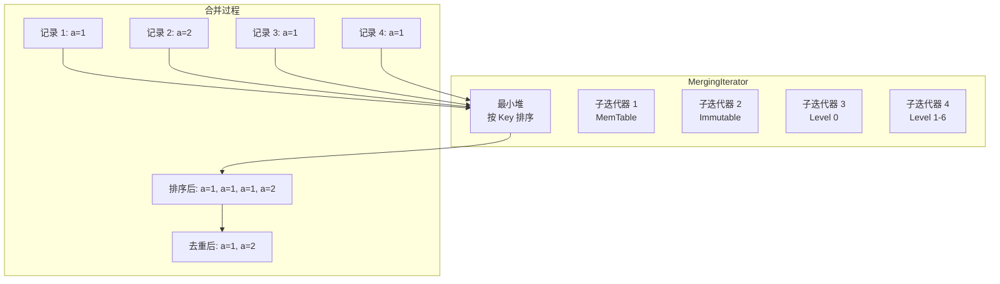
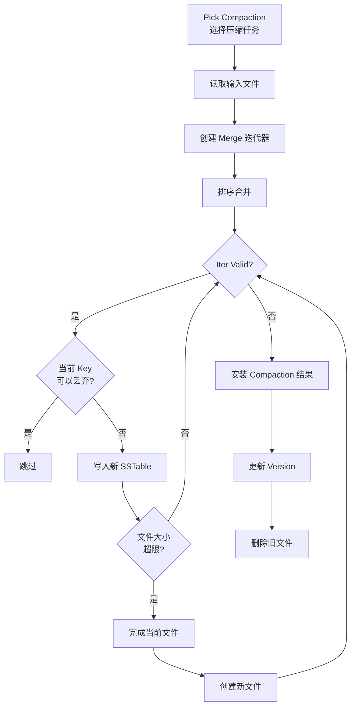
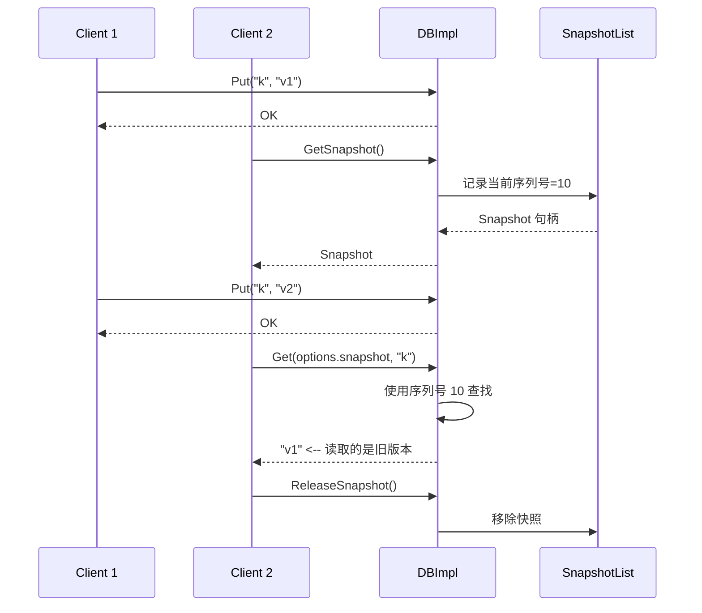
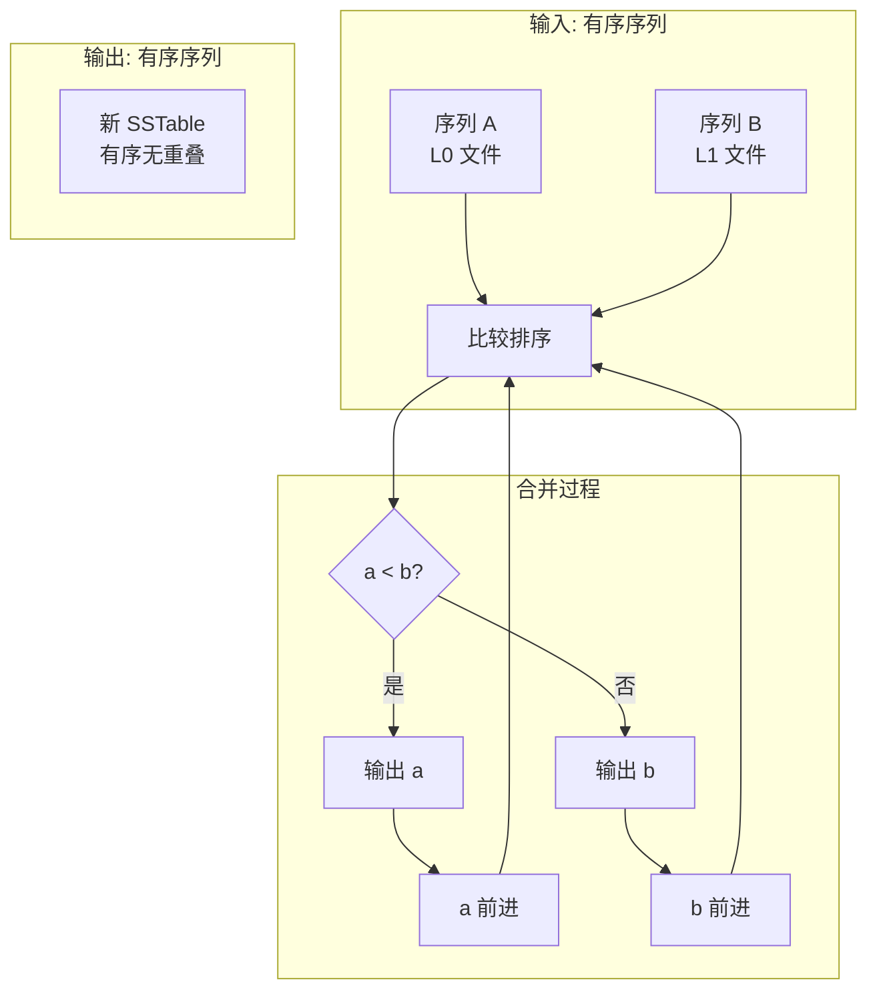

# 查询或操作引擎

## 学习目标

- 理解 LevelDB 查询和操作执行流程
- 掌握 Iterator 设计和 Merge 迭代器的工作方式
- 了解 Snapshot 和 MVCC 的实现
- 对比 LevelDB 操作引擎与项目 algo/ 模块的关联

## 操作执行流程

### 写入操作 (Put)



### 删除操作 (Delete)



### 读取操作 (Get)



### 范围扫描 (Iterator)



## 核心算法和数据结构

### Iterator 设计

LevelDB 的 Iterator 是一致的数据访问接口，隐藏了底层存储细节。

```cpp
// include/leveldb/iterator.h
class Iterator {
 public:
  // 定位
  virtual void SeekToFirst() = 0;   // 到第一个
  virtual void SeekToLast() = 0;    // 到最后一个
  virtual void Seek(const Slice& target) = 0;  // 定位到 >= target

  // 遍历
  virtual void Next() = 0;          // 下一个
  virtual void Prev() = 0;          // 上一个

  // 访问
  virtual bool Valid() const = 0;   // 是否有效
  virtual Slice key() const = 0;    // 当前 Key
  virtual Slice value() const = 0;  // 当前 Value

  // 错误
  virtual Status status() const = 0;
};
```

### 五种 Iterator 实现

| 实现 | 数据来源 | 说明 |
|------|---------|------|
| MemTable Iterator | SkipList | 遍历内存表 |
| Table Iterator | SSTable | 遍历磁盘文件 |
| Level Iterator | Level 层 | 遍历一层所有文件 |
| TwoLevel Iterator | 索引+数据 | 分层遍历 |
| Merging Iterator | 多路合并 | 合并多个子迭代器 |

### Merge 迭代器 (MergingIterator)



**Merge 迭代器算法**：

```cpp
// db/db_iter.cc
void MergingIterator::Next() {
    // 1. 从当前最小子迭代器前进
    current_->Next();

    // 2. 重新插入最小堆
    // 3. 从堆顶取出新的最小 Key
    // 4. 去重：跳过相同 Key 的旧版本
    while (heap_.top()->key() == current_->key()) {
        heap_.top()->Next();
        heap_.adjust();
    }
}
```

### Compaction 中的操作



**丢弃策略**：

```
丢弃条件（满足任一即可）：
1. Key 已被删除（kTypeDeletion 标记）
2. 同一 Key 有更新版本，且旧版本在更低层不再需要
3. 低于用户指定的 Snapshot 序列号
```

### Snapshot 与 MVCC



**Snapshot 实现**：

```cpp
// db/db_impl.cc
class SnapshotList {
    // 双向链表
    Snapshot list_;          // 哨兵节点
    int refs_;               // 引用计数

    Snapshot* New(SequenceNumber seq) {
        Snapshot* s = new Snapshot;
        s->number_ = seq;    // 记录当前序列号
        // 插入链表头部
        Insert(s);
        return s;
    }

    void Delete(const Snapshot* s) {
        // 引用计数递减，为 0 时移除
        if (--s->refs_ == 0) {
            Remove(s);
            delete s;
        }
    }
};
```

### WriteBatch 实现

```cpp
// db/write_batch.cc
// 将多个操作打包为原子操作
//
// 内部格式:
// +----------------+----------------+----------------+----------------+
// | sequence(8B)   | count(4B)      | record 1       | record 2       |
// +----------------+----------------+----------------+----------------+
//
// record = type(1B) + key_len(4B) + key(NB) + val_len(4B) + val(NB)

class WriteBatch {
 public:
  void Put(const Slice& key, const Slice& value);
  void Delete(const Slice& key);

  // 原子提交
  Status Write(const WriteOptions& options, DB* db);

  // 遍历操作记录
  class Handler {
   public:
    virtual void Put(const Slice& key, const Slice& value) = 0;
    virtual void Delete(const Slice& key) = 0;
  };

 private:
  std::string rep_;  // 序列化缓冲区
};
```

## 与项目 algo/ 模块的关联

### 算法关联

LevelDB 中使用的核心算法在项目 algo/ 模块中都有对应实现：

| 算法 | LevelDB 使用 | 项目对应模块 |
|------|-------------|-------------|
| **SkipList** | MemTable 实现 | `engineering/src/index/` |
| **Bloom Filter** | SSTable 快速过滤 | `engineering/src/algo/` |
| **LRU Cache** | Block Cache | `engineering/src/db/core/` |
| **二分查找** | Index Block 定位 | `engineering/src/algo/` |
| **排序合并** | Compaction 合并 | `engineering/src/algo/` |
| **最小堆** | Merge 迭代器优先队列 | `engineering/src/algo/` |
| **Hash 表** | LRU Cache 查找 | `engineering/src/self_made/` |

### 排序合并算法 (Compaction 核心)



**Compaction 合并代码**：

```cpp
// db/version_set.cc
Status VersionSet::DoCompactionWork(CompactionState* compact) {
    // 创建合并迭代器
    Iterator* input = MakeInputIterator(compact);

    // 逐条处理
    for (; input->Valid(); input->Next()) {
        const Slice& key = input->key();
        const Slice& value = input->value();

        // 1. 解析序列号
        SequenceNumber seq = ExtractSequenceNumber(key);

        // 2. 检查是否可以丢弃
        bool drop = false;
        if (compact->smallest_snapshot > seq) {
            // 序列号小于最小快照，可以丢弃
            drop = true;
            if (input->value().type() == kTypeDeletion) {
                // 删除标记在 Compaction 中真正删除
                drop = true;
            }
        }

        // 3. 去重（相同 Key 保留最新版本）
        if (key == last_key) {
            drop = true;
        }

        // 4. 写入新 SSTable
        if (!drop) {
            builder->Add(key, value);
        }

        // 5. 文件大小限制
        if (builder->FileSize() >= kTargetFileSize) {
            FinishFile(builder, compact);
            builder = NewBuilder();
        }
    }
}
```

## 操作性能分析

### 写入性能

| 因素 | 影响 | 说明 |
|------|------|------|
| WAL fdatasync | 每次写入 1 次 fsync | 最大开销 |
| MemTable 插入 | O(log n) SkipList | 内存操作，快 |
| MemTable 满 | 冻结 + 后台 Compaction | 可能阻塞写入 |
| 批量写入 | 合并 WAL 写入 | 吞吐提升 10x+ |

### 读取性能

| 因素 | 影响 | 说明 |
|------|------|------|
| Bloom Filter | 过滤 90% 无效文件 | 减少磁盘 I/O |
| Block Cache | 缓存热点 Block | 减少磁盘读取 |
| 层级深度 | 最多 7 层 | 读放大可能 |
| Level 0 重叠 | 最多 4 个文件 | 逐文件查找 |

### 读放大问题

```
读放大 = 实际读取的磁盘数据量 / 返回的数据量

场景 1: 点查 Key 在 L1
- 1 次 Bloom Filter 检查
- 1 次 Index Block 读取
- 1 次 Data Block 读取
- 读放大: ~2x

场景 2: 点查 Key 不在 L0
- 需要检查 4 个 L0 文件的 Bloom Filter
- 可能需要读取 4 次 Index Block
- 读放大: ~8x

场景 3: 范围扫描
- 可能需要合并多个层级
- 读放大: 10x~100x
```

## 要点总结

- **操作流程**：Put/Get/Delete 都通过 WriteBatch 序列化，保证原子性
- **Iterator 系统**：一致的数据访问接口，支持 Merge 迭代器多路合并
- **Snapshot 机制**：基于序列号 MVCC，读操作不阻塞写操作
- **Compaction 操作**：后台合并排序 + 去重，是 LSM-Tree 的核心维护操作
- **性能权衡**：写入吞吐高但读放大不可避免，Bloom Filter 缓解读放大
- **与项目关联**：SkipList、Bloom Filter、排序合并算法与项目 algo/ 模块对应

## 思考题

1. Merge 迭代器如何保证多个子迭代器的 Key 排序正确？如果子迭代器有相同 Key 怎么处理？
2. LevelDB 的删除为什么是插入删除标记而不是立即删除？这有什么好处和坏处？
3. 如果项目中实现 LSM-Tree 引擎，Compaction 的合并排序算法能否复用现有 algo/ 模块的排序实现？
4. Snapshot 的序列号机制如何工作？为什么 Compaction 不能丢弃 Snapshot 引用的版本？