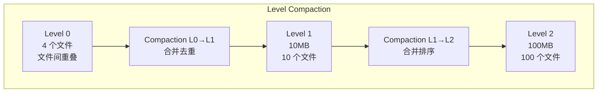

# LevelDB 关键特性

## 学习目标

- 掌握 LevelDB 的核心特性
- 理解 Level Compaction、压缩、批量写入等机制
- 了解 Snapshot 和 Bloom Filter 的实现

## Level Compaction

### Compaction 策略



### Compaction 选择策略

```cpp
// db/version_set.cc
Compaction* VersionSet::PickCompaction() {
    // 1. 优先选择 Level 0（文件数 > 4）
    if (current_->level0_files_.size() > kL0_StopWritesTrigger) {
        return Compaction::PickLevel0(current_);
    }
    
    // 2. 选择大小超过阈值的层级
    for (int level = 1; level < config::kNumLevels; level++) {
        if (current_->NumLevelBytes(level) > MaxBytesForLevel(level)) {
            return Compaction::PickLevel(current_, level);
        }
    }
    
    return nullptr;
}
```

### 文件大小计算

```cpp
// 每层最大大小（10 倍增长）
static uint64_t MaxBytesForLevel(int level) {
    if (level == 0) return 10 * 1048576;  // 10 MB
    return 10 * 1048576 * pow(10, level - 1);
}
```

| Level | 最大大小 | 文件数（约） |
|-------|---------|------------|
| L0 | 10 MB | 4 |
| L1 | 100 MB | 10 |
| L2 | 1 GB | 100 |
| L3 | 10 GB | 1000 |
| L4 | 100 GB | 10000 |

## Snappy 压缩

### 压缩配置

```cpp
// 默认启用 Snappy 压缩
Options options;
options.compression = kSnappyCompression;

// 关闭压缩
options.compression = kNoCompression;
```

### 压缩级别

| 级别 | 压缩算法 | 压缩比 | 压缩速度 | 解压速度 |
|------|---------|-------|---------|---------|
| kNoCompression | 无 | 1:1 | 最快 | 最快 |
| kSnappyCompression | Snappy | ~2:1 | 极快 | 极快 |

### 压缩实现

```cpp
// util/compression.cc
#include "snappy.h"

static bool SnappyCompression(const char* input, size_t length,
                              std::string* output) {
    // Snappy 压缩
    output->resize(snappy::MaxCompressedLength(length));
    size_t outlen;
    snappy::RawCompress(input, length, &(*output)[0], &outlen);
    output->resize(outlen);
    return true;
}

static bool SnappyUncompress(const char* input, size_t length,
                              std::string* output) {
    // Snappy 解压
    size_t ulength;
    if (!snappy::GetUncompressedLength(input, length, &ulength)) {
        return false;
    }
    output->resize(ulength);
    return snappy::RawUncompress(input, length, &(*output)[0]);
}
```

## WriteBatch 批量写入

### 批量写入接口

```cpp
// 创建 WriteBatch
WriteBatch batch;

// 批量写入
batch.Put("key1", "value1");
batch.Put("key2", "value2");
batch.Delete("key3");

// 原子提交
Status s = db->Write(write_options, &batch);
```

### WriteBatch 实现

```cpp
// db/write_batch.cc
class WriteBatch::Handler {
 public:
  virtual void Put(const Slice& key, const Slice& value) = 0;
  virtual void Delete(const Slice& key) = 0;
};

// WriteBatch 内部格式
// +----------------+----------------+----------------+----------------+
// | sequence(8B)   | count(4B)      | record 1       | record 2       |
// +----------------+----------------+----------------+----------------+
// record = type(1B) + key_len(4B) + key(NB) + val_len(4B) + val(NB)
```

### 批量写入的优势

```cpp
// 单个写入会触发多次 WAL 写入和锁竞争
for (int i = 0; i < 10000; i++) {
    db->Put(put_options, key[i], value[i]);
}

// 批量写入只需要一次 WAL 写入和锁获取
WriteBatch batch;
for (int i = 0; i < 10000; i++) {
    batch.Put(key[i], value[i]);
}
db->Write(write_options, &batch);
```

**性能对比**：

| 操作 | 单条写入 | 批量写入 |
|------|---------|---------|
| 写入 10000 条 | ~500ms | ~20ms |
| WAL 写入次数 | 10000 | 1 |
| 锁竞争 | 大量 | 少量 |

## Snapshot（快照）

### 快照使用

```cpp
// 创建快照
ReadOptions options;
options.snapshot = db->GetSnapshot();

// 使用快照读取
// 读取的是快照时刻的数据
Status s = db->Get(options, "key", &value);

// 释放快照
db->ReleaseSnapshot(options.snapshot);
```

### 快照实现

```cpp
// db/db_impl.cc
class SnapshotList {
 public:
  // 创建快照（记录当前序列号）
  const Snapshot* New(SequenceNumber sequence) {
    Snapshot* s = new Snapshot;
    s->number_ = sequence;
    s->refs_ = 1;
    // 插入链表
    Insert(s);
    return s;
  }
  
  // 释放快照
  void Delete(const Snapshot* s) {
    // 递减引用计数
    Snapshot* snap = const_cast<Snapshot*>(s);
    snap->refs_--;
    if (snap->refs_ == 0) {
      Remove(snap);
      delete snap;
    }
  }
  
 private:
  // 双向链表管理所有快照
  Snapshot list_;
};
```

## Bloom Filter

### Bloom Filter 使用

```cpp
// 每个 SSTable 内置 Bloom Filter
Options options;
options.filter_policy = NewBloomFilterPolicy(10);  // 10 bits per key

// 创建 DB 时指定
DB* db;
DB::Open(options, "/tmp/testdb", &db);
```

### Bloom Filter 实现

```cpp
// util/bloom.cc
class BloomFilterPolicy : public FilterPolicy {
 private:
  size_t bits_per_key_;  // 每个 key 的 bit 数
  size_t k_;             // 哈希函数个数

 public:
  // 创建 Bloom Filter
  virtual void CreateFilter(const Slice* keys, int n,
                            std::string* dst) const {
    // 计算 bit 数组大小
    size_t bits = n * bits_per_key_;
    bits = std::max(bits, size_t(64));  // 最小 64 bits
    
    // 初始化 bit 数组
    dst->resize(bits / 8 + 1, 0);
    dst->back() = k_;  // 最后字节存 k_
    
    // 对每个 key 设置 bit
    for (int i = 0; i < n; i++) {
      uint32_t h = BloomHash(keys[i]);
      for (int j = 0; j < k_; j++) {
        uint32_t bitpos = (h + j * k_) % bits;
        (*dst)[bitpos / 8] |= (1 << (bitpos % 8));
      }
    }
  }
  
  // 判断 key 是否存在
  virtual bool KeyMayMatch(const Slice& key,
                           const Slice& bloom_filter) const {
    // 计算哈希，检查 bit 位
    uint32_t h = BloomHash(key);
    for (int j = 0; j < k_; j++) {
      uint32_t bitpos = (h + j * k_) % bits;
      if (!((*bloom)[bitpos / 8] & (1 << (bitpos % 8)))) {
        return false;  // 一定不存在
      }
    }
    return true;  // 可能存在
  }
};
```

### Bloom Filter 效果

| bits_per_key | 误判率 | 空间占用 |
|-------------|--------|---------|
| 5 | ~10% | 低 |
| 10 | ~1% | 中等 |
| 15 | ~0.1% | 高 |

## Cache 系统

### LRU Cache

```cpp
// 启用 Table Cache（SSTable 缓存）
Options options;
options.block_cache = NewLRUCache(8 << 20);  // 8 MB Cache

// 关闭缓存
options.block_cache = nullptr;
```

### Cache 实现

```cpp
// util/cache.cc
class LRUCache {
 public:
  // 插入缓存
  Cache::Handle* Insert(const Slice& key, void* value,
                        size_t charge, Deleter* deleter);
  
  // 查找缓存
  Cache::Handle* Lookup(const Slice& key);
  
  // 释放缓存
  void Release(Cache::Handle* handle);
  
 private:
  // LRU 链表
  LRUHandle lru_;
  // Hash 表
  HandleTable table_;
  // 总容量
  size_t capacity_;
};
```

## 要点总结

- **Level Compaction**：10 倍层级增长，合并去重
- **Snappy 压缩**：默认开启，压缩快，解压快
- **WriteBatch**：批量写入减少 WAL 和锁开销
- **Snapshot**：基于序列号的 MVCC 快照
- **Bloom Filter**：加速 SSTable 查找，减少磁盘 I/O
- **LRU Cache**：缓存 SSTable Block，提升读性能

## 思考题

1. WriteBatch 的原子性如何保证？如果写入过程中崩溃会怎样？
2. Bloom Filter 的 bits_per_key 参数如何选择？
3. Snapshot 太长时间不释放会有什么影响？