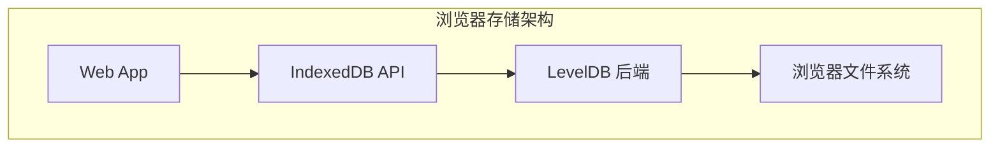

# LevelDB 使用场景

## 学习目标

- 掌握 LevelDB 的典型应用场景
- 理解 LevelDB 与其他嵌入式 KV 的选型决策
- 了解 LevelDB 在浏览器和嵌入式场景的应用

## 浏览器存储（IndexedDB）

### 浏览器后端存储



### Chrome IndexedDB

Chrome 浏览器的 IndexedDB 使用 LevelDB 作为后端存储：

```cpp
// Chrome IndexedDB 实现
// content/browser/indexed_db/
class LevelDBDatabase {
 public:
  // 打开数据库
  static Status Open(const Options& options,
                     const FilePath& path,
                     LevelDBDatabase** db);
  
  // 读取
  bool Get(const Slice& key, std::string* value);
  
  // 写入
  Status Put(const WriteOptions& options,
             const Slice& key,
             const Slice& value);
  
  // 删除
  Status Delete(const WriteOptions& options,
                 const Slice& key);
};

// IndexedDB 存储结构
// Key: object_store_id + key_sequence
// Value: serialized JavaScript object
```

### IndexedDB 使用示例

```javascript
// Web 应用使用 IndexedDB
const request = indexedDB.open('myDB', 1);

request.onupgradeneeded = function(event) {
  const db = event.target.result;
  const store = db.createObjectStore('users', { keyPath: 'id' });
  store.createIndex('name', 'name', { unique: false });
};

request.onsuccess = function(event) {
  const db = event.target.result;
  const tx = db.transaction('users', 'readwrite');
  const store = tx.objectStore('users');
  
  // 写入数据
  store.put({ id: 1, name: 'Alice', age: 30 });
  store.put({ id: 2, name: 'Bob', age: 25 });
  
  // 读取数据
  const getRequest = store.get(1);
  getRequest.onsuccess = function(event) {
    console.log('User:', event.target.result);
  };
};
```

### 浏览器场景优势

| 特性 | 优势 |
|------|------|
| 嵌入式 | 无需独立服务进程 |
| 压缩 | 减少磁盘占用 |
| 事务 | 保证数据一致性 |
| Snapshot | 支持离线数据快照 |

## 嵌入式场景

### 移动应用本地存储

```cpp
// Android/iOS 本地存储
class LocalStore {
 public:
  // 初始化
  void Init(const std::string& path) {
    Options options;
    options.create_if_missing = true;
    options.error_if_exists = false;
    options.compression = kSnappyCompression;
    
    DB::Open(options, path, &db_);
  }
  
  // 存储 Token
  void SaveToken(const std::string& token) {
    db_->Put(WriteOptions(), "auth_token", token);
  }
  
  // 读取 Token
  std::string GetToken() {
    std::string value;
    db_->Get(ReadOptions(), "auth_token", &value);
    return value;
  }
  
 private:
  DB* db_;
};
```

### 配置管理

```cpp
// 应用配置存储
class ConfigManager {
 public:
  // 获取配置项
  std::string GetConfig(const std::string& key,
                        const std::string& default_value) {
    std::string value;
    if (db_->Get(ReadOptions(), "config:" + key, &value).ok()) {
      return value;
    }
    return default_value;
  }
  
  // 设置配置项
  void SetConfig(const std::string& key, const std::string& value) {
    db_->Put(WriteOptions(), "config:" + key, value);
  }
  
  // 批量设置
  void SetConfigBatch(const std::map<std::string, std::string>& configs) {
    WriteBatch batch;
    for (const auto& kv : configs) {
      batch.Put("config:" + kv.first, kv.second);
    }
    db_->Write(WriteOptions(), &batch);
  }
};
```

### 日志存储

```cpp
// 应用日志存储
class LogStore {
 public:
  // 写入日志
  void WriteLog(const std::string& level,
                 const std::string& message) {
    std::string key = "log:" + std::to_string(time(nullptr));
    std::string value = level + "|" + message;
    db_->Put(WriteOptions(), key, value);
  }
  
  // 查询最近日志
  std::vector<std::string> GetRecentLogs(int count) {
    std::vector<std::string> logs;
    Iterator* it = db_->NewIterator(ReadOptions());
    
    // 从后向前遍历
    it->Seek("log:");
    while (it->Valid() && logs.size() < count) {
      logs.push_back(it->value().ToString());
      it->Prev();
    }
    
    delete it;
    return logs;
  }
  
 private:
  DB* db_;
};
```

## IoT 设备存储

### 传感器数据

```cpp
// IoT 传感器数据存储
class SensorDataStore {
 public:
  // 存储传感器数据
  void StoreSensorData(const std::string& sensor_id,
                        double value,
                        uint64_t timestamp) {
    std::string key = sensor_id + ":" + std::to_string(timestamp);
    std::string val = std::to_string(value);
    db_->Put(WriteOptions(), key, val);
  }
  
  // 查询时间范围数据
  std::vector<std::pair<uint64_t, double>> QueryRange(
      const std::string& sensor_id,
      uint64_t start_time,
      uint64_t end_time) {
    std::vector<std::pair<uint64_t, double>> result;
    Iterator* it = db_->NewIterator(ReadOptions());
    
    std::string start_key = sensor_id + ":" + std::to_string(start_time);
    std::string end_key = sensor_id + ":" + std::to_string(end_time);
    
    it->Seek(start_key);
    while (it->Valid() && it->key().ToString() <= end_key) {
      uint64_t ts = std::stoull(it->key().ToString().substr(sensor_id.size() + 1));
      double val = std::stod(it->value().ToString());
      result.emplace_back(ts, val);
      it->Next();
    }
    
    delete it;
    return result;
  }
};
```

## 场景选型对比

### LevelDB vs RocksDB

| 维度 | LevelDB | RocksDB |
|------|---------|---------|
| 复杂度 | 简单，代码量小 | 复杂，功能丰富 |
| 并发写入 | 单线程 | 多线程 |
| 压缩策略 | 仅 Level Compaction | Level/Universal/FIFO |
| 压缩算法 | 仅 Snappy | LZ4/Snappy/ZSTD |
| 列族 | 不支持 | 支持 ColumnFamily |
| 性能 | 中等 | 高（高度优化） |
| 适用场景 | 简单嵌入式 | 生产级嵌入式 |

### LevelDB vs Badger

| 维度 | LevelDB | Badger |
|------|---------|--------|
| 语言 | C++ | Go |
| 键值分离 | 不支持 | 原生支持 |
| 事务 | WriteBatch（非事务） | MVCC 事务 |
| TTL | 不支持 | 原生支持 |
| Go 生态 | 需要 CGO | 原生支持 |
| 学习曲线 | 平缓 | 中等 |

### LevelDB vs SQLite

| 维度 | LevelDB | SQLite |
|------|---------|--------|
| 数据模型 | Key-Value | 关系型 |
| 查询能力 | 仅 KV | SQL 查询 |
| 事务 | WriteBatch | ACID 事务 |
| 索引 | 无（仅主键） | 支持多索引 |
| 适用场景 | 简单 KV 存储 | 复杂数据关系 |

## 最佳实践

### 参数调优

```cpp
// 优化配置
Options options;

// MemTable 大小（根据写入负载调整）
options.write_buffer_size = 64 << 20;  // 64 MB

// MemTable 数量
options.max_write_buffer_number = 4;

// Level 0 文件数阈值
options.level0_file_num_compaction_trigger = 4;

// Block Cache 大小
options.block_cache = NewLRUCache(256 << 20);  // 256 MB

// Bloom Filter
options.filter_policy = NewBloomFilterPolicy(10);
```

### 写入优化

```cpp
// 批量写入替代单条写入
WriteBatch batch;
for (int i = 0; i < 10000; i++) {
    batch.Put(keys[i], values[i]);
}
db->Write(WriteOptions(), &batch);

// 关闭同步写入
WriteOptions write_options;
write_options.sync = false;  // 不等待磁盘刷新
```

### 读取优化

```cpp
// 使用 Snapshot 避免读取到部分更新
ReadOptions options;
options.snapshot = db->GetSnapshot();
// ... 读取操作
db->ReleaseSnapshot(options.snapshot);

// 使用 Iterator 进行范围查询
Iterator* it = db->NewIterator(ReadOptions());
for (it->Seek(start_key); it->Valid() && it->key() < end_key; it->Next()) {
    // 处理数据
}
delete it;
```

## 要点总结

- **浏览器存储**：Chrome IndexedDB 的后端存储
- **嵌入式场景**：移动应用配置、日志、缓存
- **IoT 设备**：传感器数据存储，时间范围查询
- **选型建议**：简单场景选 LevelDB，复杂场景选 RocksDB

## 思考题

1. 为什么 Chrome 选择 LevelDB 作为 IndexedDB 的后端？
2. LevelDB 的单线程写入瓶颈在什么场景下会成为问题？
3. 如何在 LevelDB 上实现简单的 TTL 过期机制？