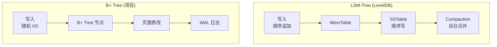
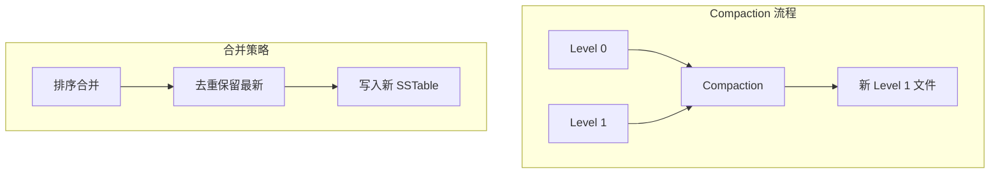

# LevelDB 项目关联

## 学习目标

- 理解 LevelDB 设计与项目存储引擎的关联
- 对比 LSM-Tree 与项目 BTree/Heap 存储的异同
- 探索可借鉴的设计点

## LSM-Tree 与 BTree 对比

### 数据结构差异



### 性能特点对比

| 维度 | LSM-Tree | B+ Tree |
|------|---------|--------|
| 写入 | 顺序写，高吞吐 | 随机写，中等吞吐 |
| 读取 | 需要合并，读放大 | 直接定位，读高效 |
| 空间 | 有冗余（旧版本） | 紧凑存储 |
| 压缩 | 后台 Compaction | 即时更新 |
| 适用场景 | 写多读少 | 读多写少 |

### 项目存储引擎现状

```c
// engineering/src/db/storage/
// - heapam.c: 堆表存储（页面结构）
// - btreeam.c: BTree 索引（B+ Tree）
// - bufmgr.c: Buffer Pool 管理
```

**当前特点**：
- B+ Tree 索引结构
- 页面级缓存（Buffer Pool）
- WAL 日志保证持久性

## Compaction 策略借鉴

### LevelDB Level Compaction



### 借鉴到项目

如果项目实现 LSM-Tree 存储引擎：

```c
// lsm_compaction.h
typedef struct lsm_compaction {
    int input_level;
    int output_level;
    sstable_t **input_tables;
    int input_count;
    sstable_builder_t *output_builder;
} lsm_compaction_t;

// 执行 Compaction
int lsm_compaction_run(lsm_compaction_t *comp);

// 选择 Compaction 任务
lsm_compaction_t *lsm_pick_compaction(lsm_tree_t *lsm);
```

**Compaction 策略选择**：

| 策略 | 特点 | 项目借鉴 |
|------|------|---------|
| Level Compaction | 层级合并，读友好 | 简单实现，适合学习 |
| Tiered Compaction | 规模合并，写友好 | 写入密集场景 |
| FIFO Compaction | 时间窗口，时序数据 | 日志场景 |

## MemTable 实现借鉴

### LevelDB SkipList MemTable

```cpp
// db/skip_list.h
template <typename Key, class Comparator>
class SkipList {
 private:
  struct Node {
    Key key;
    Node* next_[1];  // 变长数组
  };
  Node* head_;
  int max_height_;
  Comparator compare_;
};
```

### 项目 SkipList 实现

```c
// 借鉴 LevelDB 实现
// engineering/src/index/skiplist.c

typedef struct skl_node {
    void *key;
    size_t key_len;
    void *value;
    size_t value_len;
    struct skl_node **forward;  // 前向指针
    int level;
} skl_node_t;

typedef struct skiplist {
    skl_node_t *header;
    int max_level;
    int level;
    int (*compare)(const void*, size_t, const void*, size_t);
} skiplist_t;

// 插入
int skiplist_insert(skiplist_t *sl, void *key, size_t key_len,
                    void *value, size_t value_len);

// 查找
skl_node_t *skiplist_find(skiplist_t *sl, void *key, size_t key_len);

// 删除
int skiplist_delete(skiplist_t *sl, void *key, size_t key_len);
```

### SkipList vs B+ Tree

| 维度 | SkipList | B+ Tree |
|------|---------|--------|
| 实现 | 简单（链表 + 随机层数） | 复杂（节点分裂合并） |
| 并发 | 无锁读取 | 需要锁 |
| 内存 | 较高（指针开销） | 较低 |
| 范围扫描 | 简单（链表遍历） | 复杂（中序遍历） |

## SSTable 格式借鉴

### LevelDB SSTable 结构

```
+------------------+
| Data Block 1     |
| Data Block 2     |
| ...              |
+------------------+
| Meta Block       |  --> Bloom Filter
+------------------+
| Index Block      |  --> 指向各 Data Block
+------------------+
| Footer           |  --> 指向 Index/Meta
+------------------+
```

### 项目 SSTable 设计

```c
// sstable.h
typedef struct sstable_footer {
    uint64_t index_offset;    // Index Block 偏移
    uint64_t index_size;      // Index Block 大小
    uint64_t meta_offset;     // Meta Block 偏移
    uint64_t meta_size;       // Meta Block 大小
    uint32_t magic;           // 魔数
    uint32_t checksum;        // 校验和
} sstable_footer_t;

typedef struct sstable {
    int fd;                   // 文件描述符
    sstable_footer_t footer;  // Footer
    block_cache_t *cache;     // Block 缓存
    bloom_filter_t *bloom;    // Bloom Filter
} sstable_t;

// 打开 SSTable
sstable_t *sstable_open(const char *path);

// 读取 Block
block_t *sstable_read_block(sstable_t *sst, uint64_t offset, uint64_t size);

// 查找 Key
int sstable_get(sstable_t *sst, const char *key, size_t key_len,
                char **value, size_t *value_len);

// 关闭 SSTable
void sstable_close(sstable_t *sst);
```

## Version 管理借鉴

### LevelDB VersionSet

```cpp
// db/version_set.h
class VersionSet {
 public:
  // 当前 Version
  Version* current_;
  
  // 层级管理
  std::vector<Version*> versions_;
  
  // Compaction 管理
  uint64_t max_file_size_;
  int num_levels_;
};
```

### 项目 Version 管理设计

```c
// version.h
typedef struct version {
    int ref_count;              // 引用计数
    sstable_t **levels[7];      // 7 层 SSTable
    int level_counts[7];        // 每层文件数
    
    struct version *prev;       // 前一个版本
    struct version *next;       // 下一个版本
} version_t;

typedef struct version_set {
    version_t *current;         // 当前版本
    version_t *versions;        // 版本链表
    
    pthread_mutex_t mutex;      // 版本锁
    pthread_cond_t cv;          // 条件变量
    
    manifest_t *manifest;       // Manifest 文件
} version_set_t;

// 创建新 Version
version_t *version_new();

// 增加引用
void version_ref(version_t *v);

// 释放引用
void version_unref(version_t *v);

// 切换 Version
void version_set_switch(version_set_t *vs, version_t *new_version);
```

## Block Cache 借鉴

### LevelDB LRU Cache

```cpp
// util/cache.cc
class LRUCache {
 public:
  Cache::Handle* Insert(const Slice& key, void* value,
                        size_t charge, Deleter* deleter);
  Cache::Handle* Lookup(const Slice& key);
  void Release(Cache::Handle* handle);
 private:
  size_t capacity_;
  LRUHandle lru_;
  HandleTable table_;
};
```

### 项目 Block Cache 设计

```c
// block_cache.h
typedef struct block_cache {
    size_t capacity;            // 容量
    size_t used;                // 已用
    lru_list_t *lru;            // LRU 链表
    hash_table_t *table;        // Hash 表
    pthread_mutex_t lock;       // 锁
} block_cache_t;

// 获取 Block
block_t *block_cache_get(block_cache_t *bc, uint64_t block_id);

// 放入 Block
void block_cache_put(block_cache_t *bc, uint64_t block_id, block_t *block);

// 释放 Block
void block_cache_release(block_cache_t *bc, block_t *block);
```

### 与 Buffer Pool 的关系

| 组件 | 用途 | 数据来源 |
|------|------|---------|
| Block Cache | 缓存 SSTable Block | 磁盘 SSTable |
| Buffer Pool | 缓存页面 | 数据文件 |

**协作模式**：
- SSTable Block 通过 Block Cache 缓存
- 数据页面通过 Buffer Pool 缓存
- 两者互不干扰，独立管理

## 实践建议

### 阶段一：SkipList 实现

1. 在 `engineering/src/index/skiplist.c` 实现完整 SkipList
2. 参考 LevelDB 的 `db/skip_list.h` 实现
3. 添加并发读取支持

### 阶段二：SSTable 格式

1. 定义 SSTable 文件格式
2. 实现 `sstable.h` 和 `sstable.c`
3. 添加 Block Cache 支持

### 阶段三：LSM-Tree 原型

1. 实现 `lsm_tree.h` 和 `lsm_tree.c`
2. 实现 MemTable → Immutable → SSTable 流程
3. 实现 Level Compaction

### 阶段四：Version 管理

1. 实现 `version.h` 和 `version.c`
2. 实现 Manifest 文件管理
3. 实现 Compaction 触发逻辑

## 要点总结

- **数据结构**：LSM-Tree 适合写密集，B+ Tree 适合读密集
- **MemTable**：SkipList 实现简单，并发友好
- **SSTable**：有序文件格式，Block Cache 加速
- **Compaction**：后台合并，需要合理策略
- **Version**：原子切换，引用计数回收

## 思考题

1. 项目存储引擎是否需要实现 LSM-Tree？什么场景下收益更大？
2. 如何将 Block Cache 与现有 Buffer Pool 集成？
3. Level Compaction 的层级倍数（10 倍）如何选择？对性能有什么影响？