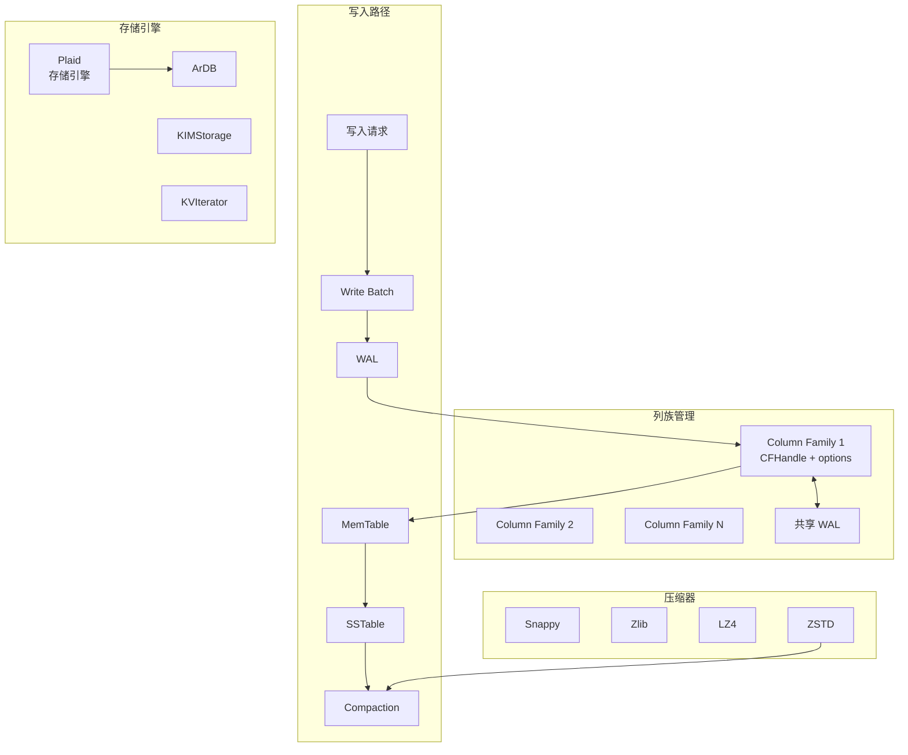

# RocksDB 项目概览

## 学习目标

- 了解 RocksDB 的定位和特点
- 掌握 RocksDB 的列族管理与可插拔存储引擎设计

## 项目定位

> Facebook 开源的高性能嵌入式 LSM-Tree KV 存储引擎，支持列族、多压缩器、可插拔接口，是 RocksDB DB 的核心引擎

**基本信息**：

- 开发方：Facebook (Meta)
- 开源协议：Apache 2.0
- GitHub Stars：~28k

## 核心设计

## 要点总结

- **列族 (Column Family)**：逻辑隔离的数据分区，共享 WAL 但独立 Compaction
- **可插拔存储引擎**：支持 Plaid、ArDB 等多种存储引擎接口
- **可配置压缩器**：支持 Snappy、Zlib、LZ4、ZSTD 等多种压缩算法
- **ColumnFamily Handle**：用于动态管理列族的创建、删除和查询
- **Write Batch**：批量写入保证原子性，支持跨列族的事务
- **协处理器**：支持 Pre/Post 写入/读取钩子，用于自定义逻辑
- **支持 Iterator**：支持前向/后向迭代器，以及快照读
- **广泛集成**：MyRocks、TiKV、CockroachDB 等均基于 RocksDB

## 相关资源

- GitHub: https://github.com/facebook/rocksdb
- 文档: https://rocksdb.org/docs/
