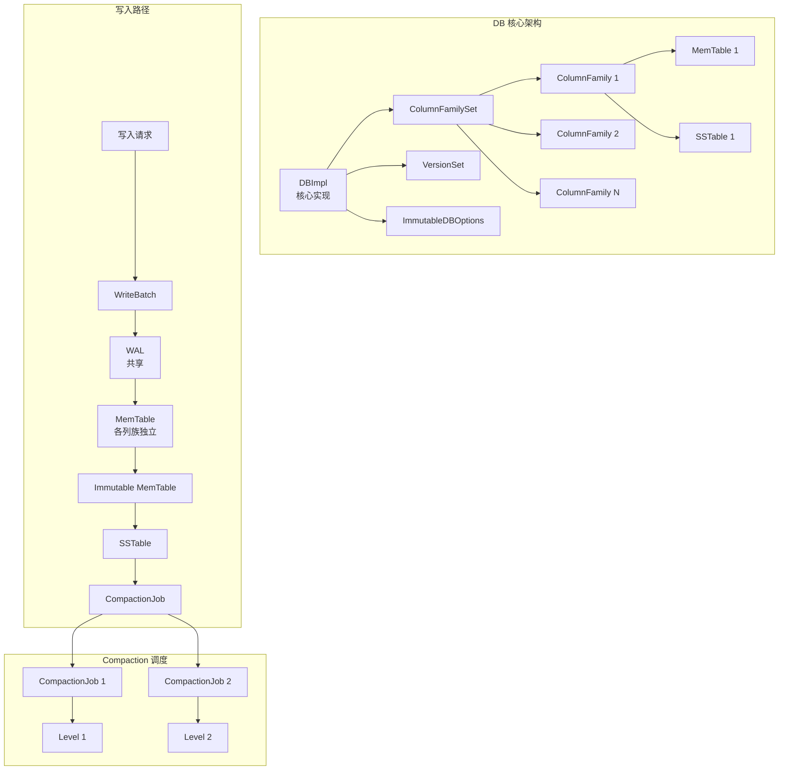
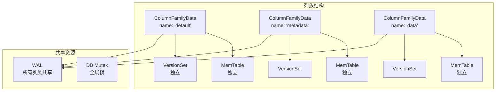
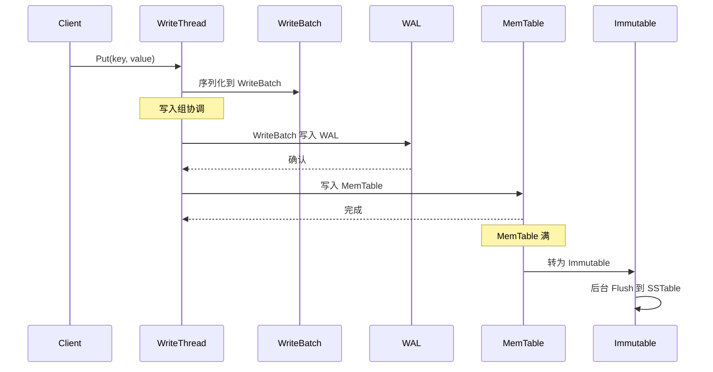
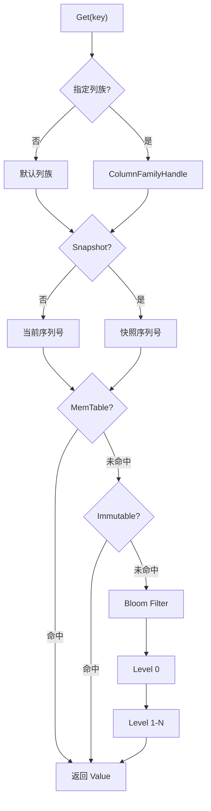
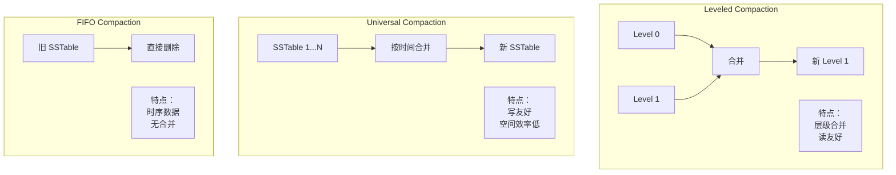

# RocksDB 架构设计

## 学习目标

- 理解 RocksDB 的 LSM-Tree 架构设计
- 掌握列族（Column Family）和多线程 Compaction
- 了解写入/读取/压缩流程

## 架构总览



## 列族设计

### Column Family 概念



### 列族使用示例

```cpp
// 创建列族
ColumnFamilyHandle* cf1;
db->CreateColumnFamily(ColumnFamilyOptions(), "cf1", &cf1);

// 指定列族写入
db->Put(WriteOptions(), cf1, "key1", "value1");

// 指定列族读取
std::string value;
db->Get(ReadOptions(), cf1, "key1", &value);

// 删除列族
db->DropColumnFamily(cf1);
delete cf1;
```

### 列族实现

```cpp
// db/column_family.cc
class ColumnFamilyData {
 public:
  const std::string& GetName() const { return name_; }
  uint32_t GetID() const { return id_; }
  
  // MemTable
  MemTable* mem() { return mem_; }
  MemTable* imm() { return imm_; }
  
  // Version
  Version* current() { return current_; }
  VersionSet* version_set() { return version_set_; }
  
 private:
  std::string name_;
  uint32_t id_;
  MemTable* mem_;
  MemTable* imm_;
  Version* current_;
  VersionSet* version_set_;
};
```

## 写入路径详解

### 写入流程



### WriteBatch 实现

```cpp
// WriteBatch 格式
// +----------------+----------------+----------------+
// | Header (12B)   | Content        | Footer         |
// +----------------+----------------+----------------+
// | count(4B)      | Put/Delete     | checksum       |
// | seq(8B)        | records        |                |
// +----------------+----------------+----------------+

class WriteBatch {
 public:
  // 添加 Put 操作
  void Put(ColumnFamilyHandle* column_family,
           const Slice& key, const Slice& value);
  
  // 添加 Delete 操作
  void Delete(ColumnFamilyHandle* column_family, const Slice& key);
  
  // 序列化
  Slice Serialize();
  
 private:
  std::string rep_;
};
```

### WAL 格式

```
WAL Record 格式：
+----------------+----------------+----------------+
| Header (7B)    | CRC (4B)       | Data           |
+----------------+----------------+----------------+
| type (1B)      | length (2B)    | log_num (4B)   |
+----------------+----------------+----------------+

类型：
- kZeroType = 0        // 无效
- kFullType = 1        // 完整记录
- kFirstType = 2       // 分片首部
- kMiddleType = 3      // 分片中部
- kLastType = 4        // 分片尾部
```

## 读取路径详解

### 读取流程



### Iterator 设计

```cpp
// 两层迭代器
// 上层：索引 Block 迭代器
// 下层：数据 Block 迭代器

class TwoLevelIterator : public Iterator {
 public:
  void Seek(const Slice& target) override {
    // 在索引 Block 中定位
    index_iter_->Seek(target);
    if (index_iter_->Valid()) {
      // 读取对应的数据 Block
      SetDataIterator(index_iter_->value());
      // 在数据 Block 中定位
      data_iter_->Seek(target);
    }
  }
  
 private:
  Iterator* index_iter_;
  Iterator* data_iter_;
};
```

## Compaction 策略

### 三种 Compaction 类型



### Compaction 选择策略

```cpp
// db/compaction_picker.cc
class CompactionPicker {
 public:
  // 选择 Compaction 任务
  virtual Compaction* PickCompaction(
      const std::string& cf_name,
      const MutableCFOptions& mutable_cf_options,
      VersionStorageInfo* version,
      LogBuffer* log_buffer) = 0;
};

// Leveled Compaction 选择
class LevelCompactionPicker : public CompactionPicker {
  Compaction* PickCompaction(...) override {
    // 1. 优先选择 Level 0
    if (version->NumLevelFiles(0) >=
        mutable_cf_options.level0_file_num_compaction_trigger) {
      return PickL0Compaction(version);
    }
    
    // 2. 选择大小超限的层级
    for (int level = 1; level < num_levels_; level++) {
      if (version->NumLevelBytes(level) >
          MaxBytesForLevel(level)) {
        return PickFileToCompact(level, version);
      }
    }
    
    return nullptr;
  }
};
```

### 并发 Compaction

```cpp
// db/compaction_job.cc
class CompactionJob {
 public:
  void Run() {
    // 切分 Compaction 任务
    std::vector<SubcompactionState> subcompactions;
    SplitCompactionTask(&subcompactions);
    
    // 并发执行
    thread_pool_->ParallelCall(
        [this, &subcompactions](int thread_id) {
          ProcessSubcompaction(&subcompactions[thread_id]);
        });
  }
  
 private:
  // 处理子任务
  void ProcessSubcompaction(SubcompactionState* sub) {
    Iterator* input = MakeInputIterator(sub);
    for (input->SeekToFirst(); input->Valid(); input->Next()) {
      // 合并排序
      if (ShouldDrop(input)) continue;
      builder_->Add(input->key(), input->value());
    }
  }
};
```

## SSTable 结构

### SSTable 文件格式

```
+------------------+
| Data Block 1     |
| Data Block 2     |
| ...              |
| Data Block N     |
+------------------+
| Meta Block       |  --> Bloom Filter, Properties
+------------------+
| Meta Index Block |
+------------------+
| Index Block      |  --> 指向各 Data Block
+------------------+
| Footer           |  --> 指向 Index/Meta Index
+------------------+

Block 格式：
+----------------+----------------+----------------+
| Block Header   | KV Entries     | Restart Array  |
+----------------+----------------+----------------+
| checksum(4B)   | key-value      | restart points |
| length(2B)     | compressed     |                |
| type (1B)      |                |                |
+----------------+----------------+----------------+
```

### Block Cache

```cpp
// table/block_cache.cc
class BlockCache {
 public:
  // 获取 Block
  Status Get(const ReadOptions& options,
             const BlockHandle& handle,
             BlockContents* result);
  
 private:
  std::shared_ptr<Cache> cache_;  // LRU Cache
};

// Block Cache 配置
BlockBasedTableOptions table_options;
table_options.block_cache = NewLRUCache(1 << 30);  // 1GB
```

## 要点总结

- **列族设计**：逻辑隔离，共享 WAL，独立 MemTable/Version
- **写入路径**：WriteBatch → WAL → MemTable → SSTable
- **读取路径**：MemTable → Immutable → Bloom Filter → SSTable
- **Compaction**：Leveled/Universal/FIFO 三种策略
- **并发设计**：多线程 Flush 和 Compaction

## 思考题

1. 列族之间共享 WAL 有什么优势？如何保证原子性？
2. Leveled Compaction 和 Universal Compaction 各适合什么场景？
3. 并发 Compaction 如何保证数据一致性？