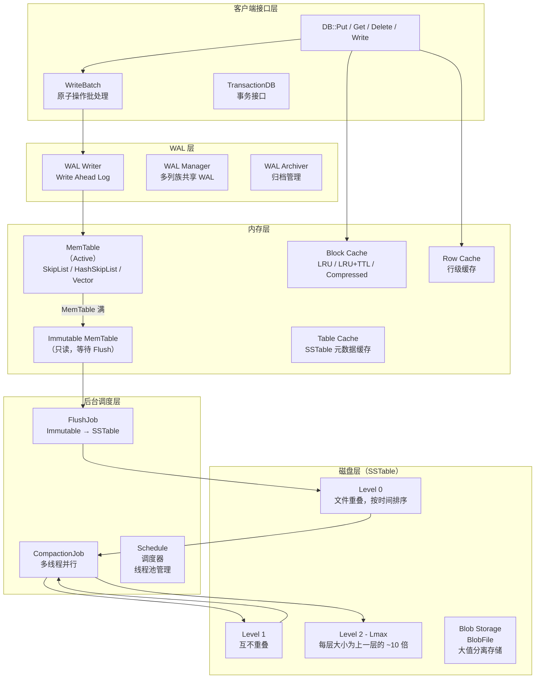
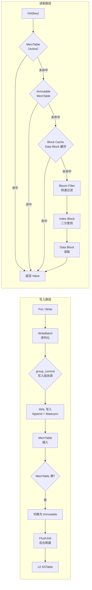
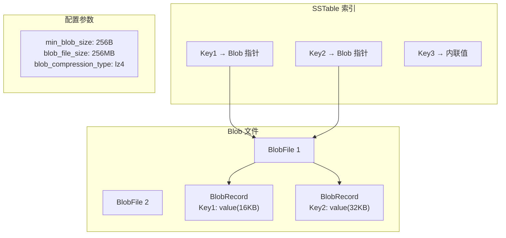
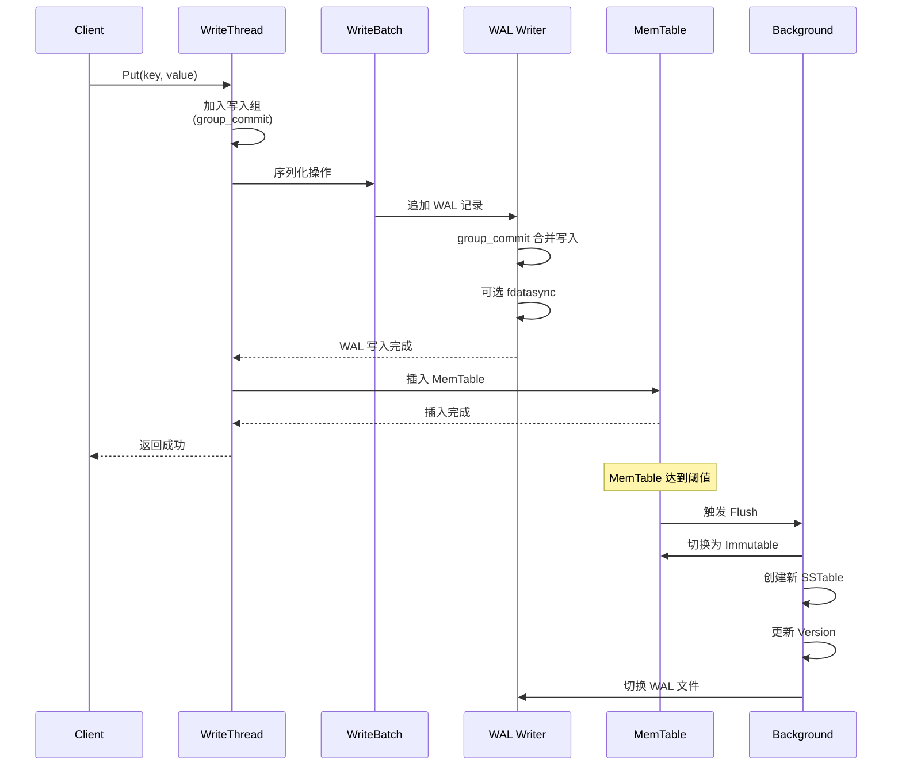
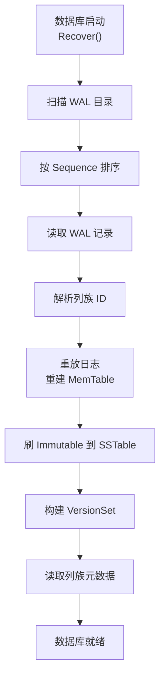
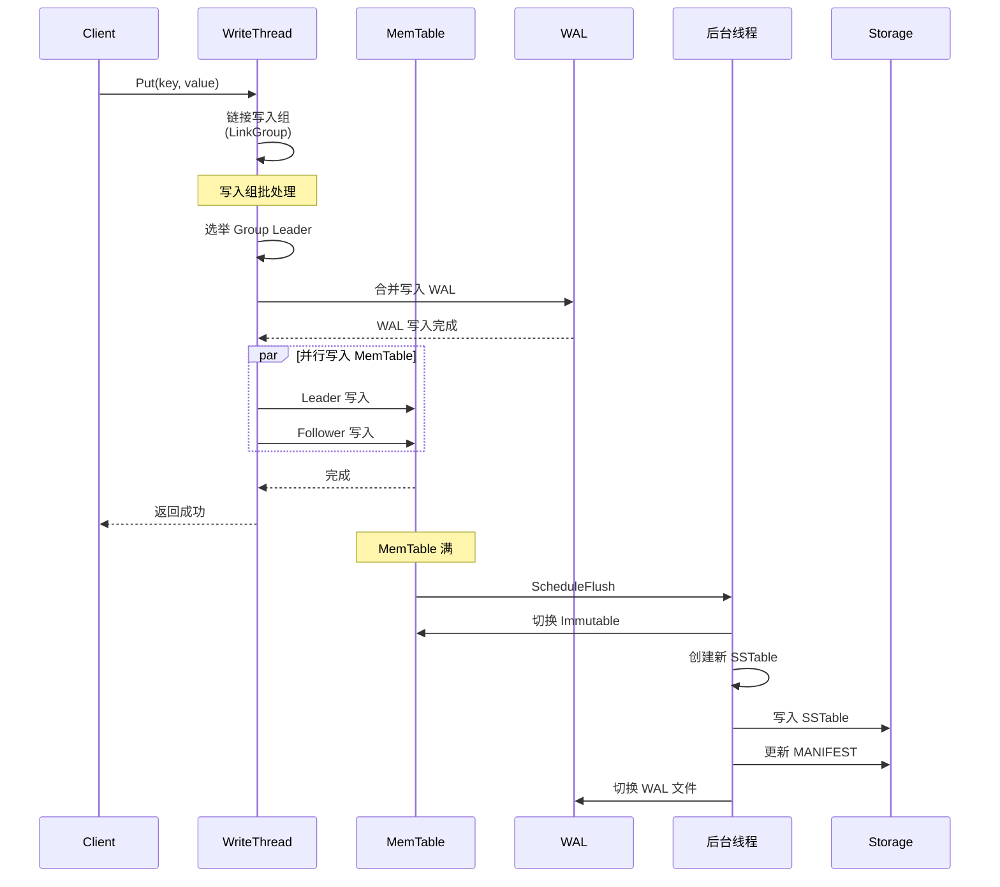
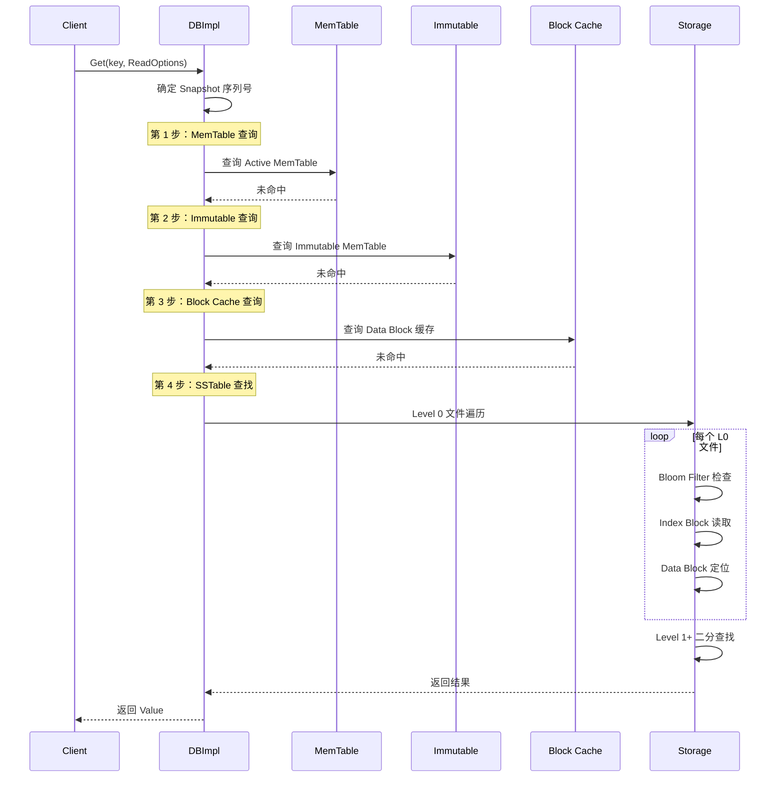
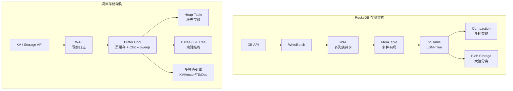

# 存储引擎

## 学习目标

- 理解 RocksDB 存储引擎的核心架构和核心数据结构
- 掌握 WAL、MemTable、SSTable 的持久化机制
- 熟悉读写路径的完整流程和性能优化设计
- 对比 RocksDB 与项目存储在架构设计上的异同

## 核心存储架构

### 整体架构

RocksDB 的存储引擎以 LSM-Tree 为基础，在 LevelDB 的架构上做了大量扩展：列族支持、多线程 Compaction、多种 Compaction 策略、事务支持、Blob Storage 等。



### 数据流向



## 核心数据结构

### MemTable

RocksDB 支持多种 MemTable 实现，可通过 `memtable_factory` 配置。

```cpp
// include/rocksdb/memtablerep.h
class MemTableRepFactory {
 public:
  virtual MemTableRep* CreateMemTableRep(
      const MemTableRep::KeyComparator& comparator,
      Allocator* allocator) = 0;
};

// 内置实现
// - SkipListFactory: 默认，读写均衡
// - HashSkipListRepFactory: Hash + SkipList，点查优化
// - HashLinkListRepFactory: Hash + 链表，小表场景
// - VectorRepFactory: 向量，批量插入后排序
```

| MemTable 类型 | 查找复杂度 | 插入复杂度 | 适用场景 |
|-------------|-----------|-----------|---------|
| SkipList | O(log n) | O(log n) | 通用，读写均衡 |
| HashSkipList | O(1) 平均 | O(log n) | 点查为主 |
| HashLinkList | O(1) 平均 | O(1) 平均 | 小表，写密集 |
| Vector | O(log n) | O(1) 追加 | 批量插入 |

**Arena 分配器**：MemTable 使用 Arena 分配内存，避免每个节点单独 malloc/free，减少内存碎片和分配开销。

```cpp
// db/arena.h
// Arena 分配器
// +------------------+------------------+------------------+
// | Block 1 (4KB)    | Block 2 (4KB)    | Block N (4KB)    |
// +------------------+------------------+------------------+
// |<- used ->|<- free ->|
//
// 特点：
// 1. 内存块按需增长（4KB → 8KB → 16KB → ...）
// 2. 只增不减，全部释放时一次性回收
// 3. 无内存碎片，分配效率高
```

### WAL (Write-Ahead Log)

RocksDB 的 WAL 在 LevelDB 基础上增加了对列族的支持。

```
WAL 文件格式（扩展）：
+------------------+
| Record 1         |
|  - Header (7B)   |
|    - type(1B)    |
|    - length(2B)  |
|    - log_num(4B) |
|  - Data          |
|    - batch_count  |
|    - sequence     |
|    - Put/Delete   |
|      records      |
|  - CRC (4B)      |
+------------------+
| Record 2         |
| ...              |
+------------------+

WAL 类型：
- kFullType / kFirstType / kMiddleType / kLastType
  （大记录分片写入）
- kSetType: 设置列族 ID
```

**WAL 写入优化**：

| 优化项 | 说明 |
|-------|------|
| **group_commit** | 多个写入线程合并为一次 WAL 写入 |
| **Manual WAL Flush** | 延迟 fdatasync，由用户控制 |
| **WAL Recycling** | 重用 WAL 文件，减少文件创建开销 |
| **WAL TTL** | 自动清理过期 WAL 文件 |
| **Unbuffered WAL** | 直接写入，绕过 OS 页缓存 |

**WAL 生命周期**：

```
WAL 文件状态：
+----------+       +----------+       +----------+       +----------+
| 活跃     | ----> | 待归档   | ----> | 归档     | ----> | 删除     |
| (Active) |       | (ToArchive) |  | (Archive) |       | (Deleted)|
+----------+       +----------+       +----------+       +----------+

切换条件：
1. 活跃 WAL 过大 → 切换
2. 列族切换 MemTable → 切换
3. 手动调用 SwitchWAL() → 切换
```

### SSTable (Block-Based Table)

RocksDB 的 SSTable 格式与 LevelDB 兼容，但增加了更多功能。

```
SSTable 文件格式（BlockBasedTable）：
+------------------+
| Data Block 1     |  <- 压缩/未压缩的 KV 数据
| Data Block 2     |
| ...              |
| Data Block N     |
+------------------+
| Filter Block     |  <- Bloom Filter / Ribbon Filter
+------------------+
| Meta Block       |  <- 统计信息（Properties）
|  - num_entries   |
|  - num_deletions |
|  - filter_size   |
|  - raw_key_size  |
|  - raw_value_size|
|  - ...           |
+------------------+
| Meta Index Block |  <- Filter / Meta Block 索引
+------------------+
| Index Block      |  <- Data Block 索引
|  - 每个 Data Block 的 last_key
|  - 对应的 Data Block offset + size
+------------------+
| Footer (48B)     |  <- 指向 Index / Meta Index
+------------------+

Block 格式（压缩后）：
+------------------+------------------+------------------+
| Block Header(7B) | Compressed Data  | Restart Points   |
+------------------+------------------+------------------+
| checksum(4B)     | KV 条目          | restart 数组     |
| type(1B)         | (前缀压缩)       | 每 16 个条目一个 |
| length(2B)       |                  |                  |
+------------------+------------------+------------------+
```

**Block 压缩算法**（可配置）：

| 压缩算法 | 速度 | 压缩比 | 适用场景 |
|---------|------|-------|---------|
| Snappy | 非常快 | 2x | 默认，均衡 |
| Zlib | 慢 | 4x | 空间敏感 |
| LZ4 | 极快 | 2x | 读密集 |
| ZSTD | 快 | 3x | 推荐，压缩比好 |
| None | 最快 | 1x | 临时数据 |

### Blob Storage (大值分离)

针对大值场景，RocksDB 支持将大值存储在单独的 Blob 文件中。



## 数据持久化机制

### 写入持久化



**写入选项**：

```cpp
// include/rocksdb/options.h
struct WriteOptions {
  bool sync;              // 是否 fsync（默认 false）
  bool disableWAL;        // 跳过 WAL（性能优先）
  bool no_slowdown;       // 不等待 MemTable 腾出空间
  bool low_pri;           // 低优先级写入
  uint64_t post_commit;   // 延迟确认
};
```

### 崩溃恢复



**恢复流程**：

1. 扫描 WAL 目录，获取所有 WAL 文件列表
2. 按 Sequence Number 排序，确定恢复顺序
3. 读取每个 WAL 文件，解析 WriteBatch 和列族 ID
4. 重放日志到对应的列族 MemTable
5. 将满的 Immutable MemTable 刷盘
6. 构建完整的 VersionSet 和列族元数据
7. 数据库就绪

### 检查点 (Checkpoint)

```cpp
// utilities/checkpoint/checkpoint.cc
Status Checkpoint::CreateCheckpoint(const std::string& checkpoint_dir) {
    // 1. 创建检查点目录
    // 2. 创建 hard link 指向当前 SSTable 文件
    // 3. 创建当前 MANIFEST 的 hard link
    // 4. 创建 CURRENT 文件
    // 5. 返回检查点路径
}

// 使用方式
Checkpoint* checkpoint;
Checkpoint::Create(db, &checkpoint);
checkpoint->CreateCheckpoint("/path/to/checkpoint");
```

### 持久化配置

```cpp
// DBOptions 持久化相关配置
struct DBOptions {
  bool create_if_missing;           // 不存在时创建
  bool error_if_exists;             // 存在时报错
  bool paranoid_checks;             // 严格校验
  bool wal_dir;                     // 独立 WAL 目录
  bool wal_ttl_seconds;             // WAL 存活时间
  bool wal_size_limit_mb;           // WAL 大小限制
  uint64_t max_total_wal_size;      // 所有 WAL 总大小
  bool flush_on_commit;             // 事务提交时 Flush
};

// ColumnFamilyOptions 持久化相关
struct ColumnFamilyOptions {
  bool disable_auto_compactions;    // 禁用自动 Compaction
  int level0_file_num_compaction_trigger;    // L0 文件数触发 Compaction
  int level0_slowdown_writes_trigger;        // 写入降速阈值
  int level0_stop_writes_trigger;            // 写入停止阈值
  uint64_t max_bytes_for_level_base;         // 每层大小基数
  double max_bytes_for_level_multiplier;     // 层大小倍数
};
```

## 读写路径

### 写入路径



**写入组协调 (Group Commit)**：

```cpp
// db/write_thread.h
// 写入组协调机制
//
// 场景：多个线程同时写入
// 线程 A: 加入组 → 等待 WAL → 写入 MemTable → 返回
// 线程 B: 加入组 → 等待 Leader → 写入 MemTable → 返回
// 线程 C: 加入组 → 等待 Leader → 写入 MemTable → 返回
//
// 只有 Leader 执行 WAL 写入，Follower 在 Leader 完成 WAL 后
// 并行写入 MemTable

class WriteThread {
  // 写入组结构
  struct WriteGroup {
    WriteBatch* leader;           // 组长
    std::vector<WriteBatch*> followers;  // 组员
    size_t total_byte_size;       // 总大小
    SequenceNumber last_sequence; // 最后序列号
  };

  // 加入写入组
  void JoinBatchGroup(Writer* w);

  // 执行批处理
  void LaunchParallel(WriteGroup& group);

  // 退出写入组
  void ExitAsBatchGroupFollower(Writer* w);
};
```

### 读取路径



**读取优化技术**：

| 技术 | 说明 | 效果 |
|------|------|------|
| **Bloom Filter** | 快速排除不存在 Key | 减少 90%+ 无效磁盘 I/O |
| **Ribbon Filter** | 改进版 Bloom Filter，空间更优 | 比 Bloom 节省 30% 空间 |
| **Block Cache** | 缓存热点 Data Block | 减少磁盘读取 |
| **Row Cache** | 缓存热点行数据 | 跳过 Block 层级 |
| **Table Cache** | 缓存 SSTable 元数据 | 减少文件打开开销 |
| **Prefix Bloom** | 前缀 Bloom Filter | 优化前缀扫描 |
| **Two-Level Iterator** | 索引+数据两层迭代 | 快速定位 |
| **Prefetch** | 预读相邻 Block | 优化顺序扫描 |
| **Read Ahead** | 大范围扫描预读 | 减少 IO 次数 |

### 合并读取 (Merge)

RocksDB 支持 Merge 操作，允许用户自定义合并逻辑，将多次更新合并为一次写入。

```cpp
// include/rocksdb/merge_operator.h
class MergeOperator {
 public:
  // 部分合并（在 Compaction 中执行）
  virtual bool PartialMerge(
      const Slice& key,
      const Slice& left_operand,
      const Slice& right_operand,
      std::string* new_value,
      Logger* logger) const = 0;

  // 完全合并（读取时执行）
  virtual bool FullMerge(
      const Slice& key,
      const Slice* existing_value,
      const std::vector<std::string>& operand_list,
      std::string* new_value,
      Logger* logger) const = 0;
};

// 使用示例
class CounterMergeOperator : public MergeOperator {
  bool FullMerge(...) override {
    int sum = 0;
    if (existing_value) sum += std::stoi(existing_value->ToString());
    for (auto& op : operand_list) sum += std::stoi(op);
    *new_value = std::to_string(sum);
    return true;
  }
};
```

## 与项目 storage 模块的对比

### 架构对比



### 详细对比

| 维度 | RocksDB | 项目存储引擎 |
|------|---------|-------------|
| **数据结构** | LSM-Tree | B+ Tree / Heap Table |
| **内存管理** | MemTable (SkipList) + Block Cache | Buffer Pool (页缓存) |
| **磁盘格式** | SSTable (Block-Based Table) | 数据文件 + 索引文件 |
| **写入模式** | 顺序追加 WAL + MemTable | 随机写入 Buffer Pool |
| **读取模式** | 多层合并查找 | 直接定位 |
| **压缩策略** | 多线程 Compaction，多种策略 | 无后台压缩 |
| **并发控制** | 多线程写入组协调 | 锁管理器 |
| **列族支持** | 原生支持 | 通过多模态引擎实现 |
| **大值处理** | Blob Storage | 无特殊处理 |
| **事务支持** | TransactionDB (Pessimistic/Optimistic) | 无事务层 |
| **适用场景** | 写密集，嵌入式 | 读密集，嵌入式 |

### 项目存储引擎现状

项目存储引擎实现了多模态存储引擎架构，支持 KV、向量、时序、文档、空间等多种数据模型，与 RocksDB 的列族设计有相似之处。

```c
// 多模态存储引擎 (engineering/include/db/mm_storage.h)
// 与 RocksDB 列族的对比：
//
// RocksDB ColumnFamily    项目 MultiModalStorage
// ─────────────────────── ───────────────────────
// 每个 CF 独立 MemTable    每个引擎独立内存状态
// 共享 WAL                共享 WAL
// 独立 VersionSet          独立持久化
// 列族创建/删除            引擎注册/注销

// 存储引擎接口 (engineering/include/db/storage_engine.h)
typedef struct storage_ops_s {
    const char *name;        // 引擎名称
    DataModel model;         // 数据模型

    // 生命周期
    int (*init)(const char *data_dir);
    int (*shutdown)(void);

    // 表操作
    int (*table_create)(const char *name, const storage_schema_t *schema);
    void *(*table_open)(const char *name, AccessMode mode);
    int (*table_close)(void *rel);

    // 元组操作
    int (*tuple_insert)(void *rel, const void *data, size_t len);
    int (*tuple_update)(void *rel, ...);
    int (*tuple_delete)(void *rel, const void *key, size_t key_len);

    // 扫描操作
    scan_desc_t *(*scan_begin)(void *rel, ...);
    int (*scan_next)(scan_desc_t *scan, void *out_data, size_t *out_len);
} storage_ops_t;
```

### KV 引擎对比

```c
// 项目 KV 引擎 API (engineering/include/db/kv.h)
// 与 RocksDB 接口对比
//
// 项目 KV              RocksDB
// ───────────────────  ─────────────────────
// kv_open(path)         DB::Open(options, path, &db)
// kv_put(db, k, v)      db->Put(write_opts, key, value)
// kv_get(db, k, &v)     db->Get(read_opts, key, &value)
// kv_delete(db, k)      db->Delete(write_opts, key)
// kv_close(db)          delete db
//
// 主要差异：
// 1. 项目 KV 使用 Heap Table + BTree 索引
// 2. RocksDB 使用 LSM-Tree + 多线程 Compaction
// 3. 项目 KV 无列族支持
// 4. RocksDB 有丰富的配置选项

typedef struct kv_s kv_t;

kv_t *kv_open(const char *path);
kv_result_t kv_put(kv_t *db, const void *key, size_t key_len,
                   const void *value, size_t value_len);
kv_result_t kv_get(kv_t *db, const void *key, size_t key_len,
                   void **out_value, size_t *out_len);
kv_result_t kv_delete(kv_t *db, const void *key, size_t key_len);
kv_result_t kv_close(kv_t *db);
```

### 可借鉴的设计

| 项目 | 借鉴点 | 说明 |
|------|-------|------|
| **MemTable** | Arena 分配器 | 减少内存碎片，批量回收 |
| **WAL** | group_commit | 合并写入，减少 fsync 次数 |
| **Compaction** | 多级合并策略 | LSM-Tree 维护的核心 |
| **Block Cache** | LRU + 分片 | 缓存热点数据 |
| **Blob Storage** | 大小值分离 | 优化大值存储 |
| **列族** | 逻辑隔离 | 多模态引擎的参考 |

## 要点总结

- **LSM-Tree 架构**：WAL → MemTable → Immutable → SSTable 分层，RocksDB 在此基础上增加了列族和多种 MemTable 实现
- **写入优化**：group_commit 合并写入，多线程并行插入 MemTable，WAL 可配置异步
- **读取路径**：MemTable → Immutable → Block Cache → Bloom Filter → SSTable 多层查找
- **持久化保障**：WAL 确保崩溃恢复，Checkpoint 提供快照，MANIFEST 记录版本状态
- **Compaction 策略**：Leveled（默认，读友好）、Universal（写友好）、FIFO（时序数据）
- **大值处理**：Blob Storage 将大值分离到独立文件，避免写放大
- **与项目对比**：LSM-Tree 写友好，Buffer Pool 读友好，各有所长；项目多模态引擎与列族设计有相似之处

## 思考题

1. RocksDB 的 group_commit 如何减少磁盘 I/O 开销？它与 LevelDB 的写入锁有什么不同？
2. 为什么 RocksDB 支持多种 MemTable 实现？HashSkipList 适合什么场景，SkipList 又适合什么场景？
3. 如果要在项目中实现一个 RocksDB 风格的 LSM-Tree 引擎，需要修改哪些模块？Arena 分配器能否复用？
4. RocksDB 的 Blob Storage 解决了什么问题？它如何影响读性能和写放大？
5. 多列族共享 WAL 如何保证原子性？崩溃恢复时如何正确处理多个列族的状态？