# 查询或操作引擎

## 学习目标

- 理解 RocksDB 查询和操作执行流程
- 掌握 Iterator 设计、Merge 迭代器、事务处理
- 了解 Snapshot、Backup、CompactRange 等高级特性
- 对比 RocksDB 操作引擎与项目 algo/ 模块的关联

## 操作执行流程

### 写入操作 (Put / Write)

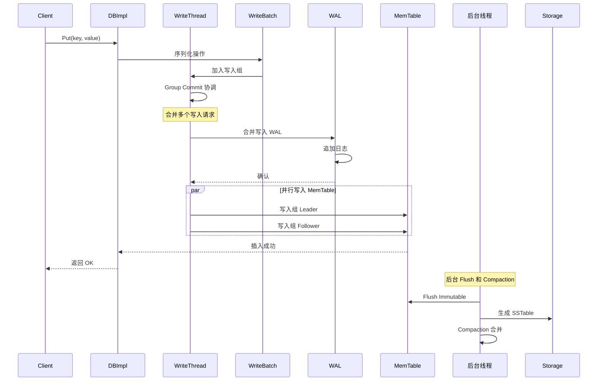

### 写入组协调 (Group Commit)

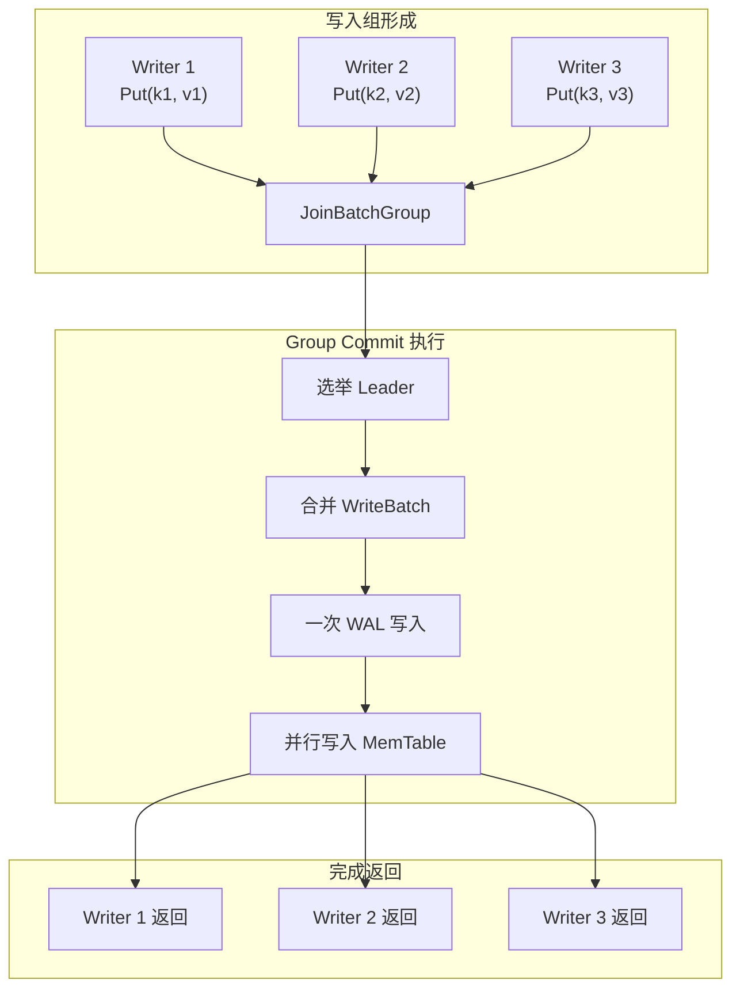

**写入组协调实现**：

```cpp
// db/write_thread.cc
// 写入组协调逻辑
//
// 核心思想：
// 1. 多个写入线程同时到达时，合并为一个写入组
// 2. 选出一个 Leader，负责写入 WAL
// 3. Leader 写完 WAL 后，所有成员并行写入 MemTable
// 4. 所有成员写入完成后，一起返回

class WriteThread {
  // 写入组状态机
  enum State {
    STATE_INIT,           // 初始状态
    STATE_GROUP_LEADER,   // 组长
    STATE_GROUP_FOLLOWER, // 组员
    STATE_PARALLEL_FOLLOWER, // 并行 MemTable 写入
    STATE_COMPLETED,      // 完成
  };

  // 加入写入组
  void JoinBatchGroup(Writer* w) {
    // 1. 如果没有活跃组，创建新组
    // 2. 否则加入现有组
    // 3. 组满或超时后开始执行
  }

  // Leader 执行批处理
  void EnterAsBatchGroupLeader(Writer* leader) {
    // 1. 合并所有 WriteBatch
    // 2. 一次 WAL 写入
    // 3. 通知 Follower 开始 MemTable 写入
  }

  // Follower 等待 Leader
  void EnterAsBatchGroupFollower(Writer* w) {
    // 等待 Leader 完成 WAL 写入
    // 收到通知后并行写入 MemTable
  }
};
```

### 批量写入 (WriteBatch)

```cpp
// WriteBatch 内部格式
// 支持多列族，每个操作可指定不同的 ColumnFamilyHandle
//
// +----------------+----------------+----------------+----------------+
// | Header (12B)   | Content        | Content        | ...            |
// +----------------+----------------+----------------+----------------+
// | count(4B)      | Type(1B)       | CF ID(4B)      | Key/Value      |
// | seq(8B)        | Put/Delete     |                |                |
// +----------------+----------------+----------------+----------------+
//
// Type:
// - kTypeColumnFamilyValue: 列族 Put
// - kTypeColumnFamilyDeletion: 列族 Delete
// - kTypeColumnFamilySingleDeletion: 列族单次删除
// - kTypeColumnFamilyMerge: 列族 Merge
// - kTypeBeginPrepareXID: 事务准备
// - kTypeEndPrepareXID: 事务准备完成
// - kTypeCommitXID: 事务提交
// - kTypeRollbackXID: 事务回滚

class WriteBatch {
 public:
  // 基本操作
  void Put(ColumnFamilyHandle* cf, const Slice& key, const Slice& value);
  void Delete(ColumnFamilyHandle* cf, const Slice& key);
  void SingleDelete(ColumnFamilyHandle* cf, const Slice& key);
  void Merge(ColumnFamilyHandle* cf, const Slice& key, const Slice& value);

  // 原子操作
  void PutLogData(const Slice& blob);  // 写入自定义日志数据

  // 遍历处理
  class Handler {
   public:
    virtual Status PutCF(uint32_t cf, const Slice& key, const Slice& value);
    virtual Status DeleteCF(uint32_t cf, const Slice& key);
    virtual Status MergeCF(uint32_t cf, const Slice& key, const Slice& value);
  };
  Status Iterate(Handler* handler) const;
};
```

### 删除操作 (Delete / SingleDelete)

RocksDB 提供两种删除语义，适用于不同场景。

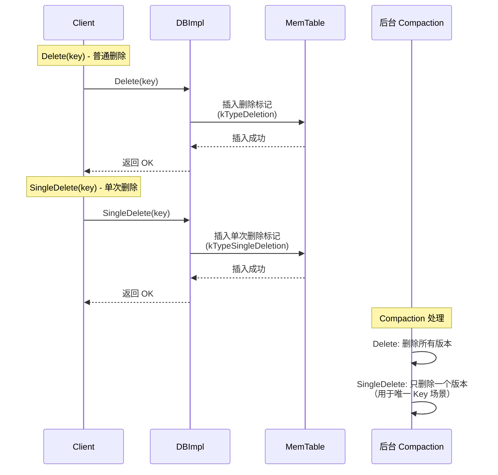

**Delete vs SingleDelete**：

| 操作 | 语义 | 适用场景 | Compaction 行为 |
|------|------|---------|----------------|
| **Delete** | 标记删除 | 通用删除 | 删除所有版本 |
| **SingleDelete** | 单次删除 | 唯一 Key 场景 | 只删除一个版本 |
| **DeleteRange** | 范围删除 | 批量删除 | 删除范围内的所有 Key |

```cpp
// DeleteRange 实现
// db/delete_scheduler.cc
//
// DeleteRange 不会立即删除数据，而是记录范围删除标记
// Compaction 时遇到范围删除标记，会跳过范围内的所有 Key
//
// 格式：
// +----------------+----------------+----------------+
// | start_key      | end_key        | seq            |
// +----------------+----------------+----------------+

Status DBImpl::DeleteRange(const WriteOptions& options,
                           ColumnFamilyHandle* cf,
                           const Slice& start, const Slice& end) {
    // 1. 创建 RangeTombstone
    // 2. 序列化到 WriteBatch
    // 3. 写入 WAL 和 MemTable
}
```

### 读取操作 (Get)

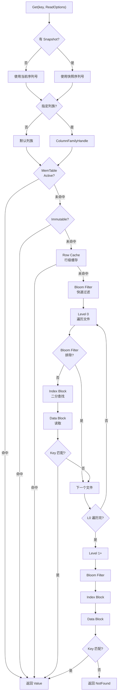

### 范围扫描 (Iterator)

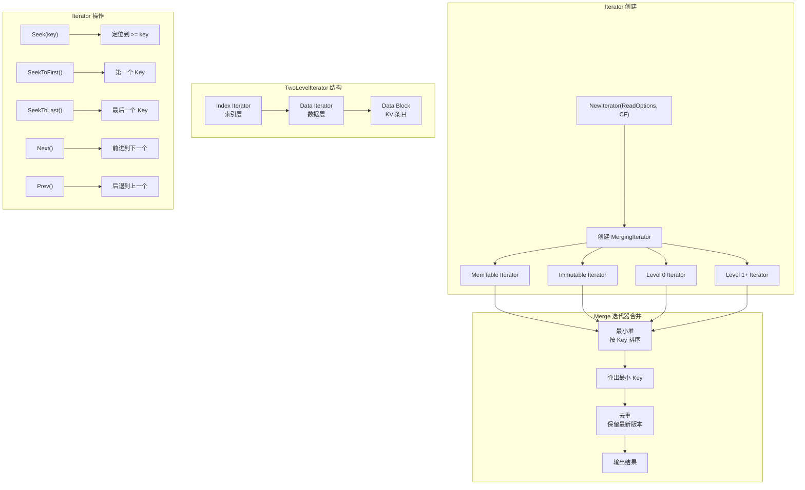

## 核心算法和数据结构

### Iterator 设计

RocksDB 的 Iterator 是统一的数据访问接口，与 LevelDB 兼容但增加了更多功能。

```cpp
// include/rocksdb/iterator.h
class Iterator {
 public:
  // 定位操作
  virtual void SeekToFirst() = 0;
  virtual void SeekToLast() = 0;
  virtual void Seek(const Slice& target) = 0;
  virtual void SeekForPrev(const Slice& target) = 0;  // RocksDB 新增

  // 遍历操作
  virtual void Next() = 0;
  virtual void Prev() = 0;

  // 访问操作
  virtual bool Valid() const = 0;
  virtual Slice key() const = 0;
  virtual Slice value() const = 0;

  // 状态操作
  virtual Status status() const = 0;

  // RocksDB 新增
  virtual void SetIterateUpperBound(const Slice& bound);  // 设置上界
  virtual void SetIterateLowerBound(const Slice& bound);  // 设置下界
};
```

### 多种 Iterator 实现

| 实现 | 数据来源 | 说明 |
|------|---------|------|
| **MemTable Iterator** | SkipList / HashSkipList | 遍历内存表 |
| **Table Iterator** | SSTable | 遍历磁盘文件 |
| **TwoLevel Iterator** | Index Block + Data Block | 分层遍历 SSTable |
| **Level Iterator** | Level 层所有文件 | 遍历一层所有 SSTable |
| **Merging Iterator** | 多路合并 | 合并多个子迭代器 |
| **DB Iterator** | 数据库级别 | 合并所有层级 |

### MergingIterator 实现

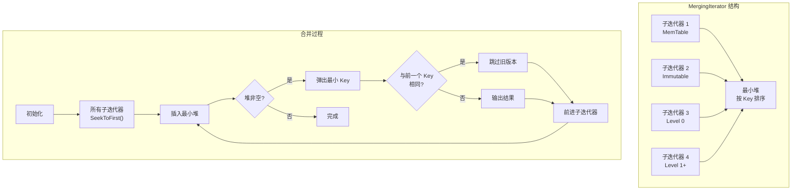

**MergingIterator 算法**：

```cpp
// table/merging_iterator.cc
class MergingIterator : public Iterator {
 public:
  void Seek(const Slice& target) override {
    // 1. 所有子迭代器 Seek(target)
    for (auto& child : children_) {
      child->Seek(target);
    }

    // 2. 清空最小堆
    heap_.clear();

    // 3. 插入有效的子迭代器
    for (auto& child : children_) {
      if (child->Valid()) {
        heap_.push(child);
      }
    }

    // 4. 去重
    AdvancePastDuplicate();
  }

  void Next() override {
    // 1. 当前子迭代器前进
    current_->Next();

    // 2. 重新插入堆
    if (current_->Valid()) {
      heap_.push(current_);
    }

    // 3. 弹出新的最小 Key
    if (!heap_.empty()) {
      current_ = heap_.top();
      heap_.pop();

      // 4. 去重
      AdvancePastDuplicate();
    }
  }

 private:
  void AdvancePastDuplicate() {
    while (Valid() && current_->key() == last_key_) {
      // 跳过相同 Key 的旧版本
      current_->Next();
      if (current_->Valid()) {
        heap_.push(current_);
        current_ = heap_.top();
        heap_.pop();
      }
    }
    if (Valid()) {
      last_key_ = current_->key().ToString();
    }
  }

  std::vector<Iterator*> children_;
  std::priority_queue<Iterator*> heap_;
  Iterator* current_;
  std::string last_key_;
};
```

### TwoLevelIterator 实现

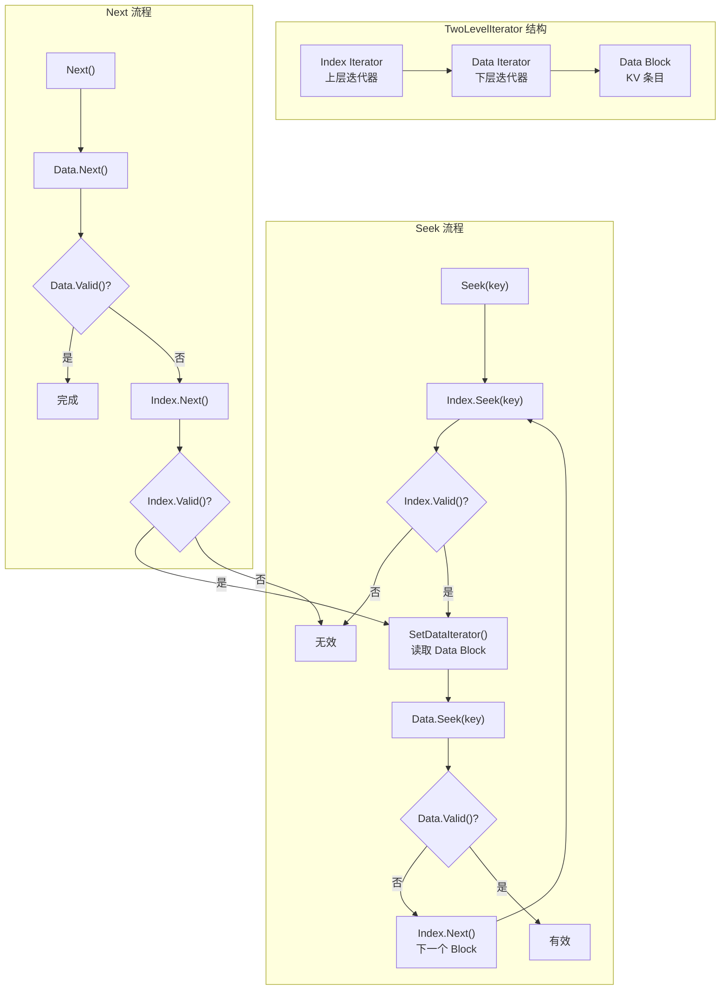

**TwoLevelIterator 代码**：

```cpp
// table/two_level_iterator.cc
class TwoLevelIterator : public Iterator {
 public:
  void Seek(const Slice& target) override {
    // 在 Index Block 中定位
    index_iter_->Seek(target);

    while (index_iter_->Valid()) {
      // 读取对应的 Data Block
      Slice block_handle = index_iter_->value();
      SetDataIterator(block_handle);

      if (data_iter_) {
        // 在 Data Block 中定位
        data_iter_->Seek(target);
        if (data_iter_->Valid()) {
          // 找到了
          return;
        }
      }

      // 当前 Block 没有，继续下一个 Block
      index_iter_->Next();
    }

    // 没找到
    data_iter_ = nullptr;
  }

  void Next() override {
    data_iter_->Next();

    // 当前 Block 遍历完了，切换到下一个 Block
    if (!data_iter_->Valid()) {
      index_iter_->Next();
      if (index_iter_->Valid()) {
        SetDataIterator(index_iter_->value());
        if (data_iter_) {
          data_iter_->SeekToFirst();
        }
      } else {
        data_iter_ = nullptr;
      }
    }
  }

 private:
  void SetDataIterator(const Slice& block_handle) {
    // 从 Block Cache 读取 Data Block
    data_iter_ = block_reader_->NewIterator(block_handle);
  }

  Iterator* index_iter_;  // 索引迭代器
  Iterator* data_iter_;   // 数据迭代器
  BlockReader* block_reader_;
};
```

### Compaction 执行流程

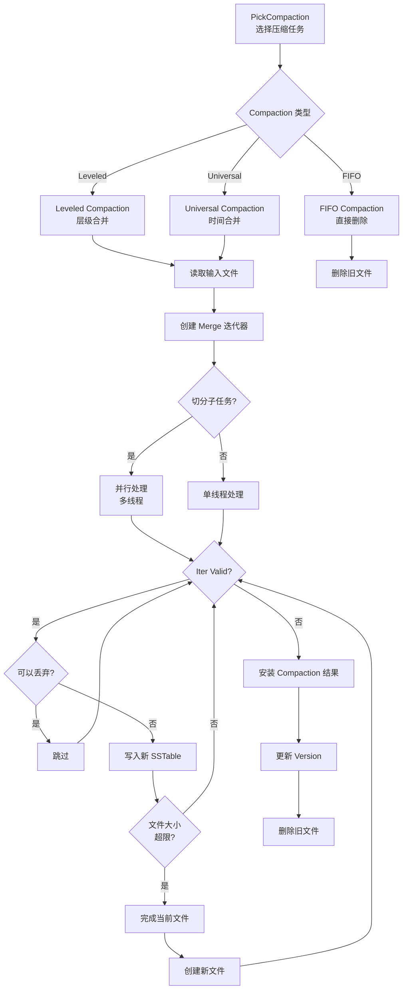

**Compaction 核心算法**：

```cpp
// db/compaction_job.cc
Status CompactionJob::Run() {
    // 1. 创建合并迭代器
    Iterator* input = version_->MakeInputIterator(compaction_);

    // 2. 并发 Compaction
    if (parallel_compaction_) {
        // 切分为多个子任务
        std::vector<SubcompactionState> states;
        SplitCompactionTask(&states);

        // 并行执行
        thread_pool_->ParallelCall([this, &states](int thread_id) {
            ProcessSubcompaction(&states[thread_id]);
        });
    } else {
        // 单线程执行
        ProcessSubcompaction(&compact_);
    }

    return Status::OK();
}

void CompactionJob::ProcessSubcompaction(SubcompactionState* sub) {
    Iterator* input = sub->input;

    for (input->SeekToFirst(); input->Valid(); input->Next()) {
        const Slice& key = input->key();
        const Slice& value = input->value();

        // 1. 解析序列号
        SequenceNumber seq = ExtractSequenceNumber(key);

        // 2. 检查是否可以丢弃
        bool drop = ShouldDrop(key, value, seq);

        // 3. 去重
        if (key == last_key_) {
            drop = true;
        }

        // 4. 写入新 SSTable
        if (!drop) {
            sub->builder->Add(key, value);
            last_key_ = key.ToString();
        }

        // 5. 文件大小限制
        if (sub->builder->FileSize() >= target_file_size_) {
            FinishCompactionOutputFile(sub);
        }
    }
}
```

**丢弃策略**：

```
丢弃条件（满足任一即可）：
1. Key 已被删除（kTypeDeletion / kTypeSingleDeletion 标记）
2. 同一 Key 有更新版本，且旧版本在更低层不再需要
3. 序列号低于最小活跃 Snapshot
4. Merge 操作可以合并（部分合并）
5. 过期 TTL（如果启用了 TTL）
```

### 事务处理 (TransactionDB)

RocksDB 提供两种事务模式：悲观事务和乐观事务。

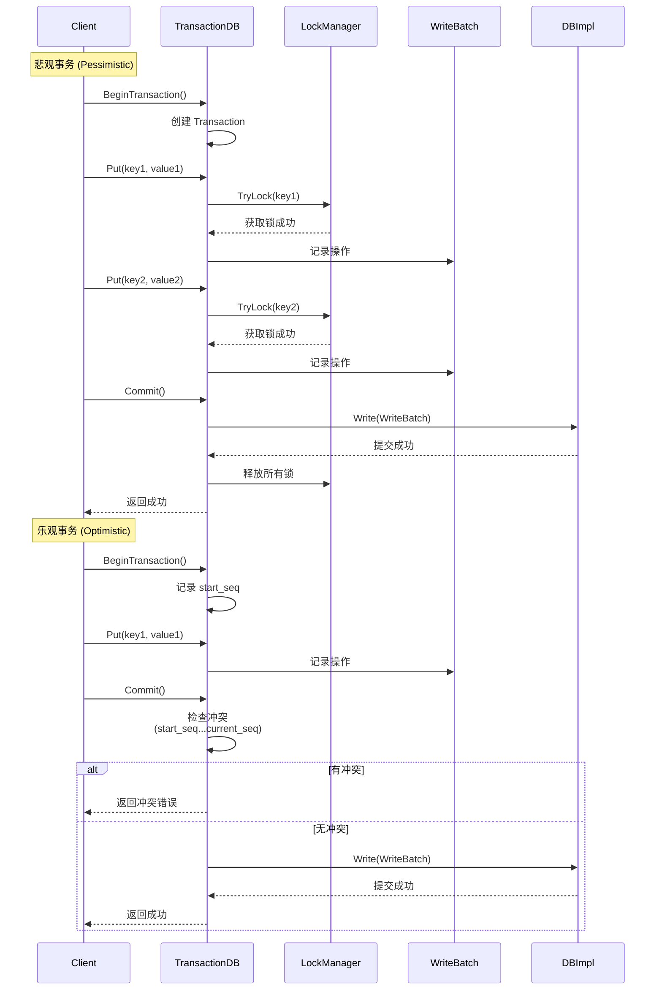

**悲观事务实现**：

```cpp
// utilities/transactions/pessimistic_transaction.cc
class PessimisticTransaction : public TransactionBase {
 public:
  Status Put(ColumnFamilyHandle* cf, const Slice& key,
             const Slice& value) override {
    // 1. 获取锁
    Status s = TryLock(cf, key, exclusive);

    if (!s.ok()) {
      return s;  // 锁获取失败
    }

    // 2. 记录操作
    return write_batch_.Put(cf, key, value);
  }

  Status Commit() override {
    // 1. 获取所有需要的锁（两阶段锁）
    // 2. 写入 WAL
    Status s = db_->Write(write_options_, &write_batch_);

    // 3. 释放所有锁
    UnlockAll();

    return s;
  }

 private:
  Status TryLock(ColumnFamilyHandle* cf, const Slice& key, bool exclusive) {
    return lock_tracker_->TryLock(cf, key, exclusive);
  }
};
```

**乐观事务实现**：

```cpp
// utilities/transactions/optimistic_transaction.cc
class OptimisticTransaction : public TransactionBase {
 public:
  Status Commit() override {
    // 1. 检查冲突
    Status s = CheckConflict();

    if (!s.ok()) {
      return s;  // 有冲突
    }

    // 2. 写入 WAL
    s = db_->Write(write_options_, &write_batch_);

    return s;
  }

 private:
  Status CheckConflict() {
    // 检查从 start_seq 到 current_seq 之间是否有冲突写入
    // 遍历所有操作的 Key，检查是否有其他事务修改

    for (auto& key : tracked_keys_) {
      SequenceNumber seq = db_->GetLatestSequenceNumber(key);
      if (seq > start_seq_) {
        return Status::Busy();  // 有冲突
      }
    }

    return Status::OK();
  }

  SequenceNumber start_seq_;  // 事务开始时的序列号
};
```

### Snapshot 与 MVCC

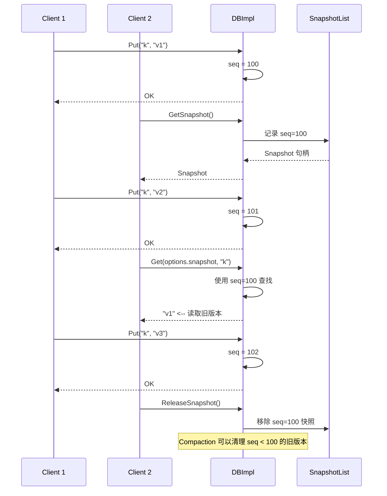

**Snapshot 实现**：

```cpp
// db/snapshot_impl.h
class SnapshotList {
 public:
  // 创建快照
  Snapshot* New(SequenceNumber seq) {
    Snapshot* s = new Snapshot(seq);
    s->refs_ = 1;

    // 插入双向链表
    s->prev_ = list_.prev_;
    s->next_ = &list_;
    list_.prev_->next_ = s;
    list_.prev_ = s;

    return s;
  }

  // 删除快照
  void Delete(const Snapshot* snapshot) {
    if (--snapshot->refs_ == 0) {
      // 从链表中移除
      snapshot->prev_->next_ = snapshot->next_;
      snapshot->next_->prev_ = snapshot->prev_;
      delete snapshot;
    }
  }

  // 获取最小快照序列号
  SequenceNumber GetMinSnapshot() {
    if (list_.next_ == &list_) {
      return kMaxSequenceNumber;  // 无活跃快照
    }
    return list_.next_->number_;
  }

 private:
  Snapshot list_;  // 哨兵节点，双向链表
};
```

### Backup 与 Checkpoint


**Backup 使用示例**：

```cpp
// utilities/backup/backup_engine.cc
Status BackupEngine::CreateNewBackup(DB* db, bool flush_before_backup) {
    // 1. 创建临时 Checkpoint
    Checkpoint* checkpoint;
    Checkpoint::Create(db, &checkpoint);

    std::string temp_dir = backup_dir_ + "/temp";
    checkpoint->CreateCheckpoint(temp_dir);

    // 2. 复制文件
    std::vector<std::string> files;
    env_->GetChildren(temp_dir, &files);

    for (auto& file : files) {
        if (file.find(".sst") != std::string::npos) {
            // Hard link SSTable 文件
            env_->LinkFile(temp_dir + "/" + file,
                          backup_dir_ + "/shared/" + file);
        }
    }

    // 3. 创建元数据
    BackupMeta meta;
    meta.timestamp = env_->NowMicros();
    meta.seq = db->GetLatestSequenceNumber();

    // 4. 清理临时文件
    env_->DeleteDir(temp_dir);

    return Status::OK();
}
```

## 与项目 algo/ 模块的关联

### 算法关联

RocksDB 中使用的核心算法在项目 algo/ 模块中都有对应实现：

| 算法 | RocksDB 使用 | 项目对应模块 |
|------|-------------|-------------|
| **SkipList** | MemTable 实现 | `engineering/src/index/` |
| **Bloom Filter** | SSTable 快速过滤 | `engineering/src/algo/` |
| **Ribbon Filter** | 改进版 Bloom Filter | `engineering/src/algo/` |
| **LRU Cache** | Block Cache | `engineering/src/db/core/` |
| **二分查找** | Index Block 定位 | `engineering/src/algo/` |
| **排序合并** | Compaction 合并 | `engineering/src/algo/` |
| **最小堆** | Merge 迭代器优先队列 | `engineering/src/algo/` |
| **Hash 表** | LRU Cache 查找 | `engineering/src/self_made/` |
| **前缀压缩** | Block Key 压缩 | 可学习实现 |
| **VByte 编码** | 变长整数编码 | `engineering/src/algo/` |

### 排序合并算法 (Compaction 核心)

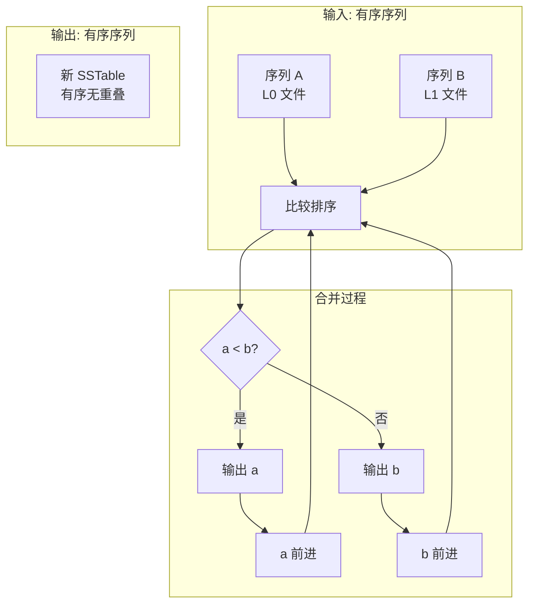

**Compaction 合并与项目排序关联**：

```cpp
// 项目中的排序实现 (engineering/src/algo/)
// 可用于 Compaction 合并
//
// 1. 归并排序 - Compaction 合并的核心
// 2. 外部排序 - 大文件排序
// 3. 堆排序 - Merge 迭代器

// 假设项目有归并排序实现
// algo/merge_sort.c
void merge_sorted_arrays(
    const void** arr1, size_t len1,
    const void** arr2, size_t len2,
    int (*compare)(const void*, const void*),
    void** output
);

// 可以复用于 Compaction
// 但需要适配 RocksDB 的迭代器接口
```

### Bloom Filter 与项目实现

```cpp
// 项目 Bloom Filter 实现 (engineering/src/algo/bloom_filter.c)
// RocksDB 使用类似实现

// Bloom Filter 参数计算
// k = ln(2) * (bits_per_key)  // 哈希函数数量
// m = n * bits_per_key        // 位数组大小

// RocksDB Bloom Filter
// table/filter_block.cc
class BloomFilterBuilder {
 public:
  void AddKey(const Slice& key) {
    // 1. 计算多个哈希值
    uint32_t hash = BloomHash(key);
    for (int i = 0; i < num_probes_; i++) {
      // 2. 设置对应位
      uint32_t bit_pos = (hash + i * hash2) % bits_;
      filter_[bit_pos / 8] |= (1 << (bit_pos % 8));
    }
  }

  bool MayContain(const Slice& key) {
    // 检查所有对应位是否都被设置
    uint32_t hash = BloomHash(key);
    for (int i = 0; i < num_probes_; i++) {
      uint32_t bit_pos = (hash + i * hash2) % bits_;
      if (!(filter_[bit_pos / 8] & (1 << (bit_pos % 8)))) {
        return false;  // 肯定不存在
      }
    }
    return true;  // 可能存在
  }
};
```

### Iterator 模式与项目实现

```c
// 项目扫描接口 (engineering/include/db/rel.h)
// 与 RocksDB Iterator 设计相似
//
// RocksDB Iterator       项目 ScanDesc
// ─────────────────────  ─────────────────────
// SeekToFirst()         scan_begin()
// Next()                scan_next()
// Valid()               scan != NULL
// key()                 scan->tuple
// value()               scan->tuple_data
// status()              错误码

typedef struct scan_desc_s scan_desc_t;

scan_desc_t *scan_begin(void *rel, ...);
int scan_next(scan_desc_t *scan, void *out_data, size_t *out_len);
void scan_end(scan_desc_t *scan);
```

## 操作性能分析

### 写入性能

| 因素 | 影响 | 说明 |
|------|------|------|
| **WAL sync** | 每次写入 1 次 fsync | 可配置 async |
| **Group Commit** | 合并多个写入 | 吞吐提升 5-10x |
| **MemTable 插入** | O(log n) SkipList | 内存操作，快 |
| **MemTable 满** | 冻结 + 后台 Flush | 可能阻塞写入 |
| **批量写入** | 合并 WAL 写入 | 吞吐提升 10x+ |
| **并发 MemTable 写入** | 多线程并行 | 写入吞吐进一步提升 |

### 读取性能

| 因素 | 影响 | 说明 |
|------|------|------|
| **Bloom Filter** | 过滤 90%+ 无效文件 | 减少磁盘 I/O |
| **Ribbon Filter** | 比 Bloom 节省 30% 空间 | 更高效的过滤 |
| **Block Cache** | 缓存热点 Block | 减少磁盘读取 |
| **Row Cache** | 缓存热点行数据 | 跳过 Block 层级 |
| **层级深度** | 最多 7 层 | 读放大可能 |
| **Level 0 重叠** | 最多 4 个文件 | 逐文件查找 |

### 读放大问题

```
读放大 = 实际读取的磁盘数据量 / 返回的数据量

场景 1: 点查 Key 在 L1
- 1 次 Bloom Filter 检查
- 1 次 Index Block 读取（可能缓存命中）
- 1 次 Data Block 读取（可能缓存命中）
- 读放大: ~2x

场景 2: 点查 Key 不在 L0
- 需要检查多个 L0 文件的 Bloom Filter
- 可能需要读取多次 Index Block
- 读放大: ~4-8x

场景 3: 范围扫描
- 需要合并多个层级
- 读放大: 10x~100x

优化方案：
1. 增大 Block Cache
2. 启用 Row Cache
3. 使用 Ribbon Filter
4. 调整层级参数
```

### 写放大问题

```
写放大 = 实际写入磁盘的数据量 / 用户写入的数据量

场景 1: 写入 1MB 数据
- WAL 写入: 1MB
- MemTable → L0: 1MB
- L0 → L1 Compaction: 1MB + 10MB = 11MB
- L1 → L2 Compaction: 11MB + 100MB = 111MB
- ...
- 写放大: ~10-50x

优化方案：
1. 使用 Universal Compaction（写友好）
2. 增大 MemTable 大小
3. 调整 Compaction 触发阈值
4. 使用 FIFO Compaction（时序数据）
```

## 要点总结

- **操作流程**：Put/Get/Delete 都通过 WriteBatch 序列化，保证原子性；Group Commit 合并写入，减少 fsync 开销
- **Iterator 系统**：统一的数据访问接口，支持 TwoLevelIterator、MergingIterator 等多种实现
- **Merge 迭代器**：多路合并算法，使用最小堆保证有序输出，同时处理去重和版本过滤
- **事务支持**：悲观事务（两阶段锁）和乐观事务（冲突检测），满足不同场景需求
- **Snapshot 机制**：基于序列号 MVCC，读操作不阻塞写操作，Compaction 保留快照引用的版本
- **Compaction 操作**：后台合并排序 + 去重，是 LSM-Tree 的核心维护操作；支持多线程并行
- **性能权衡**：写入吞吐高但存在写放大和读放大，Bloom Filter 和 Cache 缓解读放大
- **与项目关联**：SkipList、Bloom Filter、排序合并、最小堆等算法与项目 algo/ 模块对应；Iterator 模式与项目扫描接口相似

## 思考题

1. MergingIterator 如何保证多个子迭代器的 Key 排序正确？如果子迭代器有相同 Key 怎么处理？
2. RocksDB 的 Group Commit 如何减少磁盘 I/O 开销？它与 LevelDB 的单线程写入有什么区别？
3. 悲观事务和乐观事务各适合什么场景？如果项目中实现事务层，应该选择哪种模式？
4. TwoLevelIterator 的 Seek 和 Next 操作如何工作？为什么需要两层迭代器？
5. 如果项目中实现 LSM-Tree 引擎，Compaction 的合并排序算法能否复用现有 algo/ 模块的排序实现？需要注意什么？
6. Delete 和 SingleDelete 有什么区别？为什么 RocksDB 要提供两种删除语义？
7. Snapshot 的序列号机制如何工作？为什么 Compaction 不能丢弃 Snapshot 引用的版本？