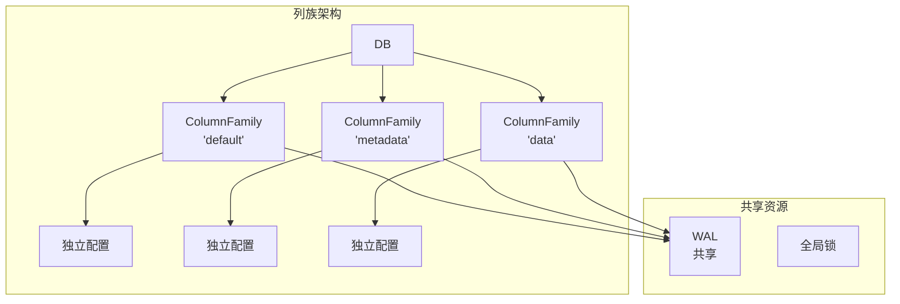
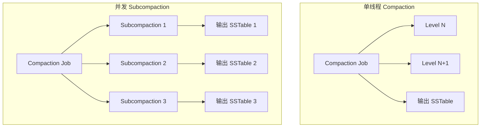
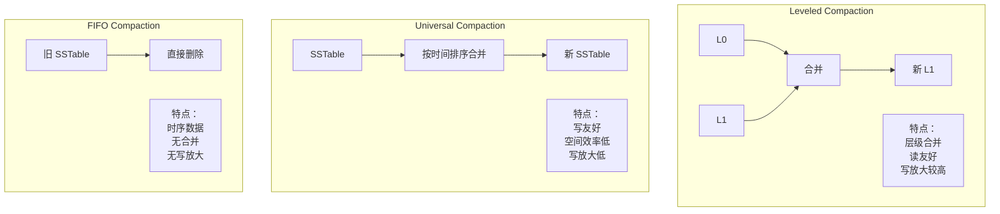
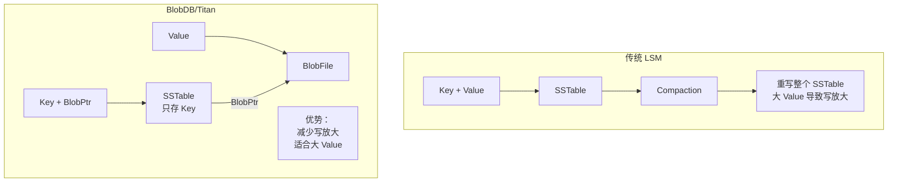

# RocksDB 关键特性

## 学习目标

- 掌握 RocksDB 的核心特性
- 理解列族、并发压缩、事务等机制
- 了解 BlobDB/Titan、Merge 操作符等高级功能

## 列族（Column Family）

### 列族概念



### 列族使用

```cpp
#include "rocksdb/db.h"
#include "rocksdb/options.h"

// 打开数据库时创建列族
std::vector<ColumnFamilyDescriptor> column_families;
column_families.push_back(ColumnFamilyDescriptor(
    kDefaultColumnFamilyName, ColumnFamilyOptions()));
column_families.push_back(ColumnFamilyDescriptor(
    "metadata", ColumnFamilyOptions()));
column_families.push_back(ColumnFamilyDescriptor(
    "data", ColumnFamilyOptions()));

std::vector<ColumnFamilyHandle*> handles;
DB* db;
Status s = DB::Open(DBOptions(), "/path/to/db",
                    column_families, &handles, &db);

// 使用列族
db->Put(WriteOptions(), handles[1], "key", "value");
std::string value;
db->Get(ReadOptions(), handles[1], "key", &value);

// 关闭时释放
for (auto h : handles) {
    delete h;
}
delete db;
```

### 列族配置

```cpp
ColumnFamilyOptions cf_options;
cf_options.write_buffer_size = 64 << 20;      // 64 MB MemTable
cf_options.max_write_buffer_number = 4;       // 4 个 MemTable
cf_options.min_write_buffer_number_to_merge = 2;
cf_options.compression = kLZ4Compression;     // LZ4 压缩
cf_options.compaction_style = kCompactionStyleLevel;  // Leveled Compaction
```

## 并发压缩（Concurrent Compaction）

### Subcompaction



### 配置并发压缩

```cpp
Options options;
options.max_subcompactions = 4;  // 最大并发子压缩数
options.max_background_jobs = 8; // 后台线程总数
options.max_background_compactions = 4;  // Compaction 线程数
options.max_background_flushes = 2;      // Flush 线程数
```

### Compaction 线程池

```cpp
// db/internal_stats.h
struct CompactionStats {
  int count;           // Compaction 次数
  uint64_t micros;     // 总耗时（微秒）
  uint64_t bytes_read;    // 读取字节数
  uint64_t bytes_written; // 写入字节数
};

// 监控 Compaction
DB::GetProperty("rocksdb.stats", &value);
```

## 压缩策略

### 三种压缩策略



### 配置压缩策略

```cpp
// Leveled Compaction（默认）
ColumnFamilyOptions options;
options.compaction_style = kCompactionStyleLevel;
options.level0_file_num_compaction_trigger = 4;
options.max_bytes_for_level_base = 256 << 20;  // 256 MB

// Universal Compaction
options.compaction_style = kCompactionStyleUniversal;
options.compaction_options_universal.size_ratio = 1;
options.compaction_options_universal.min_merge_width = 2;

// FIFO Compaction
options.compaction_style = kCompactionStyleFIFO;
options.compaction_options_fifo.ttl = 86400;  // 24 小时
options.compaction_options_fifo.max_table_files_size = 1 << 30;  // 1 GB
```

## BlobDB / Titan

### 键值分离



### BlobDB 使用

```cpp
#include "rocksdb/db.h"
#include "rocksdb/options.h"

// 启用 BlobDB
BlobDBOptions blob_options;
blob_options.min_blob_size = 1024;  // 大于 1KB 的 Value 存入 BlobFile
blob_options.blob_file_size = 256 << 20;  // BlobFile 最大 256MB

Options options;
options.blob_db_options = blob_options;
options.enable_blob_files = true;

DB* db;
DB::Open(options, "/path/to/db", &db);
```

### Titan 使用（TiKV 集成）

```cpp
#include "titan/db.h"

// 打开 Titan 数据库
titan::TitanOptions titan_options;
titan_options.min_blob_size = 1024;
titan_options.blob_file_size = 256 << 20;

titan::TitanDB* db;
titan::TitanDB::Open(titan_options, "/path/to/db", &db);
```

## 事务支持

### TransactionDB

```cpp
#include "rocksdb/utilities/transaction.h"
#include "rocksdb/utilities/transaction_db.h"

TransactionDB* txn_db;
TransactionDB::Open(DBOptions(), "/path/to/db", &txn_db);

// 开始事务
Transaction* txn = txn_db->BeginTransaction(WriteOptions());
    
// 事务操作
Status s = txn->Put("key1", "value1");
s = txn->Put("key2", "value2");

// 读取-修改-写入
std::string value;
s = txn->Get(ReadOptions(), "key1", &value);
txn->Put("key1", value + "-updated");

// 提交
s = txn->Commit();
if (s.IsBusy()) {
    // 冲突重试
    txn->Rollback();
}

delete txn;
delete txn_db;
```

### 事务隔离级别

| 隔离级别 | 说明 |
|---------|------|
| ReadCommitted | 读取已提交数据 |
| RepeatableRead | 可重复读（快照读） |
| Serializable | 序列化（需要冲突检测） |

### WritePrepared/WriteUnprepared

```cpp
TransactionOptions txn_options;
txn_options.lock_timeout = 1000000;  // 1 秒超时

// WritePrepared 事务
Transaction* txn = txn_db->BeginTransaction(WriteOptions(), txn_options);
```

## Merge 操作符

### Merge 操作

```cpp
// 使用 Merge 操作符进行增量更新
class UInt64AddOperator : public MergeOperator {
 public:
  bool FullMerge(const Slice& key, const Slice* existing_value,
                 const std::vector<std::string>& operands,
                 std::string* new_value) const override {
    uint64_t value = existing_value ? DecodeUint64(*existing_value) : 0;
    for (const auto& op : operands) {
      value += DecodeUint64(op);
    }
    *new_value = EncodeUint64(value);
    return true;
  }
};

// 使用
Options options;
options.merge_operator.reset(new UInt64AddOperator);

db->Put(WriteOptions(), "counter", EncodeUint64(100));
db->Merge(WriteOptions(), "counter", EncodeUint64(10));  // 原子 +10
db->Merge(WriteOptions(), "counter", EncodeUint64(20));  // 原子 +20

// 读取结果：130
std::string value;
db->Get(ReadOptions(), "counter", &value);
```

### 内置 Merge 操作符

```cpp
// 字符串追加
options.merge_operator = MergeOperators::CreateStringAppendOperator();

// uint64 加法
options.merge_operator = MergeOperators::CreateUInt64AddOperator();
```

## Backup & Restore

### 备份

```cpp
#include "rocksdb/utilities/backupable_db.h"

BackupEngine* backup_engine;
BackupableDBOptions backup_options("/path/to/backup");
BackupEngine::Open(DBOptions(), backup_options, &backup_engine);

// 创建备份
backup_engine->CreateNewBackup(db);

// 备份列表
std::vector<BackupInfo> backup_info;
backup_engine->GetBackupInfo(&backup_info);

delete backup_engine;
```

### 恢复

```cpp
// 恢复到指定备份
backup_engine->RestoreDBFromBackup(backup_id, "/path/to/db", "/path/to/db");

// 恢复到最新备份
backup_engine->RestoreDBFromLatestBackup("/path/to/db", "/path/to/db");
```

## 配置选项

### DB 选项

```cpp
Options options;
options.create_if_missing = true;
options.error_if_exists = false;
options.paranoid_checks = true;

// WAL 配置
options.WAL_ttl_seconds = 0;
options.WAL_size_limit_bytes = 0;

// 后台线程
options.max_background_jobs = 8;
options.max_background_compactions = 4;
options.max_background_flushes = 2;

// 日志
options.info_log_level = INFO_LEVEL;
options.max_log_file_size = 48 << 20;
options.keep_log_file_num = 1000;
```

### ColumnFamily 选项

```cpp
ColumnFamilyOptions cf_options;
// MemTable
cf_options.write_buffer_size = 64 << 20;
cf_options.max_write_buffer_number = 4;
cf_options.min_write_buffer_number_to_merge = 2;

// Compaction
cf_options.level0_file_num_compaction_trigger = 4;
cf_options.level0_slowdown_writes_trigger = 20;
cf_options.level0_stop_writes_trigger = 36;
cf_options.max_bytes_for_level_base = 256 << 20;
cf_options.max_bytes_for_level_multiplier = 10;

// 压缩
cf_options.compression = kLZ4Compression;
cf_options.bottommost_compression = kZSTD;
```

### Table 选项

```cpp
BlockBasedTableOptions table_options;
table_options.block_size = 4 << 10;          // 4 KB Block
table_options.block_cache = NewLRUCache(1 << 30);  // 1 GB Cache
table_options.filter_policy.reset(NewBloomFilterPolicy(10));
table_options.cache_index_and_filter_blocks = true;

Options options;
options.table_factory.reset(NewBlockBasedTableFactory(table_options));
```

## 要点总结

- **列族**：逻辑隔离，共享 WAL，独立配置
- **并发压缩**：Subcompaction 加速合并
- **压缩策略**：Leveled/Universal/FIFO 三种
- **BlobDB/Titan**：键值分离，减少写放大
- **事务**：TransactionDB + MVCC
- **Merge 操作符**：原子增量更新

## 思考题

1. 列族共享 WAL 如何保证跨列族事务的原子性？
2. BlobDB 的键值分离与 Badger 的 ValueLog 有什么区别？
3. Merge 操作符在什么场景下比 Put 更高效？