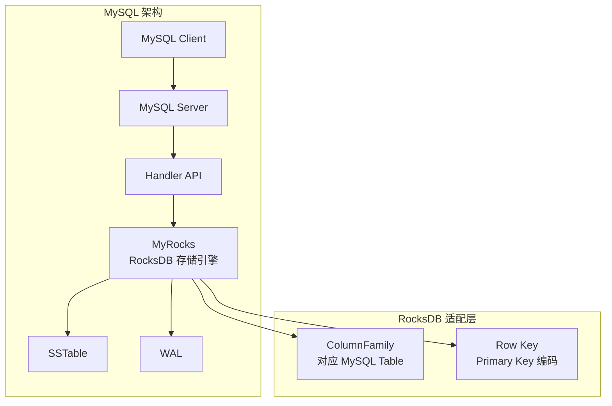
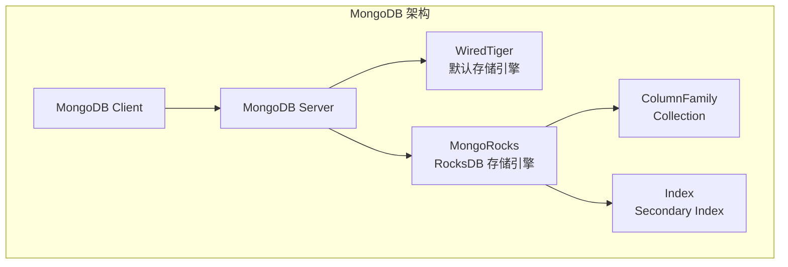
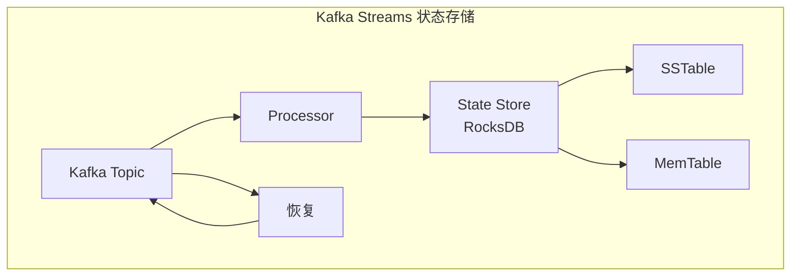
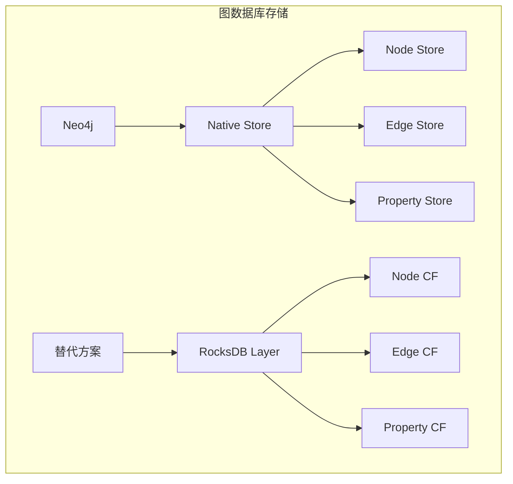
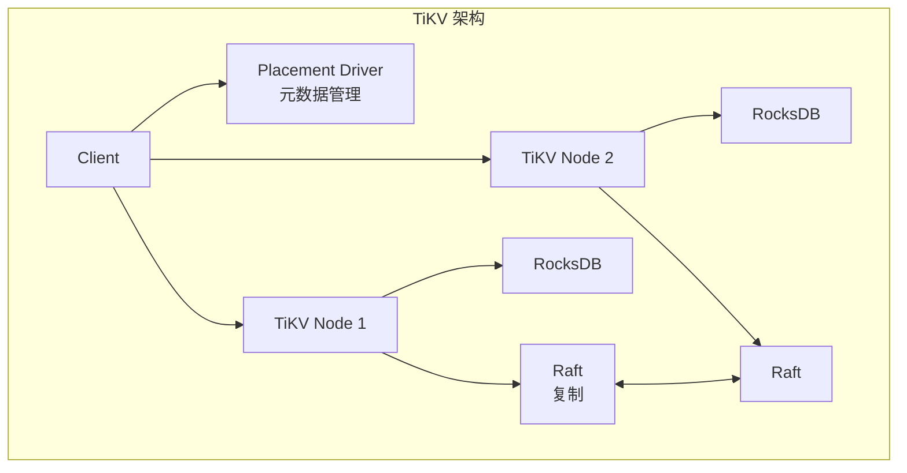
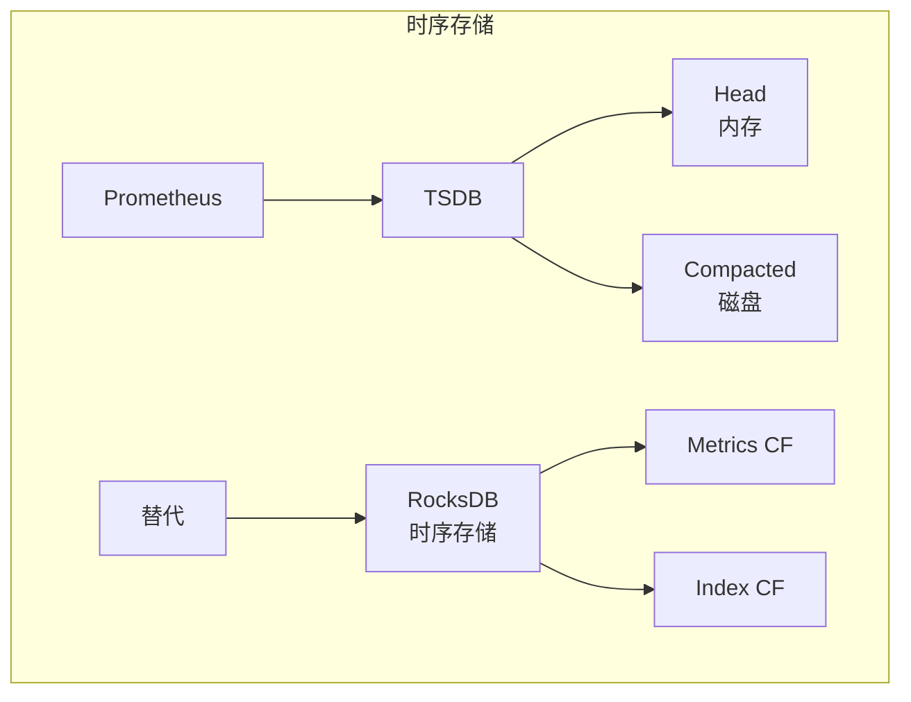

# RocksDB 使用场景

## 学习目标

- 掌握 RocksDB 的典型应用场景
- 理解 RocksDB 作为存储引擎的集成方式
- 了解 RocksDB 与其他嵌入式 KV 的选型决策

## MySQL 存储引擎（MyRocks）

### MyRocks 架构



### MyRocks 特点

| 特性 | 说明 |
|------|------|
| 压缩 | 比 InnoDB 节省 50% 存储空间 |
| 写入性能 | 高吞吐写入 |
| 读性能 | 比 InnoDB 略低 |
| 事务支持 | 支持 ACID 事务 |

### MyRocks 使用示例

```sql
-- 创建 MyRocks 表
CREATE TABLE users (
    id INT PRIMARY KEY,
    name VARCHAR(100),
    email VARCHAR(100)
) ENGINE=RocksDB;

-- 查看表引擎
SHOW TABLE STATUS LIKE 'users';
```

## MongoDB 存储引擎

### WiredTiger + RocksDB



### MongoDB 集成

```cpp
// RocksDB 作为 MongoDB 存储引擎
class RocksMongoDB {
 public:
  // Collection 映射到 ColumnFamily
  ColumnFamilyHandle* GetCollection(const std::string& name);
  
  // 文档存储
  void InsertDocument(const std::string& collection,
                      const Document& doc) {
    ColumnFamilyHandle* cf = GetCollection(collection);
    std::string key = EncodeObjectId(doc.id());
    std::string value = EncodeBSON(doc);
    db_->Put(WriteOptions(), cf, key, value);
  }
};
```

## 消息队列持久化

### Kafka Streams



### 状态存储实现

```java
// Kafka Streams RocksDB Store
public class RocksDBStore implements KeyValueStore<Bytes, byte[]> {
    private RocksDB db;
    
    @Override
    public void put(Bytes key, byte[] value) {
        db.put(key.get(), value);
    }
    
    @Override
    public byte[] get(Bytes key) {
        return db.get(key.get());
    }
    
    @Override
    public KeyValueIterator<Bytes, byte[]> range(Bytes from, Bytes to) {
        RocksIterator it = db.newIterator();
        it.seek(from.get());
        return new RocksDBRangeIterator(it, to);
    }
}
```

## 图数据库存储层

### Neo4j 存储层



### TiKV（分布式 KV）

```cpp
// TiKV 基于 RocksDB 的分布式 KV
class TiKVStore {
 public:
  // 写入
  void Put(const std::string& key, const std::string& value) {
    // Raft 复制
    raft_propose(key, value);
    // 写入 RocksDB
    db_->Put(WriteOptions(), key, value);
  }
  
  // 读取
  std::string Get(const std::string& key) {
    return db_->Get(ReadOptions(), key);
  }
};
```

### TiKV 架构



## 时序数据库

### Prometheus 存储



### 时序数据存储

```cpp
// 时序数据 Key 编码
// Key: metric_name + tags + timestamp

class TimeSeriesStore {
 public:
  void WriteMetric(const std::string& metric,
                   const std::map<std::string, std::string>& tags,
                   uint64_t timestamp,
                   double value) {
    std::string key = EncodeMetricKey(metric, tags, timestamp);
    std::string val = EncodeMetricValue(value);
    db_->Put(WriteOptions(), ts_cf_, key, val);
  }
  
  std::vector<Metric> QueryRange(const std::string& metric,
                                  uint64_t start, uint64_t end) {
    std::string start_key = EncodeMetricKey(metric, {}, start);
    std::string end_key = EncodeMetricKey(metric, {}, end);
    
    Iterator* it = db_->NewIterator(ReadOptions(), ts_cf_);
    it->Seek(start_key);
    
    std::vector<Metric> result;
    while (it->Valid() && it->key() < end_key) {
      result.push_back(DecodeMetric(it->key(), it->value()));
      it->Next();
    }
    delete it;
    return result;
  }
};
```

## 场景选型对比

### RocksDB vs LevelDB

| 维度 | RocksDB | LevelDB |
|------|---------|---------|
| 复杂度 | 高，功能丰富 | 低，代码简洁 |
| 并发写入 | 多线程 | 单线程 |
| 列族 | 支持 | 不支持 |
| 压缩策略 | 3 种 | 仅 Leveled |
| 事务 | TransactionDB | WriteBatch |
| 生产级 | 是 | 学习级 |

### RocksDB vs Badger

| 维度 | RocksDB | Badger |
|------|---------|--------|
| 语言 | C++ | Go |
| 键值分离 | BlobDB/Titan | 原生支持 |
| 列族 | 支持 | 不支持 |
| 性能 | 高 | 中等 |
| Go 生态 | CGO | 原生 |
| 学习曲线 | 陡峭 | 平缓 |

### RocksDB vs SQLite

| 维度 | RocksDB | SQLite |
|------|---------|--------|
| 数据模型 | Key-Value | 关系型 |
| 查询能力 | 仅 KV | SQL |
| 事务 | ACID | ACID |
| 索引 | 无（仅主键） | 多索引 |
| 性能 | 写入高 | 读取高 |

## 最佳实践

### 配置调优

```cpp
// SSD 优化配置
Options options;
options.use_direct_reads = true;
options.use_direct_io_for_flush_and_compaction = true;
options.max_background_jobs = 8;

// HDD 优化配置
options.max_background_jobs = 4;
options.compaction_readahead_size = 2 << 20;  // 2 MB 预读
```

### 写入优化

```cpp
// 批量写入
WriteBatch batch;
for (int i = 0; i < 10000; i++) {
    batch.Put(keys[i], values[i]);
}
db->Write(WriteOptions(), &batch);

// 关闭同步
WriteOptions write_options;
write_options.sync = false;
```

### 读取优化

```cpp
// Bloom Filter
BlockBasedTableOptions table_options;
table_options.filter_policy.reset(NewBloomFilterPolicy(10));

// Block Cache
table_options.block_cache = NewLRUCache(1 << 30);  // 1 GB

// 预取
ReadOptions read_options;
read_options.readahead_size = 64 << 10;  // 64 KB
```

## 要点总结

- **MySQL MyRocks**：节省存储空间，高写入吞吐
- **MongoDB**：替代 WiredTiger，高压缩率
- **消息队列**：Kafka Streams 状态存储
- **图数据库**：TiKV 分布式 KV 层
- **时序数据库**：Prometheus 存储替代方案

## 思考题

1. 为什么 MyRocks 比 InnoDB 节省存储空间？
2. TiKV 如何使用 RocksDB 实现分布式事务？
3. 时序数据使用 FIFO Compaction 有什么优势？