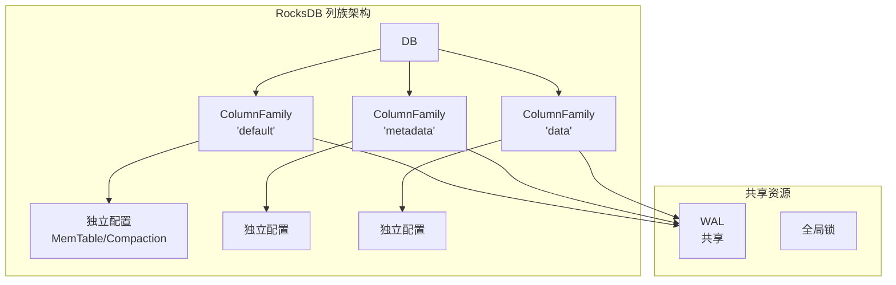
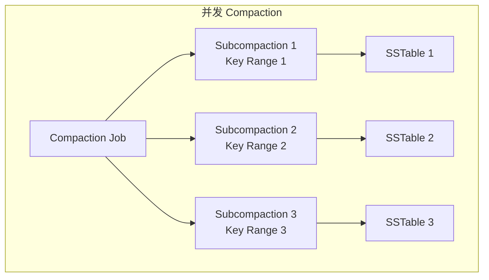
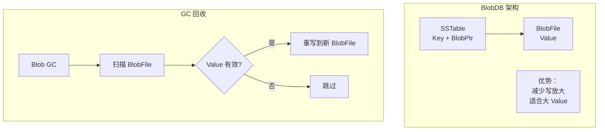

# RocksDB 项目关联

## 学习目标

- 理解 RocksDB 设计与项目存储引擎的关联
- 对比列族设计与项目多模态存储引擎
- 探索可借鉴的设计点

## 列族与多模态存储映射

### RocksDB 列族设计



### 项目多模态存储引擎

```c
// engineering/include/db/mm_storage.h
// 多模态存储引擎：KV/Vector/Timeseries/Document/Spatial/Graph/Yang

typedef struct mm_storage {
    kv_engine_t *kv;          // KV 引擎
    vector_engine_t *vector;  // 向量引擎
    ts_engine_t *ts;          // 时序引擎
    doc_engine_t *doc;        // 文档引擎
    spatial_engine_t *spatial;// 空间引擎
    graph_engine_t *graph;    // 图引擎
    yang_engine_t *yang;      // 层次引擎
} mm_storage_t;
```

### 映射关系

| RocksDB | 项目 |
|---------|------|
| ColumnFamily | 数据模型（KV/Vector/TS 等） |
| 共享 WAL | 共享日志系统 |
| 独立 MemTable | 独立存储引擎 |
| 独立 Compaction | 独立压缩策略 |

**借鉴设计**：

```c
// 统一 WAL，独立存储引擎
typedef struct unified_storage {
    wal_t *shared_wal;        // 共享 WAL
    
    // 独立存储引擎（类似列族）
    storage_engine_t *engines[MAX_ENGINES];
    int engine_count;
    
    // 全局锁
    pthread_mutex_t global_lock;
} unified_storage_t;

// 创建存储引擎（类似创建列族）
storage_engine_t *unified_storage_create_engine(
    unified_storage_t *us,
    const char *name,
    engine_type_t type);
```

## 并发 Compaction 借鉴

### RocksDB Subcompaction



### 项目 Compaction 设计

```c
// compaction.h
typedef struct compaction_job {
    int input_level;
    int output_level;
    
    // Key 范围切分
    key_range_t *ranges;
    int range_count;
    
    // 并发执行
    thread_pool_t *pool;
} compaction_job_t;

// 执行并发 Compaction
int compaction_run_parallel(compaction_job_t *job) {
    // 切分 Key 范围
    split_key_ranges(job);
    
    // 并发执行
    for (int i = 0; i < job->range_count; i++) {
        thread_pool_submit(job->pool, process_range, &job->ranges[i]);
    }
    
    // 等待完成
    thread_pool_wait(job->pool);
    
    return 0;
}
```

## 事务模型借鉴

### RocksDB TransactionDB

```cpp
// TransactionDB 架构
class TransactionDB {
    // MVCC + 锁管理
    TransactionLockMgr lock_mgr_;
    std::shared_ptr<TransactionDBMutexFactory> mutex_factory_;
    
    // WritePrepared/WriteUnprepared
    WritePreparedTxnDB *write_prepared_db_;
};
```

### 项目事务设计

```c
// txn_manager.h
typedef struct txn_manager {
    // 锁管理
    lock_manager_t *lock_mgr;
    
    // MVCC 时间戳
    timestamp_oracle_t *ts_oracle;
    
    // 活跃事务
    txn_list_t *active_txns;
} txn_manager_t;

// 开始事务
txn_t *txn_begin(txn_manager_t *mgr, isolation_level_t level);

// 提交事务
int txn_commit(txn_t *txn);

// 回滚事务
int txn_rollback(txn_t *txn);
```

### 隔离级别实现

```c
// 隔离级别
typedef enum {
    READ_UNCOMMITTED,
    READ_COMMITTED,
    REPEATABLE_READ,
    SERIALIZABLE
} isolation_level_t;

// MVCC 读取
int mvcc_read(txn_t *txn, const char *key, char **value) {
    uint64_t read_ts = txn->read_ts;
    
    // 读取指定时间戳的版本
    version_t *v = version_get(key, read_ts);
    if (v == NULL) {
        return ERR_NOT_FOUND;
    }
    
    *value = v->value;
    return 0;
}
```

## 压缩策略借鉴

### RocksDB 压缩策略

| 策略 | 特点 | 适用场景 |
|------|------|---------|
| Leveled | 层级合并，读友好 | 读多写少 |
| Universal | 按时间合并，写友好 | 写多读少 |
| FIFO | 直接删除旧文件 | 时序数据 |

### 项目压缩策略设计

```c
// compaction_strategy.h
typedef enum {
    COMPACTION_LEVELED,    // Leveled Compaction
    COMPACTION_UNIVERSAL,  // Universal Compaction
    COMPACTION_FIFO        // FIFO Compaction
} compaction_strategy_t;

typedef struct compaction_config {
    compaction_strategy_t strategy;
    
    // Leveled 参数
    int level_multiplier;     // 层级倍数（默认 10）
    int l0_trigger;           // L0 触发阈值
    
    // Universal 参数
    int size_ratio;           // 大小比例
    
    // FIFO 参数
    uint64_t ttl;             // 过期时间
    uint64_t max_size;        // 最大大小
} compaction_config_t;

// 选择 Compaction 策略
compaction_picker_t *compaction_create_picker(
    compaction_config_t *config);
```

## BlobDB 键值分离借鉴

### RocksDB BlobDB



### 项目键值分离设计

```c
// blob_storage.h
typedef struct blob_file {
    int fd;
    char *path;
    uint64_t current_offset;
} blob_file_t;

typedef struct blob_storage {
    blob_file_t **files;
    int file_count;
    
    // GC 管理
    gc_manager_t *gc;
} blob_storage_t;

// 写入大 Value
int blob_write(blob_storage_t *bs, const char *value, size_t len,
               blob_ptr_t *ptr) {
    ptr->file_id = bs->file_count - 1;
    ptr->offset = bs->files[bs->file_count - 1]->current_offset;
    ptr->len = len;
    
    // 追加写入 BlobFile
    write(bs->files[ptr->file_id]->fd, value, len);
    
    return 0;
}

// 读取大 Value
int blob_read(blob_storage_t *bs, blob_ptr_t *ptr, char **value) {
    *value = malloc(ptr->len);
    pread(bs->files[ptr->file_id]->fd, *value, ptr->len, ptr->offset);
    return 0;
}
```

## 配置系统借鉴

### RocksDB Options

```cpp
// 分层配置
Options db_options;           // DB 级别
ColumnFamilyOptions cf_options;  // 列族级别
BlockBasedTableOptions table_options;  // Table 级别
```

### 项目 GUC 系统映射

```c
// guc.h

// DB 级别配置
GUC_DEFINE(rocksdb_max_background_jobs, "8");
GUC_DEFINE(rocksdb_max_open_files, "-1");
GUC_DEFINE(rocksdb_use_fsync, "true");

// 列族级别配置（对应项目存储引擎）
GUC_DEFINE(rocksdb_write_buffer_size, "64MB");
GUC_DEFINE(rocksdb_max_write_buffer_number, "4");
GUC_DEFINE(rocksdb_level0_file_num_compaction_trigger, "4");

// Table 级别配置
GUC_DEFINE(rocksdb_block_size, "4KB");
GUC_DEFINE(rocksdb_block_cache_size, "1GB");
GUC_DEFINE(rocksdb_bloom_filter_bits_per_key, "10");
```

## 实践建议

### 阶段一：列族/存储引擎映射

1. 定义 `storage_engine.h` 统一接口
2. 实现共享 WAL 机制
3. 各存储引擎独立配置

### 阶段二：并发 Compaction

1. 实现 `compaction_job.h` 任务管理
2. 实现 Key 范围切分
3. 集成线程池并发执行

### 阶段三：事务支持

1. 实现 `txn_manager.h` 事务管理
2. 实现 MVCC 时间戳分配
3. 实现锁管理器

### 阶段四：键值分离

1. 实现 `blob_storage.h` 大 Value 存储
2. 实现 BlobFile GC
3. 集成到主存储路径

## 要点总结

- **列族映射**：项目的多模态存储引擎可借鉴列族的独立配置思想
- **并发 Compaction**：Subcompaction 加速合并
- **事务模型**：MVCC + 锁管理是成熟方案
- **压缩策略**：Leveled/Universal/FIFO 三种策略可选
- **键值分离**：BlobDB 机制减少写放大

## 思考题

1. 项目的多模态存储引擎如何设计共享 WAL？
2. 并发 Compaction 如何保证数据一致性？
3. 键值分离的 GC 如何避免对前台请求的影响？