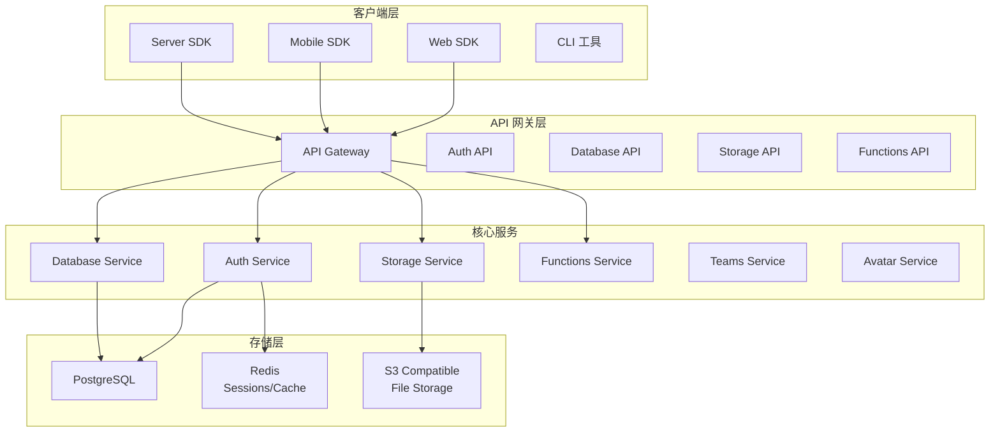

# Appwrite 项目概览

## 学习目标

- 了解 Appwrite 的定位和特点
- 掌握 Appwrite 的 BaaS 架构与后端即服务设计

## 项目定位

> Firebase 开源替代品，BaaS（后端即服务）平台，提供数据库、存储、认证、函数等后端服务能力

**基本信息**：

- 开发方：Appwrite Team
- 开源协议：BSD 3-Clause
- GitHub Stars：~45k

## 核心设计

## 要点总结

- **BaaS 平台**：后端即服务，提供开箱即用的后端能力
- **多 SDK 支持**：Web、Mobile、Server、Flutter 等多语言 SDK
- **数据库**：支持关系型数据库，支持集合、文档、索引
- **文件存储**：S3 兼容存储，支持图片、视频等大文件
- **用户认证**：内置用户注册、登录、OAuth 认证
- **函数计算**：支持自定义服务端函数扩展
- **团队权限**：基于团队和角色的细粒度权限控制
- **自托管**：可完全私有部署，保护数据隐私

## 相关资源

- GitHub: https://github.com/appwrite/appwrite
- 文档: https://appwrite.io/docs
