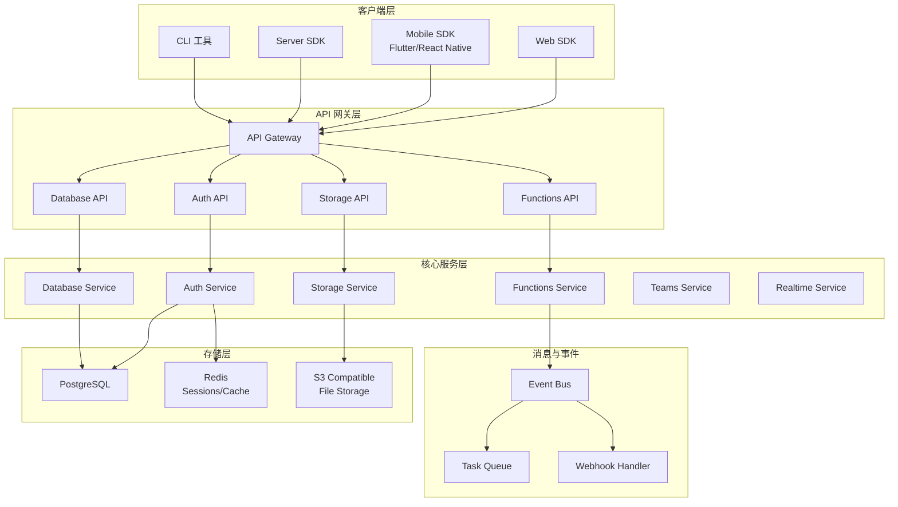
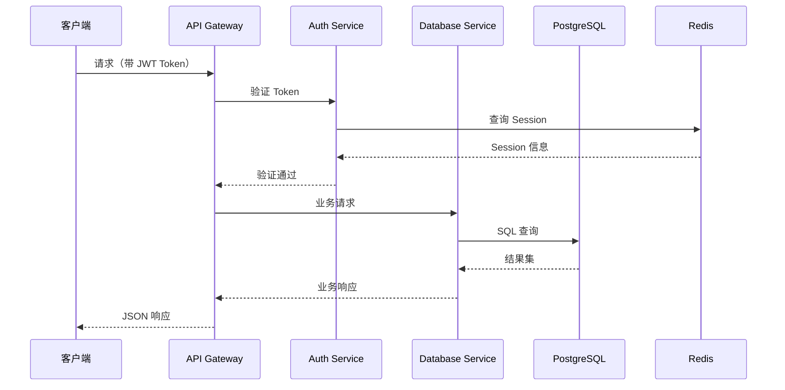
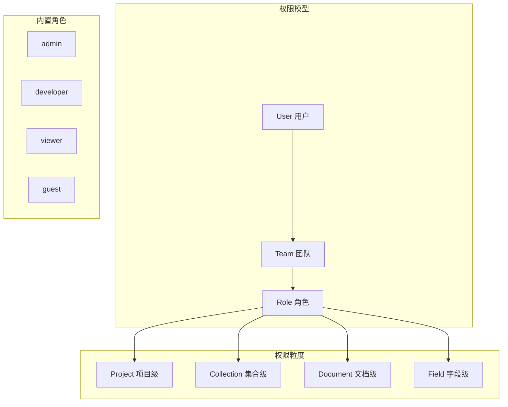

# Appwrite 架构设计

## 学习目标

- 理解 Appwrite 的整体架构分层
- 掌握各服务之间的通信机制
- 了解权限系统的设计思路

## 整体架构

## 各层职责

### 客户端层

- **Web SDK**：JavaScript/TypeScript 前端 SDK
- **Mobile SDK**：Flutter、React Native、iOS、Android SDK
- **Server SDK**：Node.js、Python、Ruby 等服务端 SDK
- **CLI 工具**：命令行管理工具

### API 网关层

- **API Gateway**：统一入口，请求路由，限流
- **各领域 API**：Auth、Database、Storage、Functions 独立 API

### 核心服务层

- **Auth Service**：用户认证与授权
- **Database Service**：文档数据库 CRUD
- **Storage Service**：文件存储与管理
- **Functions Service**：Serverless 函数执行
- **Teams Service**：团队与权限管理
- **Realtime Service**：WebSocket 实时订阅

### 消息与事件

- **Task Queue**：异步任务队列
- **Event Bus**：服务间事件通信
- **Webhook Handler**：外部事件通知

## 服务间通信流程

## 权限系统设计

## 要点总结

- **微服务架构**：各服务独立部署，通过事件和队列通信
- **API Gateway 统一入口**：认证、路由、限流集中处理
- **三级权限模型**：Team → Role → Resource 细粒度控制

## 思考题

1. Appwrite 如何保证各微服务之间的事务一致性？
2. 权限系统如何支持自定义角色？