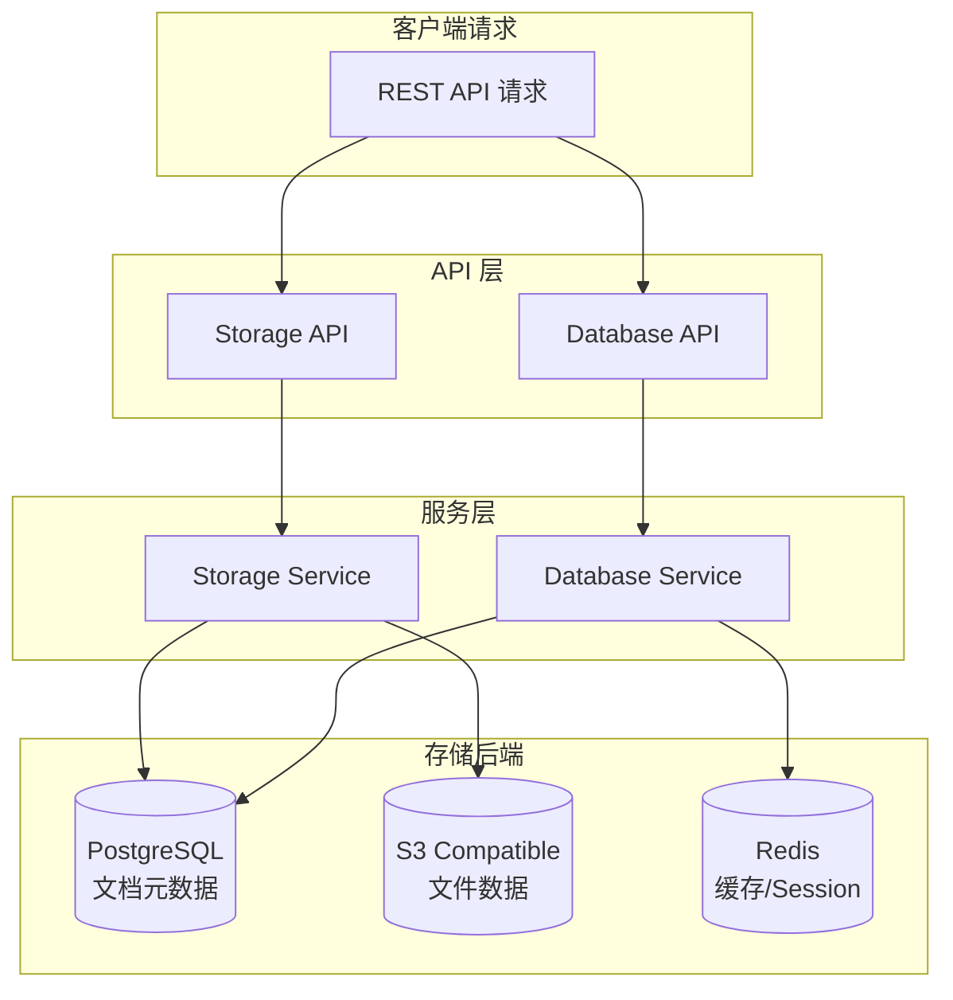
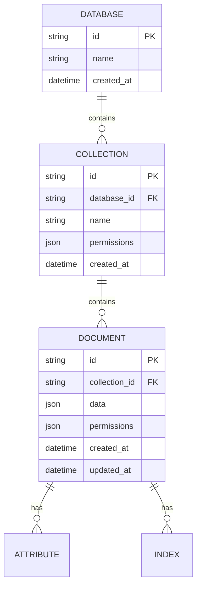
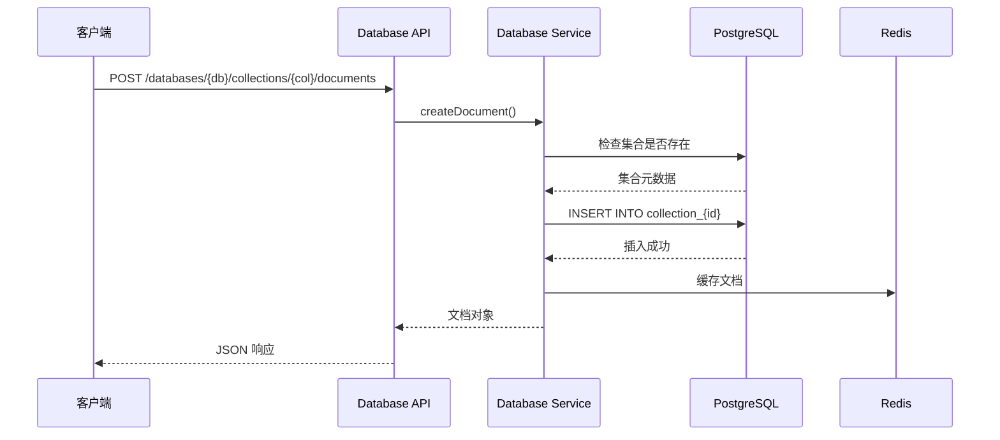
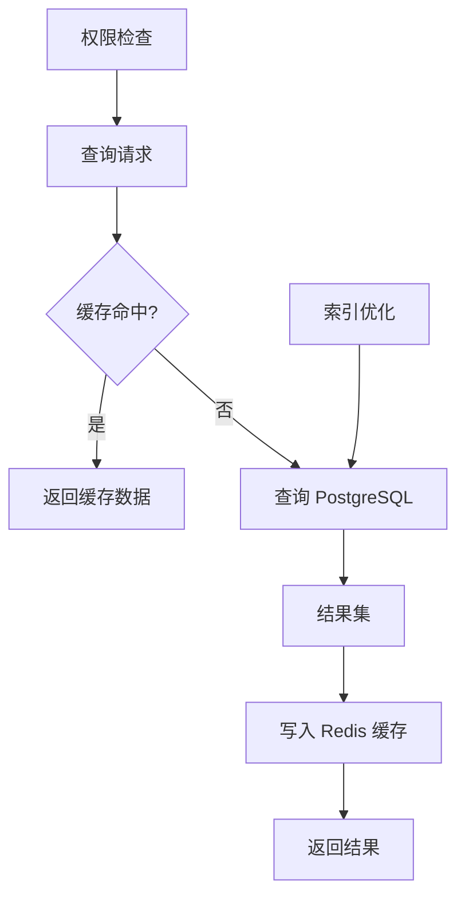
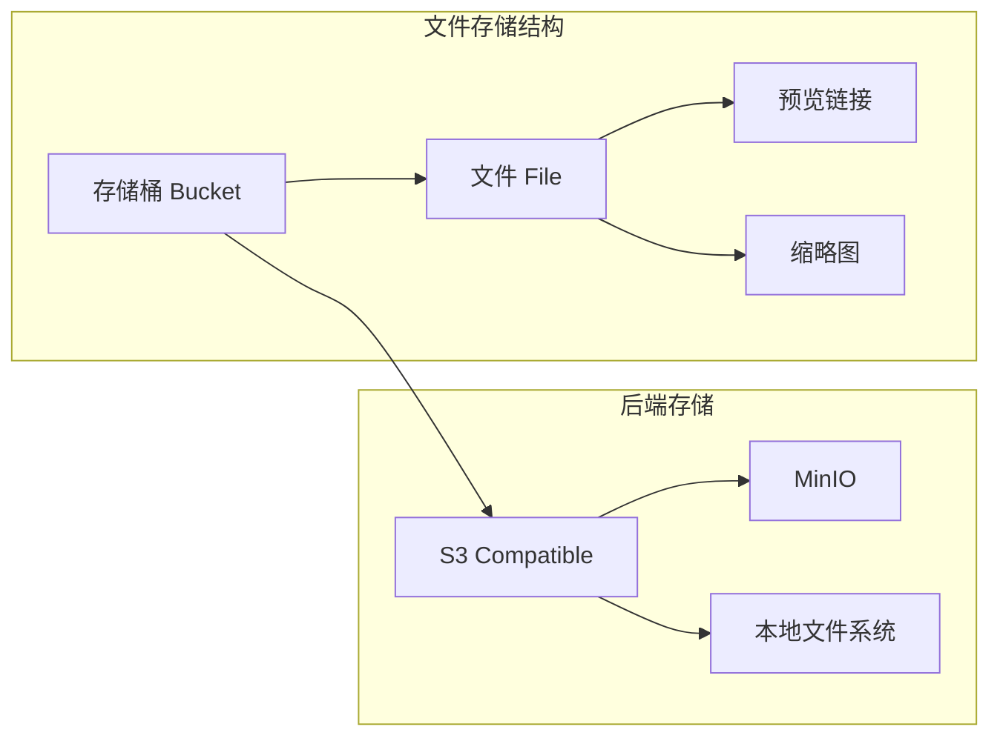
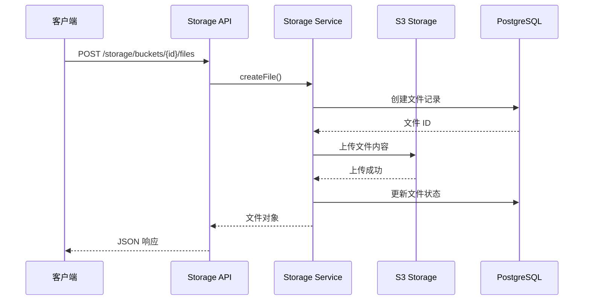
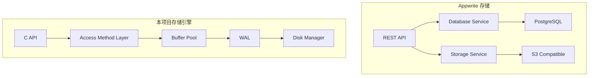

# Appwrite 存储引擎

## 学习目标

- 理解 Appwrite 的存储架构和数据持久化机制
- 掌握文档存储、文件存储的核心设计
- 对比分析 Appwrite 存储与本项目 storage 模块

## 核心概念

Appwrite 的存储分为两个层面：
- **数据库存储**：文档型数据库，支持集合、文档、索引
- **文件存储**：S3 兼容的对象存储，支持图片处理、预览链接



## 数据库存储架构

### 文档数据模型

Appwrite 采用文档型数据模型，底层使用 PostgreSQL 存储：



### 存储映射关系

| Appwrite 概念 | PostgreSQL 映射 | 说明 |
|--------------|----------------|------|
| Database | database 表行 | 逻辑数据库 |
| Collection | collection 表行 + 动态表 | 集合定义 + 数据表 |
| Document | collection_{id} 表行 | 每个集合对应一张表 |
| Attribute | collection 表字段 | 集合字段定义 |

### 数据持久化流程



### 写入路径

1. **请求验证**：检查 API Key、Project ID、权限
2. **集合校验**：验证集合存在、字段匹配
3. **权限检查**：验证用户是否有写入权限
4. **数据插入**：执行 SQL INSERT
5. **事件触发**：发送 `document.created` 事件
6. **缓存更新**：更新 Redis 缓存

```php
// 简化的写入流程（PHP 伪代码）
public function createDocument(string $collectionId, array $data): Document {
    // 1. 获取集合元数据
    $collection = $this->getCollection($collectionId);
    
    // 2. 验证字段
    $this->validateAttributes($collection, $data);
    
    // 3. 权限检查
    $this->checkPermission($collection, 'write');
    
    // 4. 执行插入
    $document = $this->database->insert(
        "collection_{$collectionId}",
        $data
    );
    
    // 5. 触发事件
    Event::emit('document.created', $document);
    
    return $document;
}
```

### 读取路径



1. **权限验证**：检查用户读取权限
2. **缓存查找**：先查 Redis
3. **数据库查询**：缓存未命中则查 PostgreSQL
4. **结果组装**：将行数据转为文档对象
5. **缓存回填**：写入 Redis

## 文件存储架构

### 存储桶模型



### 文件上传流程



### 图片处理能力

| 操作 | 参数 | 说明 |
|------|------|------|
| 裁剪 | `width`, `height` | 指定尺寸裁剪 |
| 缩放 | `width`, `height`, `gravity` | 等比缩放 |
| 旋转 | `rotation` | 旋转角度 |
| 格式转换 | `output` | jpg/png/webp |
| 质量 | `quality` | 压缩质量 0-100 |

```bash
# 预览链接示例
GET /storage/buckets/{bucket}/files/{file}/view?
    width=200&
    height=200&
    gravity=center&
    output=webp&
    quality=80
```

## 与本项目 storage 模块对比

### 架构对比



### 功能对比

| 维度 | Appwrite | 本项目 storage 模块 |
|------|----------|-------------------|
| 数据模型 | 文档型（JSON） | 关系型（Tuple） |
| 查询接口 | RESTful API | C API + SQL |
| 存储后端 | PostgreSQL | 自研存储引擎 |
| 文件存储 | S3 兼容 | 无独立实现 |
| 权限控制 | 内置 ACL | 依赖应用层 |
| 缓存机制 | Redis | Buffer Pool |

### 可借鉴的设计

#### 1. 存储抽象层

```c
// 本项目可借鉴的存储抽象
typedef struct storage_backend {
    int (*put)(struct storage_backend *self, const char *key, void *data, size_t len);
    int (*get)(struct storage_backend *self, const char *key, void **data, size_t *len);
    int (*delete)(struct storage_backend *self, const char *key);
} storage_backend_t;

// S3 兼容后端
storage_backend_t *s3_backend_new(const char *endpoint, const char *bucket);

// 本地文件系统后端
storage_backend_t *fs_backend_new(const char *base_path);
```

#### 2. 文件存储集成

```c
// 在项目中添加文件存储支持
typedef struct file_storage {
    storage_backend_t *backend;  // 抽象后端
    buffer_pool_t *cache;        // 本地缓存
    char *(*get_preview_url)(struct file_storage *self, const char *file_id, int width, int height);
} file_storage_t;
```

#### 3. 权限系统集成

```c
// 文档级权限控制
typedef struct document_acl {
    char *role;           // 角色标识
    char *permission;     // read/write/delete
    char *resource;       // 资源路径
} document_acl_t;

// 权限检查
int check_document_permission(user_t *user, document_t *doc, const char *action);
```

## 要点总结

- Appwrite 数据库存储基于 PostgreSQL，文档映射为表行
- 文件存储使用 S3 兼容后端，支持图片处理和预览
- 写入路径包含验证、插入、事件触发三阶段
- 读取路径优先查缓存，未命中则查数据库
- 本项目可借鉴存储抽象层、文件存储集成、权限系统设计

## 思考题

1. Appwrite 为什么选择 PostgreSQL 作为文档数据库的底层存储？与 MongoDB 相比有什么优劣势？
2. 文件存储的图片处理是在请求时实时处理还是预处理？各有什么优缺点？
3. 如果要在本项目中实现文档级 ACL，需要修改哪些模块？
4. Appwrite 的缓存策略是什么？如何保证缓存一致性？
