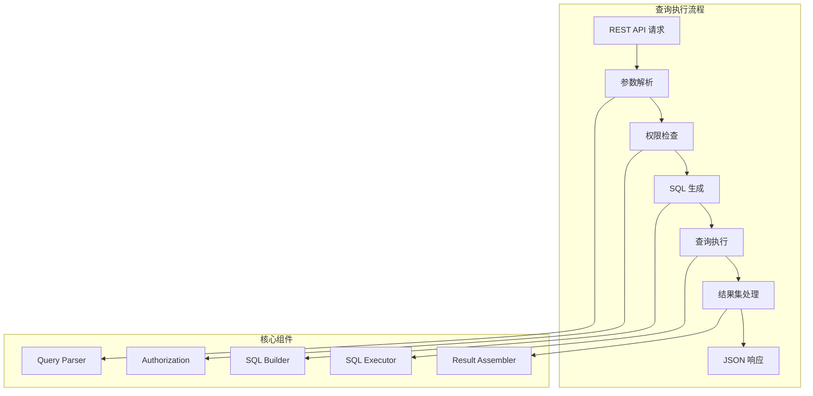
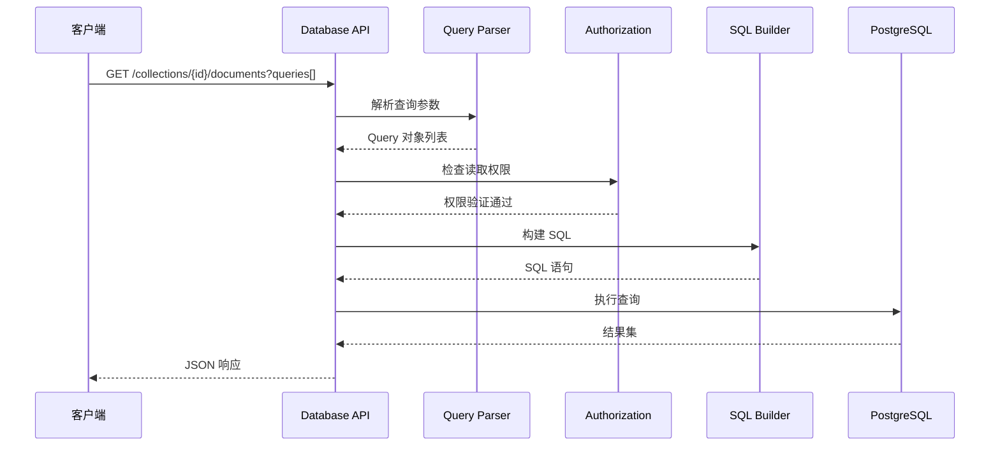
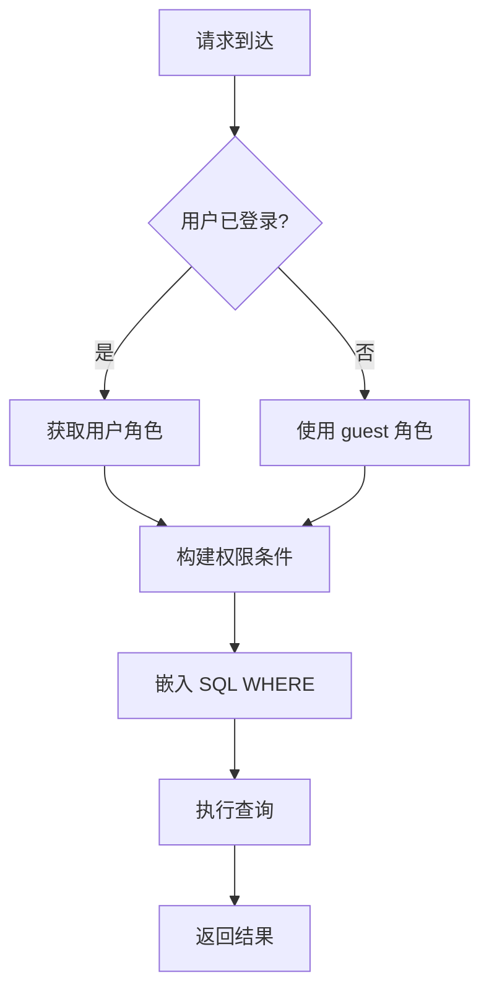
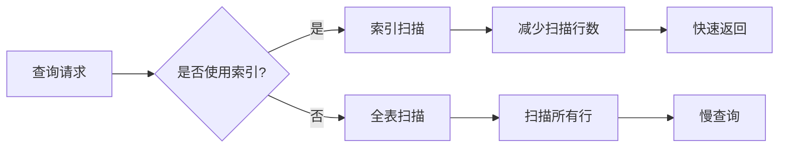
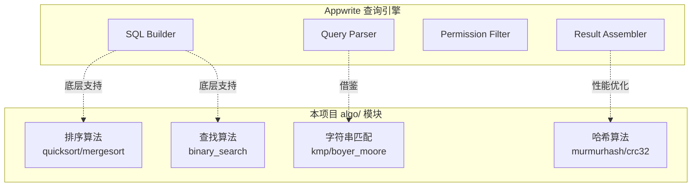
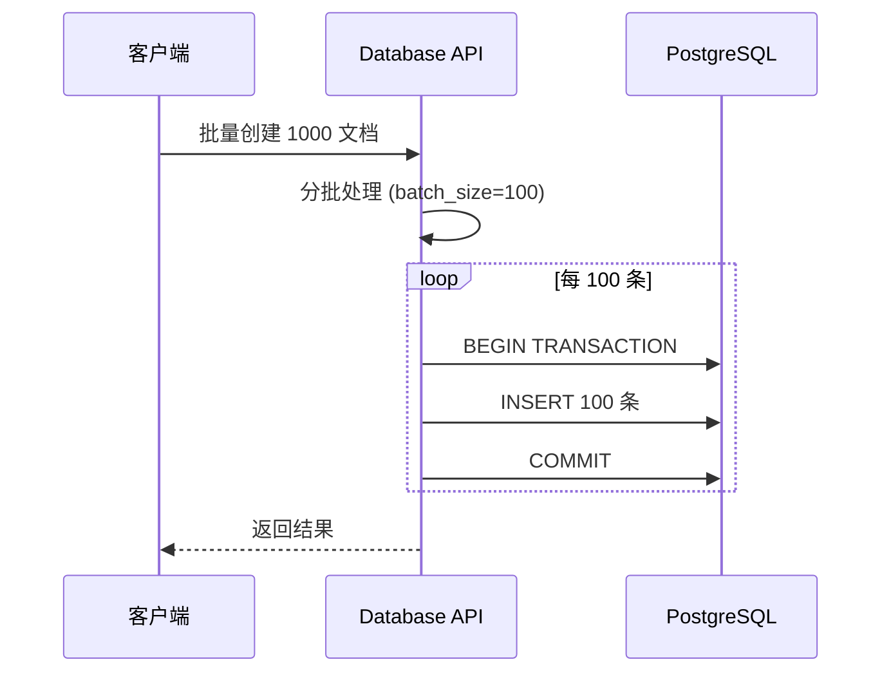

# Appwrite 查询/操作引擎

## 学习目标

- 理解 Appwrite 的查询执行流程
- 掌握查询语句解析、优化、执行的核心机制
- 对比分析 Appwrite 查询引擎与本项目 algo/ 模块的关联

## 核心概念

Appwrite 的查询引擎负责处理文档数据库的 CRUD 操作，核心流程包括：
- **查询解析**：将 REST API 参数转为数据库查询
- **权限过滤**：基于 ACL 的数据访问控制
- **查询执行**：生成 SQL 并执行
- **结果组装**：将 SQL 结果转为文档对象



## 查询语法

### 查询构建器

Appwrite 提供 Query 类构建查询条件：

```javascript
// JavaScript SDK 查询示例
import { Query } from 'appwrite';

// 等于查询
Query.equal('name', '张三')

// 范围查询
Query.greaterThan('age', 18)
Query.lessThan('score', 100)

// 模糊查询
Query.search('title', '数据库')

// 逻辑组合
Query.and([
    Query.equal('status', 'active'),
    Query.greaterThan('age', 18)
])

Query.or([
    Query.equal('role', 'admin'),
    Query.equal('role', 'moderator')
])

// 排序与分页
Query.orderDesc('created_at')
Query.limit(10)
Query.offset(20)
```

### 查询操作符映射

| Query 方法 | SQL 映射 | 说明 |
|-----------|---------|------|
| `equal` | `= ` | 精确匹配 |
| `notEqual` | `!= ` | 不等于 |
| `lessThan` | `< ` | 小于 |
| `lessThanEqual` | `<= ` | 小于等于 |
| `greaterThan` | `> ` | 大于 |
| `greaterThanEqual` | `>= ` | 大于等于 |
| `search` | `ILIKE` / `@@ ` | 模糊/全文搜索 |
| `orderByAsc` | `ORDER BY ... ASC` | 升序 |
| `orderByDesc` | `ORDER BY ... DESC` | 降序 |
| `limit` | `LIMIT` | 结果数量 |
| `offset` | `OFFSET` | 偏移量 |

## 查询解析流程



### 查询参数解析

```php
// PHP 查询解析伪代码
class QueryParser {
    public function parse(array $queries): array {
        $conditions = [];
        
        foreach ($queries as $query) {
            $method = $query['method'];
            $attribute = $query['attribute'];
            $values = $query['values'];
            
            switch ($method) {
                case 'equal':
                    $conditions[] = "{$attribute} = ?";
                    break;
                case 'greaterThan':
                    $conditions[] = "{$attribute} > ?";
                    break;
                case 'search':
                    $conditions[] = "{$attribute} ILIKE ?";
                    $values = ["%{$values[0]}%"];
                    break;
                // ... 其他操作符
            }
        }
        
        return $conditions;
    }
}
```

### SQL 构建

```mermaid
flowchart TD
    A[Query 对象列表] --> B[解析操作符]
    B --> C[生成 WHERE 条件]
    C --> D[添加权限过滤]
    D --> E[添加排序]
    E --> F[添加分页]
    F --> G[完整 SQL]
    
    subgraph "SQL 模板"
        H[SELECT * FROM collection_{id}]
        I[WHERE {conditions} AND {acl}]
        J[ORDER BY {order}]
        K[LIMIT {limit} OFFSET {offset}]
    end
    
    G --> H
    H --> I
    I --> J
    J --> K
```

```php
// SQL 构建伪代码
class SQLBuilder {
    public function build(string $collectionId, array $queries, array $permissions): string {
        $where = [];
        $params = [];
        
        // 解析查询条件
        foreach ($queries as $query) {
            $where[] = $this->parseQuery($query, $params);
        }
        
        // 添加权限过滤
        $where[] = $this->buildACL($permissions, $params);
        
        // 构建 SQL
        $sql = "SELECT * FROM collection_{$collectionId}";
        $sql .= " WHERE " . implode(' AND ', $where);
        $sql .= " ORDER BY {$this->orderBy}";
        $sql .= " LIMIT {$this->limit} OFFSET {$this->offset}";
        
        return $sql;
    }
}
```

## 权限过滤机制

### 权限模型

```mermaid
graph TD
    subgraph "权限层级"
        PROJ[Project 权限]
        TEAM[Team 权限]
        DOC[Document 权限]
    end

    subgraph "权限类型"
        READ[read]
        WRITE[write]
        DELETE[delete]
    end

    PROJ --> TEAM
    TEAM --> DOC
    
    DOC --> READ
    DOC --> WRITE
    DOC --> DELETE

    subgraph "权限主体"
        ANY[any 任何人]
        USER[users 所有用户]
        GUEST[guests 访客]
        ROLE[role:{id} 角色]
        USER_ID[user:{id} 特定用户]
    end
```

### ACL 过滤实现

```php
// ACL 过滤伪代码
class Authorization {
    public function buildACLFilter(user $user, string $action): string {
        $roles = $this->getUserRoles($user);
        $conditions = [];
        
        // 构建权限检查条件
        foreach ($roles as $role) {
            $conditions[] = "permissions->>'{$action}' LIKE '%{$role}%'";
        }
        
        // 用户 ID 直接匹配
        $conditions[] = "permissions->>'{$action}' LIKE '%user:{$user->id}%'";
        
        return '(' . implode(' OR ', $conditions) . ')';
    }
}
```

### 权限检查流程



## 索引优化策略

### 自动索引创建

Appwrite 在创建集合属性时自动创建索引：

| 属性类型 | 自动索引 | 索引类型 |
|---------|---------|---------|
| String | 是 | B-Tree |
| Integer | 是 | B-Tree |
| Float | 是 | B-Tree |
| Boolean | 是 | B-Tree |
| Array | 否 | GIN（可选） |

### 索引使用建议

```javascript
// 创建集合时指定索引
await databases.createIndex(
    databaseId,
    collectionId,
    'idx_user_email',
    ['email'],           // 索引字段
    'unique'             // 索引类型: unique/key/fulltext
);

// 查询使用索引字段
const result = await databases.listDocuments(
    databaseId,
    collectionId,
    [
        Query.equal('email', 'user@example.com'),  // 使用索引
        Query.greaterThan('age', 18)               // 可能不使用索引
    ]
);
```

### 查询优化流程



## 与本项目 algo/ 模块的关联

### 对比分析



### 可复用的算法

#### 1. 查询条件解析器

```c
// 本项目可实现的查询解析器
typedef struct query_condition {
    char *attribute;      // 属性名
    char *op;             // 操作符: =, >, <, LIKE
    value_t *value;       // 比较值
    struct query_condition *next;
} query_condition_t;

// 解析查询字符串
query_condition_t *parse_query(const char *query_string);
```

#### 2. 排序算法应用

```c
// 使用本项目 algo/ 模块的排序
#include "algo/sort/quicksort.h"

// 对查询结果排序
void sort_documents(document_t **docs, int count, const char *field, bool asc) {
    quicksort(docs, count, sizeof(document_t *), 
        asc ? doc_compare_asc : doc_compare_desc);
}
```

#### 3. 二分查找应用

```c
// 使用本项目 algo/ 模块的二分查找
#include "algo/search/binary_search.h"

// 在有序数组中查找文档
document_t *find_document_by_id(document_t **docs, int count, const char *id) {
    int idx = binary_search(docs, count, sizeof(document_t *), id, id_compare);
    return idx >= 0 ? docs[idx] : NULL;
}
```

#### 4. 哈希索引应用

```c
// 使用本项目 algo/ 模块的哈希
#include "algo/hash/murmurhash.h"

// 文档 ID 哈希索引
typedef struct doc_index {
    hash_table_t *id_index;     // ID -> 文档位置
    hash_table_t *field_index;  // 字段值 -> 文档列表
} doc_index_t;

uint32_t hash_document_id(const char *id) {
    return murmurhash3(id, strlen(id), 0);
}
```

### 算法复杂度对比

| 操作 | Appwrite (PostgreSQL) | 本项目 algo/ 实现 |
|------|----------------------|------------------|
| 等值查询 | O(log N) B-Tree | O(log N) binary_search |
| 范围查询 | O(log N + M) | O(N) 线性扫描 |
| 模糊匹配 | O(N) ILIKE | O(N/M) KMP |
| 排序 | O(N log N) | O(N log N) quicksort |
| 去重 | O(N) Hash | O(N) Hash |

## 批量操作优化

### 批量写入



### 批量删除

```javascript
// 批量删除示例
await databases.deleteDocuments(
    databaseId,
    collectionId,
    [
        Query.equal('status', 'obsolete')
    ]
);

// 内部执行 SQL
// DELETE FROM collection_{id} WHERE status = 'obsolete'
```

## 要点总结

- Appwrite 查询引擎将 REST 参数转为 SQL，核心流程：解析 → 权限 → 构建 → 执行
- Query 类提供等值、范围、模糊、逻辑组合等操作符
- 权限过滤通过 ACL 嵌入 SQL WHERE 子句
- 索引自动创建，查询优化依赖 PostgreSQL 引擎
- 本项目 algo/ 模块可提供排序、查找、哈希等底层算法支持

## 思考题

1. Appwrite 的查询构建器与 SQL 注入防护是什么关系？如何防止注入攻击？
2. 权限过滤是在应用层还是数据库层执行？各有什么优缺点？
3. 如果在本项目中实现类似 Query 类的查询构建器，需要哪些核心组件？
4. 批量操作时，如何平衡事务大小和性能？