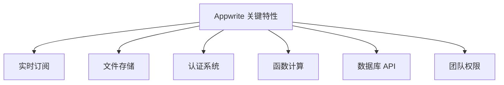
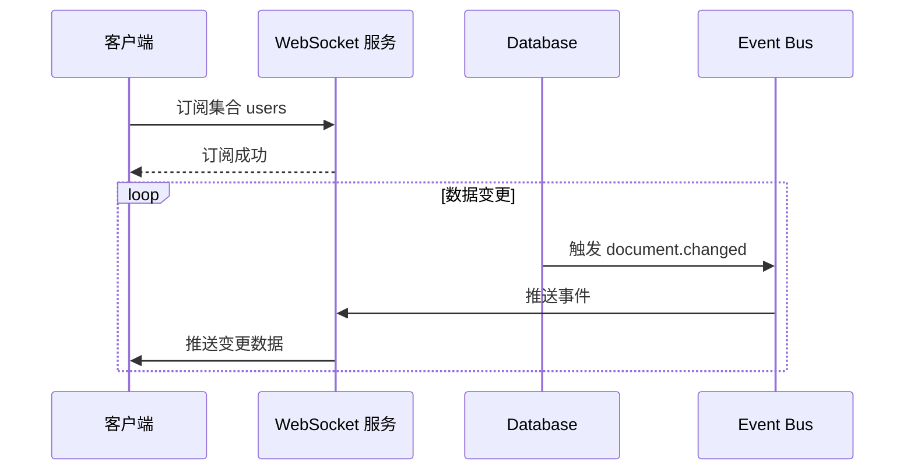
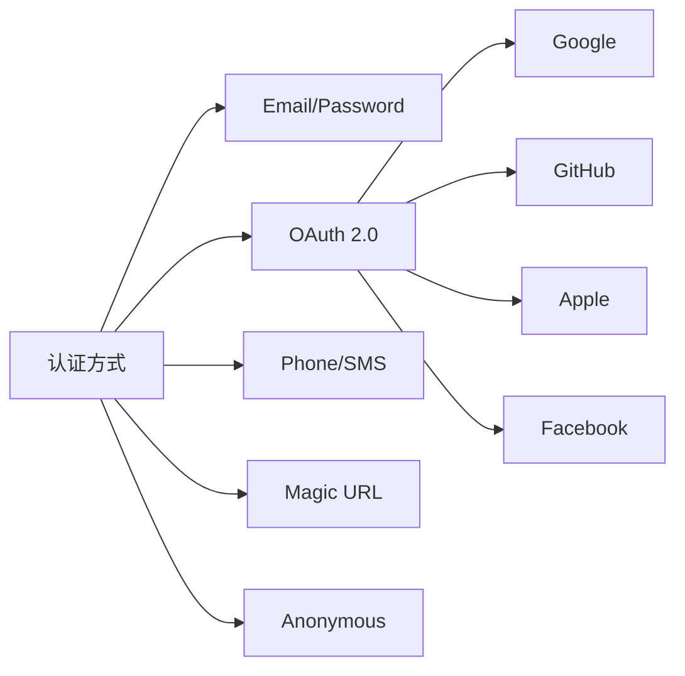
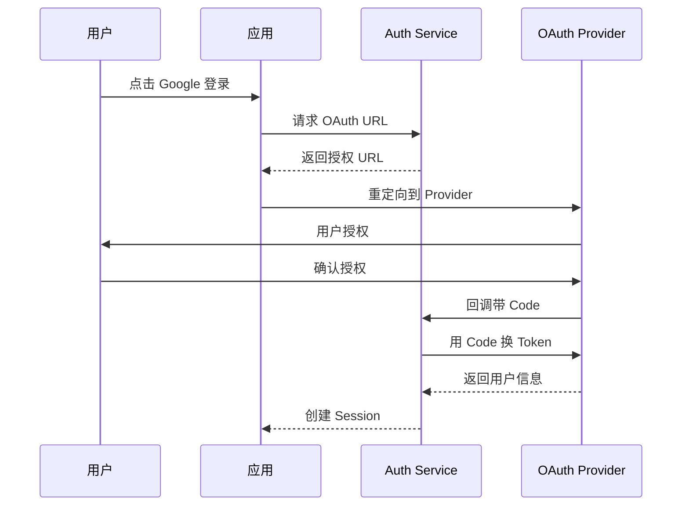
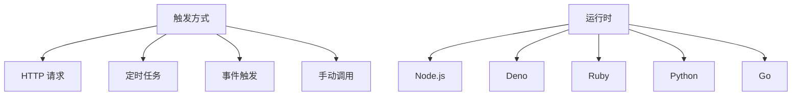

# Appwrite 关键特性

## 学习目标

- 掌握 Appwrite 的核心功能特性
- 理解各特性的使用场景和实现原理

## 特性总览



## 实时订阅（Realtime）



### 实时订阅示例

```javascript
// Web SDK 订阅文档变更
import { Client, Databases, Realtime } from 'appwrite';

const client = new Client()
    .setEndpoint('https://example.com/v1')
    .setProject('project-id');

const databases = new Databases(client);

// 订阅集合变更
client.subscribe('documents', response => {
    console.log('文档变更:', response);
});
```

## 文件存储（Storage）

| 特性 | 说明 |
|------|------|
| S3 兼容 | 支持 AWS S3、MinIO 等 |
| 图片处理 | 支持裁剪、缩放、格式转换 |
| 预览链接 | 生成临时访问 URL |
| 批量上传 | 支持多文件批量操作 |
| 权限控制 | 文件级别 ACL |

### 文件上传示例

```javascript
import { Storage } from 'appwrite';

const storage = new Storage(client);

// 上传文件
const file = await storage.createFile(
    'bucket-id',
    'unique-file-id',
    fileObject,
    ['read("any")']  // 权限设置
);

// 获取预览链接
const preview = storage.getFilePreview('bucket-id', 'file-id');
```

## 认证系统（Auth）



### OAuth 认证流程



## 函数计算（Functions）



### 函数示例

```javascript
// Node.js 函数示例
export default async function({ request, response }) {
    const body = await request.json();
    
    // 业务逻辑处理
    const result = processData(body);
    
    return response.json({
        success: true,
        data: result
    });
}
```

## 数据库 API

| 操作 | 方法 | 说明 |
|------|------|------|
| 创建文档 | POST /databases/{id}/collections/{id}/documents | 插入新文档 |
| 获取文档 | GET /databases/{id}/collections/{id}/documents/{id} | 查询单个 |
| 列表查询 | GET /databases/{id}/collections/{id}/documents | 条件查询 |
| 更新文档 | PATCH /databases/{id}/collections/{id}/documents/{id} | 部分更新 |
| 删除文档 | DELETE /databases/{id}/collections/{id}/documents/{id} | 删除 |

## 要点总结

- **实时订阅**：基于 WebSocket，支持文档和集合级别订阅
- **文件存储**：S3 兼容，支持图片处理和权限控制
- **认证系统**：多种认证方式，OAuth 2.0 完整支持
- **函数计算**：多运行时支持，事件驱动触发

## 思考题

1. Realtime 如何处理大量订阅连接？
2. Functions 的冷启动如何优化？