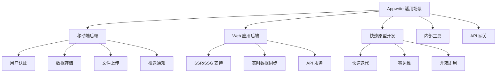
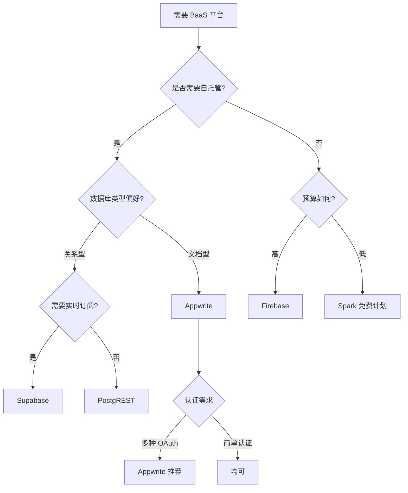

# Appwrite 使用场景与选型对比

## 学习目标

- 理解 Appwrite 的最佳适用场景
- 掌握与同类 BaaS 平台的选型对比

## 适用场景

## 典型应用场景

### 1. 移动应用后端

- 用户注册登录、OAuth 认证
- 用户数据云存储
- 图片/视频文件上传
- 实时消息推送

### 2. Web 应用后端

- SPA 单页应用后端
- SSR 服务端渲染支持
- RESTful API 服务
- 实时协作功能

### 3. 快速原型开发

- 创业项目 MVP
- Hackathon 项目
- 教学演示项目

## 选型对比

| 维度 | Appwrite | Firebase | Supabase |
|------|----------|----------|----------|
| 开源协议 | BSD 3-Clause | 闭源 | Apache 2.0 |
| 自托管 | 支持 | 不支持 | 支持 |
| 数据库 | PostgreSQL | Cloud Firestore | PostgreSQL |
| 认证方式 | Email/OAuth/Phone | Email/OAuth/Phone | Email/OAuth |
| 实时功能 | WebSocket | Realtime DB | Realtime |
| 文件存储 | S3 兼容 | Cloud Storage | S3 兼容 |
| 函数计算 | 多运行时 | Cloud Functions | Edge Functions |
| SDK 语言 | JS/Flutter/Rust/等 | JS/Flutter/iOS/等 | JS/Flutter/等 |
| 定价 | 免费自托管 | 按用量付费 | 免费自托管 |

## 决策流程

## 迁移路径

### 从 Firebase 迁移

1. 数据导出：Firebase Console 导出 JSON
2. 数据模型转换：Firestore 文档 → Appwrite 集合
3. API 重构：替换 Firebase SDK 为 Appwrite SDK
4. 认证迁移：重新注册用户或导入用户数据

### 从传统后端迁移

1. 定义数据模型：创建集合和字段
2. 设置权限：配置角色和 ACL
3. API 适配：使用 REST API 或 SDK
4. 函数迁移：将业务逻辑迁移到 Functions

## 要点总结

- **移动端和 Web 后端**是 Appwrite 的核心场景
- **开源自托管**是相对于 Firebase 的核心优势
- 与 Supabase 相比，Appwrite 更侧重 BaaS 体验

## 思考题

1. 什么情况下 Appwrite 不适合？
2. 自托管 Appwrite 的运维成本如何评估？