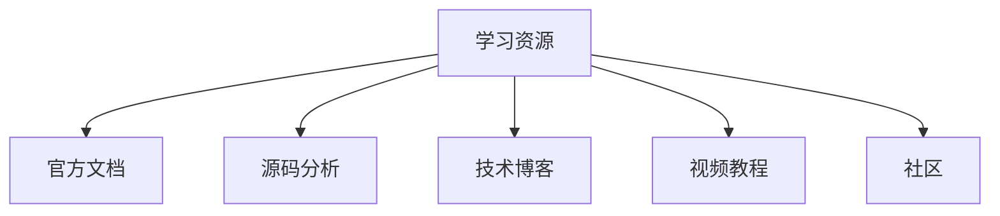
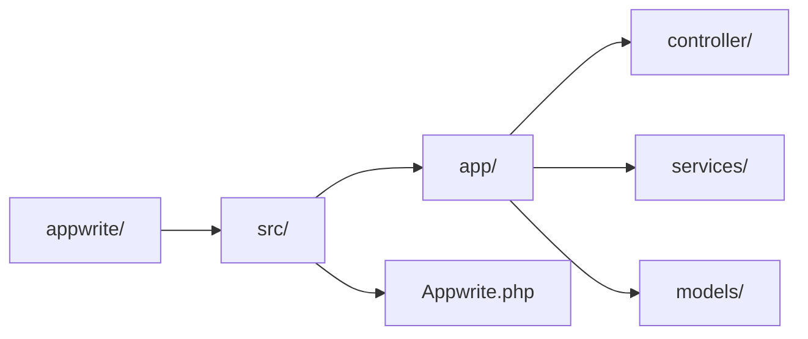

# Appwrite 学习资源

## 学习目标

- 获取 Appwrite 的最佳学习资源
- 建立系统化的学习路径

## 核心资源



## 官方文档

| 资源 | 链接 | 说明 |
|------|------|------|
| 官方文档 | https://appwrite.io/docs | 完整参考手册 |
| 快速入门 | https://appwrite.io/docs/quickstart | 入门指南 |
| API 参考 | https://appwrite.io/docs/references | API 文档 |
| SDK 文档 | https://appwrite.io/docs/sdks | 各语言 SDK |

## 源码分析



### 关键目录说明

| 目录/文件 | 说明 |
|-----------|------|
| `src/Appwrite.php` | 核心应用入口 |
| `src/app/controller/` | API 控制器 |
| `src/app/services/` | 业务服务层 |
| `src/app/models/` | 数据模型定义 |
| `src/app/tasks/` | 后台任务 |

### 核心文件解读

```
appwrite/
├── src/
│   ├── Appwrite.php           # 应用入口
│   └── app/
│       ├── controller/
│       │   ├── api/           # API 控制器
│       │   │   ├── Auth.php   # 认证 API
│       │   │   ├── Database.php # 数据库 API
│       │   │   └── Storage.php # 存储 API
│       │   └── ...
│       ├── services/
│       │   ├── Auth.php       # 认证服务实现
│       │   ├── Database.php   # 数据库服务实现
│       │   └── Storage.php    # 存储服务实现
│       └── models/
│           ├── User.php       # 用户模型
│           └── Document.php   # 文档模型
```

## 推荐学习路径

### 初级阶段

1. 阅读官方快速入门
2. 部署本地 Appwrite 实例
3. 使用 Web SDK 进行 CRUD 操作
4. 实现用户认证功能

### 中级阶段

1. 研究权限系统设计
2. 实现文件上传功能
3. 创建和部署 Functions
4. 使用 Realtime 实现实时功能

### 高级阶段

1. 阅读核心服务源码
2. 理解事件驱动架构
3. 自定义部署配置
4. 性能调优与监控

## 技术博客推荐

| 来源 | 说明 |
|------|------|
| Appwrite Blog | 官方技术博客 |
| Dev.to Appwrite | 社区教程合集 |
| Medium Appwrite | 用户实践经验 |

## 视频教程

| 平台 | 内容 |
|------|------|
| YouTube Appwrite | 官方频道 |
| Bilibili | 中文教程 |

## 要点总结

- 官方文档是首要参考资源
- 源码分析有助于深入理解架构
- 循序渐进的学习路径更高效

## 思考题

1. 哪些源码模块最值得深入研究？
2. 如何建立自己的学习笔记体系？