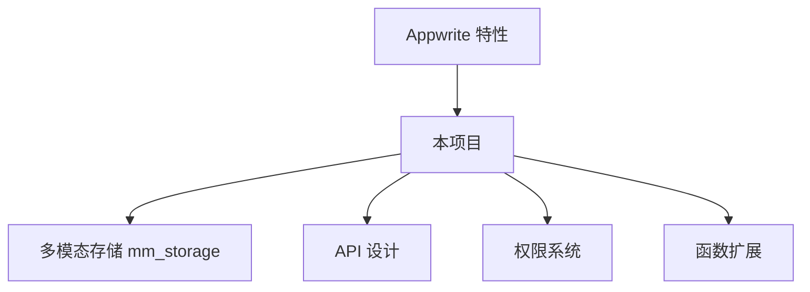
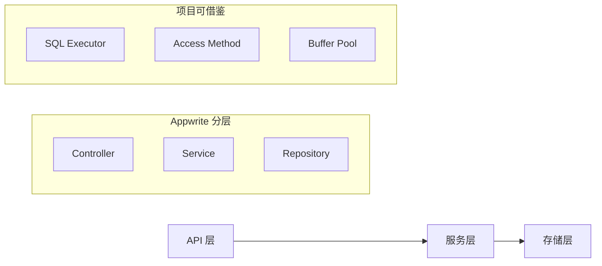
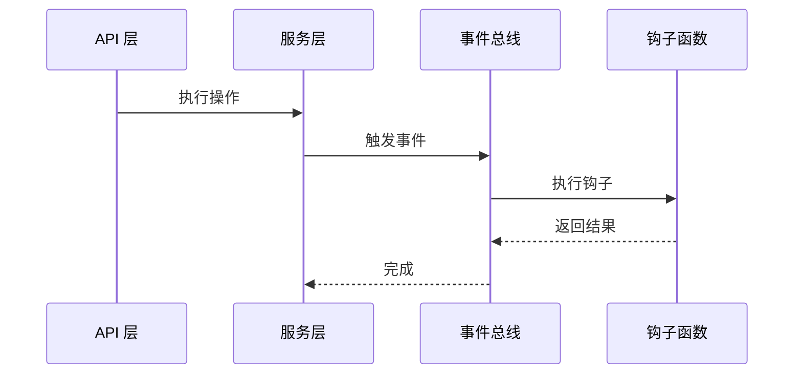
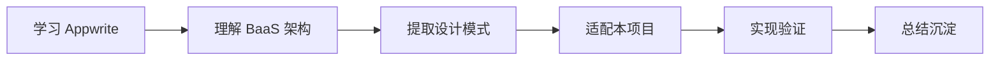

# Appwrite 与项目关联

## 学习目标

- 理解 Appwrite 与本项目的关系
- 掌握如何将所学应用到项目中

## 核心概念

- **对标分析**：对比本项目与 Appwrite 的架构差异
- **可借鉴点**：学习中可复用的设计思路
- **待改进点**：项目中可参考改进的方向

## 与本项目的关联

## 架构对比

| 维度 | Appwrite | 本项目 |
|------|----------|--------|
| 定位 | BaaS 平台 | 数据库引擎 |
| 数据库 | PostgreSQL | 自研存储引擎 |
| API 风格 | RESTful | C API |
| 认证 | 内置 OAuth | 无（依赖应用层） |
| 函数 | Serverless | 无 |

## 可借鉴的设计

### 1. 服务分层设计

### 2. 权限系统对比

| Appwrite 权限 | 本项目对应 | 改进方向 |
|---------------|------------|----------|
| Role | 角色 | 实现角色表 |
| Team | 组 | 实现组管理 |
| Document ACL | 行级安全 | 实现行级 ACL |
| Field ACL | 列级安全 | 实现列级 ACL |

### 3. 事件驱动架构

### 4. 多运行时函数支持

本项目的 SQL 扩展可参考 Appwrite 的 Functions 设计：

| Appwrite Functions | 本项目 SQL 扩展 |
|--------------------|-----------------|
| 多运行时支持 | 支持多种扩展语言 |
| 事件触发 | SQL 触发器 |
| HTTP 调用 | UDF 函数调用 |

## 学习与实践路径

## 具体改进建议

| 模块 | Appwrite 参考 | 改进方向 |
|------|---------------|----------|
| API 设计 | RESTful 规范 | 设计标准 C API |
| 权限系统 | Role/Team/ACL | 实现细粒度权限 |
| 事件系统 | Event Bus | 实现事件通知机制 |
| 函数扩展 | Functions | 设计 SQL UDF 框架 |

## 要点总结

- Appwrite 的服务分层设计值得借鉴
- 权限系统的 Role/Team 模型可参考实现
- 事件驱动架构可提升扩展性

## 思考题

1. 本项目的权限系统如何设计更合适？
2. 如何在 C 项目中实现事件驱动机制？