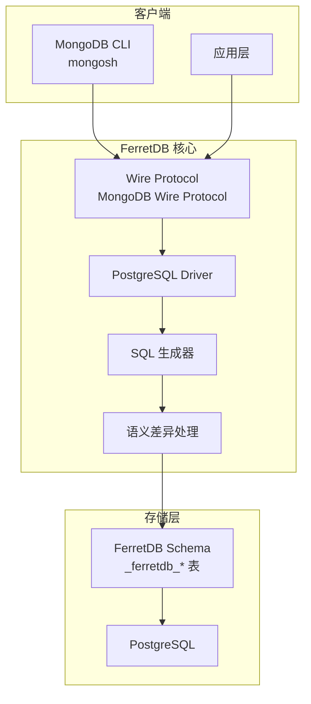

# FerretDB 项目概览

## 学习目标

- 了解 FerretDB 的定位和特点
- 掌握 FerretDB 的 MongoDB 协议转 SQL 架构

## 项目定位

> MongoDB 的开源替代方案，使用 PostgreSQL 作为后端存储，通过实现 MongoDB 协议提供 MongoDB 兼容接口

**基本信息**：

- 开发方：FerretDB Team
- 开源协议：Apache 2.0
- GitHub Stars：~6k

## 核心设计

## 要点总结

- **MongoDB 协议兼容**：实现 MongoDB Wire Protocol，现有 MongoDB 应用无需修改
- **PostgreSQL 后端**：使用 PostgreSQL 存储数据，利用其成熟的事务和索引能力
- **自动 Schema 转换**：MongoDB 的灵活文档自动映射为关系表
- **SQL 生成**：将 MongoDB 查询转换为 SQL 语句执行
- **语义差异处理**：处理 MongoDB 与 SQL 的语义差异（如数组、嵌套文档）
- **部署简单**：Docker 一键部署，零配置迁移
- **限制**：部分 MongoDB 特性（如 MapReduce）暂不支持

## 相关资源

- GitHub: https://github.com/FerretDB/FerretDB
- 文档: https://docs.ferretdb.io/
