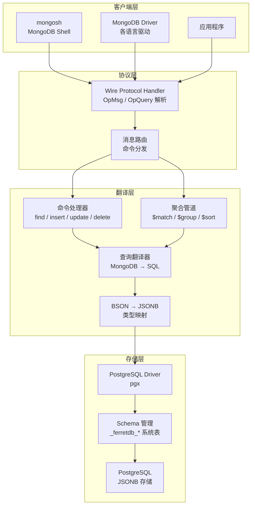
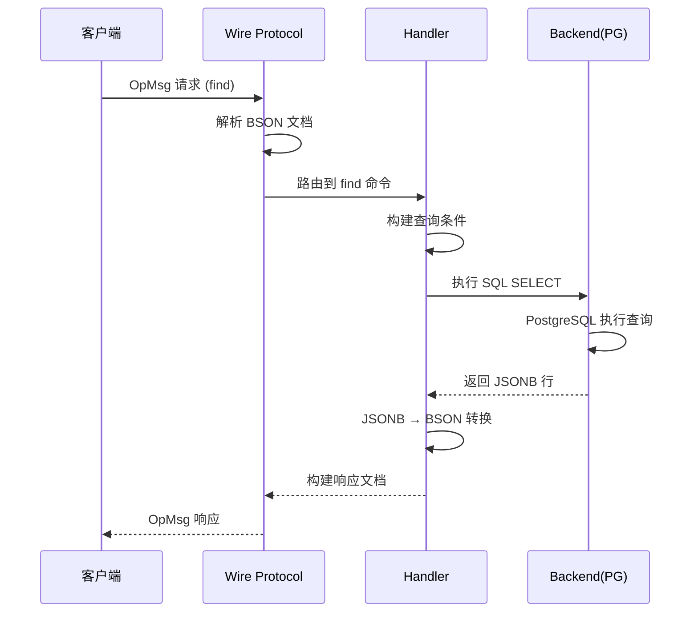
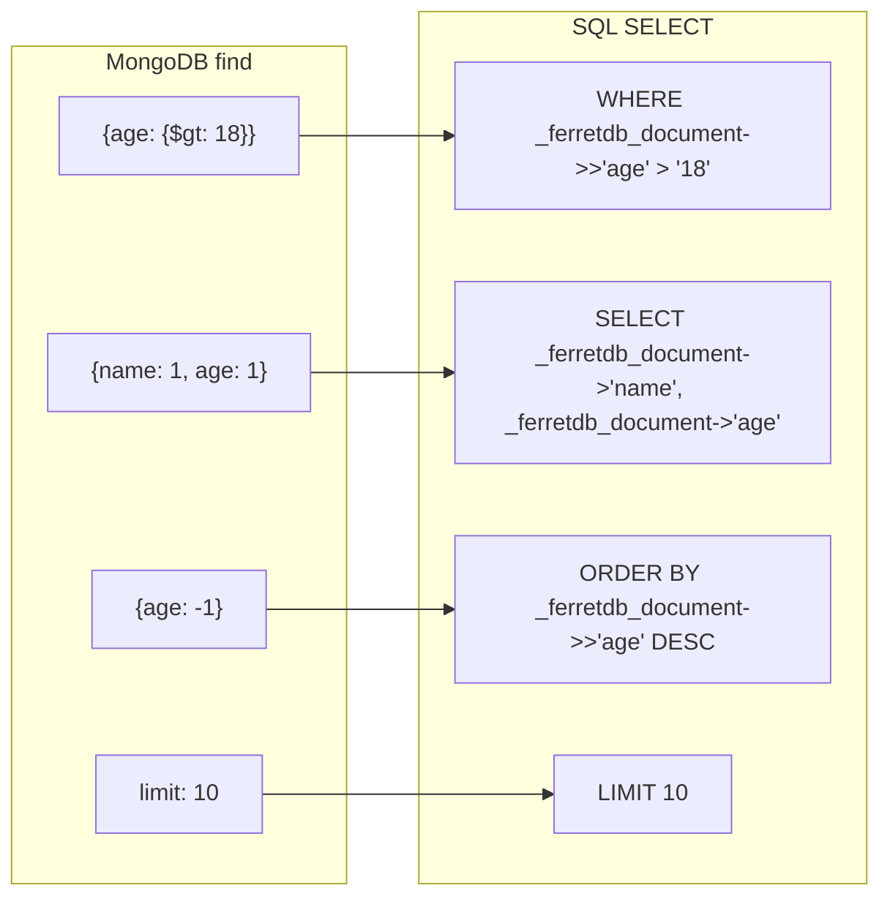
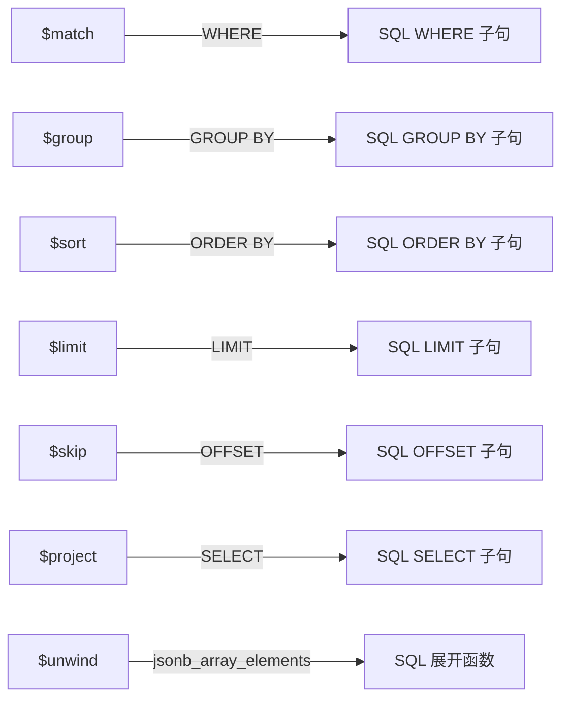
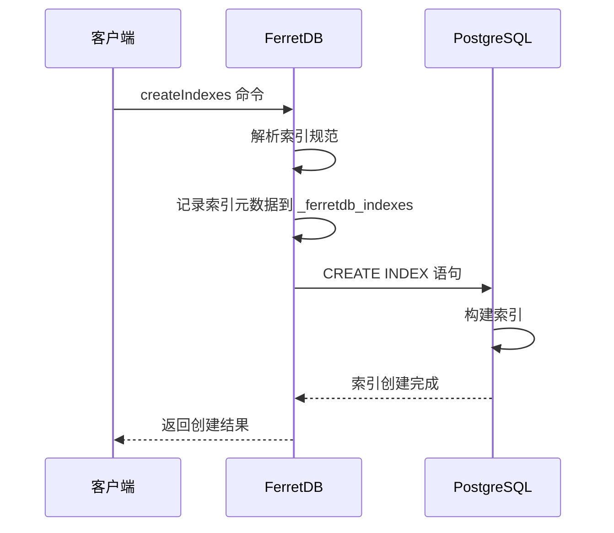

# FerretDB 架构设计

## 学习目标

- 理解 FerretDB 的分层架构设计
- 掌握 MongoDB Wire Protocol 到 PostgreSQL 的映射机制
- 了解 BSON → JSONB 的数据转换策略
- 理解查询翻译和索引映射的实现方式

## 架构总览



## MongoDB Wire Protocol 协议层

FerretDB 通过实现 MongoDB Wire Protocol 来接收客户端请求，核心处理流程如下：



### 消息类型

| 消息类型 | 用途 | FerretDB 支持 |
|----------|------|---------------|
| OpMsg | MongoDB 3.6+ 主要消息格式 | 完整支持 |
| OpQuery | 旧版查询协议（isMaster 等） | 部分支持 |
| OpInsert | 插入操作 | 通过 OpMsg 支持 |
| OpUpdate | 更新操作 | 通过 OpMsg 支持 |
| OpDelete | 删除操作 | 通过 OpMsg 支持 |
| OpReply | 旧版响应格式 | 部分支持 |

### 命令路由

FerretDB 将 MongoDB 命令分为以下几类：

- **CRUD 命令**：`find`、`insert`、`update`、`delete`、`countDocuments`
- **聚合命令**：`aggregate`（支持 `$match`、`$group`、`$sort`、`$limit` 等阶段）
- **索引命令**：`createIndexes`、`dropIndexes`、`listIndexes`
- **管理命令**：`listCollections`、`create`、`drop`、`isMaster`

## PostgreSQL 存储映射

### BSON → JSONB 类型映射

FerretDB 将 MongoDB 的 BSON 类型映射为 PostgreSQL 的 JSONB 类型：

| BSON 类型 | JSONB 映射 | 说明 |
|-----------|------------|------|
| Object | JSONB Object | 嵌套文档直接映射 |
| Array | JSONB Array | 数组直接映射 |
| String | JSONB String | 字符串直接映射 |
| Int32 | JSONB Number | 32 位整数 |
| Int64 | JSONB Number | 64 位整数 |
| Double | JSONB Number | 浮点数 |
| Boolean | JSONB Boolean | 布尔值 |
| Null | JSONB Null | 空值 |
| ObjectId | JSONB String | 转为 24 位十六进制字符串 |
| Date | JSONB String | ISO 8601 格式 |
| Regex | JSONB Object | 存为 `{"$regex": "...", "$options": "..."}` |
| Binary | JSONB Object | 存为 `{"$binary": {"base64": "...", "subType": "..."}}` |
| Timestamp | JSONB Object | 特殊处理 |
| DBRef | JSONB Object | 保留结构 |

### Schema 设计

FerretDB 在 PostgreSQL 中使用以下 Schema 结构：

```sql
-- 每个 MongoDB 数据库对应一个 PG Schema
-- 集合名作为表名
CREATE TABLE "_ferretdb_database"."collection_name" (
    _id  JSONB,           -- MongoDB _id 字段
    _ferretdb_document JSONB  -- 完整文档存储
);

-- 索引信息存储在系统表中
CREATE TABLE "_ferretdb_database"."_ferretdb_indexes" (
    name  TEXT,
    key   JSONB,
    ...   -- 索引元数据
);
```

## 查询翻译

### find 命令 → SQL



### 查询操作符映射

| MongoDB 操作符 | SQL 翻译 | 示例 |
|----------------|----------|------|
| `$eq` | `=` | `{name: "foo"}` → `WHERE doc->>'name' = 'foo'` |
| `$gt` | `>` | `{age: {$gt: 18}}` → `WHERE (doc->>'age')::int > 18` |
| `$gte` | `>=` | 类似 $gt |
| `$lt` | `<` | 类似 $gt |
| `$lte` | `<=` | 类似 $gt |
| `$ne` | `<>` | `{name: {$ne: "foo"}}` → `WHERE doc->>'name' <> 'foo'` |
| `$in` | `IN` | `{status: {$in: ["A","B"]}}` → `WHERE doc->>'status' IN ('A','B')` |
| `$nin` | `NOT IN` | 类似 $in |
| `$and` | `AND` | 组合条件 |
| `$or` | `OR` | 组合条件 |
| `$exists` | `?` | `{phone: {$exists: true}}` → `WHERE doc ? 'phone'` |
| `$regex` | `~` | `{name: {$regex: "^foo"}}` → `WHERE doc->>'name' ~ '^foo'` |

### 聚合管道翻译



## 索引映射

### MongoDB 索引 → PostgreSQL 索引

| MongoDB 索引类型 | PostgreSQL 映射 | 说明 |
|------------------|-----------------|------|
| 单字段索引 | B-tree on JSONB path | `CREATE INDEX ON t ((_ferretdb_document->>'field'))` |
| 复合索引 | 多列 B-tree | 多个 JSONB path 组合 |
| 文本索引 | GIN 索引 | `CREATE INDEX USING gin (_ferretdb_document)` |
| 地理空间索引 | 暂不支持 | 待实现 |
| 唯一索引 | UNIQUE B-tree | 添加 UNIQUE 约束 |
| TTL 索引 | 暂不支持 | 待实现 |

### 索引创建流程



## 要点总结

- **协议层**：实现 MongoDB Wire Protocol，支持 OpMsg 和部分 OpQuery 消息类型
- **存储映射**：BSON 类型通过 JSONB 存储，每个 MongoDB 集合对应一张 PG 表
- **查询翻译**：find/aggregate 命令逐操作符翻译为 SQL，利用 PG 的 JSONB 查询能力
- **索引映射**：MongoDB 索引映射为 PG 的 B-tree/GIN 索引，部分类型暂不支持
- **架构优势**：分层设计使协议处理与存储解耦，便于扩展新后端

## 思考题

1. FerretDB 为什么选择 JSONB 而不是将 BSON 文档拆分为关系表的列？这种选择有什么优缺点？
2. 在查询翻译中，`$unwind` 操作如何利用 PostgreSQL 的 `jsonb_array_elements` 函数实现？性能瓶颈在哪里？
3. 如果要为 FerretDB 添加对地理空间索引的支持，需要利用 PostgreSQL 的哪些扩展？
