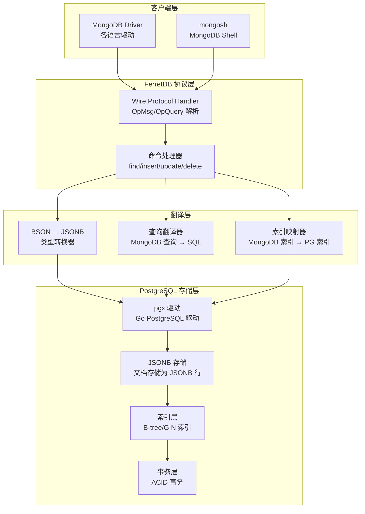
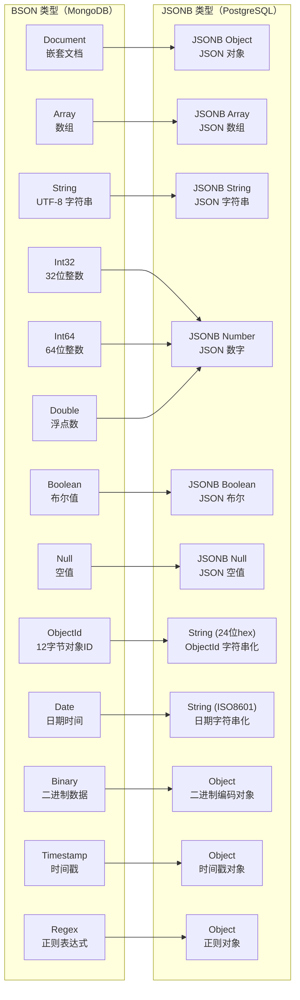
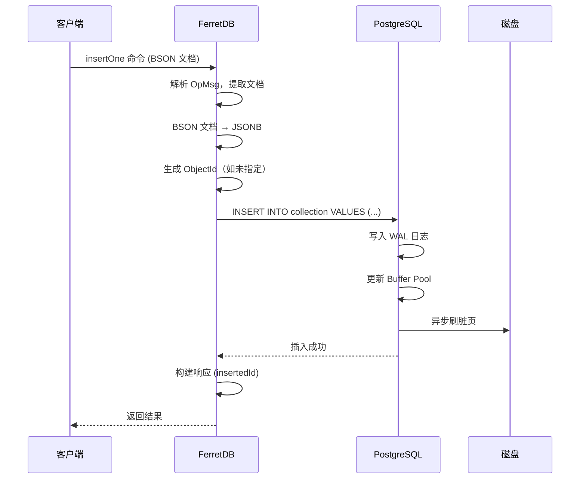
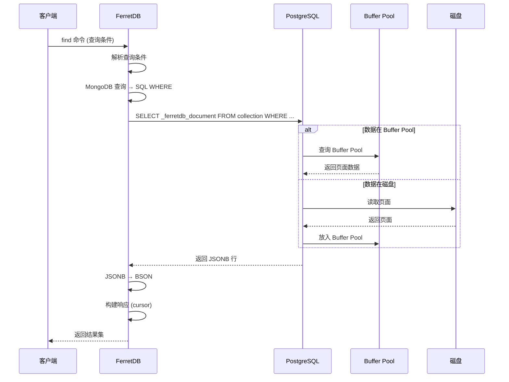
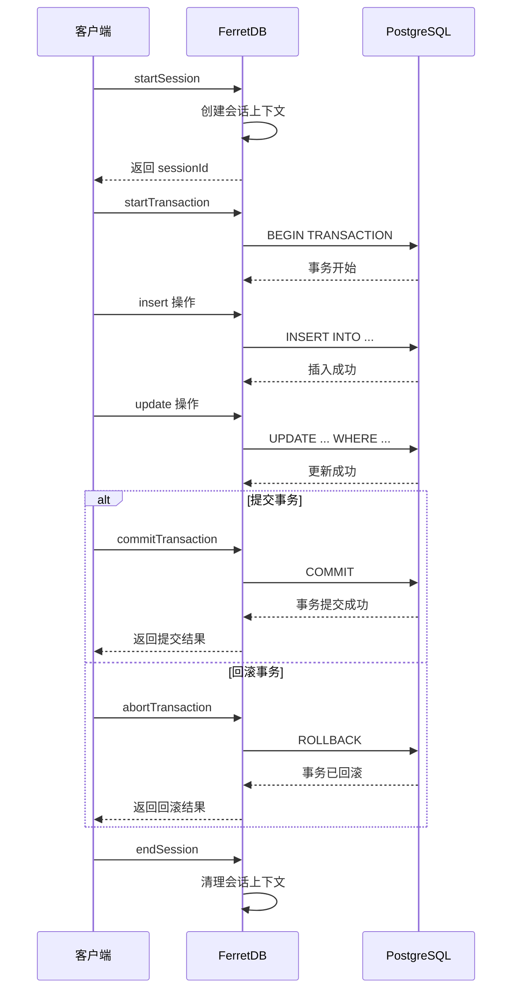
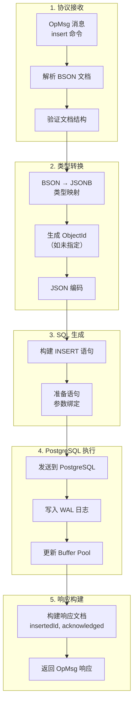
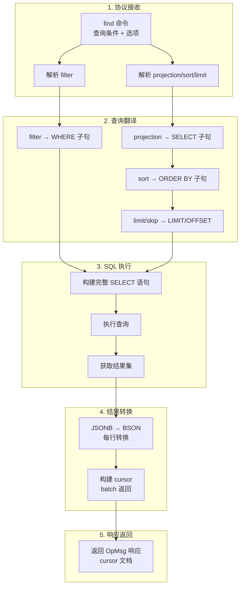
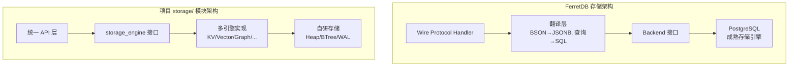

# FerretDB 存储引擎

## 学习目标

- 理解 FerretDB 的存储架构和数据持久化机制
- 掌握 BSON → JSONB 类型映射的设计思想
- 了解文档存储与关系存储的融合策略
- 对比 FerretDB 与项目 storage/ 模块的异同

## 核心存储架构

FerretDB 采用**协议翻译 + 后端委托**的存储架构，核心思想是"不做存储，只做翻译"，将 MongoDB 的文档操作翻译为 PostgreSQL 的 SQL 操作。



### 存储架构特点

| 特点 | 说明 | 优势 |
|------|------|------|
| 无自有存储 | 不实现存储引擎，完全委托 PostgreSQL | 复用成熟存储，降低开发复杂度 |
| JSONB 存储 | 文档存储为 PostgreSQL 的 JSONB 类型 | 保留文档灵活性，支持嵌套和数组 |
| 协议翻译 | MongoDB Wire Protocol → PostgreSQL SQL | 应用层无需修改，透明代理 |
| 事务委托 | 利用 PostgreSQL 的 ACID 事务 | 数据一致性有保障 |

## 数据结构：BSON → JSONB 映射

### 类型映射表

FerretDB 将 MongoDB 的 BSON 类型映射为 PostgreSQL 的 JSONB 类型：



### 详细映射规则

| BSON 类型 | JSONB 映射 | 存储示例 | 说明 |
|-----------|------------|----------|------|
| Document | JSONB Object | `{"name": "foo"}` | 直接映射，保留结构 |
| Array | JSONB Array | `[1, 2, 3]` | 直接映射，支持嵌套 |
| String | JSONB String | `"hello"` | UTF-8 编码 |
| Int32/Int64 | JSONB Number | `42` | 统一为数字类型 |
| Double | JSONB Number | `3.14` | 浮点数 |
| Boolean | JSONB Boolean | `true` / `false` | 直接映射 |
| Null | JSONB Null | `null` | 直接映射 |
| ObjectId | JSONB String | `"507f1f77bcf86cd799439011"` | 转为 24 位十六进制字符串 |
| Date | JSONB String | `"2024-01-15T10:30:00Z"` | ISO 8601 格式 |
| Binary | JSONB Object | `{"$binary": {"base64": "...", "subType": "..."}}` | 扩展格式 |
| Timestamp | JSONB Object | `{"$timestamp": {"t": 123, "i": 1}}` | 扩展格式 |
| Regex | JSONB Object | `{"$regex": "^foo", "$options": "i"}` | 扩展格式 |

### Schema 设计

FerretDB 在 PostgreSQL 中的 Schema 设计：

```sql
-- 每个 MongoDB 数据库对应一个 PostgreSQL Schema
CREATE SCHEMA IF NOT EXISTS "_ferretdb_database_name";

-- 每个集合对应一张表
CREATE TABLE "_ferretdb_database_name"."collection_name" (
    _id               JSONB NOT NULL,           -- MongoDB _id 字段
    _ferretdb_document JSONB NOT NULL,          -- 完整文档
    PRIMARY KEY ((_id->>'$oid'))                -- 主键
);

-- 索引元数据表
CREATE TABLE "_ferretdb_database_name"."_ferretdb_indexes" (
    id      SERIAL PRIMARY KEY,
    name    TEXT NOT NULL,
    key     JSONB NOT NULL,                    -- 索引字段定义
    unique  BOOLEAN DEFAULT FALSE,
    sparse  BOOLEAN DEFAULT FALSE,
    expire_after_seconds INTEGER               -- TTL 索引支持
);
```

### 文档存储示例

```mermaid
graph TB
    subgraph "MongoDB 文档"
        DOC["{<br/>  '_id': ObjectId('507f...'),<br/>  'name': 'Alice',<br/>  'age': 30,<br/>  'tags': ['dev', 'dba'],<br/>  'profile': {'city': 'Beijing'}<br/>}"]
    end

    subgraph "PostgreSQL 行存储"
        ROW["_id: {\"$oid\": \"507f...\"}<br/>_ferretdb_document: {\"_id\": {...}, \"name\": \"Alice\", ...}"]
    end

    DOC -->|"BSON → JSONB"| ROW
```

## 数据持久化机制

### 写入路径



### 读取路径



### 事务处理

FerretDB 利用 PostgreSQL 的事务能力实现 MongoDB 风格的事务：



## 读写路径详解

### 写入路径流程图



### 查询路径流程图



## 与项目 storage/ 模块的对比

### 架构对比



### 核心差异对比

| 维度 | FerretDB | 项目 storage/ 模块 | 分析 |
|------|----------|-------------------|------|
| 存储引擎 | 委托 PostgreSQL | 自研多引擎 | FerretDB 复用成熟存储，项目自主可控 |
| 数据模型 | 文档模型（通过 JSONB） | 多模型（KV/向量/图/时序等） | 项目更丰富，FerretDB 专注文档 |
| 持久化 | PostgreSQL WAL + Buffer Pool | 自研 WAL + Buffer Pool | 架构相似，实现不同 |
| 索引 | 映射到 PG 索引（B-tree/GIN） | 自研 BTree/HNSW/R-Tree 等 | 项目索引类型更多样 |
| 事务 | 委托 PG 事务 | 自研事务管理 | FerretDB 复用成熟事务 |
| 多后端 | 可插拔 Backend 接口 | 可插拔 storage_engine 接口 | 设计理念相似 |

### 接口设计对比

```c
// FerretDB Backend 接口（Go 语言）
type Backend interface {
    // 数据库操作
    CreateCollection(ctx context.Context, db, collection string) error
    DropCollection(ctx context.Context, db, collection string) error
    ListCollections(ctx context.Context, db string) ([]string, error)
    
    // CRUD 操作
    Insert(ctx context.Context, db, collection string, docs []bson.D) error
    Find(ctx context.Context, db, collection string, filter bson.D) (cursor, error)
    Update(ctx context.Context, db, collection string, filter, update bson.D) (int, error)
    Delete(ctx context.Context, db, collection string, filter bson.D) (int, error)
    
    // 索引操作
    CreateIndex(ctx context.Context, db, collection string, spec IndexSpec) error
    DropIndex(ctx context.Context, db, collection, indexName string) error
}

// 项目 storage_engine 接口（C 语言）
typedef struct storage_ops_s {
    const char *name;
    DataModel model;
    
    // 生命周期
    int (*init)(const char *data_dir);
    int (*shutdown)(void);
    
    // 表操作
    int (*table_create)(const char *name, const storage_schema_t *schema);
    void *(*table_open)(const char *name, AccessMode mode);
    int (*table_close)(void *rel);
    int (*table_drop)(const char *name);
    
    // 元组操作
    int (*tuple_insert)(void *rel, const void *data, size_t len);
    int (*tuple_update)(void *rel, const void *old_data, size_t old_len,
                        const void *new_data, size_t new_len);
    int (*tuple_delete)(void *rel, const void *key, size_t key_len);
    
    // 扫描操作
    scan_desc_t *(*scan_begin)(void *rel, const scan_key_t *keys, int nkeys,
                               ScanDirection direction);
    int (*scan_next)(scan_desc_t *scan, void *out_data, size_t *out_len);
    int (*scan_end)(scan_desc_t *scan);
    
    // 索引操作
    int (*index_create)(const char *table, const index_desc_t *index);
    int (*index_drop)(const char *index_name);
} storage_ops_t;
```

### 可借鉴的设计点

| 借鉴点 | FerretDB 实现 | 项目可应用方向 |
|--------|---------------|----------------|
| 协议翻译层 | MongoDB Wire Protocol → SQL | 统一 API → 引擎特化查询 |
| 类型映射器 | BSON → JSONB | 定义项目统一的中间数据格式 |
| 后端抽象 | Backend interface | 增强 storage_engine_t 接口 |
| 配置驱动 | 运行时切换后端 | 编译时/运行时选择引擎 |
| 委托存储 | 复用成熟存储引擎 | 考虑支持 PostgreSQL 后端 |

## 要点总结

- **委托存储架构**：FerretDB 不实现存储引擎，完全委托 PostgreSQL，降低复杂度
- **BSON → JSONB 映射**：通过类型转换保留文档模型灵活性
- **协议翻译层**：Wire Protocol → SQL 的翻译实现 MongoDB 兼容
- **事务委托**：利用 PostgreSQL 的 ACID 能力保证数据一致性
- **与项目对比**：项目自研多引擎存储，FerretDB 委托单引擎，设计理念可互相借鉴

## 思考题

1. FerretDB 选择 JSONB 存储而非拆分为关系表的列，这种设计在什么场景下性能最优？什么场景下会有性能问题？

2. 如果要为项目的多模态存储引擎增加一个"PostgreSQL 后端"选项，需要实现哪些接口？如何处理项目特有的数据模型（如向量、图）？

3. FerretDB 的 Backend 接口设计与项目的 storage_ops_t 接口设计，哪个更灵活？哪个性能更好？为什么？
