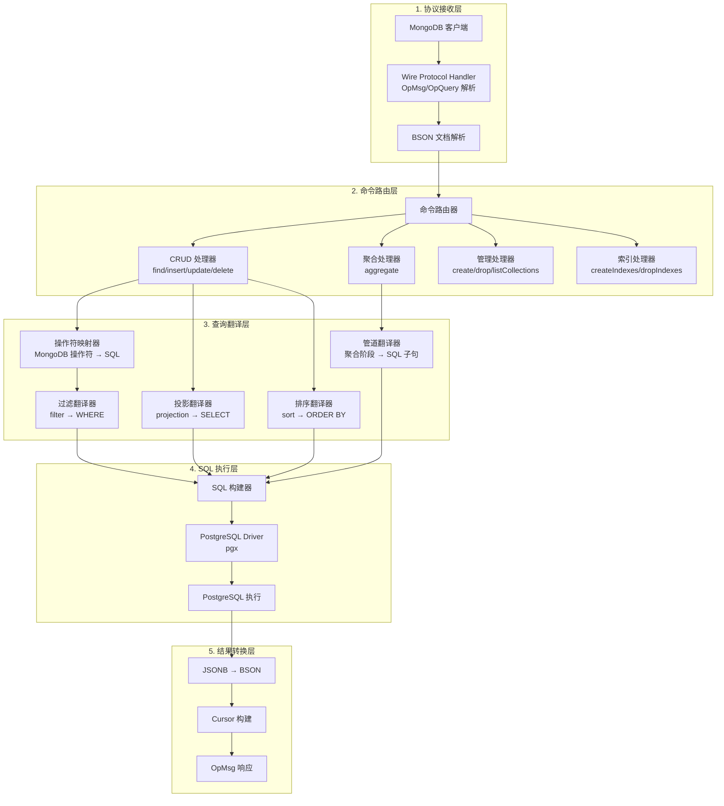
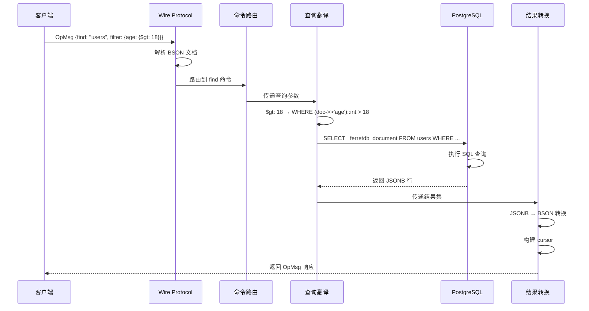
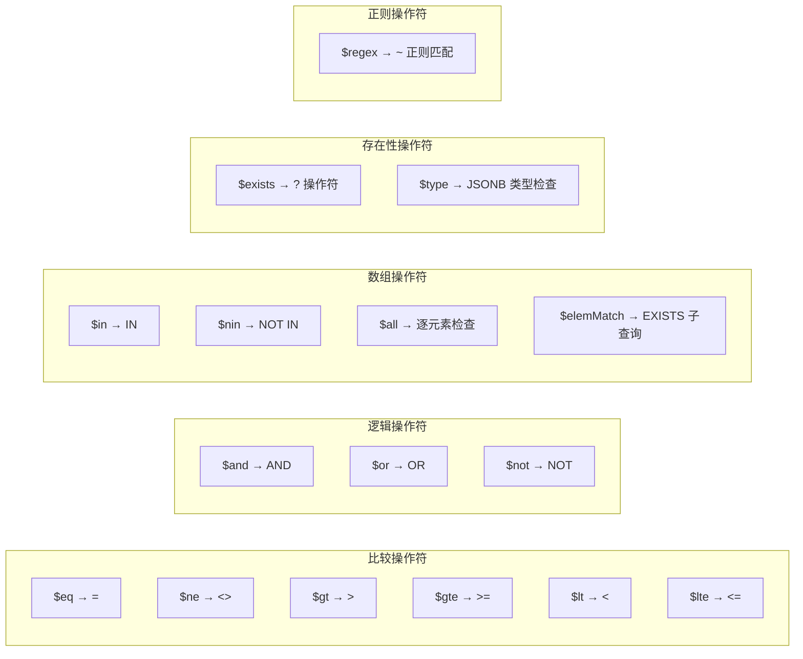
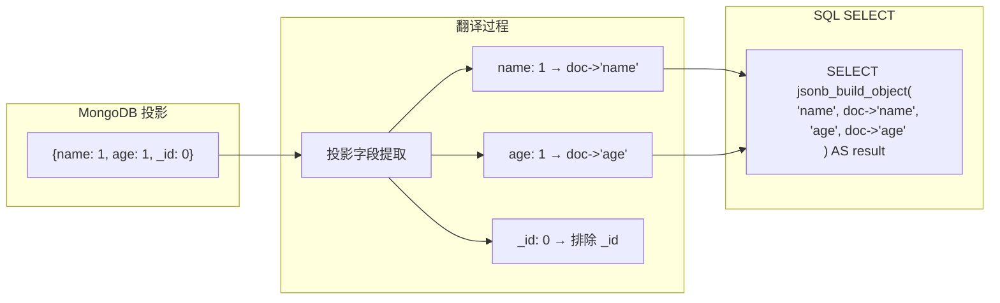
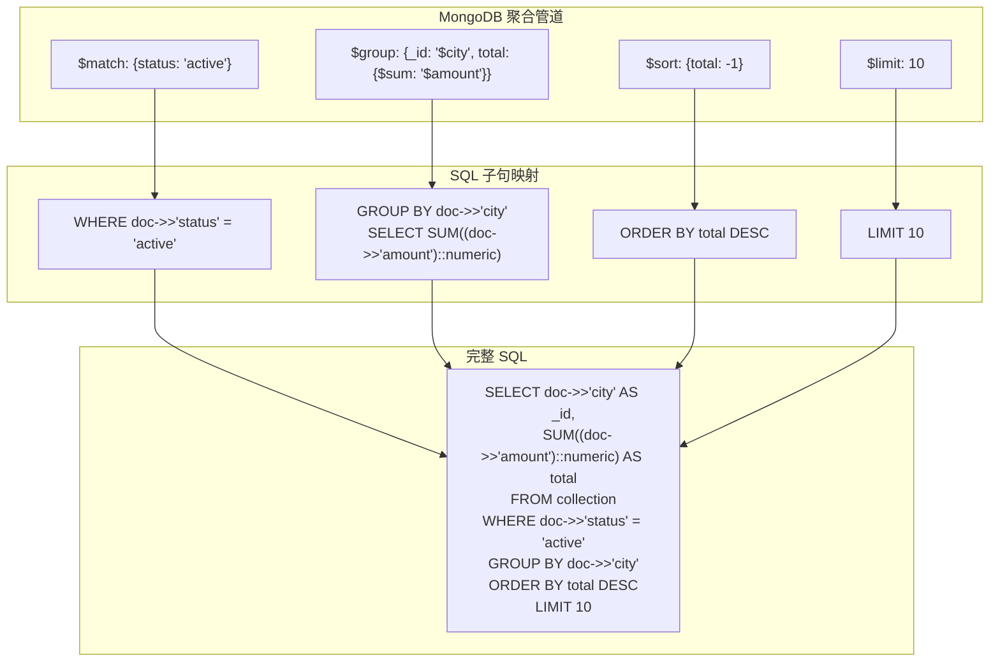
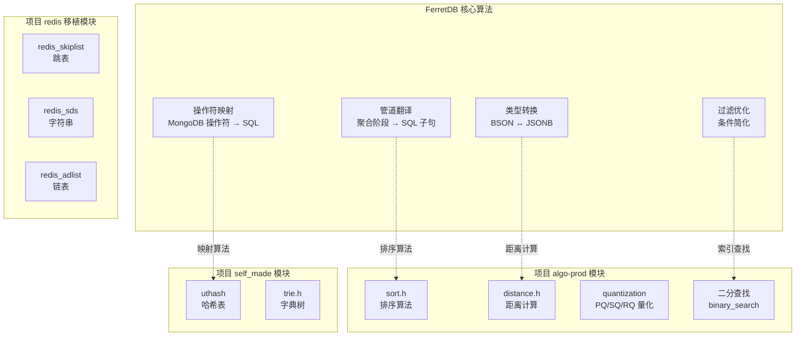
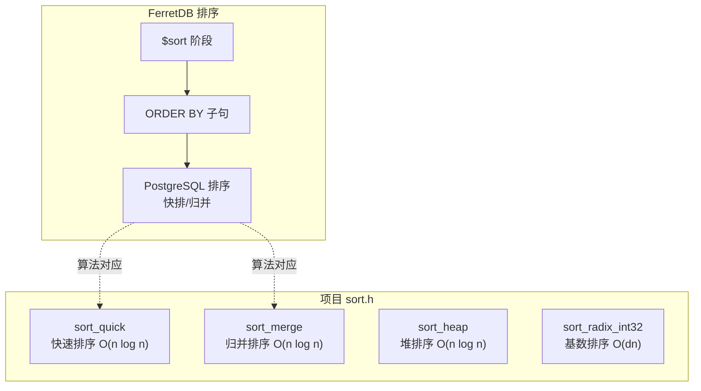
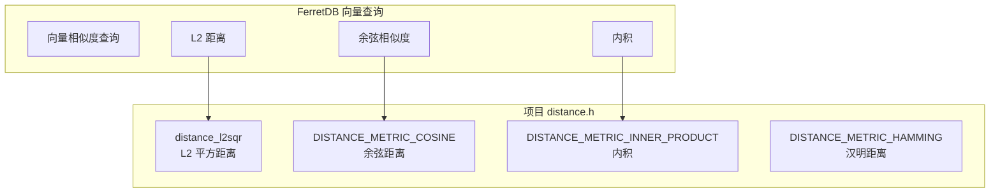
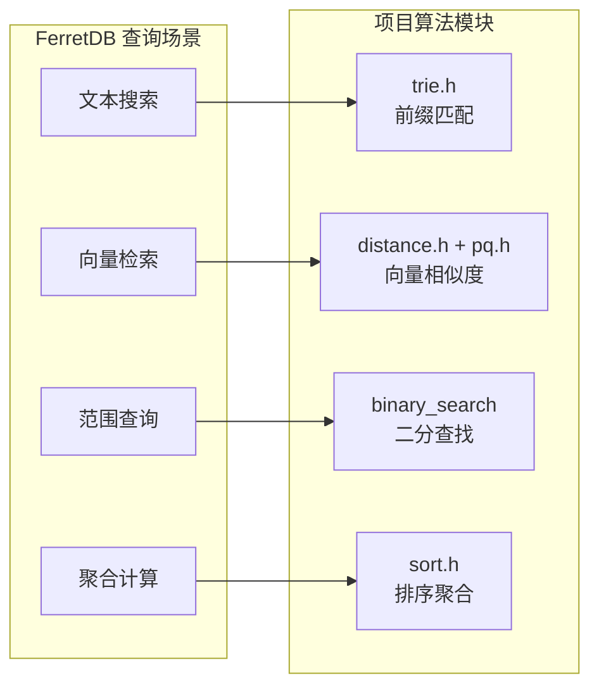

# FerretDB 查询或操作引擎

## 学习目标

- 理解 FerretDB 的查询/操作执行流程
- 掌握 MongoDB 查询到 SQL 的翻译机制
- 了解聚合管道的实现方式
- 对比 FerretDB 与项目 algo/ 模块的关联

## 查询执行流程

FerretDB 的核心职责是将 MongoDB 风格的查询和操作翻译为 PostgreSQL 的 SQL 语句执行。整个执行流程分为协议解析、命令路由、查询翻译、SQL 执行和结果转换五个阶段。



### 执行流程示例

以 `find` 命令为例，展示完整的执行流程：



## 核心算法和数据结构

### 查询操作符映射

FerretDB 将 MongoDB 查询操作符映射为 SQL 条件表达式：



### 操作符映射表

| MongoDB 操作符 | SQL 翻译 | 示例 |
|----------------|----------|------|
| `$eq` | `=` | `{name: {$eq: "foo"}}` → `WHERE doc->>'name' = 'foo'` |
| `$ne` | `<>` | `{name: {$ne: "foo"}}` → `WHERE doc->>'name' <> 'foo'` |
| `$gt` | `>` | `{age: {$gt: 18}}` → `WHERE (doc->>'age')::int > 18` |
| `$gte` | `>=` | `{age: {$gte: 18}}` → `WHERE (doc->>'age')::int >= 18` |
| `$lt` | `<` | `{age: {$lt: 65}}` → `WHERE (doc->>'age')::int < 65` |
| `$lte` | `<=` | `{age: {$lte: 65}}` → `WHERE (doc->>'age')::int <= 65` |
| `$in` | `IN` | `{status: {$in: ["A","B"]}}` → `WHERE doc->>'status' IN ('A','B')` |
| `$nin` | `NOT IN` | `{status: {$nin: ["X"]}}` → `WHERE doc->>'status' NOT IN ('X')` |
| `$and` | `AND` | `{$and: [{a:1},{b:2}]}` → `WHERE ... AND ...` |
| `$or` | `OR` | `{$or: [{a:1},{b:2}]}` → `WHERE ... OR ...` |
| `$not` | `NOT` | `{age: {$not: {$gt: 18}}}` → `WHERE NOT ((doc->>'age')::int > 18)` |
| `$exists` | `?` | `{phone: {$exists: true}}` → `WHERE doc ? 'phone'` |
| `$regex` | `~` | `{name: {$regex: "^foo"}}` → `WHERE doc->>'name' ~ '^foo'` |
| `$type` | `jsonb_typeof` | `{x: {$type: "string"}}` → `WHERE jsonb_typeof(doc->'x') = 'string'` |

### 查询翻译算法

```mermaid
graph TB
    subgraph "输入：MongoDB 查询"
        QUERY["{<br/>  find: 'users',<br/>  filter: {age: {$gt: 18}, status: 'active'},<br/>  sort: {name: 1},<br/>  limit: 10<br/>}"]
    end

    subgraph "翻译过程"
        PARSE["解析查询参数"]
        
        subgraph "filter 翻译"
            F1["age: {$gt: 18}<br/>→ (doc->>'age')::int > 18"]
            F2["status: 'active'<br/>→ doc->>'status' = 'active'"]
            F_AND["AND 连接"]
        end
        
        subgraph "sort 翻译"
            S1["name: 1<br/>→ ORDER BY doc->>'name' ASC"]
        end
        
        subgraph "limit 翻译"
            L1["limit: 10<br/>→ LIMIT 10"]
        end
    end

    subgraph "输出：SQL 查询"
        SQL["SELECT _ferretdb_document<br/>FROM \"db\".\"users\"<br/>WHERE (doc->>'age')::int > 18<br/>  AND doc->>'status' = 'active'<br/>ORDER BY doc->>'name' ASC<br/>LIMIT 10"]
    end

    QUERY --> PARSE
    PARSE --> F1 --> F_AND
    PARSE --> F2 --> F_AND
    PARSE --> S1
    PARSE --> L1
    F_AND --> SQL
    S1 --> SQL
    L1 --> SQL
```

### 投影翻译



### 聚合管道翻译

FerretDB 支持将 MongoDB 聚合管道翻译为 SQL：



### 聚合阶段映射表

| MongoDB 阶段 | SQL 映射 | 说明 |
|--------------|----------|------|
| `$match` | `WHERE` | 过滤条件 |
| `$group` | `GROUP BY` + 聚合函数 | 分组聚合 |
| `$sort` | `ORDER BY` | 排序 |
| `$limit` | `LIMIT` | 限制结果数 |
| `$skip` | `OFFSET` | 跳过结果数 |
| `$project` | `SELECT` | 投影选择 |
| `$unwind` | `jsonb_array_elements` | 数组展开 |
| `$lookup` | `LEFT JOIN` | 关联查询 |
| `$addFields` | `SELECT` + 计算字段 | 添加字段 |
| `$count` | `COUNT` | 计数 |

### 数据结构设计

FerretDB 内部使用以下核心数据结构处理查询：

```go
// 查询条件（Go 语言）
type Filter struct {
    Field    string      // 字段名
    Operator string      // 操作符
    Value    interface{} // 值
}

// 查询规格
type QuerySpec struct {
    Database   string    // 数据库名
    Collection string    // 集合名
    Filter     bson.D    // 过滤条件
    Projection bson.D    // 投影
    Sort       bson.D    // 排序
    Limit      int64     // 限制
    Skip       int64     // 跳过
}

// SQL 构建器
type SQLBuilder struct {
    SelectClause  string
    FromClause    string
    WhereClause   string
    OrderByClause string
    LimitClause   string
    OffsetClause  string
}
```

## 与项目 algo/ 模块的关联

### 模块对应关系



### 算法关联分析

| FerretDB 算法 | 项目模块 | 关联说明 |
|---------------|----------|----------|
| 操作符映射 | uthash（哈希表） | 操作符映射表可用哈希表实现 O(1) 查找 |
| 聚合管道排序 | sort.h（排序算法） | `$sort` 阶段使用排序算法，支持多种排序方式 |
| 向量相似度查询 | distance.h（距离计算） | 向量检索需要 L2/余弦/内积距离计算 |
| 向量压缩存储 | quantization（PQ/SQ/RQ） | 向量索引使用量化压缩减少内存占用 |
| 文本索引 | trie.h（字典树） | 全文索引可用字典树实现前缀匹配 |
| 有序索引 | redis_skiplist（跳表） | 有序集合索引可用跳表实现 O(log n) 查找 |

### 具体算法对比

#### 排序算法对比



#### 距离计算对比



### 可复用的算法模块

```c
// 项目 sort.h 可用于查询结果排序
typedef int (*sort_compare_fn)(const void *lhs, const void *rhs);

// 支持多种排序算法，根据数据特征选择
int sort_dispatch(sort_algorithm_t algorithm,
                  void *base,
                  size_t count,
                  size_t element_size,
                  sort_compare_fn compare);

// 项目 distance.h 可用于向量相似度查询
typedef enum distance_metric {
    DISTANCE_METRIC_L2_SQUARED = 0,   // L2 平方距离
    DISTANCE_METRIC_COSINE = 1,        // 余弦距离
    DISTANCE_METRIC_INNER_PRODUCT = 2, // 内积
    DISTANCE_METRIC_HAMMING = 3,       // 汉明距离
} distance_metric_t;

float distance_compute(distance_metric_t metric,
                       const float *lhs,
                       const float *rhs,
                       int32_t dims);

// 项目 quantization 可用于向量压缩
int pq_encode(const quantizer_t *q, const float *vector, uint8_t *code);
float pq_adc_distance(const quantizer_t *q, const uint8_t *code, const float *table);
```

### 应用场景映射



## 要点总结

- **执行流程**：FerretDB 查询分为协议解析 → 命令路由 → 查询翻译 → SQL 执行 → 结果转换五个阶段
- **操作符映射**：MongoDB 操作符系统映射为 SQL 条件表达式，支持比较、逻辑、数组、存在性等操作符
- **聚合管道**：聚合阶段逐个翻译为 SQL 子句，`$match` → `WHERE`，`$group` → `GROUP BY`，`$sort` → `ORDER BY`
- **算法关联**：项目的 sort、distance、quantization、trie 等模块可在查询引擎中复用

## 思考题

1. FerretDB 将 MongoDB 的 `$or` 操作符翻译为 SQL 的 `OR` 子句。如果 `$or` 包含大量条件，这种翻译方式的性能如何？PostgreSQL 是否有优化机制？

2. 项目 `sort.h` 提供了 10 种排序算法。如果为项目的查询引擎实现排序功能，应该如何选择合适的排序算法？考虑数据规模、内存限制、稳定性等因素。

3. 聚合管道中的 `$unwind` 阶段使用 PostgreSQL 的 `jsonb_array_elements` 函数实现。对于大型数组，这种方式的性能瓶颈在哪里？如何优化？
