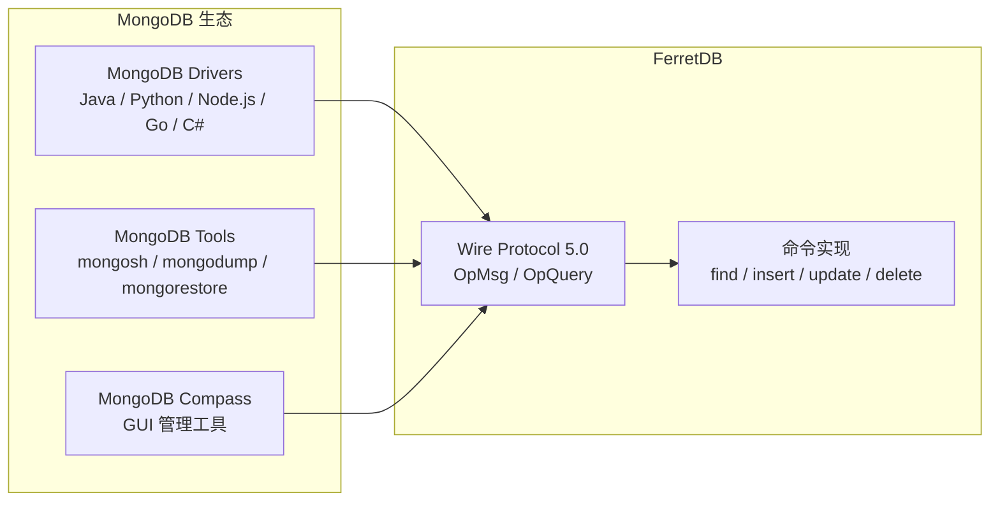
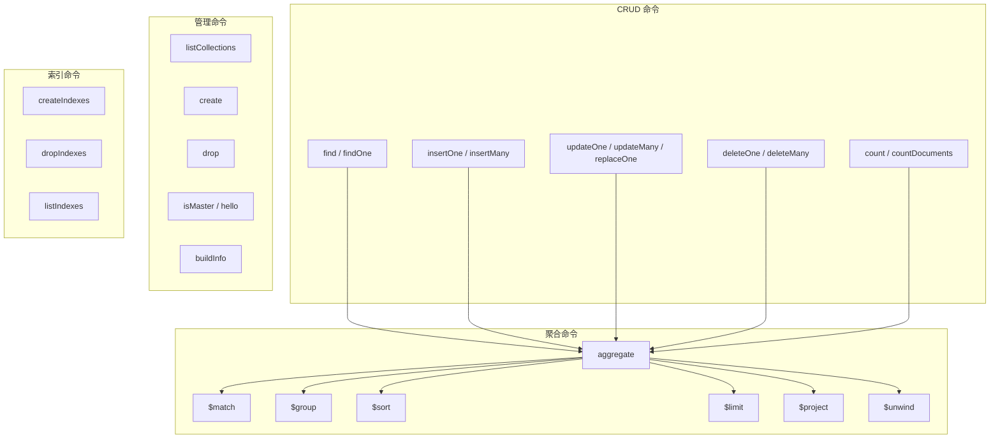
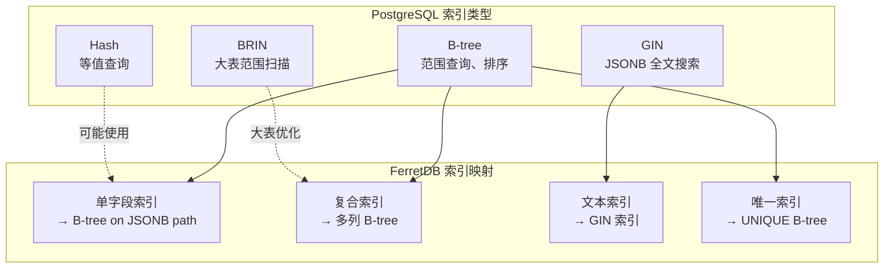
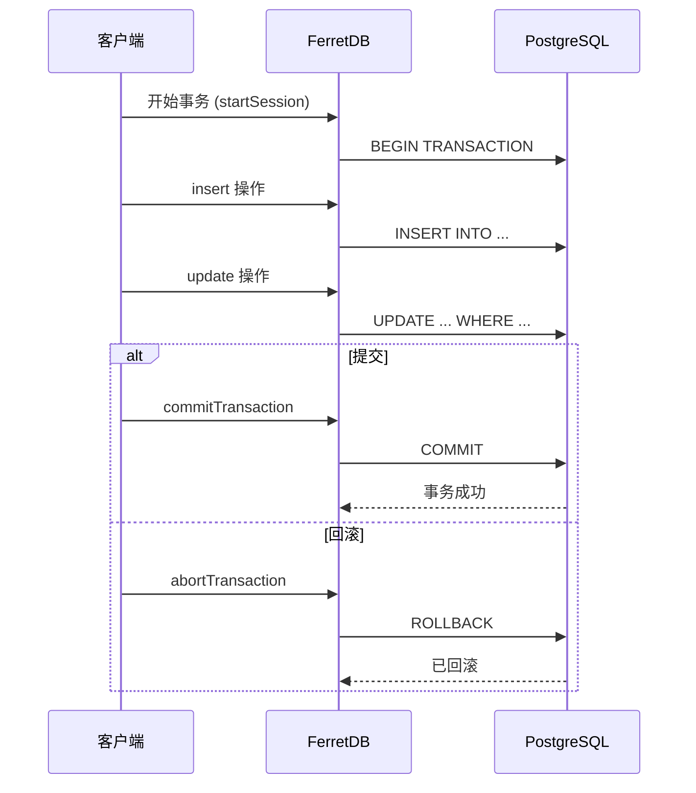
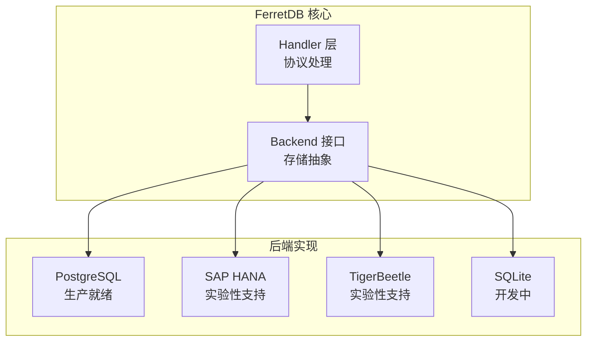
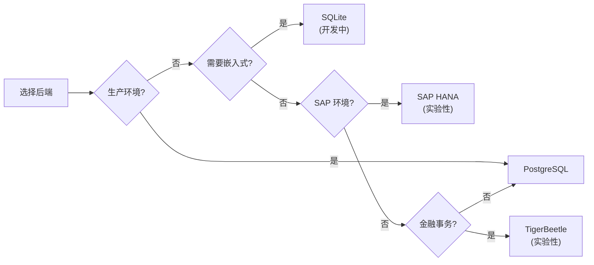
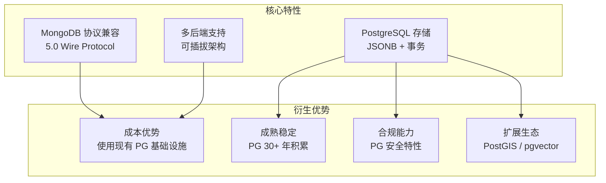

# FerretDB 关键特性

## 学习目标

- 掌握 FerretDB 的核心特性与能力边界
- 理解 MongoDB Wire Protocol 兼容性的实现方式
- 了解 PostgreSQL 后端带来的优势
- 掌握多种后端存储的支持情况

## MongoDB 5.0 Wire Protocol 兼容

FerretDB 实现了 MongoDB Wire Protocol，使得现有的 MongoDB 驱动和工具无需修改即可使用：



### 兼容性详情

| 特性类别 | MongoDB 原生 | FerretDB 支持 | 说明 |
|----------|-------------|---------------|------|
| CRUD 操作 | 完整 | 完整 | find / insert / update / delete |
| 聚合管道 | 完整 | 部分 | 支持 $match/$group/$sort/$limit/$skip/$project/$unwind |
| 索引管理 | 完整 | 部分 | 单字段/复合/唯一索引，地理空间暂不支持 |
| 事务 | 多文档事务 | 部分 | 依赖 PostgreSQL 事务 |
| Change Streams | 完整 | 不支持 | 待实现 |
| MapReduce | 完整 | 不支持 | 建议使用聚合管道 |
| GridFS | 完整 | 不支持 | 大文件存储 |
| 全文搜索 | 完整 | 部分 | 依赖 PostgreSQL 全文搜索 |

### 已实现的命令



## PostgreSQL 存储优势

使用 PostgreSQL 作为后端存储，FerretDB 继承了 PostgreSQL 的多项核心优势：

### JSONB 灵活存储

```sql
-- PostgreSQL JSONB 提供高效的文档存储
-- 每个文档存储为一个 JSONB 行
SELECT _ferretdb_document 
FROM "mydb"."mycollection"
WHERE _ferretdb_document->>'status' = 'active';

-- JSONB 支持索引
CREATE INDEX idx_status ON "mydb"."mycollection" 
    USING btree ((_ferretdb_document->>'status'));

-- GIN 索引支持任意字段查询
CREATE INDEX idx_gin ON "mydb"."mycollection" 
    USING gin (_ferretdb_document);
```

| PostgreSQL 特性 | 对 FerretDB 的意义 |
|-----------------|-------------------|
| JSONB 类型 | 原生支持嵌套文档、数组存储 |
| B-tree 索引 | 支持范围查询、排序 |
| GIN 索引 | 支持 JSONB 内任意字段的快速查询 |
| ACID 事务 | 保证数据一致性 |
| 并发控制 | MVCC 提供高并发性能 |
| 扩展生态 | 可利用 PostGIS、pgvector 等扩展 |

### PG 索引能力



### PG 事务支持

FerretDB 利用 PostgreSQL 的 ACID 事务能力：



## 多种后端支持

FerretDB 设计了可插拔的后端架构，支持多种存储引擎：



### 后端对比

| 后端 | 状态 | 适用场景 | 特点 |
|------|------|----------|------|
| PostgreSQL | 生产就绪 | 生产环境首选 | 成熟稳定，功能完整，社区活跃 |
| SAP HANA | 实验性 | 企业 SAP 环境 | 内存数据库，高性能分析 |
| TigerBeetle | 实验性 | 金融场景 | 分布式事务，强一致性 |
| SQLite | 开发中 | 嵌入式场景 | 轻量级，单文件，零配置 |

### 后端选择指南



## 特性总览



## 要点总结

- **协议兼容**：实现 MongoDB 5.0 Wire Protocol，支持大多数 CRUD 和聚合命令
- **PG 存储**：利用 PostgreSQL 的 JSONB、索引、事务能力，数据可靠且高效
- **多后端**：可插拔后端架构，PostgreSQL 生产就绪，其他后端实验性支持
- **衍生优势**：降低成本、继承成熟特性、满足合规要求、可扩展生态

## 思考题

1. FerretDB 为什么选择实现 MongoDB 5.0 而不是最新版本的 Wire Protocol？这对兼容性有什么影响？
2. 相比于 MongoDB 原生的 WiredTiger 存储引擎，PostgreSQL 的 JSONB 存储在性能上有哪些优势和劣势？
3. 如果要在 FerretDB 中实现 Change Streams 支持，需要利用 PostgreSQL 的哪些机制？
