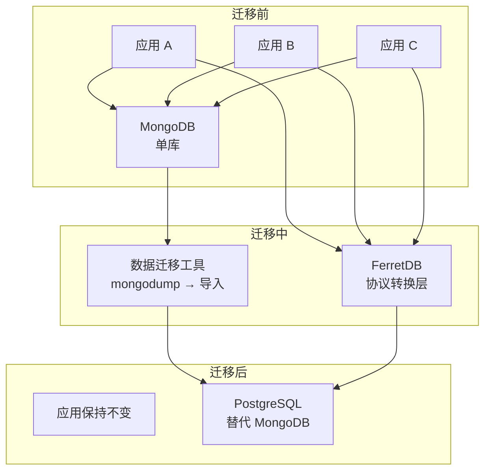
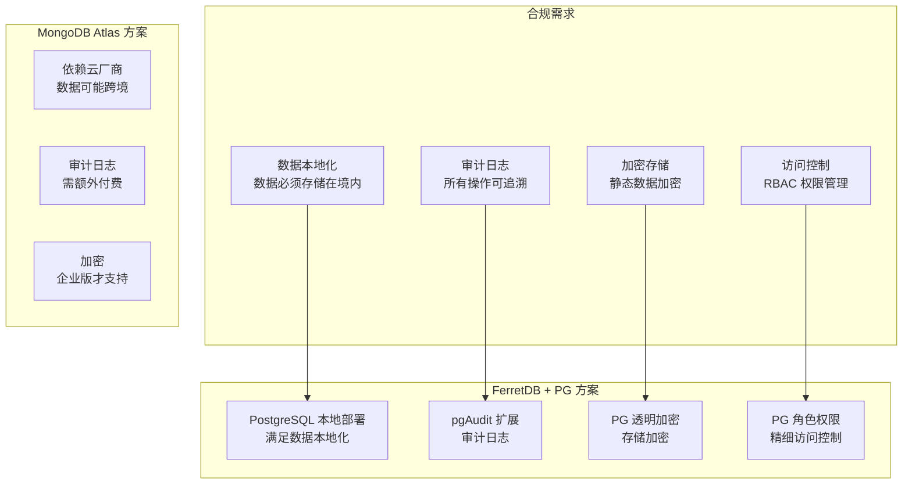
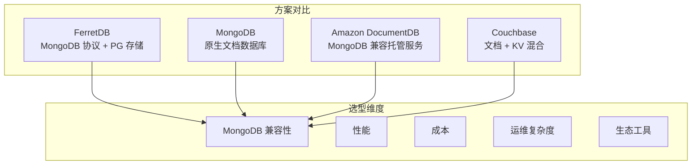

# FerretDB 使用场景与选型对比

## 学习目标

- 掌握 FerretDB 的典型使用场景
- 理解场景与 FerretDB 特性的对应关系
- 学会根据需求进行选型对比决策

## 场景一：MongoDB 迁移到 PostgreSQL

适用场景：已使用 MongoDB 但希望迁移到 PostgreSQL 的组织，需要保持应用不变。



### 迁移步骤

| 步骤 | 操作 | 说明 |
|------|------|------|
| 1 | 部署 FerretDB + PostgreSQL | Docker Compose 一键启动 |
| 2 | 导出 MongoDB 数据 | `mongodump --uri="mongodb://..."` |
| 3 | 导入数据到 FerretDB | `mongorestore --uri="mongodb://ferretdb:27017"` |
| 4 | 修改应用连接串 | 将 MongoDB URI 改为 FerretDB 地址 |
| 5 | 验证功能 | 运行应用测试，检查功能完整性 |
| 6 | 切换生产 | DNS 切换，下线 MongoDB |

### 迁移优势

- **零代码修改**：应用层无需修改 MongoDB 驱动代码
- **渐进式迁移**：可以先迁移部分应用，逐步验证
- **数据一致性**：PostgreSQL 的 ACID 事务保证迁移过程数据完整
- **运维简化**：统一数据库运维，减少 MongoDB 专属运维成本

## 场景二：PG 用户获得 MongoDB API

适用场景：熟悉 PostgreSQL 但需要文档型灵活性的团队。

```python
# 场景示例：团队熟悉 PG，但需要文档模型的灵活性
# 使用 FerretDB 后，PG 团队可以继续使用熟悉的 MongoDB 驱动

# 传统方式：PG 团队需要处理 JSONB 拼接
import psycopg2
conn = psycopg2.connect("dbname=mydb")
cur = conn.cursor()
cur.execute("""
    SELECT _ferretdb_document->>'name',
           _ferretdb_document->>'email'
    FROM "mydb"."users"
    WHERE _ferretdb_document @> '{"status": "active"}'
""")

# 使用 FerretDB 后：直接使用 MongoDB 驱动
from pymongo import MongoClient
client = MongoClient("mongodb://ferretdb:27017")
db = client.mydb
users = db.users.find({"status": "active"})
```

### 优势总结

| PG 团队需求 | FerretDB 满足方式 |
|-------------|-------------------|
| 文档模型的灵活性 | 通过 MongoDB 协议提供文档插入、嵌套查询 |
| 保持 PG 数据能力 | 数据存储在 PG，可同时使用 SQL 直接查询 |
| 减少学习成本 | 团队无需学习 MongoDB 运维知识 |
| 统一技术栈 | 底层仍是 PG，安全策略、备份方案不变 |

## 场景三：法规合规场景

适用场景：金融、医疗、政务等需要严格合规的行业。



### 合规对比

| 合规需求 | FerretDB + PG | MongoDB Atlas |
|----------|---------------|---------------|
| 数据本地化 | 完全可控，可部署在任何数据中心 | 依赖云厂商区域，部分区域不可用 |
| 审计日志 | pgAudit 免费开源 | 企业版付费功能 |
| 静态加密 | PG 透明加密（TDE） | 企业版付费功能 |
| 访问控制 | PG 角色 + 行级安全 | 内置 RBAC |
| 国产化支持 | 可基于国产 PG 分支 | 取决于云厂商 |

## 场景四：开发测试环境

适用场景：开发团队需要使用 MongoDB 兼容的测试环境，但不想部署完整的 MongoDB 集群。

```bash
# 开发环境一键启动
docker compose up -d

# 测试数据准备
mongosh "mongodb://localhost:27017" --eval '
    db.test_collection.insertMany([
        { name: "测试数据1", value: 100 },
        { name: "测试数据2", value: 200 }
    ])
'

# 运行测试
pytest tests/ -v --db-uri="mongodb://localhost:27017"
```

### 开发环境对比

| 对比维度 | FerretDB | MongoDB 社区版 | MongoDB Enterprise |
|----------|----------|----------------|-------------------|
| 部署复杂度 | 一个 Docker 容器 | 需配置副本集或分片 | 复杂配置 |
| 资源消耗 | 低（复用 PG） | 中等 | 高 |
| 测试重建 | 秒级 | 分钟级 | 分钟级 |
| 成本 | 零 | 零 | 商业许可 |

## 选型对比



### 详细对比表格

| 维度 | FerretDB | MongoDB 原生 | Amazon DocumentDB | Couchbase |
|------|----------|-------------|-------------------|-----------|
| **MongoDB 兼容** | 完整（5.0 协议） | 原生 | 3.6/4.0 兼容 | 不兼容 |
| **存储引擎** | PostgreSQL | WiredTiger | 自研 | 自研 |
| **事务支持** | PG 事务 | 多文档事务 | 分布式事务 | 跨文档事务 |
| **地理空间** | 暂不支持 | 支持 | 支持 | 支持 |
| **Change Streams** | 不支持 | 支持 | 支持 | 不支持 |
| **部署方式** | 自托管 | 自托管/Atlas | 托管服务 | 自托管/托管 |
| **许可** | Apache 2.0 | SSPL | 商业 | 商业/社区版 |
| **运维成本** | 低（PG 生态） | 中等 | 无 | 中等 |
| **扩展性** | PG 水平扩展 | 原生分片 | 自动扩展 | 原生分片 |
| **适用场景** | 中小企业/合规 | 通用场景 | AWS 生态 | 高性能缓存 |

## 要点总结

- **迁移场景**：MongoDB 到 PG 的零代码迁移，保持应用不变
- **PG 团队**：获得 MongoDB API 的灵活性，同时保持 PG 基础设施
- **合规场景**：满足数据本地化、审计、加密等合规要求
- **开发测试**：快速部署测试环境，降低资源消耗
- **选型建议**：中小规模场景选 FerretDB，大规模高性能场景选 MongoDB 原生

## 思考题

1. 在什么场景下，FerretDB 的协议转换会成为性能瓶颈？如何评估这个瓶颈的大小？
2. 如果需要在 FerretDB 上实现 MongoDB 的 Change Streams 功能，需要 PostgreSQL 的哪些机制来支持？
3. 在大规模数据场景下，FerretDB + PostgreSQL 的扩展策略与 MongoDB 原生分片相比，各有何优劣？