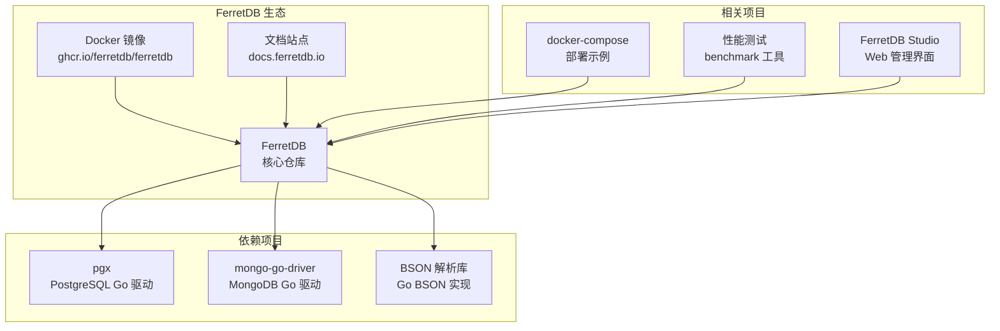
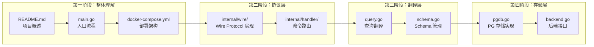

# FerretDB 学习资源

## 学习目标

- 掌握 FerretDB 的官方文档和源码资源
- 了解 FerretDB 源码的核心模块结构
- 学会从源码层面分析 FerretDB 的实现
- 获取系统性的学习路径

## 官方资源

### 文档与社区

| 资源类型 | 链接 | 说明 |
|----------|------|------|
| 官方文档 | https://docs.ferretdb.io/ | 部署、配置、使用指南 |
| GitHub 仓库 | https://github.com/FerretDB/FerretDB | 主仓库，Go 语言实现 |
| API 参考 | https://docs.ferretdb.io/reference/ | 命令兼容性列表 |
| 博客 | https://blog.ferretdb.io/ | 技术文章和更新日志 |
| 社区论坛 | https://github.com/orgs/FerretDB/discussions | 问题讨论 |
| Discord | https://discord.gg/ferretdb | 实时交流 |

### 相关项目



## 源码分析路径

### 仓库结构概览

```
ferretdb/
├── main.go                 # 入口文件
├── internal/
│   ├── handler/            # MongoDB 协议处理器
│   │   ├── handler.go      # 协议路由主入口
│   │   ├── msg_*.go        # 各消息类型处理
│   │   ├── find.go         # find 命令实现
│   │   ├── insert.go       # insert 命令实现
│   │   ├── update.go       # update 命令实现
│   │   ├── delete.go       # delete 命令实现
│   │   └── aggregate.go    # 聚合管道实现
│   ├── backend/
│   │   ├── backend.go      # Backend 接口定义
│   │   ├── pg/
│   │   │   ├── pgdb.go     # PostgreSQL 存储实现
│   │   │   ├── query.go    # 查询翻译器
│   │   │   └── schema.go   # Schema 管理
│   │   └── hana/           # SAP HANA 后端（实验性）
│   ├── types/
│   │   ├── document.go     # 文档类型定义
│   │   ├── array.go        # 数组类型
│   │   └── bson.go         # BSON 类型定义
│   ├── wire/
│   │   ├── wire.go         # Wire Protocol 实现
│   │   ├── op_msg.go       # OpMsg 消息解析
│   │   └── op_query.go     # OpQuery 消息解析
│   └── util/
│       ├── must.go         # 工具函数
│       └── testutil/       # 测试工具
├── cmd/
│   └── ferretdb/           # CLI 入口
├── Dockerfile
├── docker-compose.yml
└── go.mod
```

### 关键文件说明

#### handler.go — 协议处理主入口

```go
// 简化示意：FerretDB 协议路由
// 位置：internal/handler/handler.go

// Handler 负责接收 MongoDB 协议消息并路由到具体命令
type Handler struct {
    backend *pg.Backend  // PostgreSQL 后端
}

// Handle 方法根据命令类型路由
func (h *Handler) Handle(msg *wire.OpMsg) (*wire.OpMsg, error) {
    switch msg.Command {
    case "find":
        return h.handleFind(msg)
    case "insert":
        return h.handleInsert(msg)
    case "update":
        return h.handleUpdate(msg)
    case "delete":
        return h.handleDelete(msg)
    case "aggregate":
        return h.handleAggregate(msg)
    case "createIndexes":
        return h.handleCreateIndexes(msg)
    // ... 其他命令
    }
}
```

#### query.go — 查询翻译器

```go
// 简化示意：MongoDB 查询到 SQL 的翻译
// 位置：internal/backend/pg/query.go

// translateQuery 将 MongoDB 查询文档翻译为 SQL WHERE 子句
func translateQuery(filter bson.D) (string, []interface{}, error) {
    var clauses []string
    var args []interface{}
    
    for _, cond := range filter {
        switch cond.Key {
        case "$gt":
            // WHERE doc->>'field' > value
        case "$gte":
            // WHERE doc->>'field' >= value  
        case "$in":
            // WHERE doc->>'field' IN (values)
        case "$regex":
            // WHERE doc->>'field' ~ pattern
        // ... 其他操作符
        }
    }
    
    return strings.Join(clauses, " AND "), args, nil
}
```

#### pgdb.go — PostgreSQL 存储实现

```go
// 简化示意：PostgreSQL 数据库操作
// 位置：internal/backend/pg/pgdb.go

// PGDB 封装了所有 PostgreSQL 操作
type PGDB struct {
    pool *pgxpool.Pool  // 连接池
}

// FindDocuments 执行 MongoDB find 命令
func (p *PGDB) FindDocuments(ctx context.Context, 
    db, collection string, 
    filter bson.D, 
    sort bson.D, 
    limit int64) ([]bson.D, error) {
    
    // 1. 构建 SQL 查询
    query, args := buildSelectQuery(db, collection, filter, sort, limit)
    
    // 2. 执行 SQL
    rows, err := p.pool.Query(ctx, query, args...)
    
    // 3. 将 JSONB 行转换为 BSON 文档
    var results []bson.D
    for rows.Next() {
        var doc json.RawMessage
        rows.Scan(&doc)
        results = append(results, jsonbToBSON(doc))
    }
    
    return results, nil
}
```

### 源码阅读建议



## 推荐学习路径

### 入门阶段

1. **官方文档入门**：阅读 https://docs.ferretdb.io/ 的 Quick Start
2. **Docker 部署**：使用 docker-compose 本地部署，完成 CRUD 操作
3. **mongosh 熟悉**：使用 mongosh 执行基本命令，验证兼容性
4. **数据迁移**：尝试使用 mongodump/mongorestore 迁移数据

### 进阶阶段

1. **架构理解**：阅读 01_architecture.md 理解整体设计
2. **命令实现**：阅读 handler 目录，跟踪一条命令的完整处理流程
3. **查询翻译**：深入 query.go 理解 MongoDB 到 SQL 的转换逻辑
4. **类型映射**：分析 BSON → JSONB 的映射实现

### 深入阶段

1. **源码调试**：在本地编译 FerretDB，设置断点调试
2. **性能分析**：使用 pprof 分析 FerretDB 性能瓶颈
3. **扩展开发**：尝试添加新的 MongoDB 命令支持
4. **多后端**：研究 Backend 接口，理解多后端扩展机制

### 学习资源映射

| 学习阶段 | 资源类型 | 具体内容 | 预估时间 |
|----------|----------|----------|----------|
| 入门 | 官方文档 | Quick Start, Deployment Guide | 2-3 小时 |
| 入门 | 动手实验 | 08_experiments.md 四个实验 | 3-4 小时 |
| 进阶 | 源码阅读 | handler/backend/wire 核心包 | 8-16 小时 |
| 进阶 | 架构文档 | 01_architecture.md 架构分析 | 1-2 小时 |
| 深入 | 源码调试 | 断点跟踪命令处理流程 | 16-24 小时 |
| 深入 | 性能分析 | pprof + benchmark 工具 | 8-12 小时 |

## 要点总结

- **官方资源**：文档站点、GitHub 仓库、社区论坛是主要学习来源
- **源码结构**：handler（协议处理）→ backend（存储）→ wire（消息解析）三层
- **关键文件**：handler.go（路由）、query.go（翻译）、pgdb.go（存储）
- **学习路径**：入门（部署使用）→ 进阶（架构理解）→ 深入（源码分析）

## 思考题

1. FerretDB 的 handler 层和 backend 层之间的接口是如何定义的？如果要添加一个新的后端（如 MySQL），需要实现哪些接口？
2. 阅读 `internal/backend/pg/query.go` 的源码，找出当前查询翻译的局限性（如嵌套数组查询的处理）。
3. 从源码分析，FerretDB 的聚合管道是如何逐阶段翻译为 SQL 的？每个聚合阶段分别对应哪些 SQL 子句？