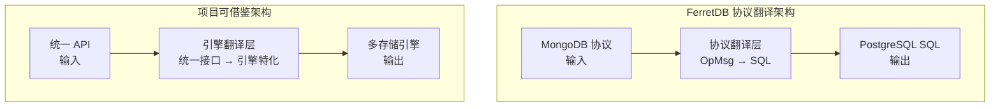
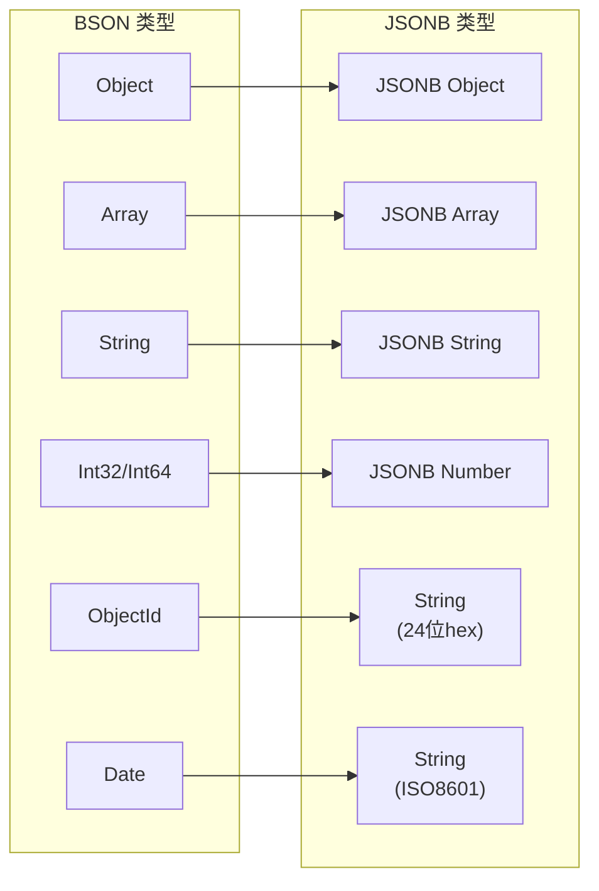
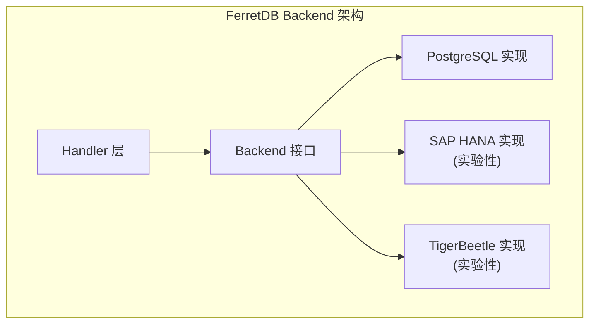
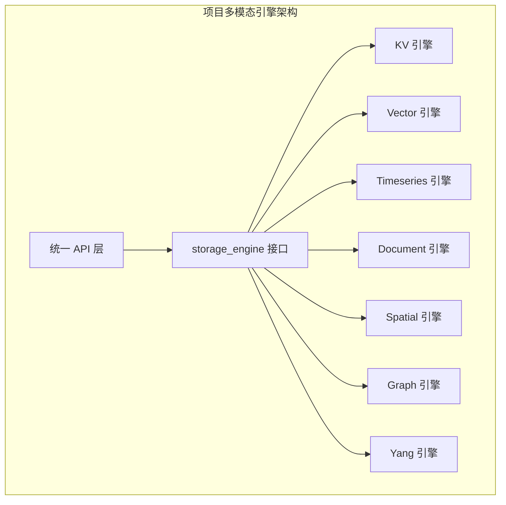
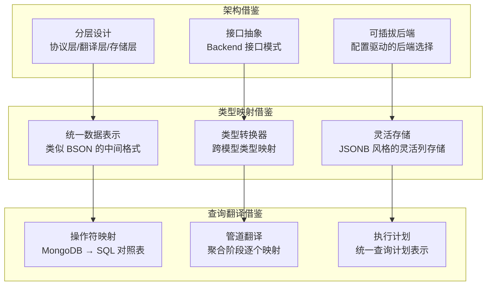

# FerretDB 与项目关联

## 学习目标

- 理解 FerretDB 的设计思想对项目的借鉴意义
- 掌握 SQL 和 NoSQL 融合的实现思路
- 对比 FerretDB 多后端架构与项目多模态引擎设计
- 提取可复用的设计模式和架构决策

## 协议翻译设计思路

### 核心设计理念

FerretDB 的核心创新在于**协议翻译层**：将 MongoDB Wire Protocol 翻译为 PostgreSQL SQL。这种设计对项目的多引擎架构有重要借鉴意义。



### 对项目多引擎架构的借鉴

项目已实现多种存储引擎（KV / Vector / Timeseries / Document / Spatial / Graph / Yang），可借鉴 FerretDB 的分层设计：

| FerretDB 分层 | 项目对应设计 | 借鉴要点 |
|---------------|--------------|----------|
| Wire Protocol Handler | API 层 | 统一的协议/接口入口 |
| Command Router | storage_engine.c | 命令路由和分发 |
| Query Translator | 各引擎的查询构建器 | 统一查询到引擎特化查询的转换 |
| Backend Interface | storage_engine.h 接口 | 定义标准接口，支持多后端实现 |
| PostgreSQL Backend | 各存储引擎实现 | 具体存储逻辑 |

### 协议抽象设计

```c
// 项目 storage_engine.h 已定义统一接口
// 可借鉴 FerretDB 的方式增加协议翻译层

// FerretDB 风格：协议 → 引擎特化查询
typedef struct {
    // 统一输入：类似 MongoDB OpMsg
    bson_t* query_doc;
    // 翻译后输出：引擎特化
    union {
        kv_query_t* kv_query;
        vector_query_t* vector_query;
        graph_query_t* graph_query;
    };
} translated_query_t;

// 翻译器接口
typedef struct query_translator {
    // BSON → KV 查询
    int (*to_kv_query)(bson_t* in, kv_query_t* out);
    // BSON → Vector 查询
    int (*to_vector_query)(bson_t* in, vector_query_t* out);
    // ... 其他引擎
} query_translator_t;
```

## SQL 和 NoSQL 融合思路

### FerretDB 的 BSON → JSONB 映射

FerretDB 通过 BSON → JSONB 类型映射，实现了 NoSQL（文档模型）到 SQL（关系模型）的融合：



### 对项目 mm_storage 的借鉴

项目的多模态存储引擎（mm_storage）支持多种数据模型，可借鉴 FerretDB 的类型映射策略：

```c
// 项目 mm_storage.h 已定义多模态存储接口
// 可借鉴 FerretDB 的类型转换设计

// 统一数据表示（类似 BSON）
typedef struct {
    data_type_e type;  // KV / VECTOR / GRAPH / ...
    union {
        kv_entry_t kv;
        vector_entry_t vector;
        graph_node_t node;
        document_t doc;
    } data;
} mm_data_t;

// 类型映射器（类似 BSON → JSONB）
typedef struct {
    // 文档 → KV 映射
    int (*doc_to_kv)(document_t* doc, kv_entry_t* kv);
    // 文档 → 向量映射
    int (*doc_to_vector)(document_t* doc, vector_entry_t* vec);
    // 向量 → 文档映射
    int (*vector_to_doc)(vector_entry_t* vec, document_t* doc);
} type_mapper_t;
```

### 融合设计对比

| 融合方向 | FerretDB 实现 | 项目可借鉴方式 |
|----------|---------------|----------------|
| 文档 → 关系 | BSON 存为 JSONB 列 | Document 模型存为结构化列 |
| 嵌套 → 扁平 | JSONB 支持嵌套查询 | 嵌套对象存为 JSON 列 + 索引 |
| 数组 → 表 | JSONB 数组 + `jsonb_array_elements` | 数组字段存为子表或 JSON 列 |
| 索引映射 | JSONB path 索引 | 各引擎索引适配器 |

## 多后端设计对比

### FerretDB 多后端架构



### 项目多模态引擎架构



### 架构对比分析

| 设计维度 | FerretDB | 项目 mm_storage | 对比分析 |
|----------|----------|-----------------|----------|
| 接口抽象 | Backend interface | storage_engine_t | 均定义标准接口 |
| 后端数量 | 3-4 个 | 7 个 | 项目后端更多样 |
| 后端状态 | 1 生产 + 3 实验 | 均可独立使用 | 项目各后端更成熟 |
| 切换机制 | 配置切换 | 编译时选择 | FerretDB 更灵活 |
| 跨后端查询 | 不支持 | 不支持 | 均需跨引擎协调器 |

### 可借鉴的设计点

```c
// 借鉴 FerretDB 的 Backend 接口设计
// 增强项目 storage_engine 的抽象能力

// FerretDB 风格的 Backend 接口
typedef struct backend_interface {
    // 数据库操作
    int (*create_collection)(const char* db, const char* name);
    int (*drop_collection)(const char* db, const char* name);
    
    // CRUD 操作
    int (*insert)(const char* db, const char* coll, bson_t* doc);
    cursor_t* (*find)(const char* db, const char* coll, bson_t* filter);
    int (*update)(const char* db, const char* coll, bson_t* filter, bson_t* update);
    int (*delete)(const char* db, const char* coll, bson_t* filter);
    
    // 索引操作
    int (*create_index)(const char* db, const char* coll, bson_t* spec);
    int (*drop_index)(const char* db, const char* coll, const char* name);
    
    // 聚合操作
    cursor_t* (*aggregate)(const char* db, const char* coll, bson_t* pipeline);
} backend_interface_t;

// 项目可扩展 storage_engine_t 增加聚合能力
```

## 可借鉴的设计点总结



### 具体借鉴建议

| 借鉴点 | FerretDB 实现 | 项目应用建议 | 优先级 |
|--------|---------------|--------------|--------|
| 协议翻译层 | Wire Protocol → SQL | 统一 API → 各引擎特化查询 | 高 |
| 类型映射 | BSON → JSONB | 定义项目统一的中间数据格式 | 中 |
| 后端接口 | Backend interface | 增强 storage_engine_t 抽象 | 高 |
| 查询翻译器 | MongoDB 操作符 → SQL | 统一查询语言 → 引擎特化 | 中 |
| 聚合管道 | 阶段式翻译 | 实现统一的聚合管道接口 | 低 |
| 索引抽象 | JSONB path 索引 | 各引擎索引适配器统一接口 | 中 |

## 要点总结

- **协议翻译**：FerretDB 的协议翻译层设计可用于项目的统一 API 到多引擎的映射
- **类型映射**：BSON → JSONB 的思路可用于项目的多模态数据类型转换
- **后端抽象**：Backend 接口设计可增强项目的 storage_engine 抽象能力
- **查询翻译**：操作符映射和管道翻译可用于项目的统一查询语言实现

## 思考题

1. 如果要为项目设计一个统一的查询语言（类似 MongoDB 查询语法），应该定义哪些核心操作符？如何映射到各存储引擎？
2. FerretDB 的 BSON → JSONB 映射保留了文档的灵活性，但牺牲了部分性能。项目在设计多模态存储时，如何在灵活性和性能之间取得平衡？
3. 对比 FerretDB 的 PostgreSQL 后端和项目的 BTree/HeapAM 实现，在索引设计上有哪些可以互相借鉴的地方？