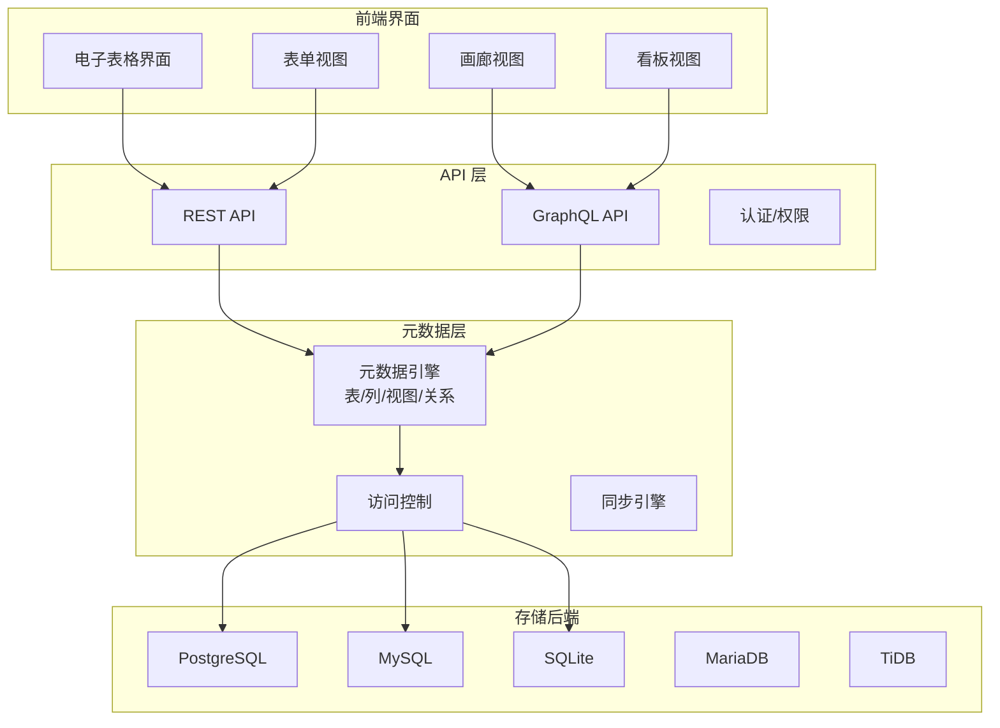

# NocoDB 项目概览

## 学习目标

- 了解 NocoDB 的定位和特点
- 掌握 NocoDB 的电子表格到数据库转换架构

## 项目定位

> Airtable 的开源替代，将传统数据库转换为智能电子表格，提供可视化的表格界面和 API

**基本信息**：

- 开发方：NocoDB Team
- 开源协议：Apache 2.0
- GitHub Stars：~35k

## 核心设计

## 要点总结

- **电子表格界面**：将数据库转换为熟悉的电子表格操作体验
- **多视图支持**：表格、表单、画廊、看板等多种视图
- **多数据库后端**：支持 PostgreSQL、MySQL、SQLite、MariaDB、TiDB 等
- **自动 API 生成**：每个表自动生成 REST/GraphQL API
- **关系管理**：支持主从表、LOOKUP、COUNT 等关联操作
- **权限控制**：基于角色和字段的细粒度权限管理
- **团队协作**：支持多人实时协作编辑
- **Webhook**：支持数据变更时的 Webhook 通知

## 相关资源

- GitHub: https://github.com/nocodb/nocodb
- 文档: https://docs.nocodb.com/
