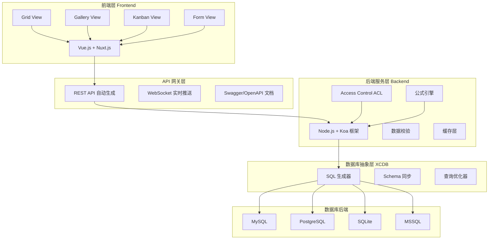
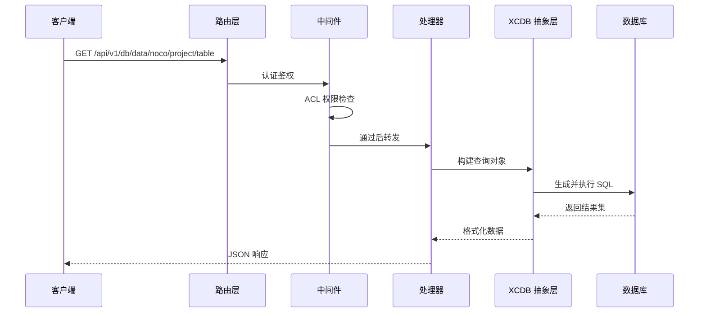
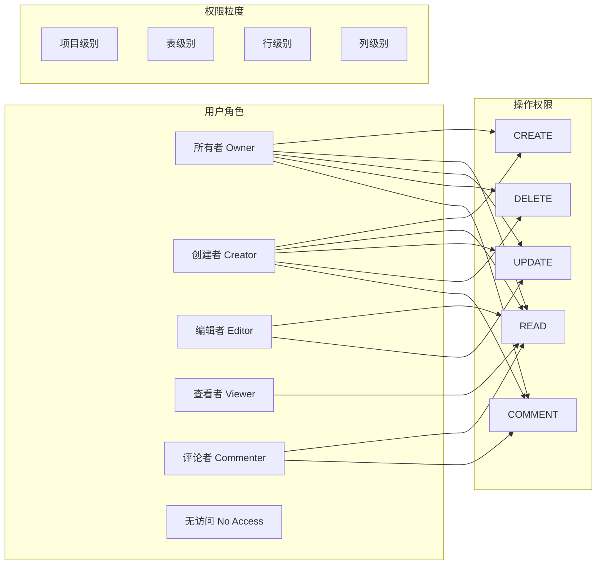

# NocoDB 架构设计

## 学习目标
- 理解 NocoDB 的前后端分层架构
- 掌握 XCDB 数据库抽象层的设计原理
- 了解表格到 SQL 的映射机制和 REST API 自动生成流程
- 熟悉 Access Control（ACL）权限控制模型

## 正文

### 整体架构分层

NocoDB 采用经典的三层架构：前端展示层、后端服务层、数据库存储层。核心设计理念是将数据库表自动映射为 REST API 和电子表格界面，无需编写代码。



### 前端架构

前端基于 Vue.js 和 Nuxt.js 框架构建，提供接近电子表格的操作体验。

| 前端模块 | 技术栈 | 职责 |
|---------|--------|------|
| 视图组件 | Vue 3 + Composition API | 表格/画廊/看板/表单视图渲染 |
| 状态管理 | VueX / Pinia | 全局状态、项目数据缓存 |
| 路由 | Nuxt.js 路由 | 项目/表/视图/设置页路由 |
| 通信层 | Axios + WebSocket | REST API 调用 + 实时数据推送 |

前端核心设计亮点是**视图层抽象**：所有视图类型（Grid、Gallery、Kanban、Form）共享同一套数据模型，仅在渲染和交互方式上差异化。

### 后端架构

后端基于 Node.js 和 Koa 框架，采用 MVC 模式组织代码。



### 表格到 SQL 映射机制

NocoDB 的核心能力是将用户操作的电子表格行为映射为 SQL 语句。每个表格对应一张数据库表，每一行对应一条记录，每一列对应一个字段。

| 电子表格操作 | 对应的 SQL 映射 |
|-------------|----------------|
| 点击行查看 | SELECT * FROM table WHERE id = ? |
| 编辑单元格 | UPDATE table SET col = ? WHERE id = ? |
| 新增行 | INSERT INTO table (col1, col2) VALUES (?, ?) |
| 删除行 | DELETE FROM table WHERE id = ? |
| 筛选 | SELECT * FROM table WHERE col op value |
| 排序 | SELECT * FROM table ORDER BY col ASC/DESC |
| 关联查询 | LEFT JOIN 关联表 ON 关联条件 |

### REST API 自动生成

NocoDB 为每个表自动生成标准的 CRUD REST API，遵循 RESTful 规范。

```
GET    /api/v1/db/data/noco/{project}/{table}          # 分页查询
GET    /api/v1/db/data/noco/{project}/{table}/{id}     # 单条查询
POST   /api/v1/db/data/noco/{project}/{table}          # 创建记录
PATCH  /api/v1/db/data/noco/{project}/{table}/{id}     # 更新记录
DELETE /api/v1/db/data/noco/{project}/{table}/{id}     # 删除记录
```

API 自动生成的实现思路：项目创建时，NocoDB 读取数据库 schema 信息，生成表结构元数据；运行时，根据请求路径解析出项目和表名，动态构建 SQL 并执行。

### Access Control（ACL）权限控制

NocoDB 提供三级权限模型，管理用户对项目和数据的访问。



ACL 的核心实现是在中间件层拦截请求，通过解析请求路径和当前用户角色，判断是否具备目标资源的操作权限。

### 数据同步机制

NocoDB 支持多用户协作编辑，通过以下机制保证数据一致性：
- **乐观锁**：更新时对比版本号，避免覆盖冲突
- **WebSocket 推送**：变更实时通知其他客户端
- **去抖处理**：高频编辑合并为单次提交

## 要点总结

- NocoDB 采用 Vue.js + Nuxt 前端、Node.js + Koa 后端、XCDB 抽象层的三层架构
- XCDB 抽象层屏蔽不同数据库后端的差异，支持 MySQL、PostgreSQL、SQLite、MSSQL 等多种后端
- 表格到 SQL 的映射机制是 NocoDB 的核心，将电子表格操作翻译为 SQL 语句
- REST API 自动生成基于 schema 元数据，运行时动态构建查询
- ACL 权限控制支持六级角色，粒度覆盖项目/表/行/列四级
- WebSocket 实时推送和乐观锁机制支撑多用户协作编辑

## 思考题

1. 如果需要在 NocoDB 中新增一个数据库后端（如 TiDB），需要在 XCDB 层的哪些接口实现适配？
2. NocoDB 的 ACL 权限检查是在中间件层进行的，这种设计有什么优缺点？如果权限规则非常复杂，如何优化性能？
3. 乐观锁方案在高并发场景下可能导致大量更新失败，NocoDB 的设计如何权衡一致性和可用性？
4. 如果将 NocoDB 的架构从 Node.js 迁移到 Go 语言，你认为哪些模块可以获得最大的性能提升？