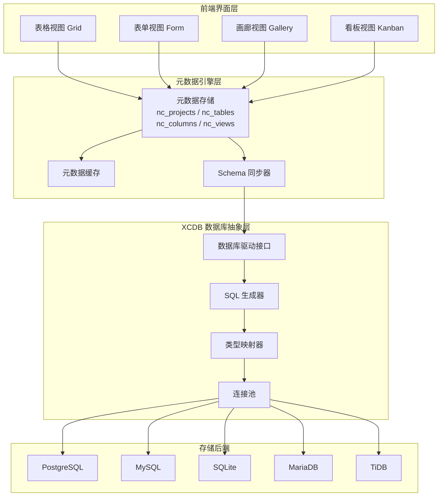
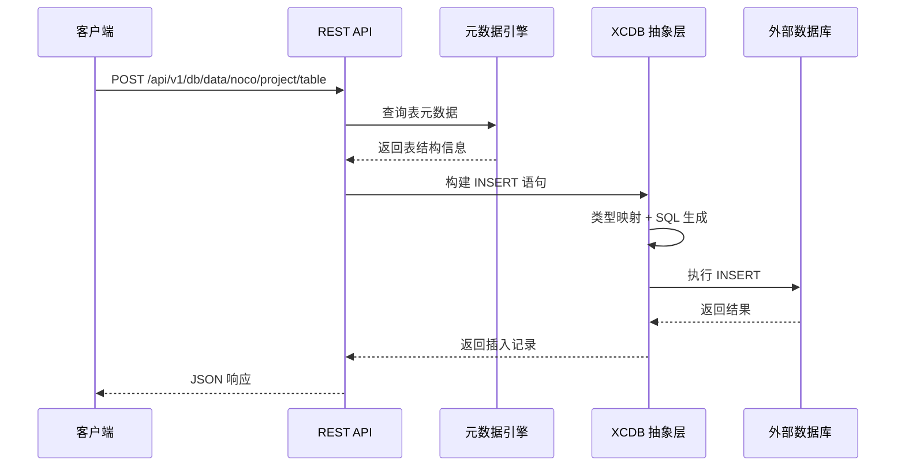
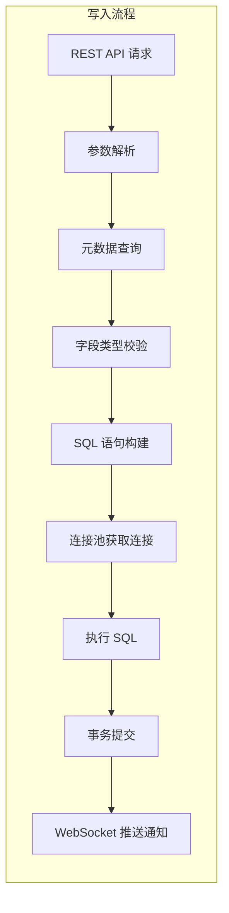
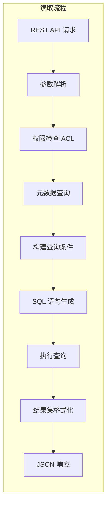
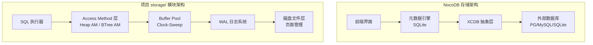
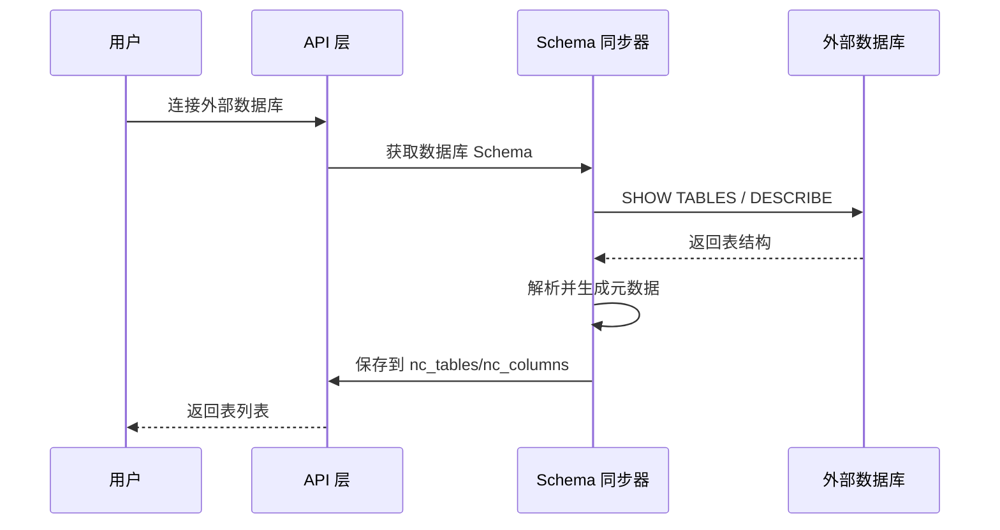

# NocoDB 存储引擎

## 学习目标

- 理解 NocoDB 的存储架构和数据持久化机制
- 掌握 XCDB 数据库抽象层的设计原理
- 对比 NocoDB 与项目 storage/ 模块的架构差异
- 了解元数据驱动的存储管理设计

## 正文

### 核心存储架构

NocoDB 采用"数据库抽象层 + 元数据引擎"的双层存储架构，核心设计理念是将传统关系数据库的存储能力抽象为统一的 API 接口，同时通过元数据引擎管理表结构、视图、关系等定义。



### 数据持久化机制

NocoDB 的数据持久化分为两个层次：

#### 1. 元数据持久化

NocoDB 使用内部数据库（默认 SQLite）存储项目元数据，包括：

| 元数据表 | 存储内容 |
|---------|---------|
| nc_projects | 项目定义、配置信息 |
| nc_tables | 表定义、表名、关联项目 |
| nc_columns | 列定义、类型、约束 |
| nc_views | 视图配置（Grid/Form/Kanban 等）|
| nc_hooks | Webhook 定义 |
| nc_acl | 权限规则 |

元数据表结构示例：

```sql
-- nc_tables 表结构
CREATE TABLE nc_tables (
    id VARCHAR(255) PRIMARY KEY,
    project_id VARCHAR(255) NOT NULL,
    title VARCHAR(255) NOT NULL,
    table_name VARCHAR(255) NOT NULL,
    type VARCHAR(255),  -- table/view
    enabled BOOL DEFAULT TRUE,
    created_at TIMESTAMP,
    updated_at TIMESTAMP
);

-- nc_columns 表结构
CREATE TABLE nc_columns (
    id VARCHAR(255) PRIMARY KEY,
    table_id VARCHAR(255) NOT NULL,
    title VARCHAR(255) NOT NULL,
    column_name VARCHAR(255) NOT NULL,
    uidt VARCHAR(255),  -- UI Data Type
    dt VARCHAR(255),    -- Database Type
    dtxp VARCHAR(255),  -- Display Type
    pk BOOL DEFAULT FALSE,
    ai BOOL DEFAULT FALSE,  -- Auto Increment
    rqd BOOL DEFAULT FALSE,  -- Required
    FOREIGN KEY (table_id) REFERENCES nc_tables(id)
);
```

#### 2. 业务数据持久化

业务数据存储在外部数据库中，由用户选择存储后端。NocoDB 通过 XCDB 抽象层统一访问。



### 读写路径分析

#### 写入路径



写入路径的核心步骤：

1. **参数解析**：从请求中提取表名、字段值
2. **元数据查询**：从缓存或数据库获取表结构
3. **字段类型校验**：验证字段类型与值匹配
4. **SQL 构建**：生成 INSERT 语句
5. **执行写入**：通过连接池执行 SQL
6. **变更通知**：WebSocket 推送给订阅者

#### 读取路径



读取路径特点：

- **权限过滤**：ACL 中间件检查用户权限
- **条件映射**：URL 参数转换为 SQL WHERE 条件
- **关联查询**：LinkToAnotherRecord 字段触发 JOIN
- **分页处理**：limit/offset 参数转换为 LIMIT/OFFSET

### 核心数据结构

#### 元数据缓存结构

```javascript
// 项目元数据缓存
const projectCache = {
    projectId: {
        tables: [
            {
                id: "tbl_xxx",
                title: "用户表",
                tableName: "users",
                columns: [
                    { id: "col_xxx", title: "ID", columnName: "id", uidt: "ID", pk: true },
                    { id: "col_yyy", title: "姓名", columnName: "name", uidt: "SingleLineText" },
                    { id: "col_zzz", title: "部门", columnName: "dept_id", uidt: "LinkToAnotherRecord", fk: "departments" }
                ],
                views: [...]
            }
        ],
        relations: [...],
        hooks: [...]
    }
};
```

#### SQL 生成器

NocoDB 使用 Knex.js 作为 SQL 查询构建器：

```javascript
// 查询构建示例
function buildSelectQuery(table, params) {
    let query = knex(table.tableName);

    // WHERE 条件
    if (params.filter) {
        for (const filter of params.filter) {
            query = query.where(filter.field, filter.op, filter.value);
        }
    }

    // 排序
    if (params.sort) {
        query = query.orderBy(params.sort.field, params.sort.direction);
    }

    // 分页
    if (params.limit) {
        query = query.limit(params.limit).offset(params.offset || 0);
    }

    return query;
}
```

### 与项目 storage/ 模块的对比

| 维度 | NocoDB | 项目 storage/ 模块 |
|------|--------|-------------------|
| **架构层次** | 元数据层 + XCDB 抽象层 + 外部数据库 | Catalog + Buffer Pool + Access Method + WAL |
| **数据模型** | 纯关系模型（表、行、列）| 多模态（关系、KV、向量、图、时序、文档、空间、树）|
| **元数据管理** | JSON 格式 + SQLite 存储 | Catalog 系统表（pg_class、pg_attribute）|
| **存储引擎** | 依赖外部数据库 | 自研存储引擎（Heap AM、BTree AM）|
| **缓冲区管理** | 依赖外部数据库 | Buffer Pool（Clock-Sweep 置换）|
| **事务支持** | 依赖外部数据库 | WAL + 2PC 分布式事务 |
| **索引** | 依赖外部数据库 | BTree、Hash、向量索引（HNSW）|
| **查询语言** | REST API + 图形界面 | SQL 解析 + 执行器 |
| **持久化粒度** | 行级（通过外部数据库）| 页级（8KB 页面）|
| **崩溃恢复** | 依赖外部数据库 | WAL Redo + 检查点 |

#### 架构差异图示



#### 设计理念差异

**NocoDB 的设计理念**：

- **存储外包**：不实现存储引擎，依赖成熟的数据库后端
- **元数据驱动**：核心价值在元数据管理和 API 自动生成
- **多数据库兼容**：通过抽象层支持多种数据库后端
- **无状态服务**：服务层无状态，可水平扩展

**项目 storage/ 模块的设计理念**：

- **存储自研**：实现完整的存储引擎，控制全链路性能
- **页面级管理**：精细化页面缓冲和置换策略
- **事务完整性**：WAL 保证 ACID 特性
- **多模态统一**：一个存储引擎支持多种数据模型

### 关键技术点

#### 1. 类型映射系统

NocoDB 定义了 UI 数据类型（UIDT）与数据库类型（DT）的映射：

```javascript
const typeMapping = {
    // UI 类型 → 数据库类型映射
    "ID": { mysql: "int", postgres: "serial", sqlite: "INTEGER" },
    "SingleLineText": { mysql: "varchar(255)", postgres: "varchar(255)", sqlite: "TEXT" },
    "LongText": { mysql: "text", postgres: "text", sqlite: "TEXT" },
    "Number": { mysql: "int", postgres: "integer", sqlite: "INTEGER" },
    "Decimal": { mysql: "decimal", postgres: "numeric", sqlite: "REAL" },
    "Date": { mysql: "date", postgres: "date", sqlite: "TEXT" },
    "DateTime": { mysql: "datetime", postgres: "timestamp", sqlite: "TEXT" },
    "Checkbox": { mysql: "tinyint(1)", postgres: "boolean", sqlite: "INTEGER" },
    "MultiSelect": { mysql: "varchar(255)", postgres: "varchar(255)", sqlite: "TEXT" },
    "LinkToAnotherRecord": { /* 通过外键关联 */ }
};
```

#### 2. Schema 同步机制

NocoDB 支持从现有数据库导入表结构：



#### 3. 公式字段计算

NocoDB 支持公式字段，通过表达式引擎计算动态值：

```javascript
// 公式示例
const formulas = {
    "total_price": "SUM({items.price})",
    "full_name": "CONCAT({first_name}, ' ', {last_name})",
    "age": "YEAR(NOW()) - YEAR({birth_date})"
};

// 公式求值
function evaluateFormula(formula, rowData) {
    // 1. 解析表达式
    // 2. 替换字段引用为实际值
    // 3. 执行计算
    // 4. 返回结果
}
```

## 要点总结

- NocoDB 采用"元数据引擎 + XCDB 抽象层"的双层存储架构，核心价值在元数据管理和 API 自动生成
- 元数据持久化使用内部 SQLite 数据库，业务数据依赖外部数据库（PostgreSQL/MySQL/SQLite 等）
- 写入路径包含参数解析、元数据查询、字段校验、SQL 构建、执行写入、变更通知六个步骤
- 读取路径包含权限检查、条件映射、关联查询、分页处理等关键环节
- 与项目 storage/ 模块相比，NocoDB 不实现存储引擎，而是通过抽象层对接外部数据库
- 类型映射系统实现了 UI 类型到数据库类型的自动转换，Schema 同步支持从现有数据库导入表结构

## 思考题

1. NocoDB 的元数据缓存策略是什么？如果元数据变更频繁（如频繁修改表结构），如何保证缓存一致性？

2. 如果需要在项目中实现类似 NocoDB 的"元数据驱动 API 生成"，应该基于项目的 Catalog 系统还是单独设计一套元数据层？

3. NocoDB 的公式字段求值是在查询时实时计算还是预计算缓存？如果数据量大，如何优化公式字段性能？

4. 对比 NocoDB 的 XCDB 抽象层和项目的 storage/ 模块，哪个更适合作为多模态数据存储的底层？为什么？
