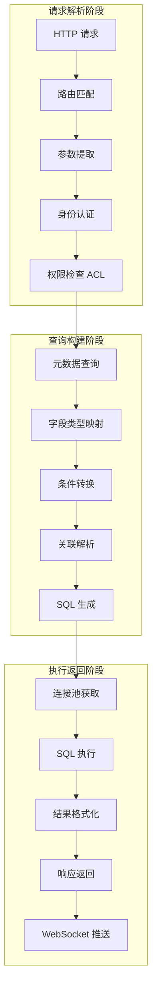
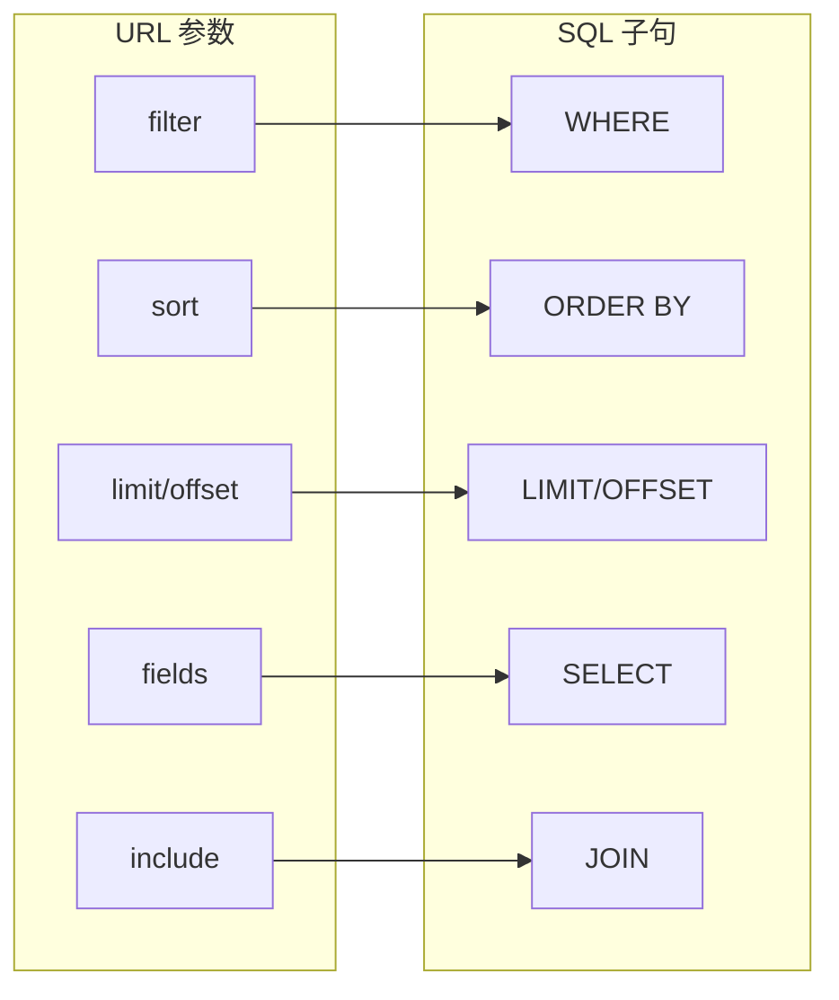
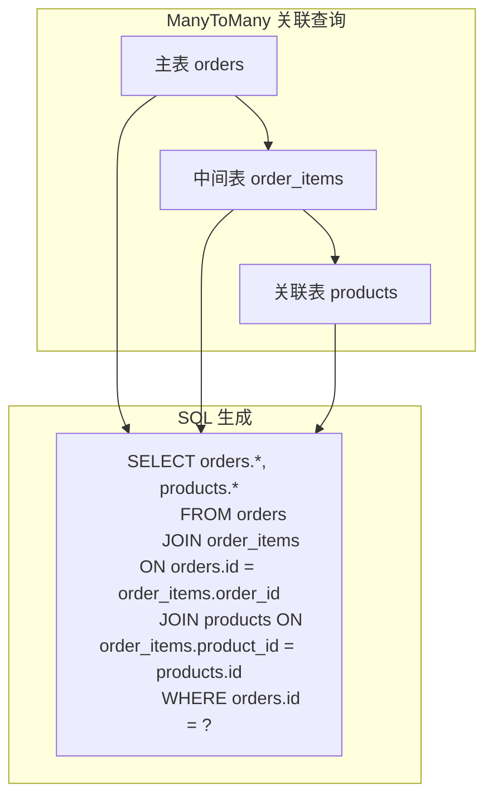
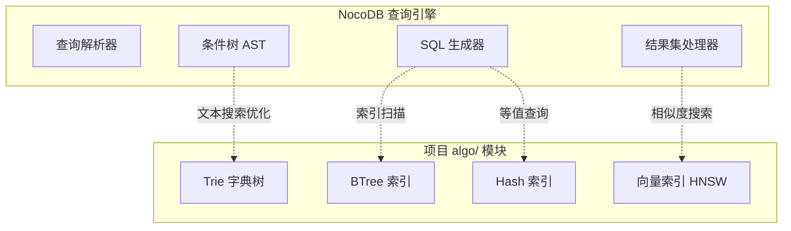
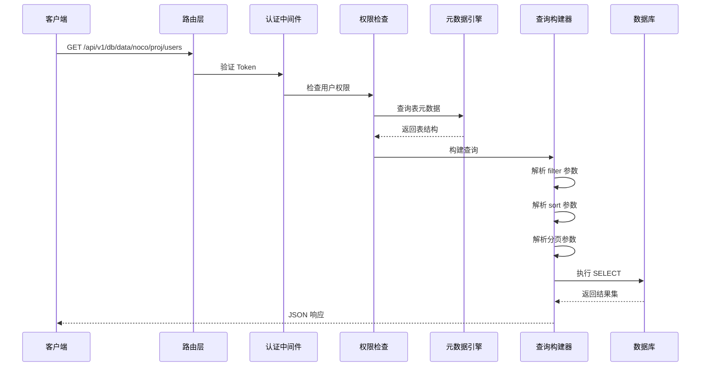
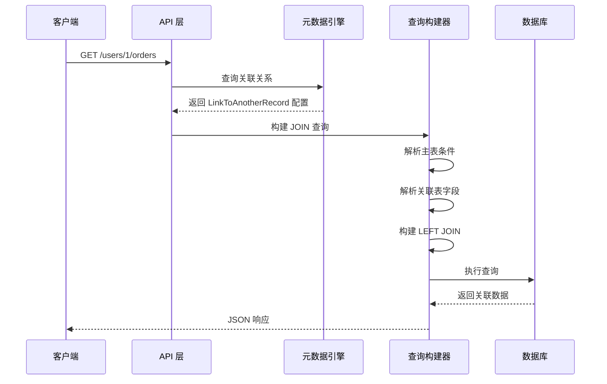
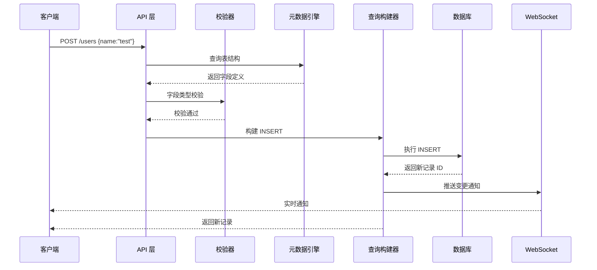

# NocoDB 查询与操作引擎

## 学习目标

- 理解 NocoDB 的查询/操作执行流程
- 掌握 REST API 自动生成的实现机制
- 对比 NocoDB 与项目 algo/ 模块的查询处理方式
- 了解图形化查询构建到 SQL 的转换过程

## 正文

### 查询/操作执行流程

NocoDB 将用户的图形化操作转换为数据库操作，核心执行流程包含三个阶段：请求解析、查询构建、执行返回。



### REST API 自动生成机制

NocoDB 为每个表自动生成标准的 REST API，遵循 RESTful 规范。

#### API 路由规则

```
基础路径: /api/v1/db/data/noco/{projectId}/{tableName}

GET    /                          # 分页查询列表
GET    /{rowId}                   # 查询单条记录
POST   /                          # 创建记录
PATCH  /{rowId}                   # 更新记录
DELETE /{rowId}                   # 删除记录

GET    /views/{viewId}            # 按视图查询
POST   /bulk                      # 批量创建
PATCH  /bulk                      # 批量更新
DELETE /bulk                      # 批量删除

GET    /{rowId}/{relationCol}     # 关联查询
POST   /{rowId}/{relationCol}     # 关联创建
```

#### 请求参数到 SQL 的映射



**Filter 参数语法**：

```
# 等于
?filter=(status,eq,active)

# 包含
?filter=(name,like,%keyword%)

# 范围
?filter=(created_at,between,2024-01-01,2024-12-31)

# 组合条件
?filter=(status,eq,active)~and(priority,eq,high)~or(category,eq,bug)
```

**Filter 到 WHERE 的转换**：

```javascript
function filterToWhere(filter, columnTypes) {
    const [field, op, ...values] = filter;

    switch (op) {
        case 'eq':
            return { [field]: values[0] };
        case 'neq':
            return { [field]: { neq: values[0] } };
        case 'like':
            return { [field]: { like: values[0] } };
        case 'gt':
            return { [field]: { gt: values[0] } };
        case 'lt':
            return { [field]: { lt: values[0] } };
        case 'between':
            return { [field]: { between: values } };
        case 'in':
            return { [field]: { in: values } };
    }
}
```

### 核心算法和数据结构

#### 1. 查询构建器（Query Builder）

NocoDB 使用 Knex.js 作为查询构建器，提供链式 API：

```javascript
class QueryBuilder {
    constructor(tableName, dbDriver) {
        this.query = dbDriver(tableName);
        this.relations = [];
    }

    // WHERE 条件构建
    where(conditions) {
        for (const [field, value] of Object.entries(conditions)) {
            if (typeof value === 'object') {
                // 复杂条件 { like, gt, lt, between, in }
                this.buildComplexCondition(field, value);
            } else {
                // 简单等值条件
                this.query = this.query.where(field, value);
            }
        }
        return this;
    }

    // 关联查询构建
    withRelation(relationCol, targetTable, foreignKey) {
        this.query = this.query.leftJoin(
            targetTable,
            `${this.tableName}.${foreignKey}`,
            `${targetTable}.id`
        );
        return this;
    }

    // 排序构建
    orderBy(sortField, direction = 'asc') {
        this.query = this.query.orderBy(sortField, direction);
        return this;
    }

    // 分页构建
    paginate(limit, offset) {
        this.query = this.query.limit(limit).offset(offset);
        return this;
    }

    // 返回 Knex 查询对象
    build() {
        return this.query;
    }
}
```

#### 2. 关联查询处理器

NocoDB 支持多种关联类型，每种类型有不同的查询策略：

| 关联类型 | 实现方式 | 查询特点 |
|---------|---------|---------|
| HasOne | 外键关联 | 单条 JOIN 查询 |
| HasMany | 外键关联 | LEFT JOIN + GROUP BY |
| ManyToMany | 中间表 | 双 JOIN 查询 |
| Lookup | 虚拟字段 | 关联查询后字段映射 |
| Count | 聚合字段 | COUNT + GROUP BY |



#### 3. 视图查询处理

不同视图类型有不同的查询处理逻辑：

```javascript
const viewQueryHandlers = {
    // 表格视图：标准查询
    grid: async (table, params) => {
        return baseQuery(table)
            .where(params.filter)
            .orderBy(params.sort)
            .paginate(params.limit, params.offset);
    },

    // 看板视图：按分组字段聚合
    kanban: async (table, params) => {
        const groupField = params.groupField;
        const results = await baseQuery(table)
            .where(params.filter)
            .orderBy(groupField);

        // 按分组字段重组数据
        return groupBy(results, groupField);
    },

    // 画廊视图：选择特定字段
    gallery: async (table, params) => {
        const fields = params.fields || ['id', 'title', 'cover'];
        return baseQuery(table)
            .select(fields)
            .where(params.filter)
            .paginate(params.limit, params.offset);
    },

    // 表单视图：单条记录查询
    form: async (table, params) => {
        return baseQuery(table)
            .where({ id: params.rowId })
            .first();
    }
};
```

#### 4. 批量操作处理器

批量操作使用事务保证原子性：

```javascript
async function bulkOperation(table, operations, dbDriver) {
    const trx = await dbDriver.transaction();

    try {
        const results = [];

        for (const op of operations) {
            let result;

            switch (op.type) {
                case 'insert':
                    result = await trx(table).insert(op.data);
                    break;
                case 'update':
                    result = await trx(table)
                        .where('id', op.id)
                        .update(op.data);
                    break;
                case 'delete':
                    result = await trx(table)
                        .where('id', op.id)
                        .delete();
                    break;
            }

            results.push(result);
        }

        await trx.commit();
        return { success: true, results };
    } catch (error) {
        await trx.rollback();
        return { success: false, error: error.message };
    }
}
```

### 与项目 algo/ 模块的关联

项目的 algo/ 模块提供算法和数据结构支持，与 NocoDB 的查询引擎有以下关联：

#### 算法复用场景

| NocoDB 场景 | 项目 algo/ 模块能力 | 关联点 |
|------------|-------------------|--------|
| 全文搜索 | Trie 字典树、倒排索引 | 文本索引和搜索 |
| 范围查询 | BTree 索引 | 索引范围扫描 |
| 相似度匹配 | 向量距离计算 | 向量搜索（如果支持）|
| 排序算法 | 快速排序、堆排序 | 结果排序 |
| 分词处理 | Trie 前缀匹配 | 自动补全、搜索建议 |

#### 数据结构对比



#### 实现差异对比

| 维度 | NocoDB | 项目 algo/ 模块 |
|------|--------|----------------|
| **查询语言** | REST API + 图形界面 | SQL + 内部 API |
| **索引类型** | 依赖外部数据库 | BTree、Hash、向量索引 |
| **全文搜索** | 依赖外部数据库 | Trie、倒排索引 |
| **排序** | SQL ORDER BY | 快速排序、堆排序 |
| **分页** | LIMIT/OFFSET | 内存分页 + 索引定位 |
| **聚合** | SQL GROUP BY | 内存聚合算法 |
| **连接** | SQL JOIN | 嵌套循环、Hash Join |

### 执行流程详解

#### 1. 分页查询流程



#### 2. 关联查询流程



#### 3. 写入操作流程



### 关键技术点

#### 1. 查询优化策略

```javascript
// 查询优化策略
const queryOptimizations = {
    // 索引提示
    useIndex: (query, indexName) => {
        return query.hint(indexName);
    },

    // 延迟加载关联
    lazyLoadRelations: (query, relations) => {
        // 仅在请求时加载关联数据
        return query;
    },

    // 结果缓存
    cacheResults: (query, ttl) => {
        const cacheKey = query.toString();
        // 检查缓存
        // 未命中则执行查询并缓存
    },

    // 分页优化
    cursorPagination: (query, cursorField, cursorValue) => {
        // 使用游标而非 OFFSET
        return query.where(cursorField, '>', cursorValue);
    }
};
```

#### 2. 事务处理

```javascript
// 事务隔离级别
const isolationLevels = {
    'read_uncommitted': 'READ UNCOMMITTED',
    'read_committed': 'READ COMMITTED',
    'repeatable_read': 'REPEATABLE READ',
    'serializable': 'SERIALIZABLE'
};

// 事务包装器
async function withTransaction(callback, isolationLevel = 'read_committed') {
    const trx = await knex.transaction({ isolationLevel });
    try {
        const result = await callback(trx);
        await trx.commit();
        return result;
    } catch (error) {
        await trx.rollback();
        throw error;
    }
}
```

#### 3. 并发控制

```javascript
// 乐观锁实现
async function updateWithOptimisticLock(table, id, data, version) {
    const result = await knex(table)
        .where({ id, version })
        .update({ ...data, version: version + 1 });

    if (result === 0) {
        throw new ConflictError('记录已被其他用户修改');
    }

    return result;
}
```

## 要点总结

- NocoDB 的查询执行流程包含请求解析、查询构建、执行返回三个阶段
- REST API 自动生成基于元数据驱动，URL 参数直接映射为 SQL 子句
- 关联查询支持 HasOne、HasMany、ManyToMany 等多种类型，通过 JOIN 或中间表实现
- 查询构建器使用 Knex.js 提供链式 API，支持 WHERE、JOIN、ORDER BY、LIMIT 等子句构建
- 与项目 algo/ 模块相比，NocoDB 依赖外部数据库的索引能力，项目自研 Trie、BTree、向量索引
- 关键技术点包括查询优化策略、事务处理、并发控制（乐观锁）

## 思考题

1. NocoDB 的查询构建器使用 Knex.js，如果需要支持更复杂的查询（如子查询、窗口函数），应该如何扩展？

2. 对比 NocoDB 的 Filter 参数语法和 SQL WHERE 子句，哪种表达方式更适合非技术用户？哪种方式功能更强大？

3. 如果项目的 algo/ 模块需要为 NocoDB 类型的 REST API 提供查询支持，应该设计怎样的接口？请考虑索引选择、排序、分页等场景。

4. NocoDB 的 ManyToMany 关联查询需要 JOIN 中间表，如果中间表数据量很大，如何优化查询性能？请结合项目的 BTree 索引设计提出方案。
