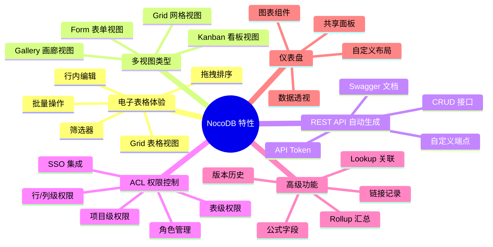
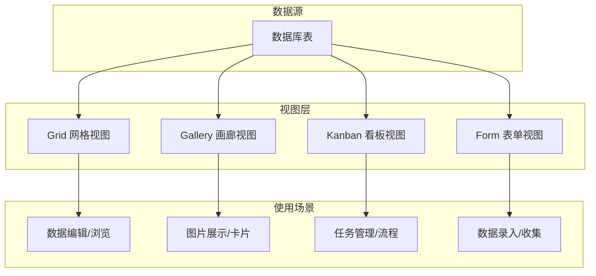

# NocoDB 关键特性

## 学习目标
- 了解 NocoDB 的核心功能特性
- 掌握四种视图类型的使用场景
- 理解公式字段和 Lookup 关联的实现原理
- 熟悉 ACL 权限控制和仪表盘功能

## 正文

### 特性总览

NocoDB 定位为开源版的 Airtable，将数据库的灵活性带给了电子表格用户。以下特性图展示了功能全景。



### 电子表格 UI 操作体验

NocoDB 的核心交互方式是电子表格界面，让非技术人员也能操作数据库。

| 功能 | 说明 |
|------|------|
| 行内编辑 | 双击单元格直接编辑，效果类似 Excel |
| 拖拽排序 | 拖拽行或列改变顺序 |
| 批量操作 | 选中多行后批量修改、删除、导出 |
| 筛选器 | 条件筛选，支持 AND/OR 组合 |
| 排序 | 支持多列排序，升降序切换 |
| 分组 | 按字段值分组显示 |
| 搜索 | 全文搜索，跨字段搜索 |
| 导入导出 | CSV、Excel 导入导出 |

### 视图类型

NocoDB 提供四种视图类型，满足不同的数据展示需求。



**Grid 视图**：默认的表格视图，支持行内编辑、列排序、筛选、分组，是最常用的数据浏览方式。

**Gallery 视图**：以卡片形式展示数据，适合图片较多的场景，如产品目录、员工档案等。

**Kanban 视图**：看板视图，将数据按字段值分组为列，实现拖拽卡片移动分组，适合任务管理和工作流跟踪。

**Form 视图**：表单视图，自动生成数据录入表单，可自定义字段布局和校验规则，适合数据收集场景。

### REST API 自动生成

每个表创建后，NocoDB 自动生成对应的 REST API 端点。

```json
// 查询表数据示例
GET /api/v1/db/data/noco/myproject/mytable?limit=10&offset=0

// 响应格式
{
  "list": [
    {
      "Id": 1,
      "Title": "示例记录",
      "CreatedAt": "2024-01-01T00:00:00Z",
      "UpdatedAt": "2024-01-01T00:00:00Z"
    }
  ],
  "pageInfo": {
    "totalRows": 100,
    "page": 1,
    "pageSize": 10,
    "isFirstPage": true,
    "isLastPage": false
  }
}
```

API 特性：
- 自动生成 OpenAPI / Swagger 文档
- 支持 API Token 认证
- 支持分页、排序、筛选参数
- 支持嵌套关联查询

### ACL 权限控制

NocoDB 的权限控制体系覆盖从项目到单列的不同粒度。

| 角色 | 项目访问 | 表创建 | 数据读取 | 数据写入 | 数据删除 | 评论 |
|------|---------|--------|---------|---------|---------|------|
| 所有者 | 完全 | 是 | 是 | 是 | 是 | 是 |
| 创建者 | 完全 | 是 | 是 | 是 | 是 | 是 |
| 编辑者 | 受限 | 否 | 是 | 是 | 否 | 是 |
| 查看者 | 受限 | 否 | 是 | 否 | 否 | 否 |
| 评论者 | 受限 | 否 | 是 | 否 | 否 | 是 |
| 无访问 | 禁止 | 否 | 否 | 否 | 否 | 否 |

### 公式字段和 Lookup 关联

**公式字段**支持类似 Excel 的函数表达式，自动计算字段值。

支持的公式类型：
- 数学运算：SUM、AVERAGE、COUNT、MIN、MAX
- 字符串处理：CONCATENATE、LEFT、RIGHT、LENGTH
- 逻辑判断：IF、AND、OR、NOT
- 日期运算：DATETIME_DIFF、WORKDAY、NOW
- 数值转换：ROUND、CEILING、FLOOR

**Lookup 关联**允许从关联表中引用字段值，实现跨表数据联动。

```
表 A: 订单
  - 关联字段: 客户 (链接到 表 B)
  - Lookup 字段: 客户名称 (从 表 B 的 "名称" 字段引用)
  - Lookup 字段: 客户电话 (从 表 B 的 "电话" 字段引用)

表 B: 客户
  - 名称
  - 电话
  - 地址
```

### 仪表盘功能

仪表盘允许用户将多个图表和数据面板组合到一个页面，用于数据监控和分析。

支持的组件类型：
- 图表组件：柱状图、折线图、饼图、环形图
- 数据透视表
- 汇总统计
- 富文本描述
- 嵌入外部内容

### 版本历史和审计日志

NocoDB 记录所有数据变更历史，支持查看和恢复历史版本，满足合规审计需求。

## 要点总结

- NocoDB 提供四种视图（Grid、Gallery、Kanban、Form），满足不同场景的数据展示需求
- 每个表自动生成 REST API，支持构建外部应用
- ACL 权限控制覆盖六级角色、四级粒度，确保数据安全
- 公式字段支持 Excel 风格函数，Lookup 实现跨表关联
- 仪表盘功能支持图表组合和数据监控
- 版本历史和审计日志提供数据变更追踪

## 思考题

1. NocoDB 的四种视图类型共享同一数据模型，如果需要在 Gallery 视图中按字段值着色，应当在前端实现还是后端实现？
2. 假设一个表有 100 万行数据，Grid 视图的前端渲染如何优化才能保证流畅滚动？
3. Lookup 关联的实现本质上是 JOIN 操作，在大数据量场景下如何保证查询性能？
4. 公式字段的表达式求值是在前端执行还是后端执行？各自有什么优缺点？