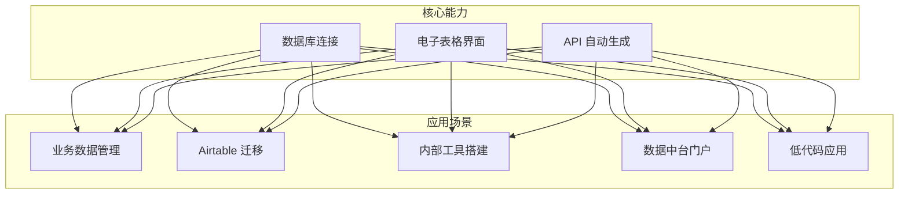
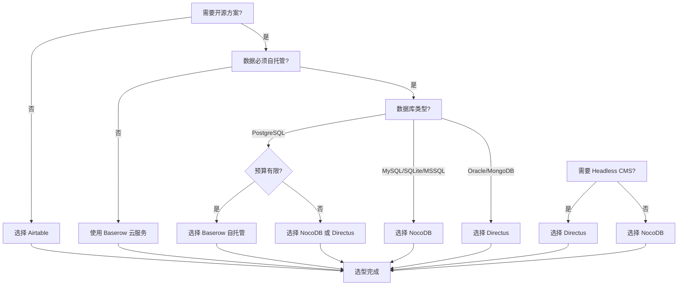

# NocoDB 使用场景与选型对比

## 学习目标
- 了解 NocoDB 的典型应用场景
- 掌握从 Airtable 迁移到 NocoDB 的路径
- 熟悉 NocoDB 与同类产品的选型对比
- 能够根据业务需求选择合适的开源方案

## 正文

### 典型使用场景

NocoDB 适合需要将数据库数据以电子表格形式管理的场景，以下是典型应用。



#### 场景一：业务数据管理

**背景**：运营团队需要管理用户反馈数据，但不会写 SQL 查询。

**方案**：
1. 创建 NocoDB 项目，连接现有数据库
2. 配置用户反馈表、产品表、用户表的关联关系
3. 非技术人员通过 Grid 视图筛选、编辑数据
4. 搭建看板视图，按状态分组管理反馈处理流程

**优势**：无需培训 SQL，直接上手操作，数据变更实时同步到数据库。

#### 场景二：Airtable 迁移

**背景**：团队之前使用 Airtable 管理数据，因成本或数据安全考虑希望迁移到自托管方案。

**迁移路径**：
```
Airtable 导出 CSV
        ↓
NocoDB 创建项目
        ↓
CSV 导入数据
        ↓
重建表关联关系
        ↓
配置视图和权限
        ↓
迁移完成
```

**迁移要点**：
- 检查字段类型兼容性（如 Attachment 类型需要特殊处理）
- 重建关联关系（Lookup、Rollup 字段需手动配置）
- 重新配置自动化工作流（NocoDB 支持有限，可能需要外部工具）
- 迁移 API 调用方，更新端点和认证方式

#### 场景三：内部工具快速搭建

**背景**：研发团队需要一个简单的后台管理系统，用于配置管理。

**方案**：
1. NocoDB 连接业务数据库
2. 配置配置表的读写权限，仅开放给运维角色
3. 利用 REST API 提供配置读取接口
4. 前端应用通过 API 获取配置，无需开发后台界面

**优势**：省去后台界面开发工作量，配置变更无需发版。

#### 场景四：数据中台门户

**背景**：企业有多个业务数据库，需要统一的数据查看门户。

**方案**：
- NocoDB 支持多项目，每个数据库对应一个项目
- 为不同业务线配置项目访问权限
- 提供统一的数据查看界面，无需为每个业务线开发独立门户

### 选型对比

以下对比 NocoDB 与 Airtable、Baserow、Directus 的关键差异。

| 特性 | NocoDB | Airtable | Baserow | Directus |
|------|--------|----------|---------|----------|
| **部署方式** | 自托管 | SaaS | 自托管 | 自托管 |
| **数据存储** | 连接外部数据库 | 云端存储 | 内置数据库 | 连接外部数据库 |
| **前端框架** | Vue + Nuxt | React | Vue 3 | Vue 3 |
| **后端框架** | Node.js + Koa | 私有技术栈 | Django | Node.js + Express |
| **数据库支持** | MySQL、PG、SQLite、MSSQL | 仅云端 | PostgreSQL | MySQL、PG、SQLite、Oracle 等 |
| **API 自动生成** | REST | REST + GraphQL | REST + GraphQL | REST + GraphQL |
| **视图类型** | 4 种 | 6+ 种 | 4 种 | 无原生视图 |
| **权限控制** | 项目/表/行/列 | 项目/表 | 项目/表 | 集合/字段/角色 |
| **SSO 集成** | 支持 | 支持 | 企业版 | 支持 |
| **自动化工作流** | 有限 | 强大 | 有限 | 无 |
| **仪表盘** | 支持 | 支持 | 企业版 | 无 |
| **开源协议** | MIT | 闭源 | MIT | GPL-3.0 |
| **社区活跃度** | 高 | - | 中 | 高 |

### 选型决策树



### 详细选型分析

#### NocoDB vs Airtable

**NocoDB 优势**：
- 开源免费，无用户数限制
- 数据存储在自有数据库，完全可控
- 可自托管，满足合规要求

**Airtable 优势**：
- 功能更完整（自动化、视图类型更多）
- 生态更成熟（模板、插件市场）
- 无需运维，开箱即用

**选择建议**：
- 数据安全要求高、预算有限 → NocoDB
- 追求功能完整、愿意付费 → Airtable

#### NocoDB vs Baserow

**NocoDB 优势**：
- 支持更多数据库类型
- 社区更活跃，迭代更快
- 视图类型更多

**Baserow 优势**：
- 插件生态正在发展
- Django 后端更适合 Python 团队
- 托管服务可用

**选择建议**：
- 已有 MySQL/SQLite 数据库 → NocoDB
- Python 技术栈、PostgreSQL → Baserow

#### NocoDB vs Directus

**NocoDB 优势**：
- 电子表格界面更友好
- 视图类型丰富
- 非技术人员上手更快

**Directus 优势**：
- 支持更多数据库类型（包括 NoSQL）
- Headless CMS 能力更强
- GraphQL API 支持

**选择建议**：
- 数据管理为主 → NocoDB
- API 优先、需要 Headless CMS → Directus

### 典型用户画像

| 用户类型 | 推荐产品 | 理由 |
|---------|---------|------|
| 小团队、无数据库运维能力 | Baserow 云服务 | 开箱即用，无需运维 |
| 中大型企业、有数据库 | NocoDB | 连接现有数据库，权限控制完善 |
| 技术团队、API 优先 | Directus | GraphQL 支持，Headless CMS 能力 |
| 运营团队、协作需求强 | Airtable | 自动化、生态完整 |

## 要点总结

- NocoDB 适合业务数据管理、Airtable 迁移、内部工具搭建等场景
- 支持连接外部数据库，数据完全自主可控
- 与 Airtable 相比，功能稍弱但成本和可控性优势明显
- 与 Baserow 相比，数据库支持更广泛，社区更活跃
- 与 Directus 相比，界面更友好，但 API 能力稍弱
- 选型需综合考虑数据库类型、团队能力、功能需求

## 思考题

1. 如果一个团队从 Airtable 迁移到 NocoDB，哪些功能可能需要用其他工具替代？
2. NocoDB 只支持 SQL 数据库，如果需要管理 MongoDB 数据，有什么替代方案？
3. 在 NocoDB 和 Baserow 之间选择时，如果团队既有 Python 也有 Node.js 技术栈，还应该考虑哪些因素？
4. Directus 的 GraphQL API 相比 NocoDB 的 REST API，在移动端应用开发中有什么优势？