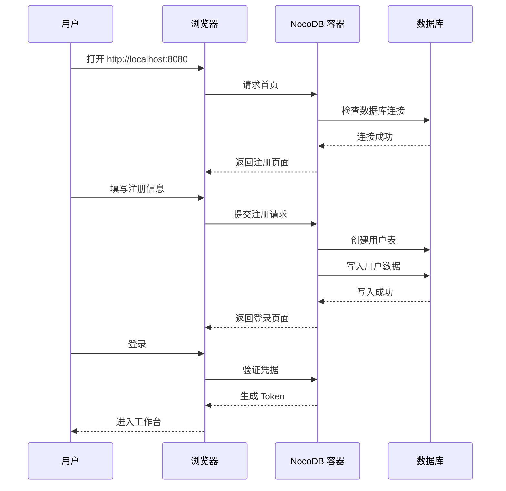
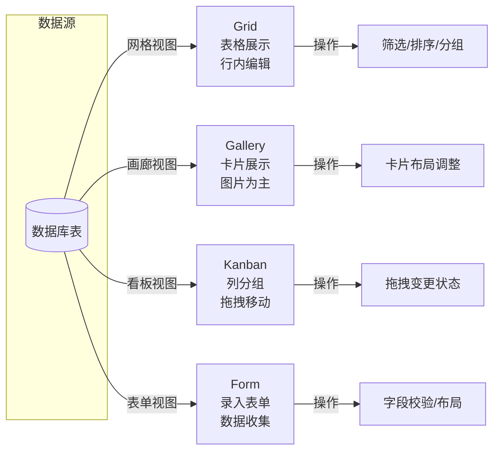

# NocoDB 动手实验

## 学习目标
- 掌握 NocoDB 的 Docker 部署流程
- 能够创建项目和表格，添加字段和数据
- 熟练切换四种视图类型
- 掌握公式字段配置和 REST API 调用

## 正文

### 实验一：Docker 部署 NocoDB

NocoDB 官方提供 Docker 镜像，可快速部署。

**步骤 1：拉取镜像并启动**

```bash
# 使用 SQLite 存储（适合快速体验）
docker run -d \
  --name nocodb \
  -p 8080:8080 \
  nocodb/nocodb:latest

# 使用 PostgreSQL 存储（推荐生产环境）
docker run -d \
  --name nocodb \
  -p 8080:8080 \
  -e NC_DB="pg://host.docker.internal:5432?u=nocodb&p=nocodb&d=nocodb" \
  nocodb/nocodb:latest
```

**步骤 2：验证部署**

```bash
# 查看容器状态
docker ps | grep nocodb

# 查看日志
docker logs nocodb -f
```

**步骤 3：访问 Web 界面**

打开浏览器访问 `http://localhost:8080`，进入注册页面。



### 实验二：创建项目、表格和数据

**步骤 1：创建项目**

登录后，点击"新建项目"，输入项目名称，选择数据库类型。

| 项目名称 | 数据库类型 | 说明 |
|---------|-----------|------|
| 客户管理系统 | SQLite | 快速体验，无需额外数据库 |
| 进销存系统 | MySQL | 连接已有业务数据库 |
| 项目管理系统 | PostgreSQL | 对外发布，需要高可靠性 |

**步骤 2：创建表格**

在项目中点击"新建表"，定义表结构。

```sql
-- 创建后的等效 SQL
CREATE TABLE customers (
    id INTEGER PRIMARY KEY AUTOINCREMENT,
    name TEXT NOT NULL,
    email TEXT,
    phone TEXT,
    status TEXT DEFAULT 'active',
    created_at DATETIME DEFAULT CURRENT_TIMESTAMP,
    updated_at DATETIME DEFAULT CURRENT_TIMESTAMP
);
```

**步骤 3：添加字段**

在表设计器中添加字段，支持以下类型：

| 字段类型 | 说明 | 配置参数 |
|---------|------|---------|
| 单行文本 | 短文本输入 | 最大长度、默认值 |
| 长文本 | 多行文本 | 行数、富文本开关 |
| 数字 | 数值输入 | 精度、小数位、单位 |
| 日期 | 日期选择 | 格式、显示时间 |
| 选择 | 单选/多选 | 选项列表、颜色 |
| 附件 | 文件上传 | 文件类型、大小限制 |
| 链接 | 关联表 | 关联表、显示字段 |
| 公式 | 表达式计算 | 公式表达式 |
| 复选框 | 布尔值 | 默认值 |
| 用户 | 用户选择 | 可选用户列表 |

**步骤 4：添加数据**

直接在 Grid 视图中添加数据，每行对应一条记录。

```json
// 添加数据后的 API 响应
{
  "Id": 1,
  "Name": "张三",
  "Email": "zhangsan@example.com",
  "Phone": "13800138000",
  "Status": "active",
  "CreatedAt": "2024-01-15 10:30:00",
  "UpdatedAt": "2024-01-15 10:30:00"
}
```

### 实验三：切换视图类型

**Grid 视图操作**

1. 点击工具栏的"Grid"按钮切换到网格视图
2. 尝试行内编辑：双击单元格修改内容
3. 使用筛选器：点击列头的筛选图标，设置条件
4. 排序：点击列头排序按钮，切换升序/降序
5. 列宽调整：拖拽列边界调整宽度

**Gallery 视图操作**

1. 点击"添加视图" → "Gallery"
2. 选择封面图片字段
3. 调整卡片布局参数
4. 体验卡片点击展开详情

**Kanban 视图操作**

1. 点击"添加视图" → "Kanban"
2. 选择分组字段（如 Status）
3. 拖拽卡片到不同分组列
4. 观察状态变更自动保存

**Form 视图操作**

1. 点击"添加视图" → "Form"
2. 拖拽调整字段顺序和布局
3. 设置必填字段和校验规则
4. 点击"预览"查看表单效果
5. 复制表单链接，分享给用户



### 实验四：使用公式字段和 REST API

**公式字段配置**

1. 在表设计器中添加公式字段
2. 输入公式表达式，例如：

```javascript
// 数学公式：计算总价
// 字段: 单价(UnitPrice), 数量(Quantity)
总价 = UnitPrice * Quantity

// 字符串公式：合并姓名
// 字段: 姓(LastName), 名(FirstName)
全名 = CONCATENATE(LastName, FirstName)

// 条件公式：根据数值判断等级
// 字段: 分数(Score)
等级 = IF(Score >= 90, "优秀", IF(Score >= 60, "及格", "不及格"))

// 日期公式：计算剩余天数
// 字段: 截止日期(Deadline)
剩余天数 = DATETIME_DIFF(Deadline, TODAY(), "days")
```

**REST API 调用**

首先获取 API Token：设置 → API Token → 生成新 Token。

```bash
# 设置 API Token 变量
export NC_TOKEN="YOUR_API_TOKEN_HERE"
export BASE_URL="http://localhost:8080"

# 1. 获取表列表
curl -s "$BASE_URL/api/v1/db/meta/projects/{projectId}/tables" \
  -H "xc-token: $NC_TOKEN" | jq

# 2. 查询表数据（分页）
curl -s "$BASE_URL/api/v1/db/data/noco/{projectName}/{tableName}?limit=10&offset=0" \
  -H "xc-token: $NC_TOKEN" | jq

# 3. 创建新记录
curl -s -X POST "$BASE_URL/api/v1/db/data/noco/{projectName}/{tableName}" \
  -H "xc-token: $NC_TOKEN" \
  -H "Content-Type: application/json" \
  -d '{
    "Name": "李四",
    "Email": "lisi@example.com",
    "Status": "active"
  }' | jq

# 4. 更新记录
curl -s -X PATCH "$BASE_URL/api/v1/db/data/noco/{projectName}/{tableName}/{recordId}" \
  -H "xc-token: $NC_TOKEN" \
  -H "Content-Type: application/json" \
  -d '{
    "Name": "李四(已更新)",
    "Status": "inactive"
  }' | jq

# 5. 删除记录
curl -s -X DELETE "$BASE_URL/api/v1/db/data/noco/{projectName}/{tableName}/{recordId}" \
  -H "xc-token: $NC_TOKEN" | jq
```

**使用 Python 调用 API**

```python
import requests
import json

# 配置
BASE_URL = "http://localhost:8080"
PROJECT = "myproject"
TABLE = "customers"
TOKEN = "YOUR_API_TOKEN_HERE"

headers = {
    "xc-token": TOKEN,
    "Content-Type": "application/json"
}

# 查询数据
def list_records(limit=10, offset=0):
    url = f"{BASE_URL}/api/v1/db/data/noco/{PROJECT}/{TABLE}"
    params = {"limit": limit, "offset": offset}
    response = requests.get(url, headers=headers, params=params)
    return response.json()

# 创建记录
def create_record(data):
    url = f"{BASE_URL}/api/v1/db/data/noco/{PROJECT}/{TABLE}"
    response = requests.post(url, headers=headers, json=data)
    return response.json()

# 使用示例
if __name__ == "__main__":
    # 创建客户
    new_customer = create_record({
        "Name": "王五",
        "Email": "wangwu@example.com",
        "Status": "active"
    })
    print(f"创建成功: {json.dumps(new_customer, indent=2)}")

    # 查询所有客户
    customers = list_records(limit=50)
    print(f"共 {customers['pageInfo']['totalRows']} 条记录")
```

## 要点总结

- Docker 部署只需一条命令，支持 SQLite 和 PostgreSQL 两种存储模式
- 创建项目、表格、字段的操作与主流电子表格工具类似
- 四种视图类型（Grid、Gallery、Kanban、Form）覆盖不同场景
- 公式字段支持数学运算、字符串处理、条件判断和日期计算
- REST API 支持 CRUD 操作，通过 API Token 认证
- 可使用 curl 或 Python 等工具调用 API

## 思考题

1. 在生产环境中使用 NocoDB 时，为什么推荐使用 PostgreSQL 而非 SQLite 作为存储后端？
2. 公式字段的表达式求值是在前端还是后端执行？如果公式中引用了 Lookup 字段，如何处理跨表依赖？
3. REST API 的排序和筛选参数在 NocoDB 中是如何传递到 SQL 查询的？可能存在 SQL 注入风险吗？
4. 如果需要在 NocoDB 中实现自定义的字段类型（如 IP 地址、JSON），需要修改哪些代码模块？