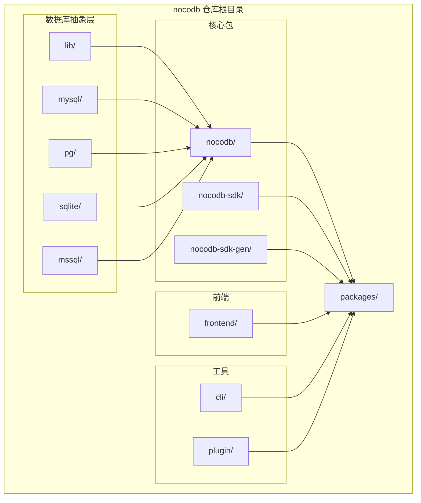
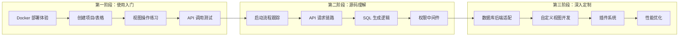

# NocoDB 学习资源

## 学习目标
- 掌握 NocoDB 的官方文档和社区资源
- 了解源码结构，找到关键模块的入口
- 制定合理的学习路径，逐步深入

## 正文

### 官方资源

| 资源类型 | 链接 | 说明 |
|---------|------|------|
| 官方网站 | https://nocodb.com | 产品介绍、功能特性 |
| 官方文档 | https://docs.nocodb.com | 安装部署、使用指南、API 文档 |
| GitHub 仓库 | https://github.com/nocodb/nocodb | 开源源码，MIT 协议 |
| 在线演示 | https://demo.nocodb.com | 在线体验，无需注册 |
| 社区论坛 | https://github.com/nocodb/nocodb/discussions | 问题讨论、功能建议 |
| Discord 社区 | https://discord.gg/nocodb | 实时交流、开发者社区 |
| Docker Hub | https://hub.docker.com/r/nocodb/nocodb | 官方镜像，支持多架构 |

### 源码分析路径

NocoDB 的源码采用 monorepo 结构，使用 Lerna 管理多个包。



### 关键模块说明

#### 核心后端模块（packages/nocodb/src/）

| 目录/文件 | 职责 | 关键文件 |
|----------|------|---------|
| controllers/ | API 控制器，处理 HTTP 请求 | ColumnController.ts、TableController.ts |
| models/ | 数据模型，ORM 映射 | Model.ts、Column.ts |
| services/ | 业务逻辑层 | ColumnService.ts、TableService.ts |
| middleware/ | 中间件（认证、鉴权） | auth.ts、acl.ts |
| factories/ | 工厂模式创建数据库连接 | DatabaseFactory.ts |
| helpers/ | 工具函数 | formulaHelper.ts、sqlHelper.ts |
| plugins/ | 插件系统 | PluginManager.ts |

**controllers/ 目录详解**：这是理解 API 处理流程的最佳入口。

```
controllers/
├── auth/
│   ├── AuthController.ts          # 用户认证
│   └── PasswordController.ts      # 密码重置
├── public/
│   ├── ColumnController.ts        # 列 CRUD
│   ├── TableController.ts         # 表 CRUD
│   ├── ViewController.ts          # 视图管理
│   ├── DataController.ts         # 数据操作
│   ├── RecordController.ts       # 记录操作
│   └── BaseController.ts         # 基础操作
├── v1/
│   ├── AuthController.ts          # V1 API 认证
│   ├── DbTableController.ts      # V1 表 API
│   └── DbViewController.ts       # V1 视图 API
└── v2/
    ├── AuthController.ts          # V2 API 认证
    ├── TableController.ts         # V2 表 API
    └── ViewController.ts          # V2 视图 API
```

#### 数据库抽象层（packages/nocodb/lib/）

```
lib/
├── BaseModel.ts              # 基础模型，ORM 核心
├── BaseModelSql.ts           # SQL 数据库适配
├── BaseModelSqlv2.ts         # V2 版本 SQL 适配
├── Knex/
│   ├── KnexFactory.ts        # Knex 连接工厂
│   └── KnexMysql.ts          # MySQL 方言
│   └── KnexPg.ts             # PostgreSQL 方言
│   └── KnexSqlite.ts         # SQLite 方言
│   └── KnexMssql.ts          # MSSQL 方言
```

#### 前端模块（packages/frontend/）

```
frontend/
├── components/
│   ├── library/              # 通用组件库
│   ├── smartsheet/           # 电子表格组件
│   │   ├── GridView.vue      # Grid 视图
│   │   ├── GalleryView.vue   # Gallery 视图
│   │   ├── KanbanView.vue    # Kanban 视图
│   │   └── FormView.vue      # Form 视图
│   └── dashboard/            # 仪表盘组件
├── pages/
│   ├── index.vue             # 首页
│   ├── dashboard.vue         # 工作台
│   ├── project.vue           # 项目页
│   └── table.vue             # 表格页
├── store/                    # 状态管理
│   ├── index.js
│   └── modules/
└── plugins/                  # 插件
    └── axios.js
```

### 推荐学习路径



**第一阶段：使用入门（1-2 天）**
1. 通过 Docker 部署 NocoDB，体验完整的安装流程
2. 创建项目和一个包含多字段的表格，熟悉界面操作
3. 练习四种视图的创建和切换，理解各自特点
4. 调用 REST API，体验自动化接口能力

**第二阶段：源码理解（1 周）**
1. 从 `packages/nocodb/src/main.ts` 开始，跟踪启动流程
2. 跟踪一个 GET 请求从路由到数据库的完整链路
3. 阅读 `BaseModelSql.ts`，理解 SQL 生成逻辑
4. 阅读 `middleware/acl.ts`，理解权限检查实现

**第三阶段：深入定制（2-4 周）**
1. 阅读指定数据库后端的适配器代码，理解抽象层接口
2. 尝试新增一个自定义视图组件
3. 研究插件系统，开发一个简单的插件
4. 分析慢查询日志，提出性能优化方案

### 相关开源项目

| 项目 | 链接 | 说明 |
|------|------|------|
| NCache | GitHub 搜索 | 社区贡献的缓存增强 |
| nocodb-rails | GitHub 搜索 | Ruby on Rails 集成 |
| nocodb-docker | GitHub 搜索 | 多环境 Docker 配置 |
| nocodb-backup | GitHub 搜索 | 备份工具 |

### 推荐书籍和文章

- **《Nuxt.js 实战》**：NocoDB 前端基于 Nuxt，理解 Nuxt 有助于阅读前端代码
- **《Node.js 设计模式》**：理解后端架构设计模式
- **《MySQL 必知必会》**：理解数据库操作基础
- NocoDB 官方博客：https://blog.nocodb.com
- Medium 上的 NocoDB 技术文章

## 要点总结

- 官方文档是首要学习资源，GitHub 仓库包含完整源码
- 源码采用 monorepo 结构，核心后端在 packages/nocodb/src/ 下
- 学习路径分三阶段：使用入门 → 源码理解 → 深入定制
- controllers/ 是理解 API 流程的最佳入口点
- 数据库抽象层基于 Knex.js，支持多种 SQL 方言
- 前端视图组件在 packages/frontend/components/smartsheet/ 下

## 思考题

1. NocoDB 的 monorepo 结构使用 Lerna 管理，这种方式相比独立的仓库结构有什么优缺点？
2. 如果需要为 NocoDB 新增一个 TiDB 数据库后端，需要实现哪些接口？借鉴现有 MySQL 适配器的代码结构。
3. 前端 GridView.vue 组件中有大量数据渲染逻辑，在 10 万行数据场景下，虚拟滚动是如何实现的？阅读源码分析其实现方案。
4. NocoDB 的插件系统是如何设计的？插件的加载和钩子机制是怎样的？