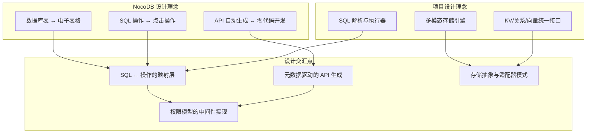
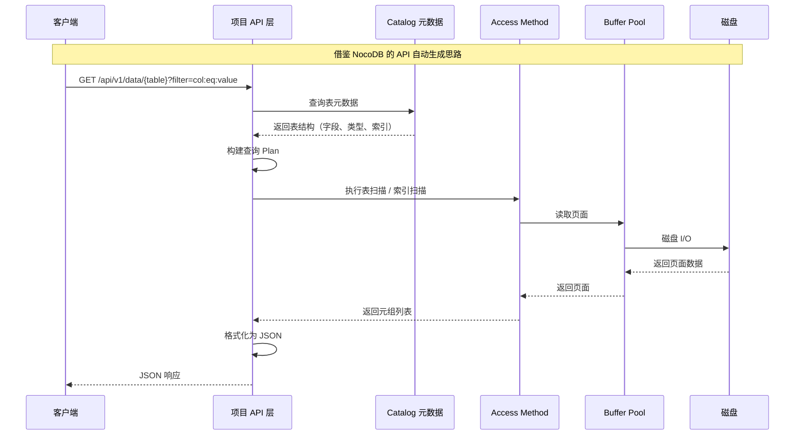
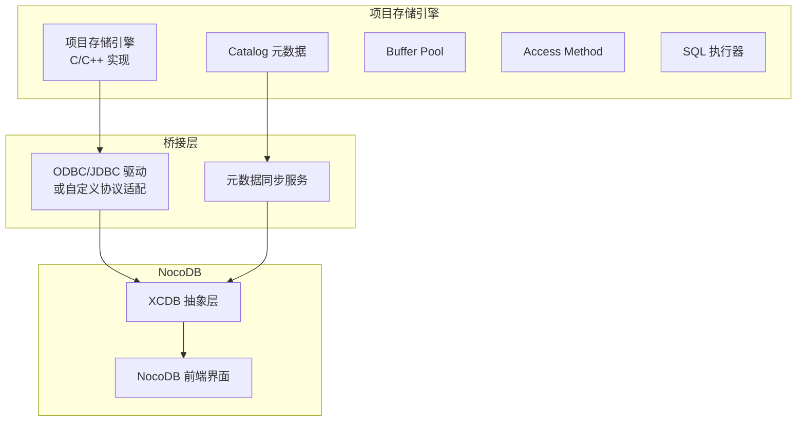

# NocoDB 与项目关联

## 学习目标
- 理解 NocoDB 可视化数据管理设计理念与项目的关系
- 掌握 REST API 自动生成思路在项目中的借鉴价值
- 对比 NocoDB 的项目关系模型映射与项目自有实现的异同
- 识别可借鉴的设计点，指导项目演进

## 正文

### 可视化数据管理设计理念

NocoDB 的核心设计理念是"让数据库操作像电子表格一样简单"。这个理念与项目中的存储引擎设计有深刻的联系。



NocoDB 对"数据库管理"的抽象层次是：**表 → 项目 → 视图 → 接口**。项目的存储引擎对"数据管理"的抽象层次是：**页面 → 元组 → 访问方法 → 索引**。两者虽然在实现细节上不同，但都遵循"分层抽象、接口统一"的设计原则。

### REST API 自动生成思路

NocoDB 的 REST API 自动生成机制，为项目提供了 API 层设计的参考。

#### NocoDB 的实现策略

```
数据库 Schema 读取
        ↓
元数据缓存（表结构、字段类型、关联关系）
        ↓
路由注册（/api/v1/db/data/noco/{project}/{table}/{id}）
        ↓
请求解析（路径参数 → 表名、操作类型、过滤条件）
        ↓
SQL 构建（根据元数据和操作参数生成 SQL 语句）
        ↓
SQL 执行 + 结果格式化
        ↓
JSON 响应
```

#### 项目的借鉴思路



**可借鉴的设计点**：

1. **元数据驱动的 API 路由**：NocoDB 的项目路由基于元数据动态注册，项目可以在 Catalog 模块基础上，实现类似的路由注册机制，为每个表自动生成访问接口。

2. **请求参数到查询条件的映射**：NocoDB 将 URL 参数（filter、sort、limit、offset）映射为 SQL 条件，项目可以借鉴此方法，将 HTTP 参数映射为项目内部的 ScanKey 或 Filter 结构。

3. **响应格式的标准化**：NocoDB 提供了结构化的 JSON 响应（包含分页信息），项目在实现 API 层时可以参考此格式，提供统一的响应规范。

### 关系模型映射对比

NocoDB 的关系模型映射与项目的关系模型实现有相似之处，也有重要差异。

| 维度 | NocoDB | 项目存储引擎 |
|------|--------|-------------|
| **数据模型** | 关系表（Table） | 关系表（Relation）+ 多模态引擎 |
| **元数据** | 项目/表/字段/视图 | Catalog（pg_class、pg_attribute） |
| **字段类型** | 文本、数字、日期、选择、附件等 | 内置类型 + 扩展类型 |
| **关联关系** | LinkToAnotherRecord + Lookup | 外键 + JOIN 操作 |
| **索引** | 依赖底层数据库 | BTree、Hash、向量索引 |
| **查询语言** | 图形化操作 + REST API | SQL 解析 + 执行器 |
| **权限模型** | 项目/表/行/列 ACL | 待实现 |

以下对比 NocoDB 的表结构定义与项目中的表结构定义：

**NocoDB 表结构**（JSON 格式元数据）：
```json
{
  "table_name": "orders",
  "columns": [
    {"title": "ID", "type": "ID", "ai": true, "pk": true},
    {"title": "客户", "type": "LinkToAnotherRecord", "fk": "customers"},
    {"title": "总金额", "type": "Formula", "formula": "SUM(items.price)"},
    {"title": "状态", "type": "SingleSelect", "options": ["待处理", "处理中", "已完成"]}
  ]
}
```

**项目表结构**（Catalog 元数据）：
```c
// pg_class 系统表定义表
typedef struct RelationData {
    Oid rel_oid;            // 表 OID
    char rel_name[64];      // 表名
    Oid rel_namespace;      // 命名空间
    int rel_columns;        // 列数
    TupleDesc rel_desc;     // 元组描述符
    // ... 其他属性
} RelationData;

// pg_attribute 系统表定义列
typedef struct AttributeData {
    Oid att_relid;          // 所属表 OID
    char att_name[64];      // 列名
    Oid att_typeid;         // 类型 OID
    int att_num;            // 列序号
    bool att_notnull;       // 非空约束
    // ... 其他属性
} AttributeData;
```

### 可借鉴的设计点

#### 1. 视图层抽象

NocoDB 的四种视图共享同一数据模型，这是一个值得借鉴的前端设计模式。项目中的知识图谱和看板前端可以借鉴此思路，为同一数据源提供多种展示方式。

**借鉴方案**：
- 定义统一的视图接口（View Interface）
- 实现 GridView、KanbanView、GraphView 等具体视图
- 视图通过数据源组件（DataSource）访问数据

#### 2. 元数据驱动的 API 生成

NocoDB 根据表结构自动生成 API，项目中可以借鉴此机制，为 Catalog 中的每个表自动生成访问接口。

**借鉴方案**：
```
/table/{table_name}        → 全表扫描
/table/{table_name}/{id}   → 主键查询
/table/{table_name}?filter= → 条件查询
```

#### 3. 插件化数据库后端

NocoDB 通过 XCDB 抽象层支持多种数据库后端，项目中的多模态存储引擎也采用了类似的设计。

**借鉴方案**：
- 统一存储引擎接口（StorageEngine Interface）
- 每个引擎实现接口（RelationEngine、VectorEngine、KvEngine）
- 通过工厂模式创建引擎实例

#### 4. 权限中间件设计

NocoDB 的 ACL 在中间件层实现，项目中的权限控制可以借鉴此分层设计。

**借鉴方案**：
```c
// 权限检查中间件
typedef struct AccessControl {
    // 角色定义
    char **roles;
    // 权限规则：{角色, 资源, 操作} → 允许/拒绝
    PermissionRule *rules;
    int rule_count;
} AccessControl;

// 请求处理链路
// 请求 → 认证中间件 → 权限中间件 → 业务处理 → 响应
```

#### 5. 公式引擎

NocoDB 的公式字段提供表达式计算能力，项目中的计算字段或虚拟列可以借鉴此设计。

**借鉴方案**：
- 定义表达式语法（支持字段引用、函数调用、运算符）
- 实现表达式解析器（AST 构建）
- 实现表达式求值器（递归求值）
- 表达式结果缓存（避免重复计算）

### 项目集成的可能性

如果项目需要集成 NocoDB 作为前端管理界面，可以按以下方式对接：



集成方式有两种：

1. **通过标准协议**：实现 MySQL 或 PostgreSQL Wire 协议兼容，NocoDB 直接连接项目存储引擎
2. **通过桥接层**：开发自定义桥接服务，将 NocoDB 的 XCDB 接口映射到项目存储引擎的 API

## 要点总结

- NocoDB 的可视化数据管理理念与项目的多模态存储引擎在设计上互补
- 元数据驱动的 API 自动生成机制可以借鉴到项目中的 API 层设计
- 关系模型映射对比显示，NocoDB 的元数据设计与项目的 Catalog 设计有相似之处
- 可借鉴的设计点包括：视图层抽象、API 自动生成、插件化后端、权限中间件、公式引擎
- 项目可以通过桥接层或标准协议与 NocoDB 集成，提供可视化数据管理界面

## 思考题

1. 如果在项目中实现元数据驱动的 API 自动生成，与 NocoDB 相比，项目的优势在于直接控制存储引擎，劣势在于缺少 JDBC/ODBC 标准接口。如何设计一个即支持标准协议又支持自动生成 API 的架构？

2. NocoDB 的 Lookup 字段本质上是跨表 JOIN 操作。项目的存储引擎目前支持哪些 JOIN 实现方式？NocoDB 的 Lookup 机制在实现上有哪些优化点？

3. 项目的多模态存储引擎与 NocoDB 的 XCDB 抽象层有哪些本质差异？如果项目需要支持 NocoDB 作为前端界面，应该优先实现哪种数据库协议兼容？

4. 项目的权限系统目前处于什么阶段？参考 NocoDB 的 ACL 设计，项目中应该实现哪些级别的权限控制？如何在 Buffer Pool 层面实现行级权限？