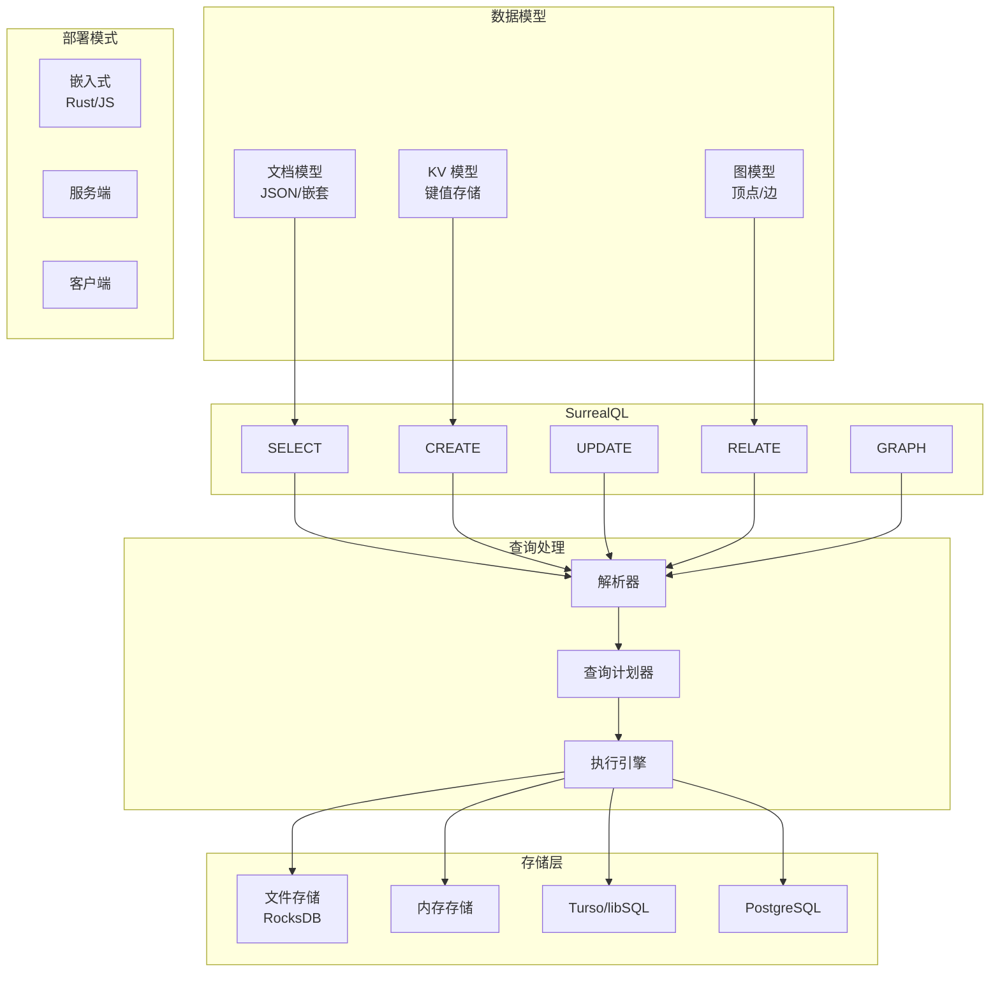

# SurrealDB 项目概览

## 学习目标

- 了解 SurrealDB 的定位和特点
- 掌握 SurrealDB 的多模态数据模型与 SurrealQL 查询语言

## 项目定位

> 多模态数据库，同时支持文档、图、KV 数据模型，使用 SurrealQL 查询语言，可嵌入式或客户端部署

**基本信息**：

- 开发方：SurrealDB Team
- 开源协议：Apache 2.0
- GitHub Stars：~28k

## 核心设计

## 要点总结

- **多模态数据**：同时支持文档、图、KV 三种数据模型
- **SurrealQL**：类 SQL 但专为图数据设计的查询语言
- **嵌入式部署**：可嵌入 Rust 或 JavaScript 应用，减少网络开销
- **多种存储后端**：支持 RocksDB 文件存储、内存存储、Turso/libSQL、PostgreSQL
- **ACID 事务**：完整的事务支持，保证数据一致性
- **实时订阅**：支持数据变更的实时推送
- **权限模型**：基于角色的访问控制和行级安全
- **无模式设计**：支持灵活的数据结构，无需预定义 Schema

## 相关资源

- GitHub: https://github.com/surrealdb/surrealdb
- 文档: https://surrealdb.com/docs/
